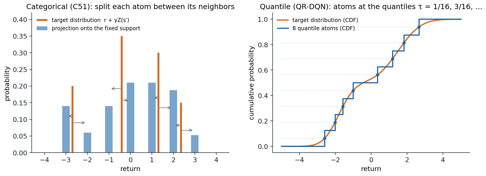
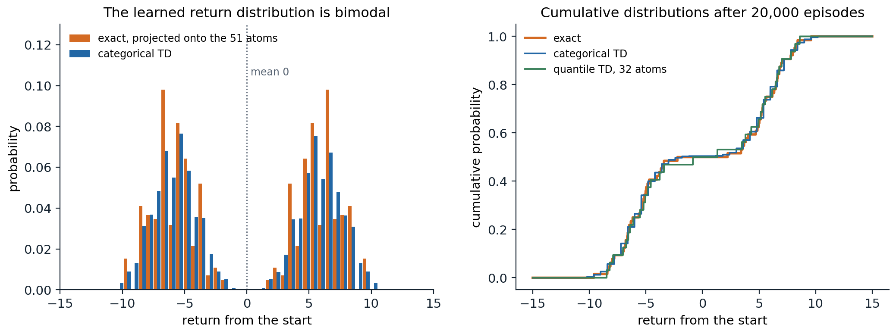

[Background Notes](../README.md) › [Reinforcement Learning](README.md)

# 17. Distributional Reinforcement Learning

> [!WARNING]
> Work in progress: this part of the notes is still being revised.

[← 16. Deep Q-Learning](16-deep-q-learning.md) · [18. Data-Efficient and Scalable Value-Based Agents →](18-data-efficient-and-scalable-value-based-agents.md)

## <a id="the-distribution-of-returns"></a>The distribution of returns

### <a id="beyond-the-expected-return"></a>Beyond the expected return

Every method so far has estimated expected returns. The return itself is random: it depends on the rewards, the transitions, and the agent's own choices, and two situations with the same expected return can be very different. A bet that pays 0 for sure and one that pays $`+100`$ or $`-100`$ with equal probability have the same value. **Distributional reinforcement learning** learns the whole distribution of the return, the random variable

```math
Z^\pi(s,a)=\sum_{t=0}^\infty\gamma^tR_{t+1}\quad\text{given }S_0=s,\;A_0=a\text{, and then }\pi,
```

whose expectation is $`q_\pi(s,a)`$. Interest in the distribution is old: [Sobel (1982)](https://doi.org/10.2307/3213832) derived Bellman equations for the variance of the return, and risk-sensitive control has always needed more than the mean. What made the distributional view central to deep reinforcement learning was the discovery by [Bellemare, Dabney, and Munos (2017)](https://arxiv.org/abs/1707.06887) that learning the distribution, even when only its mean is used to act, makes deep Q-learning agents much better. This chapter develops the theory of the distributional Bellman equation, the two main ways of representing distributions, categorical and quantile, the deep agents built on them, and the uses of the distribution for risk-sensitive decisions. The book by [Bellemare, Dabney, and Rowland (2023)](https://www.distributional-rl.org/) covers the subject in depth.

### <a id="the-distributional-bellman-equation"></a>The distributional Bellman equation

The return satisfies a recursion in distribution. Writing $`\overset{D}{=}`$ for equality in distribution,

```math
Z^\pi(s,a)\overset{D}{=}R(s,a)+\gamma Z^\pi(S',A'),\qquad S'\sim p(\cdot\mid s,a),\;A'\sim\pi(\cdot\mid S'),
```

where, given $`(s,a)`$, the reward $`R`$ and the next pair $`(S',A')`$ come from the MDP and the policy, and, given $`(S',A')`$, the return $`Z^\pi(S',A')`$ from there is independent of $`R`$. Taking expectations gives the Bellman equation for $`q_\pi`$ of [chapter 1](01-markov-decision-processes.md#value-functions-and-the-bellman-expectation-equations). The **distributional Bellman operator** $`\mathcal T^\pi`$ maps a collection of distributions $`\eta(s,a)`$ to the distribution of $`R+\gamma Z(S',A')`$ with $`Z(S',A')\sim\eta(S',A')`$: it mixes the next distributions over the possible next states and actions, scales them by $`\gamma`$, and shifts them by the reward.

Is it a contraction, as the ordinary operator is? The answer depends on how distances between distributions are measured ([Bellemare, Dabney, and Munos, 2017](https://arxiv.org/abs/1707.06887)). In the **Wasserstein distance** $`W_p`$, the scaling by $`\gamma`$ contracts, $`W_p(\gamma X,\gamma Y)=\gamma W_p(X,Y)`$, shifting by an independent reward does not expand, and mixing does not expand either, so $`\mathcal T^\pi`$ is a $`\gamma`$-contraction in the maximal Wasserstein distance $`\bar W_p(\eta,\eta')=\sup_{s,a}W_p(\eta(s,a),\eta'(s,a))`$, and it has a unique fixed point, the true return distributions (exercise 17.2). The same holds for the **Cramér distance**, the $`L^2`$ distance between cumulative distribution functions, with modulus $`\sqrt\gamma`$ ([Rowland et al., 2018](https://arxiv.org/abs/1802.08163)). It fails for the Kullback–Leibler divergence, the total variation distance, and the Kolmogorov distance, which do not see how far apart two distributions are, only how much they overlap (exercise 17.3). This matters for learning: a loss that is not compatible with the geometry in which the operator contracts may not lead to the fixed point.

The control operator, which follows the greedy policy with respect to the means, $`A'=\arg\max_{a'}\mathbb E[Z(S',a')]`$, is a different matter. It is not a contraction in any metric: the means converge to $`q_*`$ as in ordinary value iteration, but when several actions are optimal, different greedy choices lead to different return distributions, and the distributions may oscillate without converging (exercise 17.8). In practice, this has not prevented distributional control from working well.

## <a id="representing-return-distributions"></a>Representing return distributions

A return distribution is an infinite-dimensional object, and an agent must represent it with finitely many numbers. Two representations dominate: fixed locations with learned probabilities, and fixed probabilities with learned locations.

### <a id="the-categorical-representation"></a>The categorical representation

The **categorical** representation fixes $`N`$ equally spaced **atoms** $`z_1<\dots<z_N`$ on an interval $`[V_{\min},V_{\max}]`$ and learns their probabilities $`p_i(s,a)`$. The backed-up distribution, $`r+\gamma Z(s',a')`$, has its atoms at $`r+\gamma z_j`$, which no longer lie on the grid, so it is **projected** back: each shifted atom's probability is split between the two grid points on either side of it, in proportion to its proximity, and atoms outside the interval are moved to its ends ([Appendix A](#block-rl17-appendix-a)). This projection is the orthogonal projection onto categorical distributions in the Cramér distance, and it preserves the mean whenever the shifted atoms lie within the interval ([Rowland et al., 2018](https://arxiv.org/abs/1802.08163)).



*Left: the categorical projection. Each atom of the target distribution (orange) is split between the two nearest points of the fixed support, in proportion to its proximity to each, so the nearer point gets more (arrows), which gives the projected distribution (blue). Right: the quantile representation. A target distribution (its cumulative distribution function in orange) is represented by $`N=8`$ equally weighted atoms placed at its quantiles at the levels $`\tau_i=(2i-1)/2N`$, the representation closest to it in the Wasserstein-1 distance.*

**Categorical TD learning** moves each $`p(s,\cdot)`$ toward the projected sample target. In a table, this is a mixture step, $`p\leftarrow(1-\alpha)p+\alpha\,\Pi_C(r+\gamma Z(s'))`$; with a network that outputs a softmax over atoms, it minimizes the cross-entropy between the projected target and the prediction. The next code runs categorical dynamic programming and categorical TD on a process whose return from the start is bimodal, with mean 0.

```python
import itertools

import numpy as np

# Distributional policy evaluation on a small Markov reward process. From the start, the process moves with
# equal probability to one of two paths of five steps; every step pays -1 or +1 with equal probability, and the
# last step of one path adds +10, of the other -10. gamma = 0.9. The return from the start has a bimodal
# distribution with mean 0. Categorical dynamic programming (C51-style, 51 atoms on [-15, 15]) and categorical
# TD learning, compared with the exact distribution by the Cramer distance (the L2 distance between CDFs).
gamma, L = 0.9, 5
states = ["start"] + [f"{p}{k}" for p in "AB" for k in range(L)] + ["end"]
nxt = {"start": [("A0", 0.5), ("B0", 0.5)], "end": []}
for p in "AB":
    for k in range(L):
        nxt[f"{p}{k}"] = [(f"{p}{k + 1}" if k < L - 1 else "end", 1.0)]
bonus = {"A4": 10.0, "B4": -10.0}


def exact(state):
    """All (return, probability) pairs from a state, by enumeration."""
    if state == "end":
        return [(0.0, 1.0)]
    out = []
    for s2, p in nxt[state]:
        for noise in ((0.0,) if state == "start" else (-1.0, 1.0)):
            q = p * (1.0 if state == "start" else 0.5)
            for g, pg in exact(s2):
                out.append((noise + bonus.get(state, 0.0) + gamma * g, q * pg))
    return out


z = np.linspace(-15, 15, 51); dz = z[1] - z[0]


def project(values, probs):
    """Categorical projection of the atoms `values` with weights `probs` onto the support z (linear interpolation)."""
    b = (np.clip(values, z[0], z[-1]) - z[0]) / dz
    lo, hi = np.clip(np.floor(b).astype(int), 0, 50), np.clip(np.ceil(b).astype(int), 0, 50)
    out = np.zeros(len(z))
    np.add.at(out, lo, probs * (hi - b + (lo == hi)))
    np.add.at(out, hi, probs * (b - lo))
    return out


def cramer(p, values, probs):
    """Cramer distance between the categorical p on z and the exact distribution (values, probs)."""
    grid = np.linspace(-20, 20, 4001)
    F1 = (z[None, :] <= grid[:, None]) @ p
    F2 = (np.asarray(values)[None, :] <= grid[:, None]) @ np.asarray(probs)
    return np.sqrt(np.sum((F1 - F2) ** 2) * (grid[1] - grid[0]))


true = exact("start"); tv, tp = np.array([v for v, _ in true]), np.array([p for _, p in true])
print(f"exact return distribution from the start: {len(true)} outcomes, mean {tv @ tp:.3f}, "
      f"standard deviation {np.sqrt((tv - tv @ tp) ** 2 @ tp):.2f}, P(return > 0) = {tp[tv > 0].sum():.2f}")

# categorical dynamic programming: apply the projected distributional Bellman operator until it converges
P = {s: np.eye(51)[25] for s in states}                           # all mass at 0 initially
for sweep in range(20):
    new = {"end": np.eye(51)[25]}
    for s in states[:-1]:
        vals, probs = [], []
        for s2, p in nxt[s]:
            for noise in ((0.0,) if s == "start" else (-1.0, 1.0)):
                q = p * (1.0 if s == "start" else 0.5)
                vals.append(noise + bonus.get(s, 0.0) + gamma * z); probs.append(q * P[s2])
        new[s] = project(np.concatenate(vals), np.concatenate(probs))
    P = new
print(f"projection of the exact distribution onto the 51 atoms: Cramer distance {cramer(project(tv, tp), tv, tp):.3f}")
print(f"categorical DP fixed point at the start: mean {z @ P['start']:.3f}, Cramer distance to the truth {cramer(P['start'], tv, tp):.3f}")

# categorical TD from sampled episodes
rng = np.random.default_rng(0)
Pt = {s: np.eye(51)[25] for s in states}; visits = {s: 0 for s in states}
for ep in range(1, 20001):
    s = "start"
    while s != "end":
        visits[s] += 1; alpha = 1 / visits[s] ** 0.7                    # decreasing step sizes
        s2 = nxt[s][0][0] if len(nxt[s]) == 1 else nxt[s][rng.integers(2)][0]
        r = (0.0 if s == "start" else rng.choice([-1.0, 1.0])) + bonus.get(s, 0.0)
        target = project(r + gamma * z, Pt[s2])                   # the sample target, projected onto the support
        Pt[s] = Pt[s] + alpha * (target - Pt[s])                  # a mixture step toward it (tabular categorical TD)
        s = s2
    if ep in (100, 1000, 20000):
        print(f"categorical TD after {ep:6,d} episodes: mean {z @ Pt['start']:+.3f},"
              f" Cramer distance to the truth {cramer(Pt['start'], tv, tp):.3f}")
# exact return distribution from the start: 64 outcomes, mean 0.000, standard deviation 6.14, P(return > 0) = 0.50
# projection of the exact distribution onto the 51 atoms: Cramer distance 0.061
# categorical DP fixed point at the start: mean 0.000, Cramer distance to the truth 0.069
# categorical TD after    100 episodes: mean -0.703, Cramer distance to the truth 0.336
# categorical TD after  1,000 episodes: mean -0.200, Cramer distance to the truth 0.089
# categorical TD after 20,000 episodes: mean -0.039, Cramer distance to the truth 0.070
```

The projected operator has a fixed point close to the truth but not equal to its projection: projecting at every backup compounds the error of one projection, here from 0.061 to 0.069 in the Cramér distance, and [Rowland et al. (2018)](https://arxiv.org/abs/1802.08163) bound the compounded error by $`1/\sqrt{1-\gamma}`$ times the largest error of a single projection over states. The mean is preserved exactly, as the theory says. Categorical TD with decreasing step sizes converges to the same fixed point from samples; its estimate of the mean at any moment carries the noise of the samples, like any TD estimate.



*The return from the start of the chapter's process: with equal probability, it follows one of two five-step paths whose last step pays $`+10`$ or $`-10`$, and every step adds $`\pm1`$ at random, with $`\gamma=0.9`$. Left: the exact distribution, projected onto the 51 atoms, and the distribution learned by categorical TD. The expected return, 0, is a value that the return never takes. Right: the cumulative distributions of the exact return and of the categorical and quantile TD estimates after 20,000 episodes.*

### <a id="the-quantile-representation"></a>The quantile representation

The **quantile** representation turns the categorical one around: it fixes the probabilities, $`1/N`$ each, and learns the locations $`\theta_1(s,a),\dots,\theta_N(s,a)`$ of $`N`$ atoms ([Dabney, Rowland, Bellemare, and Munos, 2018](https://arxiv.org/abs/1710.10044)). Among all such distributions, a closest one to a given distribution in the Wasserstein-1 distance places its atoms at the quantiles at the midpoints $`\tau_i=(2i-1)/2N`$ of the probability intervals, so the natural target is the $`\tau_i`$-quantile of the backed-up distribution. Quantiles can be learned by **quantile regression**: the $`\tau`$-quantile of a distribution minimizes the expected **pinball loss** $`\rho_\tau(u)=u\,(\tau-\mathbb 1[u<0])`$ of the residual $`u=Z-\theta`$, whose gradient in $`\theta`$ is $`\mathbb 1[Z<\theta]-\tau`$ (exercise 17.5). Quantile TD therefore updates each atom by

```math
\theta_i(s)\leftarrow\theta_i(s)+\alpha\Bigl(\tau_i-\frac1N\sum_j\mathbb 1\bigl[r+\gamma\theta_j(s')<\theta_i(s)\bigr]\Bigr),
```

a step up by $`\tau_i`$ and down by 1 for each target atom below it, averaged over the $`N`$ atoms of the target. The update needs no bounds on the returns, since the atoms go wherever the quantiles are; its steps have a fixed size, whatever the scale of the rewards, so the step size must be chosen for that scale. The projected quantile operator is a contraction in the maximal $`\infty`$-Wasserstein distance, so quantile dynamic programming converges ([Dabney, Rowland, Bellemare, and Munos, 2018](https://arxiv.org/abs/1710.10044)), and quantile TD converges too, with probability one under the usual step-size conditions ([Rowland et al., 2023](https://arxiv.org/abs/2301.04462)).

```python
import numpy as np

# Quantile representation on the same process: each distribution is N = 32 equally weighted atoms, at the
# quantile levels tau_i = (2i - 1) / 2N. Quantile dynamic programming projects each backed-up mixture onto its
# quantiles (the projection that minimizes the Wasserstein-1 distance); quantile TD takes stochastic steps on
# the quantile regression loss. Compared with the exact distribution by the Wasserstein-1 distance.
gamma, L, N = 0.9, 5, 32
tau = (2 * np.arange(N) + 1) / (2 * N)
states = ["start"] + [f"{p}{k}" for p in "AB" for k in range(L)] + ["end"]
nxt = {"start": [("A0", 0.5), ("B0", 0.5)], "end": []}
for p in "AB":
    for k in range(L):
        nxt[f"{p}{k}"] = [(f"{p}{k + 1}" if k < L - 1 else "end", 1.0)]
bonus = {"A4": 10.0, "B4": -10.0}


def outcomes(s):
    """(probability, reward, next state) triples."""
    if s == "start":
        return [(0.5, 0.0, "A0"), (0.5, 0.0, "B0")]
    s2 = nxt[s][0][0]
    return [(0.5, noise + bonus.get(s, 0.0), s2) for noise in (-1.0, 1.0)]


def exact(s):
    if s == "end":
        return np.array([0.0]), np.array([1.0])
    vals, probs = [], []
    for p, r, s2 in outcomes(s):
        v, q = exact(s2); vals.append(r + gamma * v); probs.append(p * q)
    return np.concatenate(vals), np.concatenate(probs)


def w1(atoms, values, probs):
    """Wasserstein-1 distance between N equally weighted atoms and a discrete distribution: the L1 distance of CDFs."""
    grid = np.linspace(-20, 20, 8001)
    F1 = (np.sort(atoms)[None, :] <= grid[:, None]).mean(1)
    F2 = (values[None, :] <= grid[:, None]) @ probs
    return np.sum(np.abs(F1 - F2)) * (grid[1] - grid[0])


def quantiles(values, probs):
    order = np.argsort(values); cdf = np.cumsum(probs[order])
    return values[order][np.minimum(np.searchsorted(cdf, tau), len(cdf) - 1)]


tv, tp = exact("start")
print(f"exact: the {N} quantile atoms that best approximate it are at W1 distance {w1(quantiles(tv, tp), tv, tp):.3f};"
      f" their mean is {quantiles(tv, tp).mean():+.3f} (true mean {tv @ tp:.3f})")
Q = {s: np.zeros(N) for s in states}                              # quantile dynamic programming
for sweep in range(20):
    new = {"end": np.zeros(N)}
    for s in states[:-1]:
        vals = np.concatenate([r + gamma * Q[s2] for p, r, s2 in outcomes(s)])
        probs = np.concatenate([np.full(N, p / N) for p, r, s2 in outcomes(s)])
        new[s] = quantiles(vals, probs)
    Q = new
print(f"quantile DP fixed point at the start: mean {Q['start'].mean():+.3f}, W1 distance to the truth {w1(Q['start'], tv, tp):.3f}")

rng = np.random.default_rng(0)
Qt = {s: np.zeros(N) for s in states}; visits = {s: 0 for s in states}
for ep in range(1, 20001):
    s = "start"
    while s != "end":
        visits[s] += 1; alpha = max(0.02, 2 / visits[s] ** 0.5)
        p, r, s2 = outcomes(s)[rng.integers(2)]
        target = r + gamma * Qt[s2]                                   # N target atoms
        # quantile regression step: move each atom up by tau_i and down by 1 for each target atom below it
        Qt[s] = Qt[s] + alpha * (tau - (target[None, :] < Qt[s][:, None]).mean(1))
        s = s2
    if ep in (100, 1000, 20000):
        print(f"quantile TD after {ep:6,d} episodes: mean {Qt['start'].mean():+.3f}, W1 distance to the truth {w1(Qt['start'], tv, tp):.3f}")
print("quantile TD atoms at the start, rounded:", np.round(np.sort(Qt["start"]), 1))
# exact: the 32 quantile atoms that best approximate it are at W1 distance 0.121; their mean is -0.121 (true mean 0.000)
# quantile DP fixed point at the start: mean -0.121, W1 distance to the truth 0.121
# quantile TD after    100 episodes: mean +0.137, W1 distance to the truth 4.584
# quantile TD after  1,000 episodes: mean +0.072, W1 distance to the truth 1.392
# quantile TD after 20,000 episodes: mean +0.026, W1 distance to the truth 0.239
# quantile TD atoms at the start, rounded: [-8.5 -8.2 -7.9 -7.  -6.7 -6.6 -6.4 -6.1 -5.5 -5.2 -5.  -4.9 -4.6 -3.8
#  -3.4 -0.8  1.3  3.5  3.8  4.3  5.   5.1  5.3  5.5  6.2  6.5  6.6  6.8
#   7.   7.8  8.2  8.6]
```

With 32 atoms for 64 equally likely outcomes, the best quantile approximation cannot be exact. Each atom stands for two outcomes, and any point between them is equally close in $`W_1`$; the $`\tau_i`$-quantile is the lower one, so the atoms are off in the mean by $`-0.12`$ (midpoints would give the same $`W_1`$ distance and the right mean). For continuous distributions the $`W_1`$-optimal atoms are unique and still miss the mean in general: the quantile projection does not preserve the mean, unlike the categorical one, so an agent that acts on the mean of quantile atoms acts on a slightly biased value. Quantile TD converges more slowly than categorical TD here, and its atoms in the middle, whose quantile levels, 31/64 and 33/64, are closest to 1/2, are the last to settle: they sit in the gap between the two modes, and where the true distribution has no mass, the expected step of an atom is small, and it crosses the gap slowly (exercise 17.7 shows the same effect).

### <a id="other-representations"></a>Other representations

Beyond these two, distributions can be represented by **expectiles**, the minimizers of an asymmetric squared loss, which behave better than quantiles in some respects but need an extra step to turn them back into samples ([Rowland et al., 2019](https://arxiv.org/abs/1902.08102)); by samples matched with a kernel distance ([Nguyen-Tang, Gupta, and Venkatesh, 2021](https://arxiv.org/abs/2007.12354)); or by a network that takes a quantile level as input, as in IQN below. The early parametric approaches, a Gaussian, Laplace, or skewed Laplace density for each state–action pair ([Morimura et al., 2010](https://arxiv.org/abs/1203.3497)), were less flexible and did not scale.

## <a id="deep-distributional-agents"></a>Deep distributional agents

### <a id="c51"></a>C51

**C51** ([Bellemare, Dabney, and Munos, 2017](https://arxiv.org/abs/1707.06887)) is DQN with a categorical output: for each action, the network outputs 51 logits over atoms on $`[-10,10]`$ (with clipped rewards), a softmax turns them into probabilities, and the greedy action maximizes the mean, $`\sum_iz_ip_i(s,a)`$. The loss is the cross-entropy between the projected target distribution, computed with the target network and the greedy action at $`s'`$, and the predicted distribution of the action taken. Everything else is as in DQN. On Atari, C51 improved substantially over DQN and double DQN, and the number of atoms mattered: on the training games, too few atoms could lead to poor behavior and more atoms always helped, and with 51 atoms the agent beat DQN on all five games, although it uses only the means to act.

### <a id="qr-dqn-and-iqn"></a>QR-DQN and IQN

**QR-DQN** ([Dabney, Rowland, Bellemare, and Munos, 2018](https://arxiv.org/abs/1710.10044)) outputs $`N=200`$ quantile locations per action and minimizes the **quantile Huber loss**, the pinball loss with its kink at zero smoothed by a Huber function, $`\rho^\kappa_\tau(u)=|\tau-\mathbb 1[u<0]|\,L_\kappa(u)/\kappa`$, where $`L_\kappa`$ is the Huber function, $`u^2/2`$ for $`|u|\le\kappa`$ and $`\kappa(|u|-\kappa/2)`$ otherwise (the division by $`\kappa`$ is the normalization of the IQN paper; QR-DQN omits it), summed over the pairs of predicted and target atoms. It needs no bounds on the support and no projection step, and it outperformed C51 on Atari.

**Implicit quantile networks** (IQN) ([Dabney, Ostrovski, Silver, and Munos, 2018](https://arxiv.org/abs/1806.06923)) go further: the network takes a quantile level $`\tau\in[0,1]`$ as an input, embedded with cosine features and multiplied into the state features, and outputs the $`\tau`$-quantile of the return. Sampling $`\tau`$ uniformly at every update trains the network on the whole quantile function, and the number of samples, rather than the number of outputs, controls the resolution. IQN also makes risk-sensitive behavior simple: acting on the average of the quantiles at distorted levels $`\beta(\tau)`$, with $`\tau`$ uniform, instead of on the mean gives risk-averse or risk-seeking policies. **FQF** ([Yang et al., 2019](https://arxiv.org/abs/1911.02140)) learns which quantile levels to use, as well as their values.

### <a id="why-it-helps"></a>Why it helps

A distributional agent that acts on means computes, in the end, the same kind of quantity as DQN, yet it learns much better. Several explanations have been proposed, and the evidence favors a combination:

- **Richer learning signal.** Predicting a whole distribution is a harder task than predicting its mean, and like the auxiliary tasks of representation learning, it forces the network to learn features that distinguish states with the same value but different futures. Supporting this, [Lyle, Castro, and Bellemare (2019)](https://arxiv.org/abs/1901.11084) showed that in many tabular and linear settings (for example, with the Cramér projection, or a linear model of the distribution function) distributional and expected TD produce exactly the same expected values, and that where they differ in these settings, distributional learning can even hurt; its benefits appear with nonlinear function approximation, where the representation itself is learned.
- **Better-behaved losses.** The cross-entropy and quantile losses are bounded in their gradients, like the Huber loss, and less affected by the scale of rare, large targets.
- **Stability.** Distributional targets change more smoothly than their means when the greedy action changes.

What seems clear is that distributional learning is most useful as a means to better representations, which is why it remains a component of the strongest value-based agents ([chapter 18](18-data-efficient-and-scalable-value-based-agents.md)) and of actor–critic agents with distributional critics, from D4PG to the QR-SAC of GT Sophy ([Wurman et al., 2022](https://doi.org/10.1038/s41586-021-04357-7)).

## <a id="using-the-distribution"></a>Using the distribution

### <a id="risk-sensitive-decisions"></a>Risk-sensitive decisions

With the distribution in hand, an agent can optimize something other than the mean. A **risk measure** maps the return distribution to a number: the mean minus a multiple of the standard deviation; the **value at risk** $`\mathrm{VaR}_\alpha`$, the $`\alpha`$-quantile; or the **conditional value at risk** $`\mathrm{CVaR}_\alpha`$, the expected return in the worst $`\alpha`$ fraction of outcomes, which is the most used because it is coherent and easy to estimate from quantiles: with $`N`$ quantile atoms, it is approximately the mean of the lowest $`\alpha N`$ of them (exercise 17.7). Choosing actions that maximize CVaR of the learned distribution at every step is simple, but it is not the same as maximizing the CVaR of the total return: most risk measures, CVaR among them, are not time-consistent (the entropic, exponential-utility measure is an exception), since the worst outcomes from the next state are not the worst outcomes from the current one, and the optimal policy for a static CVaR objective must depend on the history, for example through the return accumulated so far or a running confidence level ([Chow, Tamar, Mannor, and Pavone, 2015](https://arxiv.org/abs/1506.02188); [Lim and Malik, 2022](https://openreview.net/forum?id=wSVEd3Ta42m)). Risk-sensitive and safe reinforcement learning are taken up in [chapter 31](31-reinforcement-learning-in-the-real-world.md).

### <a id="applications"></a>Applications

Distributional agents have been used in some of the most visible applications of reinforcement learning. The controller that navigated Loon's stratospheric balloons for weeks at a time was a distributional (QR-DQN-style) agent trained in simulation ([Bellemare et al., 2020](https://doi.org/10.1038/s41586-020-2939-8)), and Sony's GT Sophy, which beat champion drivers in the racing game Gran Turismo, used a quantile-regression critic. In neuroscience, the observation that different dopamine neurons in the brain seem to encode different quantiles, or expectiles, of the reward distribution, as a distributional TD algorithm would, suggested that the brain itself represents value distributionally ([Dabney et al., 2020](https://doi.org/10.1038/s41586-019-1924-6)).

## <a id="exercises"></a>Exercises

### <a id="exercise-17-1-the-variance-of-the-return"></a>Exercise 17.1 — The variance of the return

(a) For a Markov reward process with deterministic rewards $`r(s)`$, show that the variance $`\sigma^2(s)`$ of the return satisfies $`\sigma^2(s)=\gamma^2\bigl(\sum_{s'}p(s'\mid s)\bigl(\sigma^2(s')+v(s')^2\bigr)-\bigl(\sum_{s'}p(s'\mid s)v(s')\bigr)^2\bigr)`$. (b) Is this a contraction? (c) What is the variance of the return from the start of the chapter's process?


<details>
<summary><b>Solution</b></summary>


(a) $`G(s)=r(s)+\gamma G(S')`$ with $`S'\sim p(\cdot\mid s)`$. By the law of total variance, $`\mathrm{Var}\,G(s)=\gamma^2\bigl(\mathbb E[\mathrm{Var}(G(S')\mid S')]+\mathrm{Var}(\mathbb E[G(S')\mid S'])\bigr)=\gamma^2\bigl(\sum p\,\sigma^2(s')+\sum p\,v(s')^2-(\sum p\,v(s'))^2\bigr)`$. With random rewards, the reward's variance and $`2\gamma`$ times its covariance with the next state's value are added ([Sobel, 1982](https://doi.org/10.2307/3213832)).

(b) Given the values $`v`$, the recursion is linear in $`\sigma^2`$ with coefficient $`\gamma^2`$, so it is a $`\gamma^2`$-contraction, and it can be solved like a policy evaluation problem, with "rewards" given by the conditional variance of the next value. Learning the variance by TD is possible but its targets use estimated means, which couples the two errors.

(c) The code of the chapter reports a standard deviation of 6.14, a variance of about 37.6, for a mean of 0: the two paths contribute $`(10\gamma^5)^2\approx34.9`$ through the difference of their values, and the $`\pm1`$ noise contributes $`\sum_{k=1}^5\gamma^{2k}\approx2.8`$.

</details>


### <a id="exercise-17-2-the-distributional-operator-contracts-in-wasserstein-distance"></a>Exercise 17.2 — The distributional operator contracts in Wasserstein distance

Using the coupling definition $`W_p(X,Y)=\inf\bigl(\mathbb E|X'-Y'|^p\bigr)^{1/p}`$ over couplings with the right marginals, show that $`\bar W_p(\mathcal T^\pi\eta,\mathcal T^\pi\eta')\le\gamma\,\bar W_p(\eta,\eta')`$.


<details>
<summary><b>Solution</b></summary>


Fix $`(s,a)`$. Draw the reward $`R`$, the next state and action $`(S',A')`$, and then, for each possible $`(s',a')`$, a pair $`(X_{s'a'},Y_{s'a'})`$ from an optimal coupling of $`\eta(s',a')`$ and $`\eta'(s',a')`$, independently of $`R`$ and $`(S',A')`$. Then $`R+\gamma X_{S'A'}`$ has distribution $`(\mathcal T^\pi\eta)(s,a)`$ and $`R+\gamma Y_{S'A'}`$ has distribution $`(\mathcal T^\pi\eta')(s,a)`$, so they form a coupling of the two, and

```math
W_p^p\bigl((\mathcal T^\pi\eta)(s,a),(\mathcal T^\pi\eta')(s,a)\bigr)\le\mathbb E\bigl|\gamma(X_{S'A'}-Y_{S'A'})\bigr|^p=\gamma^p\,\mathbb E\bigl[W_p^p(\eta(S',A'),\eta'(S',A'))\bigr]\le\gamma^p\,\bar W_p(\eta,\eta')^p.
```

The reward cancels because it is shared, and taking the supremum over $`(s,a)`$ gives the result. The same coupling argument fails for KL, which is not defined through couplings, as the next exercise shows.

</details>


### <a id="exercise-17-3-kl-divergence-is-not-a-contraction"></a>Exercise 17.3 — KL divergence is not a contraction

Let $`\eta(s')`$ be a point mass at 0 and $`\eta'(s')`$ a point mass at $`\epsilon>0`$. (a) Compute the KL divergence and the total variation distance between them, and between their images under $`\mathcal T^\pi`$ for a single transition $`s\to s'`$ with reward 0. (b) What does this mean for learning with a KL loss?


<details>
<summary><b>Solution</b></summary>


(a) The two point masses have disjoint supports, so the KL divergence is infinite and the total variation distance is 1, however small $`\epsilon`$. Their images are point masses at 0 and $`\gamma\epsilon`$: again disjoint, with the same infinite KL and total variation 1. The operator does not bring them closer in these distances, while in $`W_p`$ the distance shrinks from $`\epsilon`$ to $`\gamma\epsilon`$.

(b) A loss that does not measure how far apart probability mass is placed gives no useful gradient toward the fixed point when supports do not overlap. C51 uses the KL divergence (the cross-entropy) only after projecting the target onto the same fixed support as the prediction, which guarantees overlap and turns the loss into one that behaves sensibly on that support; QR-DQN uses a loss derived from the Wasserstein-1 distance, which is why it needs no projection.

</details>


### <a id="exercise-17-4-the-categorical-projection-preserves-the-mean"></a>Exercise 17.4 — The categorical projection preserves the mean

Show that projecting a distribution supported in $`[z_1,z_N]`$ onto the atoms $`z_1<\dots<z_N`$ by splitting each atom's mass between its two neighbors, in proportion to proximity, preserves the mean. What happens to atoms outside the interval, and to the variance?


<details>
<summary><b>Solution</b></summary>


An atom at $`x`$ with $`z_k\le x\le z_{k+1}`$ and mass $`m`$ is replaced by mass $`m\,(z_{k+1}-x)/\Delta`$ at $`z_k`$ and $`m\,(x-z_k)/\Delta`$ at $`z_{k+1}`$, with $`\Delta=z_{k+1}-z_k`$. Their mean is $`m\,[z_k(z_{k+1}-x)+z_{k+1}(x-z_k)]/\Delta=m\,x`$, so each atom's contribution to the mean is unchanged, and so is the total. An atom outside the interval is moved to the nearest end, which changes the mean, so $`[V_{\min},V_{\max}]`$ must cover the returns. The variance increases: splitting a point mass into two points around it adds $`m(x-z_k)(z_{k+1}-x)`$, at most $`m\Delta^2/4`$, to the second moment, and projecting at every backup accumulates this spread.

</details>


### <a id="exercise-17-5-quantile-regression"></a>Exercise 17.5 — Quantile regression

(a) Show that the minimizer of $`\mathbb E[\rho_\tau(Z-\theta)]`$ over $`\theta`$, with $`\rho_\tau(u)=u(\tau-\mathbb 1[u<0])`$, is the $`\tau`$-quantile of $`Z`$. (b) What does the quantile Huber loss change?


<details>
<summary><b>Solution</b></summary>


(a) $`\frac{d}{d\theta}\mathbb E[\rho_\tau(Z-\theta)]=\mathbb E[-(\tau-\mathbb 1[Z<\theta])]=F(\theta)-\tau`$, where $`F`$ is the distribution function of $`Z`$. The objective is convex, and its derivative vanishes where $`F(\theta)=\tau`$, at the $`\tau`$-quantile. A stochastic gradient step on one sample is $`\theta\leftarrow\theta+\alpha(\tau-\mathbb 1[z<\theta])`$: the update of the chapter.

(b) The pinball loss has a kink at zero, and its gradient has the same magnitude however far the sample is, which makes optimization with neural networks noisy near the solution. The quantile Huber loss replaces the absolute value by the Huber function within $`\kappa`$ of zero, so small residuals give gradients proportional to their size, while large ones still give bounded gradients. With $`\kappa\to0`$ it recovers the pinball loss; its minimizer is no longer exactly the quantile, but close to it for small $`\kappa`$.

</details>


### <a id="exercise-17-6-the-mean-of-quantile-atoms"></a>Exercise 17.6 — The mean of quantile atoms

In the chapter's process, the 32 atoms at the quantiles $`\tau_i`$ have mean $`-0.12`$ although the true mean is 0. (a) Why does the quantile projection not preserve the mean? (b) What does this imply for a control agent that acts greedily on the mean of its quantile atoms?


<details>
<summary><b>Solution</b></summary>


(a) The atom for the interval $`[(i-1)/N,i/N]`$ of probability is placed at a median of the distribution over that interval, not at its mean. Here each interval holds exactly two of the 64 equally likely outcomes, every point between them is $`W_1`$-optimal, and the $`\tau_i`$-quantile is the lower of the two, so every atom sits at or below the mean of its pair and the errors add up to $`-0.12`$; midpoints would give mean 0 at the same $`W_1`$ distance. For a continuous distribution the optimal atom is unique, and where the distribution is skewed within an interval, as at the edges of each mode, it still differs from the conditional mean. The projection minimizes the Wasserstein-1 distance, which does not constrain the mean.

(b) The agent's action values are slightly biased, by amounts that differ between actions with differently shaped distributions, so it can prefer an action whose true mean is lower. With many atoms the bias is small: analyses of quantile TD characterize its fixed points and show that their Wasserstein-1 distance from the truth, and hence the bias of the mean, is at most $`(V_{\max}-V_{\min})/(2N(1-\gamma))`$ ([Rowland et al., 2023](https://arxiv.org/abs/2301.04462)).

</details>


### <a id="exercise-17-7-choosing-by-cvar"></a>Exercise 17.7 — Choosing by CVaR

Two actions: "safe" pays $`1+\mathcal N(0,0.5^2)`$; "risky" pays $`+3`$ with probability 0.9 and $`-15`$ with probability 0.1, plus the same noise. Learn 20 quantiles of each action's return by quantile regression, and choose by $`\mathrm{CVaR}_\alpha`$ for several $`\alpha`$.


<details>
<summary><b>Solution</b></summary>


```python
import numpy as np

# Risk-sensitive choice from learned quantiles. Two actions: "safe" pays 1 + N(0, 0.5^2); "risky" pays +3 with
# probability 0.9 and -15 with probability 0.1 (mean 1.2), plus the same noise. Quantile regression learns 20
# quantiles of each action's return from 20,000 samples; the policy then maximizes CVaR_alpha, the mean of the
# worst alpha fraction of outcomes, estimated as the mean of the lowest alpha * 20 atoms.
rng = np.random.default_rng(0)
N = 20; tau = (2 * np.arange(N) + 1) / (2 * N)
sample = {"safe": lambda: 1 + 0.5 * rng.standard_normal(),
          "risky": lambda: (3.0 if rng.random() < 0.9 else -15.0) + 0.5 * rng.standard_normal()}
theta = {a: np.zeros(N) for a in sample}
for n in range(1, 20001):
    for a, draw in sample.items():
        g = draw()
        theta[a] += max(0.01, 1 / n ** 0.5) * (tau - (g < theta[a]))      # quantile regression step
for a in sample:
    print(f"{a:5s}: learned quantiles (every other one) {np.round(np.sort(theta[a])[::2], 1)}; mean of the atoms {theta[a].mean():+.2f}")
for alpha in (1.0, 0.5, 0.2, 0.1):
    k = int(round(alpha * N))
    cvar = {a: np.sort(theta[a])[:k].mean() for a in sample}
    print(f"CVaR at alpha = {alpha:.1f}: safe {cvar['safe']:+.2f}, risky {cvar['risky']:+.2f} -> choose {max(cvar, key=cvar.get)}")
# safe : learned quantiles (every other one) [0.  0.4 0.6 0.8 1.  1.1 1.2 1.3 1.5 1.7]; mean of the atoms +1.02
# risky: learned quantiles (every other one) [-15.4   2.    2.5   2.7   2.8   3.    3.1   3.2   3.4   3.7]; mean of the atoms +1.52
# CVaR at alpha = 1.0: safe +1.02, risky +1.52 -> choose risky
# CVaR at alpha = 0.5: safe +0.63, risky -0.30 -> choose safe
# CVaR at alpha = 0.2: safe +0.32, risky -4.79 -> choose safe
# CVaR at alpha = 0.1: safe +0.16, risky -11.75 -> choose safe
```

The risky action has the higher mean, 1.2 against 1, so a risk-neutral agent chooses it; any $`\alpha`$ at or below 0.5 already reverses the choice. The true $`\mathrm{CVaR}_{0.1}`$ of the risky action is about $`-15`$, but the estimate is $`-11.75`$: the atom for the quantile level $`0.075`$, which should sit at $`-15`$, is still at $`-8.1`$, crossing the empty region between the two outcomes, where its expected step, the step size times $`0.075-0.1`$ per sample, is small. For the same reason the mean of the atoms, 1.52, overstates the true mean. Quantile estimates of the tails converge slowly, and risk-sensitive decisions depend on exactly those tails.

</details>


### <a id="exercise-17-8-the-control-operator-does-not-contract"></a>Exercise 17.8 — The control operator does not contract

Consider a state $`s`$ whose only action leads, with reward 0, to a state $`s'`$ with two actions, both of which end the episode with a return of mean 0: action 1 pays 0 for sure, action 2 pays $`\pm1`$ with equal probability. Starting from estimates at $`s'`$ whose means are slightly perturbed, what does the distributional control operator do at $`s`$, and why is it not a contraction?


<details>
<summary><b>Solution</b></summary>


The control operator backs up the distribution of the action that is greedy with respect to the current means at the next state. When the two means are equal in truth, tiny perturbations of the estimates decide which action is greedy, and the backed-up distribution at $`s`$ is either a point mass at 0 or a two-point distribution at $`\pm\gamma`$, which are far apart in any metric although the means differ only by the perturbation. Two sets of estimates that are arbitrarily close in $`\bar W_p`$ can thus be mapped to distributions at distance about $`\gamma`$, so no contraction modulus exists. The means still converge, since they follow ordinary value iteration, and in this example, with a fixed tie-breaking rule, the distributions converge to those of one optimal policy; with ties broken by noise they can keep changing, and in general even a fixed tie-breaking rule does not guarantee convergence ([Bellemare, Dabney, and Munos, 2017](https://arxiv.org/abs/1707.06887)).

</details>


## <a id="appendices"></a>Appendices


<details>
<summary><a id="block-rl17-appendix-a"></a><b>A. The categorical projection and categorical TD</b></summary>


Let the support be $`z_i=V_{\min}+(i-1)\Delta`$ for $`i=1,\dots,N`$, with $`\Delta=(V_{\max}-V_{\min})/(N-1)`$. Given a target distribution with atoms $`y_j`$ and probabilities $`q_j`$, for example $`y_j=r+\gamma z_j`$ and $`q_j=p_j(s',a^*)`$, the projection is

```math
(\Pi_C\,q)_i=\sum_j\Bigl[1-\frac{|\,[y_j]_{V_{\min}}^{V_{\max}}-z_i|}{\Delta}\Bigr]_0^1\,q_j,
```

where $`[\cdot]_a^b`$ clips to $`[a,b]`$: each clipped atom gives weight to the grid points within $`\Delta`$ of it, linearly decreasing with distance. In code, compute $`b_j=([y_j]-V_{\min})/\Delta`$, add $`q_j(\lceil b_j\rceil-b_j)`$ to the lower neighbor $`z_{\lfloor b_j\rfloor+1}`$ and $`q_j(b_j-\lfloor b_j\rfloor)`$ to the upper one, $`z_{\lceil b_j\rceil+1}`$, taking care when $`b_j`$ is an integer. In terms of cumulative distribution functions, the projection is the distribution on the grid whose CDF is closest to the target's in the $`L^2`$ sense: this is why it pairs with the Cramér distance, in which the projected operator $`\Pi_C\mathcal T^\pi`$ is a $`\sqrt\gamma`$-contraction. Its fixed point $`\eta_C`$ satisfies $`\bar\ell_2(\eta_C,\eta^\pi)\le(1-\gamma)^{-1/2}\,\bar\ell_2(\Pi_C\eta^\pi,\eta^\pi)`$, with $`\bar\ell_2`$ the supremum over state–action pairs ([Rowland et al., 2018](https://arxiv.org/abs/1802.08163)): the compounded projection error is at most a constant times that of a single projection. The C51 loss is the cross-entropy $`-\sum_i(\Pi_Cq)_i\ln p_i(s,a)`$, whose gradient with respect to the logits is the difference between the predicted and target probabilities.

</details>


<details>
<summary><a id="block-rl17-appendix-b"></a><b>B. Wasserstein, Cramér, and quantiles</b></summary>


For distributions on the real line, $`W_1(X,Y)=\int|F_X(x)-F_Y(x)|\,dx=\int_0^1|F_X^{-1}(\tau)-F_Y^{-1}(\tau)|\,d\tau`$, the area between the distribution functions or between the quantile functions, and $`W_\infty`$ is the largest horizontal gap between them. The Cramér distance is $`\ell_2(X,Y)=\bigl(\int(F_X-F_Y)^2dx\bigr)^{1/2}`$. Among distributions with $`N`$ equally weighted atoms, the $`W_1`$-closest to $`F`$ puts its $`i`$th atom at any minimizer of $`\int_{(i-1)/N}^{i/N}|F^{-1}(\tau)-\theta|\,d\tau`$, which is a median of $`F^{-1}`$ over that interval, for example the quantile at the midpoint $`\tau_i=(2i-1)/2N`$. This projection is not a non-expansion in $`W_1`$ in general, but the projected quantile operator is a $`\gamma`$-contraction in $`\bar W_\infty`$ ([Dabney, Rowland, Bellemare, and Munos, 2018](https://arxiv.org/abs/1710.10044)), which is enough for quantile dynamic programming to converge. The sample gradient of $`W_1`$ itself is biased, which is why quantile regression, whose sample gradients are unbiased for the quantiles, is used instead of minimizing $`W_1`$ directly ([Bellemare et al., 2017](https://arxiv.org/abs/1705.10743)).

</details>

---

[← 16. Deep Q-Learning](16-deep-q-learning.md) · [18. Data-Efficient and Scalable Value-Based Agents →](18-data-efficient-and-scalable-value-based-agents.md)
