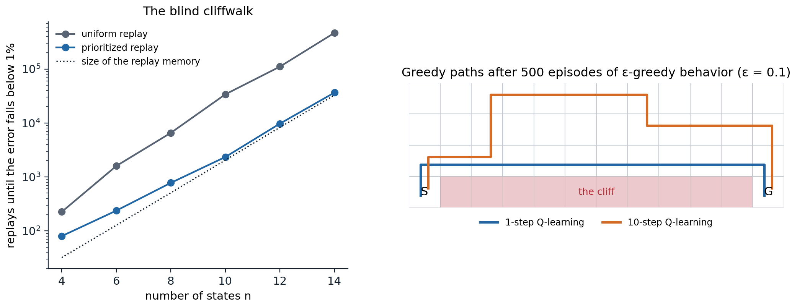

[ML Mastery Notes](../README.md) › [Reinforcement Learning](README.md)

# 18. Data-Efficient and Scalable Value-Based Agents

[← 17. Distributional Reinforcement Learning](17-distributional-reinforcement-learning.md) · [19. Deep Actor-Critic and Distributed RL →](19-deep-actor-critic-and-distributed-rl.md)

## <a id="after-dqn"></a>After DQN

DQN's recipe left room for improvement in every component: how transitions are chosen for replay, how far targets look ahead, how the agent explores, what the network outputs, how many actors collect data, and how much is learned from each piece of it. This chapter follows three lines of work that grew from it. The first combined six independent improvements into **Rainbow**. The second scaled data collection to hundreds of actors and added recurrence and intrinsic motivation, culminating in **Agent57**, the first agent to exceed the human benchmark on all 57 Atari games. The third went the other way, toward agents that learn from two hours of play what DQN learned from 38 days, culminating in agents such as **BBF** that reach human-level performance on the Atari 100k benchmark. Model-based agents that pursue the same goals, MuZero and EfficientZero, are the subject of chapter 24.

## <a id="rainbow"></a>Rainbow

### <a id="prioritized-experience-replay"></a>Prioritized experience replay

Uniform replay treats every stored transition as equally informative, but most are not: once the agent has learned what happens when nothing happens, replaying those transitions teaches it little, while the rare transition that reveals a reward is worth replaying many times. **Prioritized experience replay** (PER) ([Schaul, Quan, Antonoglou, and Silver, 2016](https://arxiv.org/abs/1511.05952)) replays transitions in proportion to how surprising they were, measured by the magnitude of their last TD error. It is the replay counterpart of the prioritized sweeping of chapter 10.

Replaying only the transition with the largest error would be too greedy: errors are updated only for replayed transitions, so a transition with a small error when first seen might never be replayed again, and a few noisy transitions could monopolize the replays. PER samples stochastically instead. Each transition $`i`$ has a priority $`p_i=|\delta_i|+\epsilon`$, with a small $`\epsilon`$ that keeps every probability positive (or $`p_i=1/\mathrm{rank}(i)`$ in the rank-based variant), and is sampled with probability

```math
P(i)=\frac{p_i^\alpha}{\sum_kp_k^\alpha},
```

where $`\alpha`$ interpolates between uniform sampling ($`\alpha=0`$) and full prioritization ($`\alpha=1`$); new transitions receive the largest current priority, so that each is replayed at least once. Sampling from this distribution changes the distribution of the data, which biases the updates toward the prioritized transitions. PER corrects the bias with **importance weights**, $`w_i=\bigl(1/(N\,P(i))\bigr)^\beta`$, normalized by their maximum for stability, which multiply each transition's loss; $`\beta`$ is annealed from about 0.4 to 1 over training, since unbiasedness matters most at the end, when the values converge (exercise 18.1). Sampling in proportion to priorities among millions of transitions is done with a **sum tree**, a binary tree whose leaves hold the priorities and whose internal nodes hold the sums of their children, so that updating a priority and sampling both take $`O(\log N)`$ time.

The next code reproduces a version of the **blind cliffwalk** with which Schaul et al. motivated prioritization: a chain in which only one of two actions leads forward and reward comes only at the end, so that a random policy almost never finds it.

```python
import numpy as np

# The blind cliffwalk of Schaul, Quan, Antonoglou, and Silver (2016): a chain of n states with two actions; the
# "right" action moves one state along, the "wrong" one ends the episode with reward 0, and which is which differs
# from state to state; reaching the end pays 1. A replay memory holds the transitions of 2^n episodes of a
# uniformly random policy (plus one successful episode, if none succeeded), so the rewarding transition is rare.
# Tabular Q-learning (gamma = 1 - 1/n, step size 1/4) replays one transition at a time: uniformly, or in proportion
# to its priority, the |TD error| it had when last replayed plus 0.0001, sampled with a sum tree. New transitions
# start with priority 1. Count the replays until the mean squared error of Q over all state-action pairs falls
# below 1% of its initial value.
rng = np.random.default_rng(0)


class SumTree:
    """Priorities in the leaves of a binary tree whose internal nodes hold sums: O(log n) updates and sampling."""

    def __init__(self, n):
        self.size = 1
        while self.size < n:
            self.size *= 2
        self.tree = np.zeros(2 * self.size)

    def update(self, i, p):
        j = i + self.size; self.tree[j] = p; j //= 2
        while j >= 1:
            self.tree[j] = self.tree[2 * j] + self.tree[2 * j + 1]; j //= 2

    def sample(self, u):
        """The leaf where the cumulative sum of priorities first exceeds u * total."""
        j, u = 1, u * self.tree[1]
        while j < self.size:
            j *= 2
            if u >= self.tree[j]:
                u -= self.tree[j]; j += 1
        return j - self.size


def cliffwalk(n):
    right = rng.integers(2, size=n)
    memory, success = [], False
    for _ in range(2 ** n):
        s = 0
        while True:
            a = int(rng.integers(2))
            if a != right[s]:
                memory.append((s, a, 0.0, 0, True)); break
            if s == n - 1:
                memory.append((s, a, 1.0, 0, True)); success = True; break
            memory.append((s, a, 0.0, s + 1, False)); s += 1
    if not success:
        memory += [(s, right[s], 0.0, s + 1, False) for s in range(n - 1)] + [(n - 1, right[n - 1], 1.0, 0, True)]
    return right, memory


def replays_needed(n, method, cap=1000000):
    right, memory = cliffwalk(n)
    gamma = 1 - 1 / n
    q_true = np.zeros((n, 2)); q_true[np.arange(n), right] = gamma ** (n - 1 - np.arange(n))
    Q = np.zeros((n, 2)); err0 = ((Q - q_true) ** 2).mean()
    tree = SumTree(len(memory))
    for i in range(len(memory)):
        tree.update(i, 1.0)
    for u in range(1, cap + 1):
        if method == "uniform":
            i = int(rng.integers(len(memory)))
        else:
            i = tree.sample(rng.random())
        s, a, r, s2, done = memory[i]
        delta = r + (0.0 if done else gamma * Q[s2].max()) - Q[s, a]
        Q[s, a] += 0.25 * delta
        tree.update(i, abs(delta) + 1e-4)                         # the new priority of the replayed transition
        if ((Q - q_true) ** 2).mean() < 0.01 * err0:
            return u, len(memory)
    return np.inf, len(memory)


print("   n   transitions   uniform replay   prioritized replay   (replays needed, median of 5 memories)")
for n in (4, 6, 8, 10, 12):
    res = {m: [] for m in ("uniform", "proportional")}
    sizes = []
    for rep in range(5):
        for m in res:
            u, size = replays_needed(n, m); res[m].append(u)
        sizes.append(size)
    print(f"{n:4d}   {int(np.median(sizes)):11,d}   {np.median(res['uniform']):14,.0f}   {np.median(res['proportional']):18,.0f}")
#    n   transitions   uniform replay   prioritized replay   (replays needed, median of 5 memories)
#    4            30              225                   80
#    6           132            1,593                  237
#    8           516            6,552                  776
#   10         2,046           33,921                2,341
#   12         8,154          110,510                9,714
```

With uniform replay, the number of replays needed grows much faster than the memory: most replays revisit transitions whose targets have not changed. With prioritization, it stays close to the size of the memory, since each replay goes where the information is: first to the rewarding transition, then to its predecessor, whose error has just grown, and so on back along the chain. On Atari, adding prioritized replay to DQN improved its score on 41 of 49 games, raising the median human-normalized score from 48% to 106%, and adding it to double DQN raised the median over 57 games from 111% to 128%.

### <a id="multi-step-returns"></a>Multi-step returns

The one-step target propagates a reward back by one step per update. The **$`n`$-step target** of chapter 8,

```math
y_t=\sum_{k=0}^{n-1}\gamma^kR_{t+k+1}+\gamma^n\max_{a'}\hat q(S_{t+n},a';\mathbf w^-),
```

propagates it $`n`$ steps at once and depends less on the current estimates, at the price of more variance. With replay it is also off-policy in an uncorrected way: the intermediate actions were chosen by an older, exploratory policy, not by the greedy policy whose value the target should estimate, and deep agents usually ignore this rather than correct it with the importance weights or traces of chapter 9. The bias is often harmless and sometimes useful, as the next code shows.

```python
import numpy as np

# Multi-step Q-learning without off-policy corrections, as in Rainbow, on the cliff-walking gridworld (4 x 12,
# reward -1 per step, -100 and back to the start for stepping into the cliff, gamma = 1) with epsilon-greedy
# behavior (epsilon = 0.1). The n-step target sum_{k<n} R_{t+k+1} + max_a Q(S_{t+n}, a) uses the behavior's own
# actions for n - 1 steps, so for n > 1 it estimates a mixture of the greedy and the behavior policy's values.
# 20 runs of 500 episodes, step size 0.1; the greedy path's length at the end (13 steps along the cliff is
# optimal, 17 is the safe path along the top) and the learned value of the start (the optimal value is -13).
rng = np.random.default_rng(0)
H, W = 4, 12
start, goal = (3, 0), (3, 11)
moves = [(-1, 0), (1, 0), (0, -1), (0, 1)]


def step(s, a):
    r, c = s[0] + moves[a][0], s[1] + moves[a][1]
    r, c = min(max(r, 0), H - 1), min(max(c, 0), W - 1)
    if r == 3 and 0 < c < 11:
        return start, -100.0
    return (r, c), -1.0


def run(n, episodes=500, eps=0.1, alpha=0.1):
    Q = np.zeros((H, W, 4))
    for ep in range(episodes):
        s = start; traj = []                                   # (state, action, reward)
        done = False
        while not done:
            a = int(rng.integers(4)) if rng.random() < eps else int(rng.choice(np.flatnonzero(Q[s] == Q[s].max())))
            s2, r = step(s, a); traj.append((s, a, r)); s = s2; done = s == goal
            if len(traj) >= n or done:                         # update the oldest pending pair
                for k in range(len(traj) if done else 1):
                    G = sum(x[2] for x in traj[k:k + n]) + (0.0 if done and k + n >= len(traj) else Q[s].max())
                    ps, pa, _ = traj[k]
                    Q[ps][pa] += alpha * (G - Q[ps][pa])
                if not done:
                    traj.pop(0)
    s, length = start, 0                                        # the greedy path
    while s != goal and length < 100:
        s, _ = step(s, int(np.argmax(Q[s]))); length += 1
    return length, Q[start].max()


print("   n   greedy path length (median of 20)   value of the start (mean)")
for n in (1, 3, 5, 10):
    res = [run(n) for _ in range(20)]
    print(f"{n:4d}   {np.median([r[0] for r in res]):22.0f}   {np.mean([r[1] for r in res]):26.1f}")
#    n   greedy path length (median of 20)   value of the start (mean)
#    1                       13                        -13.0
#    3                       17                        -18.6
#    5                       17                        -20.3
#   10                       17                        -22.8
```

The one-step learner finds the optimal path along the cliff edge. The multi-step learners' targets include $`n-1`$ of the behavior's own actions, including its random ones, so their values are those of a mixture of the greedy and the exploratory policy, which pays for walking near the cliff: they learn the safe path, like SARSA in chapter 7, and their value of the start is lower the longer the lookahead. The bias is small when exploration is rare and the policy changes slowly, and in exchange, rewards propagate much faster. Rainbow uses $`n=3`$, and later agents use more, with $`n`$ sometimes annealed during training.



*Left: replays needed by tabular Q-learning to learn the values of the blind cliffwalk, from a memory holding the transitions of $`2^n`$ random episodes, with uniform and prioritized replay (medians of 5 memories). Uniform replay needs more and more replays per stored transition as the chain grows; prioritized replay needs about one per transition. Right: the greedy paths learned on the cliff-walking gridworld by one-step and ten-step Q-learning, both with ε-greedy behavior. The ten-step learner's targets include the behavior's random steps, and it takes a detour away from the cliff.*

### <a id="noisy-networks"></a>Noisy networks

ε-greedy exploration is undirected and state-independent: it randomizes a fixed fraction of actions everywhere, whether or not the agent is uncertain. **Noisy networks** ([Fortunato et al., 2018](https://arxiv.org/abs/1706.10295)) replace it by learned noise in the weights. A noisy linear layer computes

```math
\mathbf y=(\boldsymbol\mu^w+\boldsymbol\sigma^w\odot\boldsymbol\varepsilon^w)\mathbf x+\boldsymbol\mu^b+\boldsymbol\sigma^b\odot\boldsymbol\varepsilon^b,
```

where the means $`\boldsymbol\mu`$ and the noise scales $`\boldsymbol\sigma`$ are learned by gradient descent along with the rest of the network, and the noise $`\boldsymbol\varepsilon`$ is resampled, usually once per step or per update. To save random numbers, the noise of a $`p\times q`$ weight matrix is **factorized**, $`\varepsilon^w_{ij}=f(\varepsilon_i)f(\varepsilon_j)`$ with $`f(x)=\mathrm{sign}(x)\sqrt{|x|}`$, using $`p+q`$ independent Gaussians instead of $`pq+q`$. The greedy action of a noisy network varies from step to step in a way that depends on the state and that the agent can reduce where it has learned to, by shrinking $`\boldsymbol\sigma`$: a crude but automatic form of the directed exploration of chapter 22. Noisy nets raised the median human-normalized score on Atari by 48% for DQN and 30% for dueling DQN (and 18% for A3C), though the gains varied widely from game to game.

### <a id="putting-it-together"></a>Putting it together

**Rainbow** ([Hessel et al., 2018](https://arxiv.org/abs/1710.02298)) combined six extensions of DQN: double Q-learning, prioritized replay, the dueling architecture, multi-step returns, the distributional C51 output of chapter 17, and noisy networks. Some combinations need care: the priorities are the KL losses of the distributional outputs rather than TD errors, and the double Q-learning target selects the action by the online network's mean and evaluates the target network's distribution for it. Rainbow was far better than any of its components alone, in final performance and even more in data efficiency: it matched DQN's final performance after 7 million frames, instead of DQN's 200 million.

Its **ablations** were as influential as its results. Removing prioritized replay or multi-step returns hurt the most, then removing the distributional output; noisy networks helped on many games and hurt on a few; and removing double Q-learning or the dueling architecture made little difference to the median, although each helped on some games and hurt on others. The authors suggest that double Q-learning mattered little because, with clipped rewards, returns often exceeded the distributional support of $`[-10,10]`$, so the agent tended to underestimate rather than overestimate. The components are not independent, and their value depends on the rest of the agent. [Obando-Ceron and Castro (2021)](https://arxiv.org/abs/2011.14826) repeated the study on classic-control tasks and the small MinAtar games at a fraction of the cost; they confirmed that the components' value varies across environments, but found, unlike Hessel et al., that distributional RL sometimes hurt. These small environments became a common test bed for such questions.

## <a id="scaling-up-distributed-agents"></a>Scaling up: distributed agents

### <a id="many-actors-one-learner"></a>Many actors, one learner

The other direction of progress was to collect more data, faster. **Gorila** ([Nair et al., 2015](https://arxiv.org/abs/1507.04296)) ran many DQN actors and learners in parallel with a shared parameter server. **Ape-X** ([Horgan et al., 2018](https://arxiv.org/abs/1803.00933)) found a simpler and more effective division of labor: hundreds of actors, each running a copy of the network on a CPU with its own exploration rate, $`\varepsilon_i=\varepsilon^{1+7i/(N-1)}`$ for actor $`i`$ of $`N`$, feed a single large prioritized replay memory, from which one learner on a GPU trains a dueling double DQN with 3-step returns. The actors compute the initial priorities of their transitions, which spares the learner that work, and the learner periodically sends them its parameters. With 360 actors, Ape-X collected more experience in hours than DQN in its whole training, and it far surpassed Rainbow's scores, at the cost of far more frames: sample efficiency was traded for wall-clock speed.

### <a id="recurrence-r2d2"></a>Recurrence: R2D2

**R2D2** ([Kapturowski et al., 2019](https://openreview.net/forum?id=r1lyTjAqYX)) added a recurrent network to Ape-X, for partially observable games (chapter 14), and had to solve the problem of training a recurrent network from replay. A sampled sequence starts in the middle of an episode, where the network's recurrent state is unknown: starting from zeros gives misleading predictions, and the recurrent state stored when the sequence was generated is stale, since the network has changed since. R2D2 stores the recurrent state with each sequence and uses the first part of each sampled sequence, the **burn-in**, only to update that state, computing losses on the rest. It also uses 5-step returns, a discount of 0.997, and an invertible **value rescaling** $`h(x)=\mathrm{sign}(x)(\sqrt{|x|+1}-1)+\epsilon x`$ applied to the targets instead of reward clipping, so that the agent optimizes the unclipped score ([Pohlen et al., 2018](https://arxiv.org/abs/1805.11593); exercise 18.6). R2D2 quadrupled Ape-X's median human-normalized score and exceeded human performance on 52 of the 57 games.

### <a id="agent57"></a>Agent57

The games that remained hard for R2D2 were those with sparse rewards, such as Montezuma's Revenge and Pitfall, which require long sequences of actions before any reward, and those that require long-term credit assignment, such as Skiing, where the reward comes only at the end. **Never Give Up** (NGU) ([Badia et al., 2020](https://arxiv.org/abs/2002.06038)) added intrinsic rewards for novelty, both within the episode and across the agent's lifetime (chapter 22), and learned a family of policies with different weights $`\beta`$ on the intrinsic reward and different discounts $`\gamma`$. **Agent57** ([Badia et al., 2020](https://arxiv.org/abs/2003.13350)) made the family adaptive: a sliding-window bandit, the meta-controller of chapter 3, chooses which member of the family each actor runs, according to the returns each has been obtaining, and separate networks estimate the extrinsic and intrinsic values, which have very different scales. It was the first agent to exceed the human benchmark on all 57 Atari games, including Pitfall and Skiing, but it needed tens of billions of frames to do so (about 78 billion for Skiing).

## <a id="learning-from-little-data"></a>Learning from little data

### <a id="the-atari-100k-benchmark"></a>The Atari 100k benchmark

Humans reach their Atari scores after about two hours of play. The **Atari 100k** benchmark ([Kaiser et al., 2020](https://arxiv.org/abs/1903.00374)) limits agents to 100,000 agent steps, 400,000 frames or about two hours of game time, on 26 games, and it became the standard test of sample efficiency. The model-based agent that introduced it, SimPLe, was soon matched by model-free agents that simply learn more from each transition: **data-efficient Rainbow** ([van Hasselt, Hessel, and Aslanides, 2019](https://arxiv.org/abs/1906.05243)) makes more updates per environment step, uses longer multi-step returns and an earlier start of learning, and argues that a replay memory is a nonparametric model, so that more replay is a form of model-based planning.

### <a id="representations-for-data-efficiency"></a>Representations for data efficiency

With little data, learning good features is the bottleneck, and two ideas from representation learning helped. **Data augmentation**: DrQ ([Kostrikov, Yarats, and Fergus, 2021](https://arxiv.org/abs/2004.13649)) shifts each image by a few random pixels before the network sees it, which regularizes the value function and improves data efficiency across pixel-based benchmarks; CURL ([Laskin, Srinivas, and Abbeel, 2020](https://arxiv.org/abs/2004.04136)) adds a contrastive loss between augmented views (DL chapter 10). **Self-prediction**: SPR ([Schwarzer et al., 2021](https://arxiv.org/abs/2007.05929)) trains a transition model in the latent space to predict the representations of future observations, computed by a slowly updated target encoder, with a cosine loss, and uses the resulting features for Q-learning. It learns a model without ever planning with it.

### <a id="replay-ratio-resets-and-scale"></a>Replay ratio, resets, and scale

The obvious way to learn more from each transition is to update more often, but raising the **replay ratio**, the number of updates per environment step, beyond a few makes most agents worse. The reason is the loss of plasticity of chapter 16: a network trained intensively on its early data overfits to it and loses its ability to learn from new data. **Periodic resets** of some or all of the network's parameters, with the replay memory kept, restore plasticity ([Nikishin et al., 2022](https://arxiv.org/abs/2205.07802), who call the effect the primacy bias), and with resets the replay ratio can be raised much further ([D'Oro et al., 2023](https://openreview.net/forum?id=OpC-9aBBVJe)). **BBF** ([Schwarzer et al., 2023](https://arxiv.org/abs/2305.19452)) combined these ideas: a much larger network (the 15-layer Impala ResNet, four times wider), a high replay ratio with periodic resets, self-predictive representations, weight decay, and annealing of the discount and the multi-step horizon after each reset. It was the first model-free agent to exceed human performance on Atari 100k by the interquartile mean of human-normalized scores, with at least four times less running time than the model-based EfficientZero, which had led the benchmark.

### <a id="losses-and-architectures-for-scale"></a>Losses and architectures for scale

Value-based agents had long resisted the benefits of scale that transformed supervised learning: larger networks often made them worse. Several changes have made them scale better. Training the value head by **classification** rather than regression, with a cross-entropy loss against a target histogram built from a Gaussian around the scalar target (HL-Gauss), stabilizes learning and lets larger networks help, in the spirit of the distributional losses of chapter 17 ([Farebrother et al., 2024](https://arxiv.org/abs/2403.03950)). **Mixtures of experts** (especially Soft MoE) in place of the penultimate layer allow parameter counts to grow with improving performance ([Obando-Ceron et al., 2024](https://arxiv.org/abs/2402.08609)). And offline Q-learning on large multi-task data sets with large networks has been shown to scale and to transfer ([Kumar et al., 2023](https://arxiv.org/abs/2211.15144)), as has Q-learning with transformer backbones for robot control ([Chebotar et al., 2023](https://arxiv.org/abs/2309.10150)). Chapter 26 returns to Q-learning from fixed data sets.

Two further lines of work simplify rather than enlarge. The diagnosis of lost plasticity has become more precise: over training, a growing fraction of a value network's units become **dormant**, with activations near zero relative to the rest of their layer, and reinitializing them restores the network's ability to learn at high replay ratios ([Sokar, Agarwal, Castro, and Evci, 2023](https://arxiv.org/abs/2302.12902)), in the same spirit as the continual backpropagation of [Dohare et al. (2024)](https://www.nature.com/articles/s41586-024-07711-7), which keeps reinitializing a small fraction of the least useful units. And normalization can replace the classic stabilizers: **PQN** ([Gallici et al., 2025](https://arxiv.org/abs/2407.04811)) shows that layer normalization, with a little $`L_2`$ regularization, keeps temporal-difference learning with function approximation stable, and drops both the replay memory and the target network in favor of many vectorized environments and λ-returns, which makes Q-learning much faster in wall-clock time, the approach of the next chapter's synchronous actor–critic agents. As these agents have grown more stable, their behavior at scale has become predictable enough for scaling laws: the data and compute needed for a given performance trade off along a predictable frontier set by the update-to-data (replay) ratio, with the best batch size and learning rate following power laws in that ratio, both decreasing as it grows ([Rybkin et al., 2025](https://arxiv.org/abs/2502.04327)); and for a fixed compute budget, model size and the update-to-data ratio can be traded against each other, with larger models able to use larger batches, while the learning rate matters less ([Fu et al., 2025](https://arxiv.org/abs/2508.14881)). Chapter 21 describes the corresponding architectures for continuous control.

### <a id="evaluating-agents"></a>Evaluating agents

The results of this chapter are summarized in the literature by the median human-normalized score, and increasingly by the interquartile mean with bootstrapped confidence intervals across many runs ([Agarwal et al., 2021](https://arxiv.org/abs/2108.13264)). Comparisons across papers are fragile: agents differ in frame budgets, in whether they use sticky actions, in whether evaluation starts with no-ops or human starts, and in how many seeds they report. A score is meaningful only with its protocol.

## <a id="exercises"></a>Exercises

### <a id="exercise-18-1-the-importance-weights-of-prioritized-replay"></a>Exercise 18.1 — The importance weights of prioritized replay

Let the loss of a minibatch be the average of $`\ell_i`$ over sampled transitions. (a) With uniform sampling from a memory of $`N`$ transitions, what is the expected loss? (b) With sampling probabilities $`P(i)`$, show that the weights $`w_i=1/(NP(i))`$ make the weighted loss an unbiased estimate of the uniform expected loss. (c) Why anneal $`\beta`$ rather than use $`\beta=1`$ throughout?


<details>
<summary><b>Solution</b></summary>


(a) $`\frac1N\sum_i\ell_i`$, the loss on the empirical distribution of the memory, which is what uniform replay minimizes in expectation.

(b) $`\mathbb E_{i\sim P}[w_i\ell_i]=\sum_iP(i)\frac{\ell_i}{NP(i)}=\frac1N\sum_i\ell_i`$. With $`\beta<1`$ the correction is partial: the expectation is $`\sum_iP(i)^{1-\beta}N^{-\beta}\ell_i`$, a weighting proportional to $`P(i)^{1-\beta}`$, between the prioritized and the uniform one.

(c) Early in training, the targets themselves are changing, and the bias from prioritization matters less than learning quickly from surprising transitions; full correction would also scale down the gradients of exactly the high-priority transitions that prioritization chose to replay. Near convergence, when the fixed point matters, the bias does matter, so $`\beta`$ is raised to 1. Normalizing the weights by their maximum only scales the step size down, never up, which keeps the updates stable.

</details>


### <a id="exercise-18-2-the-sum-tree"></a>Exercise 18.2 — The sum tree

(a) Show that sampling a leaf by descending the tree, going left when $`u`$ is below the left child's sum and right after subtracting it otherwise, selects leaf $`i`$ with probability $`p_i/\sum_kp_k`$. (b) PER samples a minibatch of $`k`$ by dividing $`[0,\sum p)`$ into $`k`$ equal segments and sampling one value in each. Why?


<details>
<summary><b>Solution</b></summary>


(a) Let $`u`$ be uniform on $`[0,T)`$ with $`T`$ the root's sum. At each node with left sum $`L`$ and right sum $`R`$ and $`u`$ uniform on $`[0,L+R)`$, going left has probability $`L/(L+R)`$, and conditionally on the choice, the remaining $`u`$ (after subtracting $`L`$ when going right) is uniform on the chosen child's range. By induction the probability of reaching a leaf is the product of these ratios along its path, which telescopes to $`p_i/T`$. Each level costs $`O(1)`$, so a sample costs $`O(\log N)`$, as does updating a leaf and its ancestors.

(b) Stratification: one sample per segment spreads the minibatch across the whole distribution of priorities, reduces the variance of the minibatch's composition, and avoids minibatches dominated by a few very high-priority transitions, while keeping each transition's expected number of appearances in the minibatch exactly $`k\,p_i/\sum_jp_j`$, as with independent sampling.

</details>


### <a id="exercise-18-3-the-bias-of-uncorrected-multi-step-targets"></a>Exercise 18.3 — The bias of uncorrected multi-step targets

In the cliff-walking code, the $`n`$-step learners' value of the start is $`-18.6`$ for $`n=3`$ and $`-22.8`$ for $`n=10`$, against the optimal $`-13`$. (a) What do the uncorrected $`n`$-step targets estimate, for a fixed behavior policy $`\mu`$? (b) What would Retrace do differently?


<details>
<summary><b>Solution</b></summary>


(a) The target follows $`\mu`$ for $`n-1`$ steps and then the greedy policy, so its fixed point is the value of the nonstationary policy that follows $`\mu`$ for $`n-1`$ steps, then takes one greedy action, and repeats this cycle. With ε-greedy behavior near a cliff, the first part includes a chance of falling, which makes paths near the cliff look worse, more so for larger $`n`$. As $`n\to\infty`$ it approaches the value of $`\mu`$ itself, as in Monte Carlo evaluation of the behavior.

(b) Retrace (chapter 9) multiplies the correction for each step by the truncated importance weight $`c_k=\lambda\min(1,\pi(A_k\mid S_k)/\mu(A_k\mid S_k))`$. For a greedy target policy, $`\pi(A_k\mid S_k)`$ is 0 for exploratory actions, which cuts the trace at the first non-greedy action: the target then uses only the greedy part of the trajectory, removing the bias, at the cost of shorter effective lookahead when exploration is frequent. Deep agents such as Rainbow, Ape-X, and R2D2 simply use short $`n`$ (3 to 5) and accept the bias.

</details>


### <a id="exercise-18-4-factorized-noise"></a>Exercise 18.4 — Factorized noise

A noisy layer maps $`p`$ inputs to $`q`$ outputs. (a) How many learned parameters does it have, compared with an ordinary layer? (b) How many random numbers per sample with independent and with factorized noise? (c) Why does noise in the weights give state-dependent exploration?


<details>
<summary><b>Solution</b></summary>


(a) Twice as many: a mean and a scale for each of the $`pq`$ weights and $`q`$ biases.

(b) Independent noise needs $`pq+q`$ Gaussians per sample; factorized noise needs $`p+q`$, with $`\varepsilon^w_{ij}=f(\varepsilon_i)f(\varepsilon_j)`$ and $`\varepsilon^b_j=f(\varepsilon_j)`$. For a layer of $`3136\times512`$, as in the Atari network, that is about 1.6 million against about 3,600.

(c) The perturbation of the output is $`(\boldsymbol\sigma^w\odot\boldsymbol\varepsilon^w)\mathbf x+\boldsymbol\sigma^b\odot\boldsymbol\varepsilon^b`$, which depends on the input $`\mathbf x`$: states with different features receive different perturbations of their action values, and the effect on the greedy action depends on how close the action values are there. The agent can learn to shrink the scales of weights connected to features of well-understood states, reducing exploration where it is not needed. ε-greedy perturbs every state equally.

</details>


### <a id="exercise-18-5-ape-x-s-exploration-rates"></a>Exercise 18.5 — Ape-X's exploration rates

(a) With $`N=360`$ actors, $`\varepsilon=0.4`$, and $`\varepsilon_i=\varepsilon^{1+7i/(N-1)}`$, what are the smallest and largest exploration rates, and what fraction of actors explore with $`\varepsilon_i>0.01`$? (b) Why use a spread of rates instead of one?


<details>
<summary><b>Solution</b></summary>


(a) Actor 0 has $`\varepsilon_0=0.4`$, and actor 359 has $`0.4^8\approx0.00066`$. $`\varepsilon_i>0.01`$ means $`(1+7i/359)\ln0.4>\ln0.01`$, that is $`1+7i/359<5.03`$, or $`i<206.5`$: about 57% of the actors.

(b) Different rates give the replay memory a mixture of data: nearly greedy actors produce long, high-scoring trajectories that show the consequences of good play, while exploratory actors visit states the greedy policy never would. No single rate provides both, and the spread removes the need to tune an exploration schedule; Agent57 later made the choice among such behaviors adaptive.

</details>


### <a id="exercise-18-6-value-rescaling"></a>Exercise 18.6 — Value rescaling

R2D2 replaces reward clipping by the target $`h\bigl(r+\gamma h^{-1}(\hat q(s',a^*;\mathbf w^-))\bigr)`$ with $`h(x)=\mathrm{sign}(x)(\sqrt{|x|+1}-1)+\epsilon x`$. (a) Check numerically that $`h`$ is invertible, with inverse $`h^{-1}(y)=\mathrm{sign}(y)\Bigl(\bigl(\frac{\sqrt{1+4\epsilon(|y|+1+\epsilon)}-1}{2\epsilon}\bigr)^2-1\Bigr)`$. (b) Why not clip rewards?


<details>
<summary><b>Solution</b></summary>


```python
import numpy as np

# The value rescaling of R2D2 (Pohlen et al., 2018): h(x) = sign(x)(sqrt(|x| + 1) - 1) + eps x with eps = 0.001,
# and its closed-form inverse. The rescaled target is h(r + gamma h^-1(Q_target)).
eps = 1e-3


def h(x):
    return np.sign(x) * (np.sqrt(np.abs(x) + 1) - 1) + eps * x


def h_inv(y):
    return np.sign(y) * (((np.sqrt(1 + 4 * eps * (np.abs(y) + 1 + eps)) - 1) / (2 * eps)) ** 2 - 1)


print("          x         h(x)   h^-1(h(x))")
for x in (-10000.0, -100.0, -1.0, 0.0, 0.5, 10.0, 1000.0, 100000.0):
    print(f"{x:11,.1f} {h(x):12.3f} {h_inv(h(x)):12,.3f}")
xs = np.linspace(-1e6, 1e6, 100001)
print(f"largest round-trip error over [-1e6, 1e6]: {np.abs(h_inv(h(xs)) - xs).max():.1e}")
#           x         h(x)   h^-1(h(x))
#   -10,000.0     -109.005  -10,000.000
#      -100.0       -9.150     -100.000
#        -1.0       -0.415       -1.000
#         0.0        0.000        0.000
#         0.5        0.225        0.500
#        10.0        2.327       10.000
#     1,000.0       31.639    1,000.000
#   100,000.0      415.229  100,000.000
# largest round-trip error over [-1e6, 1e6]: 5.8e-10
```

(a) $`h`$ compresses a range of values from $`-10{,}000`$ to $`100{,}000`$ into about $`-109`$ to $`415`$, roughly a square root for large values, and it is strictly increasing, since its derivative is $`\mathrm{sign}(x)\cdot\frac{\mathrm{sign}(x)}{2\sqrt{|x|+1}}+\epsilon>0`$; the closed-form inverse recovers the inputs to within numerical precision. The term $`\epsilon x`$ keeps it from flattening completely, so that $`h^{-1}`$ is Lipschitz.

(b) Clipping changes the objective (exercise 16.3): the agent maximizes the number of rewarding events rather than the score. Rescaling instead changes the representation of the values, not the objective. The network predicts $`h(q)`$, whose scale is moderate for all games, and the target applies the Bellman backup in the original scale before rescaling. The resulting operator is not exactly the Bellman operator, but in deterministic environments its fixed point is $`h(q_*)`$, so the greedy policy is unchanged ([Pohlen et al., 2018](https://arxiv.org/abs/1805.11593)).

</details>


### <a id="exercise-18-7-replay-ratios"></a>Exercise 18.7 — Replay ratios

(a) DQN makes one update of 32 transitions every 4 steps. How many times is each transition sampled on average over 100,000 steps if the memory holds all of them? (b) BBF uses a replay ratio of 8 updates per step with minibatches of 32 on Atari 100k. How many updates is that, and how many times is each transition sampled? (c) Why does this require resets?


<details>
<summary><b>Solution</b></summary>


(a) 25,000 updates of 32 give 800,000 samples from 100,000 transitions: 8 samples per transition on average (more for early transitions, which stay in the memory longer, if sampling is uniform over the whole memory at each step: a transition stored at step $`t`$ is sampled about $`\sum_{t'>t}32/(4t')\approx8\ln(100{,}000/t)`$ times).

(b) 800,000 updates of 32 give 25.6 million samples: 256 per transition on average, 32 times more than DQN's ratio, and far more for the earliest transitions.

(c) A network updated hundreds of times on each early transition fits them closely, and the targets computed from it inherit that overfitting; its gradients also become less able to change the network, the loss of plasticity. Resetting the later layers (or all layers, with the representation re-learned from the replay memory, which is kept) lets the agent relearn from all the data it has collected, instead of being anchored to its first impressions. With resets, the benefit of a high replay ratio outweighs the cost.

</details>


### <a id="exercise-18-8-which-component-matters"></a>Exercise 18.8 — Which component matters?

Rainbow's ablation found that removing double Q-learning made little difference, although double DQN clearly improved over DQN. Give two reasons why a component's value in isolation can differ from its value in a combination, and what this implies for reading ablation studies.


<details>
<summary><b>Solution</b></summary>


First, **redundancy**: components can fix the same problem. In Rainbow, the authors attribute double Q-learning's small effect to the distributional output: with clipped rewards, returns often exceeded its support of $`[-10,10]`$, and the resulting underestimation offset the overestimation that double Q-learning corrects, so once it was present, double Q-learning had less left to fix. Second, **interaction**: a component's effect depends on the others' settings. Prioritized replay's priorities, for example, are computed from distributional losses in Rainbow, and the best step size, multi-step horizon, or network size depends on which components are present, so an ablation with other hyperparameters fixed measures the component together with the mistuning its removal causes. Ablations therefore answer "how much does this agent rely on the component", not "is the component useful": the answer can change with the agent, the benchmark, and the data budget, as the data-efficient variants of Rainbow and the MinAtar studies showed.

</details>


## <a id="appendices"></a>Appendices


<details>
<summary><a id="block-rl18-appendix-a"></a><b>A. Prioritized replay in a deep agent</b></summary>


The memory stores, for each transition, its data and a priority in a sum tree (and a min tree, to compute the largest importance weight). New transitions receive the largest priority seen so far. For each update:

1. Draw $`k`$ values, one uniformly in each of $`k`$ equal segments of $`[0,\sum_ip_i^\alpha)`$, and descend the sum tree to find the transitions.
2. Compute $`w_j=(N\,P(j))^{-\beta}/\max_iw_i`$, where the maximum weight belongs to the transition with the smallest priority, found in the min tree.
3. Compute the TD errors $`\delta_j`$ (or distributional losses) and take a gradient step on $`\frac1k\sum_jw_j\,\ell(\delta_j)`$.
4. Set the priorities of the sampled transitions to $`(|\delta_j|+\epsilon)^\alpha`$.

With a distributed agent, the actors compute the initial priorities from their own copies of the network, and the learner updates them after each use. On Atari, PER used $`\alpha=0.6`$ and $`\beta`$ from 0.4 to 1 for proportional prioritization, and reduced the step size by a factor of 4 to compensate for the larger errors of the prioritized transitions.

</details>


<details>
<summary><a id="block-rl18-appendix-b"></a><b>B. The recurrent replay of R2D2</b></summary>


R2D2 stores sequences of 80 steps, adjacent ones overlapping by 40, together with the recurrent state the actor had at their start. In the final agent, each 80-step training sequence is preceded by a burn-in prefix of 40 steps: the network is run from the stored state over the prefix without computing losses, to move the recurrent state from the stale stored value toward what the current network would produce, and the losses are computed on all 80 steps that follow, with 5-step double Q-learning targets and value rescaling. The paper measured the **recurrent state staleness** as the normalized difference between the Q-values the current network computes from the recurrent states the actor stored at each step and from the states obtained by unrolling the current network over the replayed sequence (from a zero or stored start state, with or without burn-in), and showed that both the stored state and the burn-in reduce it, the combination most. Priorities are a mixture of the maximum and the mean of the absolute TD errors over the sequence, $`0.9\max_t|\delta_t|+0.1\,\overline{|\delta|}`$, since averaging over a long sequence would wash out the informative steps.

</details>

---

[← 17. Distributional Reinforcement Learning](17-distributional-reinforcement-learning.md) · [19. Deep Actor-Critic and Distributed RL →](19-deep-actor-critic-and-distributed-rl.md)
