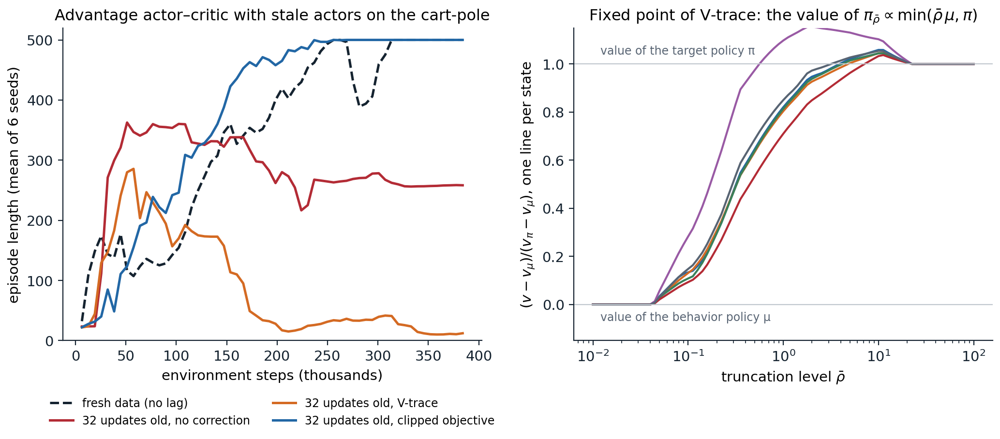

[ML Mastery Notes](../README.md) › [Reinforcement Learning](README.md)

# 19. Deep Actor-Critic and Distributed RL

[← 18. Data-Efficient and Scalable Value-Based Agents](18-data-efficient-and-scalable-value-based-agents.md) · [20. Trust Regions and Proximal Policy Optimization →](20-trust-regions-and-proximal-policy-optimization.md)

## <a id="from-one-actor-to-many"></a>From one actor to many

Chapter 13 derived the policy gradient and the actor–critic with linear functions, updated one sample or one episode at a time. Deep networks need minibatches, and an on-policy method cannot fill them from a replay memory of old experience, as DQN does, because that data was generated by earlier policies. The answer of deep actor–critic methods is to run many copies of the environment at once and learn from a batch of their fresh experience. This chapter develops that recipe, the advantage actor–critic and its generalized advantage estimates, with the details that make it work, and then follows it to the scale of hundreds or thousands of machines, where acting and learning drift apart in time and the data become off-policy after all. Its central correction, V-trace, and its limits lead directly to the trust regions of chapter 20.

### <a id="the-advantage-actorcritic"></a>The advantage actor–critic

An **advantage actor–critic** (A2C) agent has a policy network $`\pi(a\mid s;\boldsymbol\theta)`$ and a value network $`\hat v(s;\mathbf w)`$, often two heads on a shared torso. It runs $`N`$ environments for $`T`$ steps each, computes an advantage estimate $`\hat A_{i,t}`$ for each of the $`NT`$ transitions from the rewards and the critic's values ([below](#generalized-advantage-estimation)), and takes one gradient step on

```math
\mathcal L(\boldsymbol\theta,\mathbf w)=\frac1{NT}\sum_{i,t}\Bigl[-\hat A_{i,t}\ln\pi(A_{i,t}\mid S_{i,t};\boldsymbol\theta)-\beta\,\mathcal H\bigl(\pi(\cdot\mid S_{i,t};\boldsymbol\theta)\bigr)+\frac{c_v}{2}\bigl(\hat v(S_{i,t};\mathbf w)-\hat G_{i,t}\bigr)^2\Bigr],
```

where the advantages and the value targets $`\hat G_{i,t}=\hat A_{i,t}+\hat v(S_{i,t};\mathbf w)`$ are treated as constants. The first term is the policy gradient of chapter 13 with the critic as a baseline; the second, an **entropy bonus** with coefficient $`\beta`$, discourages the policy from becoming deterministic too early; the third trains the critic by regression on bootstrapped returns, with a weight $`c_v`$ that matters when the two share parameters. Then the environments continue from where they stopped, the new policy collects the next $`T`$ steps, and the old data are discarded.

### <a id="parallel-environments-instead-of-replay"></a>Parallel environments instead of replay

Replay serves DQN in two ways: it reuses data, and it breaks the correlation between consecutive samples, which would otherwise make each minibatch a narrow slice of experience. Parallel environments provide the second without the first: $`N`$ environments in different states give a batch as diverse as $`N`$ independent episodes. **A3C**, the asynchronous advantage actor–critic ([Mnih et al., 2016](https://arxiv.org/abs/1602.01783)), introduced the idea with 16 CPU threads, each running its own environment and a copy of the networks, computing gradients on its own rollouts of 5 steps, and applying them without locks to shared parameters, in the style of Hogwild ([Recht, Ré, Wright, and Niu, 2011](https://arxiv.org/abs/1106.5730)). It surpassed the state of the art on Atari while training for half the time on a single multicore CPU instead of a GPU, and it also learned 3D maze navigation and continuous control, all without replay.

The asynchrony turned out to be inessential. **A2C**, the synchronous version, waits for all environments to finish their $`T`$ steps and makes one update on the combined batch; OpenAI found it performed better than their asynchronous implementation, with no sign that the noise of asynchrony helped, and it uses a GPU more efficiently, since the batch is large ([Wu et al., 2017](https://openai.com/index/openai-baselines-acktr-a2c/)). A2C is the skeleton of most on-policy agents today: PPO (chapter 20) is A2C with several epochs of clipped updates on minibatches of each batch, and with a single epoch on the whole batch, where its clipping never activates, and the remaining settings matched (optimizer, learning rate, rollout length, λ, and no advantage normalization or value clipping), it is A2C exactly ([Huang et al., 2022](https://arxiv.org/abs/2205.09123)).

### <a id="synchronous-and-asynchronous-collection"></a>Synchronous and asynchronous collection

Scaling data collection forces a choice. A synchronous system waits for its slowest worker at every synchronization point, and environments vary in speed: some steps involve an episode reset or a complex scene, and machines are shared. An asynchronous system never waits, but its workers act with parameters that the learner has since updated, so the data are slightly off-policy. Exercise 19.5 computes the cost of waiting: with the step-time variability assumed there, 64 workers stepping in lockstep collect data at a tenth of the rate of independent workers, and synchronizing only once per rollout of 128 steps recovers most of the loss. Practical systems sit at different points of the spectrum. DD-PPO trains synchronously across hundreds of GPUs and handles stragglers by **preemption**: once most workers have finished their rollouts, the rest stop early ([Wijmans et al., 2020](https://arxiv.org/abs/1911.00357)). Sample Factory runs PPO asynchronously on a single machine, with double-buffered sampling that overlaps simulation and inference, and keeps the lag small, 5 to 10 updates on average in its experiments, correcting for it with both PPO's clipping and V-trace ([Petrenko et al., 2020](https://arxiv.org/abs/2006.11751)). IMPALA embraces asynchrony and corrects for it ([below](#off-policy-correction-for-distributed-actors)).

## <a id="generalized-advantage-estimation"></a>Generalized advantage estimation

### <a id="the-estimator"></a>The estimator

The advantage estimate decides the bias and variance of the policy gradient. With the TD errors $`\delta_t=R_{t+1}+\gamma\hat v(S_{t+1})-\hat v(S_t)`$, the $`n`$-step estimates

```math
\hat A^{(n)}_t=\sum_{l=0}^{n-1}\gamma^l\delta_{t+l}=\sum_{l=0}^{n-1}\gamma^lR_{t+l+1}+\gamma^n\hat v(S_{t+n})-\hat v(S_t)
```

range from the one-step TD error, which has low variance but is biased whenever $`\hat v`$ is wrong, to the return minus the baseline, which is unbiased and noisy. The **generalized advantage estimate** ([Schulman et al., 2016](https://arxiv.org/abs/1506.02438)) averages them with the weights of the λ-return of chapter 8:

```math
\hat A^{\mathrm{GAE}(\gamma,\lambda)}_t=(1-\lambda)\sum_{n\ge1}\lambda^{n-1}\hat A^{(n)}_t=\sum_{l\ge0}(\gamma\lambda)^l\delta_{t+l},
```

computed backward over a rollout by $`\hat A_t=\delta_t+\gamma\lambda\hat A_{t+1}`$. It equals the λ-return minus the value, so the same computation gives the critic's targets, $`\hat G_t=\hat A_t+\hat v(S_t)`$, which are TD(λ) targets. GAE(γ, 0) is the one-step TD error and GAE(γ, 1) the discounted return minus the value.

The two parameters play different roles. The discount $`\gamma`$ changes what is estimated: even with exact values, GAE estimates the advantage of the discounted problem, which downweights rewards far in the future, and a smaller $`\gamma`$ reduces variance by downweighting delayed effects, at the price of bias. The parameter $`\lambda`$ introduces bias only through the critic's errors: with $`\hat v=v_\pi`$, every GAE(γ, λ) is an unbiased estimate of the discounted advantage (exercise 19.3). Schulman et al. found that intermediate values of λ, in the range 0.9 to 0.99, usually gave the best results (on their 3D biped, for example, $`\gamma`$ between 0.99 and 0.995 with λ between 0.96 and 0.99), and $`\gamma=0.99`$, $`\lambda=0.95`$ has become the default. Lab 6 measured the bias and variance of these estimates on the cart-pole with critics of different quality.

### <a id="rollouts-truncation-and-termination"></a>Rollouts, truncation, and termination

Rollouts of $`T`$ steps from vectorized environments cut across episodes, and the implementation must distinguish three kinds of boundaries. At the end of a rollout the episode continues, so the last step bootstraps from the critic's value of the next state. At a **termination**, the episode has ended and nothing follows, so the value of the next state is zero. At a **truncation**, a time limit has cut the episode off, and what would have followed still has a value, so the step must bootstrap from the value of the true final state, which a vectorized environment that resets in the same step replaces by the first state of the next episode; Gymnasium therefore reports `terminated` and `truncated` separately and makes the final observation available, either by returning it and resetting on the next call to `step` (its default) or in `info` ([appendix A](#block-rl19-appendix-a)). At both kinds of episode ends, the recursion must not carry advantages from the next episode back into this one. The next code checks an implementation against the definition and measures the three usual mistakes.

```python
import numpy as np

# Generalized advantage estimates for a batch of rollouts from vectorized environments, where episodes end inside
# a rollout in two ways: termination (the true value of what follows is 0) and truncation by a time limit (the
# episode was cut off; the next state still has a value, estimated by the critic). The backward recursion
#   delta_t = r_t + gamma (1 - term_t) v(s'_t) - v(s_t),   A_t = delta_t + gamma lambda (1 - end_t) A_{t+1},
# with s'_t the true next state (before any reset) and end_t = term_t or trunc_t, is checked against a direct
# computation of lambda-return minus value, and against two common mistakes.
rng = np.random.default_rng(0)
gamma, lam, N, T = 0.99, 0.95, 3, 12
r = rng.normal(size=(N, T))
v = rng.normal(size=(N, T))                  # critic's value of s_t
v_next = rng.normal(size=(N, T))             # critic's value of the true next state s'_t
v_next[:, :-1] = v[:, 1:]                    # within an episode, s'_t = s_{t+1} ...
term, trunc = np.zeros((N, T), bool), np.zeros((N, T), bool)
term[0, 4] = True                            # env 0: the episode terminates at step 4
trunc[1, 7] = True                           # env 1: the episode is cut off by the time limit at step 7
v_next[0, 4], v_next[1, 7] = 0.3, 0.7        # ... except where an episode ended and the environment reset
# env 2: no episode boundary; the rollout itself ends at T and bootstraps from v_next[2, T - 1]


def gae(r, v, v_next, term, end, gamma, lam):
    adv, last = np.zeros_like(r), np.zeros(r.shape[0])
    for t in reversed(range(r.shape[1])):
        delta = r[:, t] + gamma * (1 - term[:, t]) * v_next[:, t] - v[:, t]
        last = delta + gamma * lam * (1 - end[:, t]) * last
        adv[:, t] = last
    return adv


def lambda_return_minus_value(r, v, v_next, term, trunc, gamma, lam):
    """The definition: (1 - lam) sum_n lam^(n-1) G^(n), with the weight of longer returns on the longest one."""
    adv = np.zeros_like(r)
    for i in range(r.shape[0]):
        for t in range(r.shape[1]):
            end = t
            while end < r.shape[1] - 1 and not (term[i, end] or trunc[i, end]):
                end += 1                                      # last step of this episode inside the rollout
            G, w = [], []
            for n in range(1, end - t + 2):                   # n-step returns that stay inside the episode
                k = t + n - 1
                boot = 0.0 if term[i, k] else v_next[i, k]
                G.append(sum(gamma ** j * r[i, t + j] for j in range(n)) + gamma ** n * boot)
                w.append((1 - lam) * lam ** (n - 1))
            w[-1] = lam ** (len(G) - 1)                       # all remaining weight on the longest return
            adv[i, t] = np.dot(w, G) - v[i, t]
    return adv


ref = lambda_return_minus_value(r, v, v_next, term, trunc, gamma, lam)
print(f"backward recursion vs definition:           largest difference {np.abs(gae(r, v, v_next, term, term | trunc, gamma, lam) - ref).max():.1e}")
wrong1 = gae(r, v, v_next, term | trunc, term | trunc, gamma, lam)
print(f"truncation treated as termination:          largest difference {np.abs(wrong1 - ref).max():.2f}"
      f" (env 1, steps 0-7: {np.abs(wrong1 - ref)[1, :8].max():.2f})")
wrong2 = gae(r, v, np.concatenate([v[:, 1:], v_next[:, -1:]], 1), term, term | trunc, gamma, lam)
print(f"bootstrapping from the state after a reset: largest difference {np.abs(wrong2 - ref).max():.2f}")
wrong3 = gae(r, v, v_next, term, np.zeros_like(term), gamma, lam)
print(f"advantages leaking across episode ends:     largest difference {np.abs(wrong3 - ref).max():.2f}")
for l in (0.0, 1.0):
    a = gae(r, v, v_next, term, term | trunc, gamma, l)
    one_step = r + gamma * (1 - term) * v_next - v
    print(f"lambda = {l:.0f}: difference from the one-step TD error {np.abs(a - one_step).max():.2f},"
          f" from the (bootstrapped) return minus value {np.abs(a - lambda_return_minus_value(r, v, v_next, term, trunc, gamma, 1.0)).max():.2f}")
# backward recursion vs definition:           largest difference 1.1e-15
# truncation treated as termination:          largest difference 0.69 (env 1, steps 0-7: 0.69)
# bootstrapping from the state after a reset: largest difference 0.27
# advantages leaking across episode ends:     largest difference 1.52
# lambda = 0: difference from the one-step TD error 0.00, from the (bootstrapped) return minus value 3.87
# lambda = 1: difference from the one-step TD error 3.87, from the (bootstrapped) return minus value 0.00
```

The backward recursion agrees with the definition to rounding error. Each mistake changes the advantages by amounts comparable to the rewards themselves, and none of them raises an error: treating truncation as termination tells the critic that states near the time limit are worth nothing, which it cannot explain from the state alone, a bias that destabilized the actor–critic of Lab 6 ([Pardo, Tavakoli, Levdik, and Kormushev, 2018](https://arxiv.org/abs/1712.00378)); bootstrapping from the first state of the next episode mixes unrelated episodes; and carrying advantages across episode ends credits an action with rewards that it could not have influenced.

### <a id="what-makes-deep-actorcritic-agents-work"></a>What makes deep actor–critic agents work

Beyond the estimator, a handful of details decide whether a deep actor–critic learns, and large empirical studies have measured them ([Engstrom et al., 2020](https://arxiv.org/abs/2005.12729); [Andrychowicz et al., 2021](https://arxiv.org/abs/2006.05990)).

- **Entropy regularization.** The entropy bonus, introduced by [Williams and Peng (1991)](https://doi.org/10.1080/09540099108946587) and used by A3C with $`\beta=0.01`$, keeps the policy stochastic until the advantages are informative enough to decide, and in some environments it smooths the optimization landscape ([Ahmed, Le Roux, Norouzi, and Schuurmans, 2019](https://arxiv.org/abs/1811.11214)). Its effect depends on its size relative to the advantages, which is one reason for the normalization below.
- **Normalization.** Observations are usually normalized by running estimates of their mean and standard deviation, and the advantages of each batch to zero mean and unit variance. The value targets matter as much: with a reward of 1 per step and $`\gamma=0.99`$, the cart-pole's values approach 100, and a critic whose outputs start near 1 needs many updates to reach them, during which its advantages are poor baselines. In Lab 9, multiplying the critic's output by 10 is the difference between an agent that solves the task in one seed of six, the others stalling between 150 and 360 steps, and one that balances the pole for the full 500 steps in every seed. **PopArt** ([van Hasselt, Guez, Hessel, Mnih, and Silver, 2016](https://arxiv.org/abs/1602.07714)) automates this, normalizing the value targets by running estimates of their mean and standard deviation while rescaling the last layer so that the unnormalized predictions do not change (exercise 19.8); applied to each game separately, it let one IMPALA agent learn all 57 Atari games together and exceed the median human performance ([Hessel et al., 2019](https://arxiv.org/abs/1809.04474)).
- **Initialization.** A policy whose last layer starts with small weights starts close to uniform (for a Gaussian policy, with a mean near zero in every state), which avoids early commitment to arbitrary actions; Andrychowicz et al. found that the initial policy has a surprisingly large effect on performance and recommend last-layer weights 100 times smaller than usual.
- **Shared or separate networks.** A shared torso saves computation and lets the value loss shape features for the policy, but the two losses interfere, and their relative weight $`c_v`$ becomes a sensitive hyperparameter. Andrychowicz et al. found separate networks better on continuous control; phasic policy gradient keeps the benefits of both by training them in separate phases (chapter 20).
- **Optimization.** Clipping the gradient's global norm, typically to 0.5, and annealing the learning rate protect against rare large updates, which an on-policy method cannot undo by replaying old data.

## <a id="off-policy-correction-for-distributed-actors"></a>Off-policy correction for distributed actors

### <a id="policy-lag"></a>Policy lag

Once acting and learning run on different machines, the data are off-policy. An actor copies the learner's parameters, generates a trajectory, and sends it back; by the time the learner uses it, it has made several updates, so the trajectory was generated by a **behavior policy** $`\mu`$, the policy of some updates ago, rather than by the current policy $`\pi`$. The same holds for trajectories that are replayed. There are three responses: ignore the difference, as A3C did with its small lag; correct for it with importance weights; or limit how far the current policy can move from the one that produced the data. The first is biased, the second has high variance unless the weights are truncated, and the third is the idea of chapter 20. **IMPALA** ([Espeholt et al., 2018](https://arxiv.org/abs/1802.01561)) introduced a truncated correction, V-trace, which has become the standard for actor–learner systems.

### <a id="v-trace"></a>V-trace

Given a trajectory $`(x_t,a_t,r_t)_{t=s}^{s+n}`$ from $`\mu`$, with the truncated ratios $`\rho_t=\min\bigl(\bar\rho,\pi(a_t\mid x_t)/\mu(a_t\mid x_t)\bigr)`$ and $`c_i=\min\bigl(\bar c,\pi(a_i\mid x_i)/\mu(a_i\mid x_i)\bigr)`$, $`\bar\rho\ge\bar c`$, the **V-trace target** for $`V(x_s)`$ is

```math
v_s=V(x_s)+\sum_{t=s}^{s+n-1}\gamma^{t-s}\Bigl(\prod_{i=s}^{t-1}c_i\Bigr)\rho_t\bigl(r_t+\gamma V(x_{t+1})-V(x_t)\bigr),
```

computed backward by $`v_s-V(x_s)=\rho_s\delta_s+\gamma c_s\bigl(v_{s+1}-V(x_{s+1})\bigr)`$. On-policy, with $`\pi=\mu`$ and $`\bar c\ge1`$, all the ratios are 1 and $`v_s`$ is the $`n`$-step return; a factor λ in the $`c_i`$ turns it into the λ-return. The two truncation levels play different roles. The traces $`c_i`$ are the truncated traces of Retrace (chapter 9): they cut the product of ratios, whose variance would otherwise grow with $`n`$, and they affect only how fast the targets converge. The ratio $`\rho_t`$ decides what they converge to: the fixed point is the value of the policy

```math
\pi_{\bar\rho}(a\mid x)=\frac{\min\bigl(\bar\rho\,\mu(a\mid x),\pi(a\mid x)\bigr)}{\sum_b\min\bigl(\bar\rho\,\mu(b\mid x),\pi(b\mid x)\bigr)},
```

which is $`\pi`$ when $`\bar\rho`$ is infinite, $`\mu`$ as $`\bar\rho\to0`$, and in between for $`\bar\rho=1`$, the usual choice (appendix B). The critic regresses $`V(x_s)`$ toward $`v_s`$, and the actor follows

```math
\rho_s\nabla_{\boldsymbol\theta}\ln\pi(a_s\mid x_s;\boldsymbol\theta)\bigl(r_s+\gamma v_{s+1}-V(x_s)\bigr),
```

a truncated importance-weighted policy gradient whose advantage uses the next state's V-trace target, plus an entropy bonus. The next code computes the expected V-trace operator exactly on a small MDP.

```python
import numpy as np

# V-trace (Espeholt et al., 2018) on a random MDP with 6 states and 3 actions, gamma = 0.9. Trajectories come from a
# behavior policy mu (an old policy of the actors); the learner evaluates a target policy pi. With truncated ratios
# rho_t = min(rho_bar, pi/mu) and c_i = min(c_bar, pi/mu), the n-step V-trace target is
#   v_s = V(x_s) + sum_{t<n} gamma^t (c_s ... c_{t-1}) rho_t (r_t + gamma V(x_{t+1}) - V(x_t)).
# Its expected operator is affine in V and computed exactly below: its fixed point, its contraction modulus, and,
# by sampling, the variance of the targets.
rng = np.random.default_rng(1)
S, A, gamma, n = 6, 3, 0.9, 5
P = rng.dirichlet(np.ones(S), size=(S, A))                       # P[x, a, x']
r = rng.normal(size=(S, A))
mu = rng.dirichlet(np.ones(A), size=S)                           # behavior policy
logits = rng.normal(size=(S, A)) * 1.5
pi = np.exp(logits) / np.exp(logits).sum(1, keepdims=True)       # target policy, quite different from mu


def value(policy):
    P_pol, r_pol = np.einsum("xa,xay->xy", policy, P), (policy * r).sum(1)
    return np.linalg.solve(np.eye(S) - gamma * P_pol, r_pol)


def vtrace_operator(rho_bar, c_bar):
    """R V = V + K (r_rho + gamma P_rho V - D_rho V), with K = sum_{t<n} (gamma M_c)^t: returns (M, b), R V = M V + b."""
    ratio = pi / mu
    rho, c = np.minimum(rho_bar, ratio), np.minimum(c_bar, ratio)
    M_c = np.einsum("xa,xay->xy", mu * c, P)
    K = sum(np.linalg.matrix_power(gamma * M_c, t) for t in range(n))
    P_rho, r_rho, D_rho = np.einsum("xa,xay->xy", mu * rho, P), (mu * rho * r).sum(1), np.diag((mu * rho).sum(1))
    return np.eye(S) + K @ (gamma * P_rho - D_rho), K @ r_rho


def target_variance(rho_bar, c_bar, V, samples=20000):
    """Variance of the sampled n-step target at a fixed V, averaged over start states."""
    ratio = pi / mu
    out = []
    for x0 in range(S):
        x = np.full(samples, x0); trace, total = np.ones(samples), V[x0] * np.ones(samples)
        for t in range(n):
            a = (rng.random(samples)[:, None] > np.cumsum(mu[x], 1)).sum(1)
            x2 = (rng.random(samples)[:, None] > np.cumsum(P[x, a], 1)).sum(1)
            total += gamma ** t * trace * np.minimum(rho_bar, ratio[x, a]) * (r[x, a] + gamma * V[x2] - V[x])
            trace *= np.minimum(c_bar, ratio[x, a]); x = x2
        out.append(total.var())
    return np.mean(out)


V_mu, V_pi = value(mu), value(pi)
print(f"largest ratio pi/mu: {(pi / mu).max():.1f};  |V_pi - V_mu| (largest over states): {np.abs(V_pi - V_mu).max():.2f}")
print("\nfixed point of V-trace (c_bar = min(1, rho_bar), n = 5) and the value of pi_rho_bar ~ min(rho_bar mu, pi):")
print("   rho_bar   |V - V_pi|   |V - V_mu|   |V - V(pi_rho_bar)|")
for rho_bar in (0.1, 0.5, 1.0, 2.0, 10.0, np.inf):
    M, b = vtrace_operator(rho_bar, min(1.0, rho_bar))
    V = np.linalg.solve(np.eye(S) - M, b)
    pol = np.minimum(rho_bar * mu, pi); pol /= pol.sum(1, keepdims=True)
    print(f"   {rho_bar:7.1f}   {np.abs(V - V_pi).max():10.3f}   {np.abs(V - V_mu).max():10.3f}   {np.abs(V - value(pol)).max():19.1e}")

print("\nthe trace cutoff c_bar changes the speed and the variance, not the fixed point (rho_bar = 1 unless noted):")
print("   c_bar                    |V - V(pi_1)|   contraction modulus   target variance at the fixed point")
pol = np.minimum(mu, pi); pol /= pol.sum(1, keepdims=True); V1 = value(pol)
for label, rho_bar, c_bar in [("0 (one-step)", 1.0, 0.0), ("0.5", 1.0, 0.5), ("1", 1.0, 1.0),
                              ("inf, rho_bar = inf", np.inf, np.inf)]:
    M, b = vtrace_operator(rho_bar, c_bar)
    Vfix = np.linalg.solve(np.eye(S) - M, b)
    print(f"   {label:22s}   {np.abs(Vfix - V1).max():13.3f}   {np.abs(M).sum(1).max():19.3f}   {target_variance(rho_bar, c_bar, Vfix):20.2f}")

# learning from samples: tabular V-trace updates on 5-step segments of behavior trajectories
V, x = np.zeros(S), 0
cum_mu, cum_P = np.cumsum(mu, 1), np.cumsum(P, 2)
for k in range(100000):
    xs, u = [], rng.random((n, 2))
    for t in range(n):
        a = int((u[t, 0] > cum_mu[x]).sum()); x2 = int((u[t, 1] > cum_P[x, a]).sum()); xs.append((x, a, x2)); x = x2
    target, trace = V[xs[0][0]], 1.0
    for t, (y, a, y2) in enumerate(xs):
        ratio = pi[y, a] / mu[y, a]
        target += gamma ** t * trace * min(1.0, ratio) * (r[y, a] + gamma * V[y2] - V[y]); trace *= min(1.0, ratio)
    V[xs[0][0]] += 0.01 * (target - V[xs[0][0]])
print(f"\nsampled V-trace (rho_bar = c_bar = 1), 100,000 segments: |V - V(pi_1)| = {np.abs(V - V1).max():.3f},"
      f" |V - V_pi| = {np.abs(V - V_pi).max():.3f}")
# largest ratio pi/mu: 22.5;  |V_pi - V_mu| (largest over states): 7.33
#
# fixed point of V-trace (c_bar = min(1, rho_bar), n = 5) and the value of pi_rho_bar ~ min(rho_bar mu, pi):
#    rho_bar   |V - V_pi|   |V - V_mu|   |V - V(pi_rho_bar)|
#        0.1        6.646        1.435               1.1e-14
#        0.5        3.425        4.946               5.6e-16
#        1.0        2.125        5.574               6.7e-16
#        2.0        1.105        6.223               1.1e-15
#       10.0        0.522        7.568               1.8e-15
#        inf        0.000        7.328               4.4e-16
#
# the trace cutoff c_bar changes the speed and the variance, not the fixed point (rho_bar = 1 unless noted):
#    c_bar                    |V - V(pi_1)|   contraction modulus   target variance at the fixed point
#    0 (one-step)                     0.000                 0.982                   0.15
#    0.5                              0.000                 0.976                   0.17
#    1                                0.000                 0.974                   0.20
#    inf, rho_bar = inf               2.125                 0.590                 256.70
#
# sampled V-trace (rho_bar = c_bar = 1), 100,000 segments: |V - V(pi_1)| = 0.133, |V - V_pi| = 1.996
```

The fixed point moves from the behavior's value toward the target's as $`\bar\rho`$ grows, and it is exactly the value of $`\pi_{\bar\rho}`$, to rounding error; with $`\bar\rho=1`$ it is still 2.1 away from $`v_\pi`$, since the two policies here differ a lot. The traces do not move it. Untruncated importance sampling reaches $`v_\pi`$ itself and contracts at rate $`\gamma^n\approx0.59`$, but the variance of its targets is more than a thousand times larger. Truncation makes the targets as quiet as one-step targets, at the price of slow contraction: each update moves $`V(x)`$ by roughly a fraction $`\sum_a\min(\mu(a\mid x),\pi(a\mid x))`$ of its error, which is small when the policies disagree. Both costs grow with the distance between $`\mu`$ and $`\pi`$, which is why distributed systems keep the lag short.

### <a id="stale-data-and-trust-regions"></a>Stale data and trust regions



*Left: advantage actor–critic agents on the cart-pole whose actors act with the parameters of 32 updates earlier, a much larger lag than a real system would tolerate, with no correction, with V-trace ($`\bar\rho=\bar c=1`$, λ = 0.95), and with PPO's clipped objective (ratios clipped to $`[0.8,1.2]`$), against agents that act with the current parameters; 16 environments, rollouts of 16 steps, means of 6 seeds. Right: the fixed point of V-trace on a random MDP with 6 states, one line per state, as the truncation level varies; below the smallest ratio $`\pi/\mu`$ it is the behavior's value, above the largest it is the target's, and in between it can exceed both.*

The left panel shows what stale data do to an actor–critic. Without correction, the agents learn quickly at first, and then half of them collapse, some to a deterministic policy that pushes the cart the same way at every step. V-trace does not prevent the collapse either: no V-trace seed recovered in this run, and in Lab 9's runs it saved one or two seeds of six. Once the policy has become nearly deterministic, truncated weights leave almost no gradient for the actions it has abandoned, like the current policy's own gradient, which vanishes there too (exercise 19.7). What prevents the collapse is not correcting the data but limiting how far the policy moves from the policy that generated them: with PPO's clipped objective, which stops the gradient of a sample once its ratio leaves $`[0.8,1.2]`$ in the direction its advantage favors, every seed learns to balance the pole despite the lag. With the short lags of a well-built system and small steps, V-trace works well, and IMPALA's ablations found it better than no correction and than cruder corrections, with the largest gains when the data were most off-policy. But the lesson of the figure has shaped later systems: many large distributed agents use PPO's clipped objective instead, sometimes with V-trace targets for the critic. Earlier off-policy actor–critics had combined the two ideas: ACER ([Wang et al., 2017](https://arxiv.org/abs/1611.01224)) learns action values with Retrace, truncates its importance weights with a bias correction, and constrains each update with a trust region.

## <a id="architectures-for-scale"></a>Architectures for scale

### <a id="actors-and-learners-impala-and-seed"></a>Actors and learners: IMPALA and SEED

IMPALA separates **actors**, which run environments and a copy of the policy on CPUs and send whole trajectories to the learner, from **learners**, which train on batches of trajectories on GPUs and broadcast new parameters. Sending trajectories rather than gradients, as A3C did, decouples acting from learning entirely: the learner processes large batches efficiently, the actors never wait, and V-trace absorbs the resulting lag. IMPALA reached 250,000 frames per second, more than 30 times faster than single-machine A3C, and on DMLab-30, a suite of 30 3D tasks learned by one agent, it outperformed A3C with less data and showed positive transfer between tasks. **SEED RL** ([Espeholt et al., 2020](https://arxiv.org/abs/1910.06591)) moved inference to the learner as well: the actors only step environments and stream observations to a central accelerator that computes the actions for all of them in large batches. This removes the cost of shipping parameters to thousands of actors and of running networks on CPUs, at the price of a round trip per step, which requires fast networking.

### <a id="moving-the-environment-onto-the-accelerator"></a>Moving the environment onto the accelerator

The next bottleneck was the environments themselves. Batched simulators step thousands of environments in parallel: EnvPool runs Atari and MuJoCo in a C++ thread pool with an asynchronous interface, at about a million Atari frames per second on a large machine ([Weng et al., 2022](https://arxiv.org/abs/2206.10558)); Isaac Gym simulates physics for thousands of robots on the GPU and hands the observations to the policy without leaving it, which speeds up training by two to three orders of magnitude over CPU simulation ([Makoviychuk et al., 2021](https://arxiv.org/abs/2108.10470)), and trained a quadruped to walk on rough terrain in minutes on a single GPU, with 4,096 simulated robots and PPO, for transfer to the real robot ([Rudin, Hoeller, Reist, and Hutter, 2021](https://arxiv.org/abs/2109.11978)); Brax does the same with differentiable physics written in JAX ([Freeman et al., 2021](https://arxiv.org/abs/2106.13281)). With environments written in JAX, the whole loop of acting and learning compiles into one program on the accelerator. DeepMind's **Podracer** architectures ([Hessel et al., 2021](https://arxiv.org/abs/2104.06272)) organize this on TPU pods: **Anakin** runs environments, acting, and learning on every core, vectorized within a core and replicated across cores, while **Sebulba** keeps environments on the host CPUs and splits the cores between acting and learning. [PureJaxRL](https://github.com/luchris429/purejaxrl) ([Lu et al., 2022](https://arxiv.org/abs/2210.05639)) showed the same on one GPU, where compiling the whole training loop and vectorizing it across random seeds trains many small agents at once, orders of magnitude faster than standard implementations.

When simulation is this cheap, sample efficiency matters less than wall-clock time and stability, and simple on-policy methods, PPO above all, dominate simulated robotics and games. The value-based agents of chapter 18 and the model-based agents of chapter 23 matter where data are expensive: on real systems, in slow simulators, and on benchmarks that limit data.

### <a id="openai-five"></a>OpenAI Five

The largest published on-policy system is **OpenAI Five** ([Berner et al., 2019](https://arxiv.org/abs/1912.06680)), which learned to play the five-player team game Dota 2 and defeated the world champion team in April 2019. Each hero was controlled by a copy of a network centered on a single-layer LSTM with 4,096 units, trained by PPO with GAE on self-play games (chapter 27) for ten months, which amounted to about 45,000 years of play ([OpenAI, 2019](https://openai.com/index/openai-five-defeats-dota-2-world-champions/)). Its engineering lessons concern scale and continuity. Rollout workers on many thousands of CPU cores sent data to GPU optimizers, and measurements showed that stale data slowed learning markedly, so the system was designed to keep the lag short. Because the game and the network changed during the ten months, the team developed **surgery**, transformations of a trained network's parameters to a new architecture or observation space that preserve its behavior, so that training could continue instead of restarting. AlphaStar, which reached grandmaster level in StarCraft II, used an IMPALA-style learner with V-trace and a related off-policy advantage estimate, UPGO, and a league of self-play agents ([Vinyals et al., 2019](https://doi.org/10.1038/s41586-019-1724-z); chapter 27).

Lab 9 builds a batched A2C on the cart-pole, measures the effect of λ, the entropy bonus, and the scale of the critic, and reproduces the stale-actor experiment of the figure at several lags.

## <a id="exercises"></a>Exercises

### <a id="exercise-19-1-the-entropy-bonus-of-a-softmax-policy"></a>Exercise 19.1 — The entropy bonus of a softmax policy

For a softmax policy with logits $`\mathbf z`$, $`\pi_a=e^{z_a}/\sum_be^{z_b}`$, and entropy $`\mathcal H=-\sum_a\pi_a\ln\pi_a`$: (a) show that $`\partial\mathcal H/\partial z_b=-\pi_b(\ln\pi_b+\mathcal H)`$ and describe the direction in which it pushes the logits. (b) Where does it vanish? (c) An agent's advantages are of order 10 and $`\beta=0.01`$. How strong is the entropy bonus compared with the policy gradient?


<details>
<summary><b>Solution</b></summary>


(a) $`\partial\pi_a/\partial z_b=\pi_a(\mathbb 1_{a=b}-\pi_b)`$, so $`\partial\mathcal H/\partial z_b=-\sum_a(\ln\pi_a+1)\pi_a(\mathbb 1_{a=b}-\pi_b)=-\pi_b(\ln\pi_b+1)+\pi_b\sum_a\pi_a(\ln\pi_a+1)=-\pi_b(\ln\pi_b+\mathcal H)`$. It raises the logits of actions whose log-probability is below the average $`-\mathcal H`$ and lowers the others: it pulls the policy toward uniform.

(b) At the uniform policy, where $`\ln\pi_b=-\mathcal H`$ for every $`b`$, and in the limit of a deterministic policy, where every term $`\pi_b(\ln\pi_b+\mathcal H)`$ goes to 0 (for the rare actions because $`\pi_b\ln\pi_b\to0`$, for the dominant one because $`\ln\pi_b`$ and $`\mathcal H`$ both go to 0). Near a deterministic policy with $`\pi_1=\varepsilon`$ in a two-action problem, it changes the gap $`z_1-z_0`$ at the rate $`2\varepsilon\ln(1/\varepsilon)`$, slowly.

(c) The policy-gradient term for a sampled action is $`\hat A(\mathbf e_a-\boldsymbol\pi)`$, of order 10, while the entropy term is $`\beta`$ times quantities of order 1: a thousand times weaker. The bonus then has an effect only where the advantages nearly cancel. This is why the coefficient is tuned together with the scale of the advantages, and why normalizing advantages per batch makes one value of $`\beta`$ work across tasks.

</details>


### <a id="exercise-19-2-gae-is-the-return-minus-the-value"></a>Exercise 19.2 — GAE is the λ-return minus the value

For an episode ending at time $`T`$, with $`\delta_t=0`$ for $`t\ge T`$ and $`\hat v(S_T)=0`$, show that $`\sum_{l\ge0}(\gamma\lambda)^l\delta_{t+l}=G^\lambda_t-\hat v(S_t)`$, where $`G^\lambda_t`$ is the λ-return built on $`\hat v`$. Deduce the cases λ = 0 and λ = 1.


<details>
<summary><b>Solution</b></summary>


The λ-return satisfies the recursion $`G^\lambda_t=R_{t+1}+\gamma\bigl((1-\lambda)\hat v(S_{t+1})+\lambda G^\lambda_{t+1}\bigr)`$ of chapter 8, with $`G^\lambda_T=0`$. Subtracting $`\hat v(S_t)`$ and adding and subtracting $`\gamma\lambda\hat v(S_{t+1})`$,

```math
G^\lambda_t-\hat v(S_t)=\underbrace{R_{t+1}+\gamma\hat v(S_{t+1})-\hat v(S_t)}_{\delta_t}+\gamma\lambda\bigl(G^\lambda_{t+1}-\hat v(S_{t+1})\bigr),
```

which is the recursion of GAE; the two agree at $`T`$, so they agree everywhere by backward induction. With λ = 0 only $`\delta_t`$ remains; with λ = 1, $`G^1_t=G_t`$ and the estimate is $`G_t-\hat v(S_t)`$: the sum of discounted TD errors telescopes to the return minus the value.

</details>


### <a id="exercise-19-3-when-gae-is-unbiased"></a>Exercise 19.3 — When GAE is unbiased

(a) Show that if $`\hat v=v_\pi`$, then $`\mathbb E[\hat A^{\mathrm{GAE}}_t\mid S_t,A_t]=q_\pi(S_t,A_t)-v_\pi(S_t)`$ for every λ. (b) Now let $`\hat v=v_\pi+e`$. Show that the estimate's expectation is shifted by $`-e(S_t)+(1-\lambda)\sum_{m\ge1}\gamma^m\lambda^{m-1}\mathbb E[e(S_{t+m})\mid S_t,A_t]`$, and explain which part biases the policy gradient.


<details>
<summary><b>Solution</b></summary>


(a) $`\mathbb E[\delta_t\mid S_t=s,A_t=a]=r(s,a)+\gamma\mathbb E[v_\pi(S_{t+1})\mid s,a]-v_\pi(s)=q_\pi(s,a)-v_\pi(s)`$. For $`l\ge1`$, $`\mathbb E[\delta_{t+l}\mid S_{t+l}]=\mathbb E_\pi[R_{t+l+1}+\gamma v_\pi(S_{t+l+1})\mid S_{t+l}]-v_\pi(S_{t+l})=0`$ by the Bellman equation, since the actions after $`A_t`$ are drawn from $`\pi`$; by the tower rule these terms vanish given $`(S_t,A_t)`$ too.

(b) With the error, $`\delta_t=\delta^\pi_t+\gamma e(S_{t+1})-e(S_t)`$, and the added terms sum to $`\sum_l(\gamma\lambda)^l\bigl(\gamma e(S_{t+l+1})-e(S_{t+l})\bigr)=-e(S_t)+\sum_{m\ge1}\gamma^m\lambda^{m-1}(1-\lambda)e(S_{t+m})`$ after regrouping the terms by the state. The first part depends only on $`S_t`$, so it acts as a baseline and does not bias the policy gradient: $`\mathbb E[\nabla\ln\pi(A_t\mid S_t)e(S_t)]=0`$. The second depends on the action through the future states and does bias it; it vanishes at λ = 1, and it is small when the critic's errors at the states that follow are small. This is the precise sense in which λ trades the critic's bias for variance.

</details>


### <a id="exercise-19-4-time-limits"></a>Exercise 19.4 — Time limits

The cart-pole ends episodes after 500 steps, and its state does not include the time. (a) If truncation is treated as termination, what targets does the critic see for the same state at step 10 and at step 499, with a policy that never drops the pole and $`\gamma=0.99`$? (b) Give two correct ways to handle the time limit, and say when each applies.


<details>
<summary><b>Solution</b></summary>


(a) At step 499 the target is $`1+0=1`$; at step 10, about $`\sum_{k<490}0.99^k\approx99.3`$. The critic cannot tell the two apart and fits something in between for every state, so its values are wrong everywhere, and the TD errors near the limit are large and negative for actions that were in fact good.

(b) If the limit is only a device for resetting data collection and the task is meant to continue, bootstrap from the value of the true final state at a truncation, as the code of this chapter does. If the limit is part of the task, so that the agent should behave differently with little time left, include the remaining time in the state, so that the critic can represent a value that depends on it ([Pardo, Tavakoli, Levdik, and Kormushev, 2018](https://arxiv.org/abs/1712.00378)).

</details>


### <a id="exercise-19-5-stragglers-and-lag"></a>Exercise 19.5 — Stragglers and lag

(a) Run the next code, which compares the throughput of synchronous and asynchronous data collection, and explain the trends. (b) An asynchronous system instead makes its data stale. If $`N`$ actors each take the same time to produce a trajectory, fetching parameters when they start it, and the learner consumes batches of $`B`$ trajectories as fast as they arrive, how many updates old is the policy that produced a typical trajectory?


<details>
<summary><b>Solution</b></summary>


```python
import numpy as np

# Throughput of synchronous and asynchronous data collection. N environment workers, one per core; a step takes a
# lognormal time with mean 1 ms (sigma = 1), and 1 step in 200 also resets the episode, which takes 20 ms more.
# Lockstep: all workers step together, and each batch step waits for the slowest worker. Synchronizing once per
# rollout of 128 steps: each update waits for the slowest worker's whole rollout. Asynchronous: no worker ever waits.
# Efficiency is throughput relative to the asynchronous scheme.
rng = np.random.default_rng(0)
sigma, T, rollouts = 1.0, 128, 200


def step_times(shape):
    t = rng.lognormal(-sigma ** 2 / 2, sigma, shape)                       # mean exactly 1
    return t + 20.0 * (rng.random(shape) < 1 / 200)


print("  workers   lockstep   sync per rollout   (efficiency relative to asynchronous collection)")
for N in (1, 8, 64, 512):
    t = step_times((rollouts, T, N))
    asynchronous = t.sum() / N                                              # each worker runs on its own
    lockstep = t.max(2).sum()                                               # every step waits for the slowest
    per_rollout = t.sum(1).max(1).sum()                                     # every rollout waits for the slowest
    print(f"  {N:7d}   {asynchronous / lockstep:8.2f}   {asynchronous / per_rollout:16.2f}")
#   workers   lockstep   sync per rollout   (efficiency relative to asynchronous collection)
#         1       1.00               1.00
#         8       0.29               0.81
#        64       0.10               0.70
#       512       0.05               0.62
```

(a) In lockstep, every step costs the maximum of $`N`$ step times, which grows with $`N`$: for a lognormal with $`\sigma=1`$ the maximum of 64 draws is typically five to ten times the mean, and an occasional slow reset stalls everyone. Synchronizing once per rollout averages the step times over 128 steps before taking the maximum, so the slowest worker is only somewhat slower than the average one; resets, which are rare and slow, still make a few workers late in every rollout, so efficiency still falls slowly with $`N`$. Asynchronous collection wastes nothing, which is why IMPALA and Sample Factory are asynchronous, and why synchronous systems at scale stop stragglers early, as DD-PPO does.

(b) While an actor produces one trajectory, all $`N`$ actors together produce $`N`$ trajectories, which the learner consumes in $`N/B`$ updates. A trajectory is therefore about $`N/B`$ updates old when it is used, plus any time spent waiting in a queue. With 512 actors and batches of 32, that is 16 updates: large enough that a correction, a trust region, or both are needed.

</details>


### <a id="exercise-19-6-two-properties-of-v-trace"></a>Exercise 19.6 — Two properties of V-trace

(a) Show that when $`\pi=\mu`$ and $`\bar\rho,\bar c\ge1`$, the V-trace target is the $`n`$-step return. (b) Show that $`V^{\pi_{\bar\rho}}`$, the value of $`\pi_{\bar\rho}\propto\min(\bar\rho\,\mu,\pi)`$, is a fixed point of the expected V-trace operator, for any $`\bar c`$.


<details>
<summary><b>Solution</b></summary>


(a) All the ratios are 1, so $`\rho_t=c_i=1`$ and $`v_s=V(x_s)+\sum_{t=s}^{s+n-1}\gamma^{t-s}\bigl(r_t+\gamma V(x_{t+1})-V(x_t)\bigr)`$. The sum telescopes: $`v_s=\sum_{t=s}^{s+n-1}\gamma^{t-s}r_t+\gamma^nV(x_{s+n})`$.

(b) Condition on the history up to $`x_t`$. The factor $`\gamma^{t-s}\prod_{i<t}c_i`$ is then fixed, and the remaining expectation is

```math
\mathbb E_{a\sim\mu}\bigl[\rho_t\delta_t\mid x_t\bigr]=\sum_a\min\bigl(\bar\rho\,\mu(a\mid x_t),\pi(a\mid x_t)\bigr)\bigl(r(x_t,a)+\gamma\,\mathbb E[V(x_{t+1})\mid x_t,a]-V(x_t)\bigr)=Z(x_t)\bigl((\mathcal T^{\pi_{\bar\rho}}V)(x_t)-V(x_t)\bigr),
```

with $`Z(x)=\sum_b\min(\bar\rho\,\mu(b\mid x),\pi(b\mid x))`$. At $`V=V^{\pi_{\bar\rho}}`$ the Bellman equation makes it 0 for every $`x_t`$, so every term of the sum has zero expectation and the operator leaves $`V`$ unchanged. The traces $`c_i`$ only weight these zero terms, which is why $`\bar c`$ cannot move the fixed point.

</details>


### <a id="exercise-19-7-why-a-collapsed-policy-stays-collapsed"></a>Exercise 19.7 — Why a collapsed policy stays collapsed

A two-action softmax policy has become nearly deterministic, $`\pi=(1-\varepsilon,\varepsilon)`$, although action 1 has the higher advantage, $`A_1>A_0`$. The data come from $`\mu=(\frac12,\frac12)`$. Compute the expected change of the logit gap $`z_1-z_0`$ per unit step for (a) the on-policy gradient $`\sum_a\pi_aA_a(\mathbf e_a-\boldsymbol\pi)`$, (b) the V-trace gradient with $`\bar\rho=1`$, whose weights are $`\min(\mu_a,\pi_a)`$, and (c) the uncorrected gradient, whose weights are $`\mu_a`$. What do the results say about the figure?


<details>
<summary><b>Solution</b></summary>


The gap component of $`\mathbf e_a-\boldsymbol\pi`$ is $`-2\pi_1`$ for $`a=0`$ and $`2\pi_0`$ for $`a=1`$.

(a) $`\pi_0A_0(-2\pi_1)+\pi_1A_1(2\pi_0)=2\varepsilon(1-\varepsilon)(A_1-A_0)`$, of order $`\varepsilon`$.

(b) The weights are $`\min(\frac12,1-\varepsilon)=\frac12`$ and $`\min(\frac12,\varepsilon)=\varepsilon`$: $`-\varepsilon A_0+2\varepsilon(1-\varepsilon)A_1`$, again of order $`\varepsilon`$.

(c) $`-\varepsilon A_0+(1-\varepsilon)A_1\to A_1`$, of order 1.

The true gradient vanishes at a deterministic softmax policy even when it is wrong, a plateau that can take policy-gradient methods very long to leave ([Mei, Xiao, Szepesvári, and Schuurmans, 2020](https://arxiv.org/abs/2005.06392)). V-trace's weights never exceed the current policy's probabilities, so like the true gradient it gives the abandoned action a weight of order $`\varepsilon`$ and inherits the plateau; the uncorrected update escapes only because it is biased toward the behavior's actions. Neither is a remedy: the policy must be kept from collapsing in the first place, by the entropy bonus (exercise 19.1, a force of order $`\varepsilon\ln(1/\varepsilon)`$ here) and by bounding each change, as the clipped objective does.

</details>


### <a id="exercise-19-8-preserving-outputs-while-normalizing"></a>Exercise 19.8 — Preserving outputs while normalizing

PopArt predicts values as $`\sigma\,n(x)+m`$, where $`n(x)=\mathbf w^\top\mathbf h(x)+b`$ is the network's normalized output and $`m,\sigma`$ are running estimates of the mean and standard deviation of the targets. (a) When the statistics change to $`m',\sigma'`$, how must $`\mathbf w`$ and $`b`$ change so that the predictions stay the same for every input? (b) What is the network trained on, and why do both parts matter?


<details>
<summary><b>Solution</b></summary>


(a) Require $`\sigma'(\mathbf w'^\top\mathbf h+b')+m'=\sigma(\mathbf w^\top\mathbf h+b)+m`$ for all $`\mathbf h`$: $`\mathbf w'=\sigma\mathbf w/\sigma'`$ and $`b'=(\sigma b+m-m')/\sigma'`$.

(b) On normalized targets, $`(G-m')/\sigma'`$, so the magnitude of the regression errors, and of their gradients, stays of order 1 whatever the scale of the rewards, and one learning rate works for every task and every stage of training. Normalizing alone would change every prediction whenever the statistics moved, disturbing the policy's advantages and every bootstrapped target; preserving the outputs makes the normalization invisible to the rest of the agent. Only the last layer needs the correction, since the features $`\mathbf h`$ are unchanged.

</details>


## <a id="appendices"></a>Appendices


<details>
<summary><a id="block-rl19-appendix-a"></a><b>A. A synchronous actor–critic update, with shapes</b></summary>


With $`N`$ environments, rollouts of $`T`$ steps, and observations of dimension $`d`$:

1. **Collect.** For $`t=0,\dots,T-1`$: compute the logits and values of the current observations, $`(N,|\mathcal A|)`$ and $`(N)`$; sample actions; step all environments; store observations $`(N,d)`$, actions, log-probabilities, rewards, `terminated` and `truncated` flags $`(N)`$, and, where an episode ended, the true final observation.
2. **Bootstrap.** Compute the values of the next states, $`(N,T)`$: the next stored observation within an episode, the final observation at a truncation, zero at a termination, and the value of the observation after the last step at the end of the rollout.
3. **Advantages.** Run the GAE recursion backward over $`t`$, resetting at every episode end, to get $`\hat A`$ and $`\hat G=\hat A+\hat v`$, both $`(N,T)`$; normalize $`\hat A`$ over the batch.
4. **Update.** Evaluate the loss of the chapter on the $`NT`$ transitions, clip the gradient's norm, and take one optimizer step (PPO instead takes several epochs of minibatch steps on the same data with its clipped objective).

The flags need care with library conventions. Gymnasium 1.x vector environments by default reset a finished sub-environment on the *next* call to `step`, whose action is ignored, so the observation returned when the episode ends is the true final one, and the transition produced by the resetting call must be excluded from training; other libraries, and Gymnasium's alternative mode, reset in the same step and return the final observation separately.

</details>


<details>
<summary><a id="block-rl19-appendix-b"></a><b>B. The V-trace operator</b></summary>


For a fixed trajectory length $`n`$, the expected V-trace update defines an operator

```math
\mathcal RV(x)=V(x)+\mathbb E_\mu\Bigl[\sum_{t=0}^{n-1}\gamma^t\Bigl(\prod_{i<t}c_i\Bigr)\rho_t\bigl(r_t+\gamma V(x_{t+1})-V(x_t)\bigr)\Bigm|x_0=x\Bigr].
```

Exercise 19.6 shows that $`V^{\pi_{\bar\rho}}`$ is a fixed point. [Espeholt et al. (2018)](https://arxiv.org/abs/1802.01561) show, for the infinite-horizon operator (the $`n`$-step case is similar), that it is the only one: if $`\bar\rho\ge\bar c`$ and every state has $`\mathbb E_\mu[\rho_0\mid x]\ge\beta>0`$, then $`\mathcal R`$ is a contraction in the maximum norm with modulus at most $`1-(1-\gamma)\beta`$. The bound explains the slow contraction in this chapter's code: $`\mathbb E_\mu[\rho_0\mid x]=\sum_a\min(\bar\rho\,\mu(a\mid x),\pi(a\mid x))`$ is small when the two policies disagree, and the modulus approaches 1. In the tabular case, the operator is affine, $`\mathcal RV=MV+\mathbf b`$ with $`M=I+K(\gamma P_\rho-D_\rho)`$, where $`K=\sum_{t<n}(\gamma M_c)^t`$, $`M_c`$ is the transition matrix under $`\mu`$ weighted by the traces, $`P_\rho`$ the one weighted by the ratios, and $`D_\rho`$ the diagonal of $`\mathbb E_\mu[\rho_0\mid x]`$; the code computes it this way. The requirement $`\bar\rho\ge\bar c`$ makes every trace $`c_i`$ at most the corresponding ratio $`\rho_i`$, so the traces are cut at least as much as the ratios, which keeps the coefficients of the operator nonnegative, as the contraction argument needs. With $`\bar\rho=\infty`$, V-trace becomes the $`n`$-step off-policy estimator with per-decision importance sampling of chapter 9, with traces truncated at $`\bar c`$, like Retrace applied to state values.

</details>

---

[← 18. Data-Efficient and Scalable Value-Based Agents](18-data-efficient-and-scalable-value-based-agents.md) · [20. Trust Regions and Proximal Policy Optimization →](20-trust-regions-and-proximal-policy-optimization.md)
