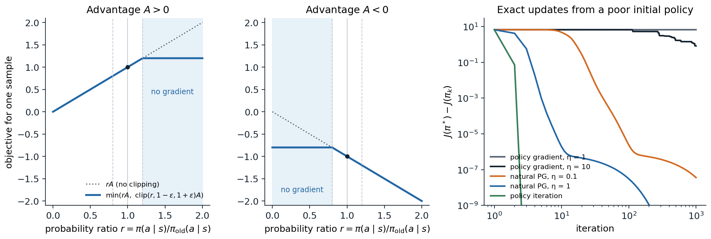

[Background Notes](../README.md) › [Reinforcement Learning](README.md)

# 20. Trust Regions and Proximal Policy Optimization

[← 19. Deep Actor-Critic and Distributed RL](19-deep-actor-critic-and-distributed-rl.md) · [21. Continuous Control and Maximum-Entropy RL →](21-continuous-control-and-maximum-entropy-rl.md)

## <a id="why-the-step-size-matters"></a>Why the step size matters

### <a id="a-step-too-far"></a>A step too far

In supervised learning, a gradient step that is too large costs a few iterations: the data stay the same, and the next steps repair the damage. In policy optimization the data come from the policy, so a bad step also corrupts the data from which the next step is computed. A policy that collapses onto a poor action stops generating the experience that would show its mistake, as the stale actors of chapter 19 did, and a softmax policy that has become nearly deterministic has almost no gradient left to escape with (exercise 19.7). Worse, the size of a step in parameter space says little about its size in behavior: the same change of the parameters can leave the policy unchanged in one region and turn it upside down in another. This chapter develops the idea that fixes both problems: measure steps by how much they change the policy, and keep each within a **trust region** where the objective that the step optimizes can be trusted. It leads from the theory of conservative updates through TRPO to PPO, the most widely used policy-gradient algorithm, and from there to the view of policy optimization as mirror descent, which unifies it with the soft methods of chapter 21 and the MPO family.

### <a id="the-performance-difference-lemma"></a>The performance difference lemma

How much better is a policy $`\pi'`$ than $`\pi`$? With $`\rho_\pi(s)=\sum_t\gamma^t\Pr(S_t=s\mid\pi)`$ the unnormalized discounted state visitation and $`A_\pi`$ the advantage function of $`\pi`$, the **performance difference lemma** ([Kakade and Langford, 2002](https://dl.acm.org/doi/10.5555/645531.656005)) states that

```math
J(\pi')-J(\pi)=\sum_s\rho_{\pi'}(s)\sum_a\pi'(a\mid s)A_\pi(s,a)
```

(exercise 20.1). The improvement is the advantage of the new policy's actions, measured by the old policy's advantage function but averaged over the *new* policy's states. That makes it useless as it stands for choosing $`\pi'`$, since the new states are unknown until $`\pi'`$ has been run. Replacing $`\rho_{\pi'}`$ by $`\rho_\pi`$ gives the **surrogate objective**

```math
L_\pi(\pi')=J(\pi)+\sum_s\rho_\pi(s)\sum_a\pi'(a\mid s)A_\pi(s,a)=J(\pi)+\mathbb E_{s,a\sim\pi}\Bigl[\frac{\pi'(a\mid s)}{\pi(a\mid s)}A_\pi(s,a)\Bigr],
```

with the expectation over the unnormalized discounted visitation (total mass $`1/(1-\gamma)`$), which can be estimated from the data of $`\pi`$ with importance weights on the actions only. The surrogate matches $`J`$ to first order at $`\pi'=\pi`$, so its gradient there is the policy gradient (exercise 20.2), but it ignores the change of the state distribution, and it becomes unreliable as $`\pi'`$ moves away. Policy iteration maximizes it completely at every step, $`\pi'(s)=\arg\max_aA_\pi(s,a)`$, which is safe with exact advantages, since the greedy policy is at least as good in every state, but not with estimated ones.

### <a id="conservative-policy-iteration-and-monotonic-improvement"></a>Conservative policy iteration and monotonic improvement

**Conservative policy iteration** ([Kakade and Langford, 2002](https://dl.acm.org/doi/10.5555/645531.656005)) moves only part of the way to the greedy policy, with the mixture $`\pi_{\text{new}}=(1-\alpha)\pi+\alpha\pi'`$, and proves a lower bound on the improvement: the surrogate's gain minus a penalty of order $`\alpha^2\varepsilon\gamma/(1-\gamma)^2`$, where $`\varepsilon=\max_s|\mathbb E_{a\sim\pi'}A_\pi(s,a)|`$ bounds the new policy's expected advantage. For small enough $`\alpha`$ the gain dominates and the policy improves monotonically. [Schulman et al. (2015)](https://arxiv.org/abs/1502.05477) extended the bound to arbitrary pairs of stochastic policies:

```math
J(\pi')\ge L_\pi(\pi')-\frac{4\varepsilon\gamma}{(1-\gamma)^2}\max_sD_{\mathrm{KL}}\bigl(\pi(\cdot\mid s)\,\|\,\pi'(\cdot\mid s)\bigr),\qquad\varepsilon=\max_{s,a}|A_\pi(s,a)|.
```

The right side equals $`J(\pi)`$ at $`\pi'=\pi`$ and is a lower bound everywhere, so maximizing it can only improve $`J`$: a **minorize–maximize** algorithm, like EM. In practice the penalty coefficient is far too large, since it is a worst case over all states and multiplied by $`(1-\gamma)^{-2}`$, and the steps it allows are tiny. TRPO keeps the structure and replaces the penalty by a constraint.

## <a id="trust-region-policy-optimization"></a>Trust region policy optimization

### <a id="from-a-bound-to-a-constraint"></a>From a bound to a constraint

**Trust region policy optimization** (TRPO) ([Schulman, Levine, Moritz, Jordan, and Abbeel, 2015](https://arxiv.org/abs/1502.05477)) solves, at each iteration,

```math
\max_{\boldsymbol\theta}\ \hat{\mathbb E}_t\Bigl[\frac{\pi_{\boldsymbol\theta}(A_t\mid S_t)}{\pi_{\boldsymbol\theta_{\text{old}}}(A_t\mid S_t)}\hat A_t\Bigr]\quad\text{subject to}\quad\hat{\mathbb E}_t\Bigl[D_{\mathrm{KL}}\bigl(\pi_{\boldsymbol\theta_{\text{old}}}(\cdot\mid S_t)\,\|\,\pi_{\boldsymbol\theta}(\cdot\mid S_t)\bigr)\Bigr]\le\delta,
```

with the expectations estimated from a batch collected by $`\pi_{\boldsymbol\theta_{\text{old}}}`$, the maximum KL of the theory replaced by the average over visited states, and the advantages estimated by Monte Carlo returns in the original paper and by GAE in later implementations (chapter 19). A typical $`\delta`$ is 0.01. The constraint makes the step size a statement about behavior: whatever the parameterization, the new policy's action distributions differ from the old ones by about $`\delta`$ nats on average.

### <a id="the-natural-gradient-step"></a>The natural gradient step

Near $`\boldsymbol\theta_{\text{old}}`$, the surrogate is linear to first order, with gradient $`\mathbf g`$, the policy gradient, and the average KL is quadratic to second order, with the **Fisher information matrix** $`F`$ as its Hessian (exercise 20.3):

```math
\hat{\mathbb E}[D_{\mathrm{KL}}]\approx\tfrac12\,\Delta\boldsymbol\theta^\top F\,\Delta\boldsymbol\theta,\qquad F=\hat{\mathbb E}_t\bigl[\nabla\ln\pi_{\boldsymbol\theta}(A_t\mid S_t)\,\nabla\ln\pi_{\boldsymbol\theta}(A_t\mid S_t)^\top\bigr].
```

Maximizing $`\mathbf g^\top\Delta\boldsymbol\theta`$ subject to $`\frac12\Delta\boldsymbol\theta^\top F\Delta\boldsymbol\theta\le\delta`$ gives the **natural gradient** direction of chapter 13, scaled to the boundary of the trust region:

```math
\Delta\boldsymbol\theta=\sqrt{\frac{2\delta}{\mathbf g^\top F^{-1}\mathbf g}}\;F^{-1}\mathbf g.
```

TRPO is thus a natural policy gradient method whose step size is set by the KL rather than chosen by hand, with a safeguard for the error of the quadratic model.

### <a id="conjugate-gradient-and-line-search"></a>Conjugate gradient and line search

A network with a million parameters has a Fisher matrix with $`10^{12}`$ entries, which can be neither stored nor inverted. TRPO never forms it. **Conjugate gradient** solves $`F\mathbf x=\mathbf g`$ using only products $`F\mathbf v`$, and each product costs about two backward passes: differentiate the average KL, take the inner product of its gradient with $`\mathbf v`$, and differentiate again. Ten iterations are usually enough, since the step only needs a good direction, and a small multiple of the identity, **damping**, is added to $`F`$, whose many near-zero eigenvalues would otherwise make the solution explode along directions that barely change the policy. Finally, a **backtracking line search** shrinks the step until the actual average KL, not its quadratic model, is below $`\delta`$ and the surrogate has improved. Exercise 20.4 implements the whole computation. TRPO learned simulated swimming, hopping, and walking and played Atari games from pixels with little tuning of its hyperparameters; its cost is the second-order machinery, which does not combine easily with shared policy and value networks or with minibatch optimizers.

## <a id="proximal-policy-optimization"></a>Proximal policy optimization

### <a id="the-clipped-objective"></a>The clipped objective

**Proximal policy optimization** (PPO) ([Schulman, Wolski, Dhariwal, Radford, and Klimov, 2017](https://arxiv.org/abs/1707.06347)) keeps TRPO's goal and drops its machinery. With the probability ratio $`r_t(\boldsymbol\theta)=\pi_{\boldsymbol\theta}(A_t\mid S_t)/\pi_{\boldsymbol\theta_{\text{old}}}(A_t\mid S_t)`$, it maximizes the **clipped objective**

```math
L^{\mathrm{CLIP}}(\boldsymbol\theta)=\hat{\mathbb E}_t\Bigl[\min\Bigl(r_t(\boldsymbol\theta)\hat A_t,\ \operatorname{clip}\bigl(r_t(\boldsymbol\theta),1-\epsilon,1+\epsilon\bigr)\hat A_t\Bigr)\Bigr],\qquad\epsilon\approx0.2,
```

with ordinary first-order optimizers. For a sample with a positive advantage, the objective rewards raising its probability only until the ratio reaches $`1+\epsilon`$; with a negative advantage, lowering it only until $`1-\epsilon`$. Beyond those points the sample contributes no gradient. The minimum with the unclipped term makes the objective a pessimistic bound: a change that makes a sample's contribution worse is never clipped away, so mistakes are always corrected (left and center panels of the figure; exercise 20.5). The paper's alternative, a penalty $`-\beta\,\hat{\mathbb E}[D_{\mathrm{KL}}]`$ whose coefficient doubles when the measured KL exceeds 1.5 times a target and halves when it falls below two thirds of it (exercise 20.6), performed somewhat worse and is less used.



*Left and center: PPO's objective for one sample as a function of its probability ratio, for a positive and a negative advantage, with $`\epsilon=0.2`$; in the shaded region, the sample contributes no gradient. Right: exact policy gradient, natural policy gradient (policy mirror descent), and policy iteration on a random MDP with 20 states and 4 actions, from a policy that puts 99.9% of its probability on the worst action in every state (the code in [the section on mirror descent](#policy-optimization-as-mirror-descent)). The policy gradient stays on the plateau of the nearly deterministic start for hundreds of iterations; the natural gradient, which updates the policy multiplicatively, leaves it at once.*

### <a id="the-algorithm"></a>The algorithm

PPO is the synchronous actor–critic of chapter 19 with one change: it takes several **epochs** of minibatch updates on each batch instead of one step. Each iteration collects $`T`$ steps from each of $`N`$ environments, computes GAE advantages and TD(λ) value targets with the old networks, and then, for $`K`$ epochs, shuffles the $`NT`$ samples into minibatches and takes an optimizer step on each minibatch with the loss

```math
-L^{\mathrm{CLIP}}+c_v\,\hat{\mathbb E}\bigl[(\hat v_{\mathbf w}(S_t)-\hat G_t)^2\bigr]-\beta\,\hat{\mathbb E}\bigl[\mathcal H(\pi_{\boldsymbol\theta}(\cdot\mid S_t))\bigr].
```

Reusing each batch for several epochs is where PPO's sample efficiency over A2C comes from, and the clipping is what makes the reuse safe. The original settings are still the usual starting points: for continuous control, one environment, $`T=2048`$, 10 epochs, minibatches of 64, Adam with step size $`3\times10^{-4}`$, $`\gamma=0.99`$, $`\lambda=0.95`$; for Atari, 8 environments, $`T=128`$, 3 epochs, $`\epsilon=0.1`$, and step size and $`\epsilon`$ both annealed to zero ([appendix B](#block-rl20-appendix-b)). With one epoch on the whole batch, the ratio is 1 when the gradient is computed, the clipping never activates, and PPO, with A2C's other settings (its optimizer, no advantage normalization or value clipping), reduces to A2C ([Huang et al., 2022](https://arxiv.org/abs/2205.09123)).

### <a id="what-clipping-does-and-does-not-do"></a>What clipping does and does not do

Clipping removes the incentive to move a sample's ratio beyond $`1\pm\epsilon`$, but it does not stop the ratio from getting there. The gradients of the samples still inside the range move the shared parameters, and those changes carry the others along. The next code measures this on a contextual bandit, with 10 epochs of minibatch updates on one batch.

```python
import numpy as np
import torch

# What PPO's clipping does to a policy trained for several epochs on one batch. A contextual bandit: contexts
# x in R^8, 4 actions, mean rewards linear in x, Gaussian noise with standard deviation 1. A batch of 2,048
# samples from the current policy (a softmax MLP), advantages = reward - the policy's true expected reward in
# that context, normalized. Then 10 epochs of minibatch Adam steps (minibatches of 256, step size 3e-3) on:
#   'no clipping':  the importance-sampled surrogate  ratio * A
#   'clipped':      PPO's  min(ratio * A, clip(ratio, 0.8, 1.2) * A)
#   'KL penalty':   ratio * A - 3 * KL(pi_old || pi)  (a fixed coefficient, for simplicity)
# After each epoch: the mean KL from the old policy, the fraction of samples whose ratio left [0.8, 1.2], the
# largest ratio, and the true improvement of the expected reward (computed exactly from the known means).
torch.manual_seed(0); rng = np.random.default_rng(0)
d, nA, N = 8, 4, 2048
W = torch.as_tensor(rng.normal(size=(d, nA)) / np.sqrt(d), dtype=torch.float32)


def make_policy():
    torch.manual_seed(1)
    return torch.nn.Sequential(torch.nn.Linear(d, 64), torch.nn.Tanh(), torch.nn.Linear(64, nA))


X = torch.randn(N, d); X_test = torch.randn(20000, d)
old = make_policy()
with torch.no_grad():
    p_old = torch.softmax(old(X), -1)
    a = torch.multinomial(p_old, 1)[:, 0]
    reward = (X @ W)[torch.arange(N), a] + torch.randn(N)
    adv = reward - (p_old * (X @ W)).sum(1)
    adv = (adv - adv.mean()) / adv.std()
    logp_old = torch.log(p_old[torch.arange(N), a])
    J_old = (torch.softmax(old(X_test), -1) * (X_test @ W)).sum(1).mean()

print("                  epoch:     1       2       4       6      10")
for name in ("no clipping", "clipped", "KL penalty"):
    pol = make_policy(); opt = torch.optim.Adam(pol.parameters(), lr=3e-3)
    rows = {"mean KL": [], "outside [0.8, 1.2]": [], "largest ratio": [], "improvement": []}
    for epoch in range(1, 11):
        for idx in torch.randperm(N).split(256):
            logits = pol(X[idx]); logp_all = torch.log_softmax(logits, -1)
            ratio = torch.exp(logp_all[torch.arange(len(idx)), a[idx]] - logp_old[idx])
            if name == "no clipping":
                obj = ratio * adv[idx]
            elif name == "clipped":
                obj = torch.minimum(ratio * adv[idx], ratio.clamp(0.8, 1.2) * adv[idx])
            else:
                kl = (p_old[idx] * (torch.log(p_old[idx]) - logp_all)).sum(1)
                obj = ratio * adv[idx] - 3.0 * kl
            opt.zero_grad(); (-obj.mean()).backward(); opt.step()
        with torch.no_grad():
            logp_all = torch.log_softmax(pol(X), -1)
            ratio = torch.exp(logp_all[torch.arange(N), a] - logp_old)
            rows["mean KL"].append((p_old * (torch.log(p_old) - logp_all)).sum(1).mean().item())
            rows["outside [0.8, 1.2]"].append(((ratio < 0.8) | (ratio > 1.2)).float().mean().item())
            rows["largest ratio"].append(ratio.max().item())
            J = (torch.softmax(pol(X_test), -1) * (X_test @ W)).sum(1).mean()
            rows["improvement"].append((J - J_old).item())
    print(name)
    for key, vals in rows.items():
        print(f"  {key:20s}  " + "".join(f"{vals[e - 1]:8.3f}" for e in (1, 2, 4, 6, 10)))
#                   epoch:     1       2       4       6      10
# no clipping
#   mean KL                  0.033   0.125   0.460   0.853   1.494
#   outside [0.8, 1.2]       0.429   0.722   0.866   0.911   0.941
#   largest ratio            2.099   3.102   4.508   4.898   5.021
#   improvement              0.134   0.256   0.426   0.512   0.582
# clipped
#   mean KL                  0.026   0.052   0.051   0.035   0.032
#   outside [0.8, 1.2]       0.373   0.555   0.549   0.453   0.440
#   largest ratio            1.867   2.125   2.119   1.933   1.874
#   improvement              0.124   0.183   0.179   0.150   0.143
# KL penalty
#   mean KL                  0.019   0.023   0.013   0.016   0.015
#   outside [0.8, 1.2]       0.305   0.362   0.218   0.253   0.252
#   largest ratio            1.736   1.761   1.570   1.727   1.687
#   improvement              0.112   0.126   0.092   0.102   0.101
```

Without clipping, the policy runs away from the one that collected the data: after 10 epochs, the mean KL is 1.5 nats and some ratios reach 5. With clipping, the policy stops moving away after about two epochs: the mean KL peaks near 0.05 and then settles back to about 0.03, which is what makes the reuse of the batch safe. But the ratios are not confined to $`[0.8,1.2]`$: more than 40% of the samples end outside the range, and the largest ratio stays near 2. The KL penalty gives the tightest control. In this bandit, the surrogate is the true objective up to sampling noise, since there are no states to shift, so every constraint only costs improvement, and the unclipped policy improves the most. In an MDP the surrogate's error grows with the distance from the old policy, and the trust region is what keeps the step within the region where the surrogate can be trusted. The loose control of the ratios was observed in deep PPO agents too ([Wang, He, and Tan, 2019](https://arxiv.org/abs/1903.07940); [Engstrom et al., 2020](https://arxiv.org/abs/2005.12729)), and some implementations therefore stop the epochs early when the measured KL exceeds a threshold.

### <a id="the-details-that-matter"></a>The details that matter

PPO's reported results depend on more than its objective. [Engstrom et al. (2020)](https://arxiv.org/abs/2005.12729) showed that its code-level optimizations, which the paper mostly did not describe, account for most of its advantage over TRPO: without them, PPO performed about as well as TRPO, and its KL from the old policy grew steadily over training instead of peaking and then falling; with them, TRPO performed about as well as PPO. [Andrychowicz et al. (2021)](https://arxiv.org/abs/2006.05990) measured more than 50 such choices in more than 250,000 training runs, and [Huang et al. (2022)](https://iclr-blog-track.github.io/2022/03/25/ppo-implementation-details/) cataloged 37 details of the reference implementation. The most common ones (Andrychowicz et al. found several, such as per-minibatch advantage normalization, gradient clipping, and a state-independent standard deviation, to be of secondary importance):

- **Normalization.** Observations normalized by running statistics; advantages normalized to zero mean and unit variance in each minibatch; rewards divided by a running estimate of the standard deviation of the discounted return, which keeps the value targets of order 1 without changing the optimal policy.
- **Value function.** A separate value network, or a shared one with a tuned loss weight. PPO's reference implementation also clips the value update, $`\max\bigl((\hat v-\hat G)^2,(\hat v_{\text{old}}+\operatorname{clip}(\hat v-\hat v_{\text{old}},-\epsilon,\epsilon)-\hat G)^2\bigr)`$, by analogy with the policy, but Andrychowicz et al. found that it hurt performance whatever the clipping threshold (exercise 20.8).
- **Initialization and architecture.** Orthogonal initialization, a policy output layer with small weights, tanh activations for small continuous-control networks, and for Gaussian policies, a log standard deviation learned as a free parameter rather than as an output of the network.
- **Optimization.** Adam with a step size annealed linearly to zero, gradient clipping to a global norm of 0.5, and a small number of epochs: more epochs reuse data more but move the policy further.
- **Discounting and λ.** The discount is among the most sensitive settings and is worth tuning per task, with $`\gamma=0.99`$ a good default; λ between 0.9 and 0.95.

Lab 10 implements PPO, measures the effect of several of these details, and trains agents on LunarLander and a MuJoCo locomotion task.

## <a id="policy-optimization-as-mirror-descent"></a>Policy optimization as mirror descent

### <a id="kl-regularized-policy-iteration"></a>KL-regularized policy iteration

TRPO and PPO approximate a cleaner idea that the tabular case exposes. Replace the greedy step of policy iteration by a regularized one, which improves on $`Q_{\pi_k}`$ while staying close to $`\pi_k`$:

```math
\pi_{k+1}(\cdot\mid s)=\arg\max_p\Bigl\{\eta\,\bigl\langle p,\,Q_{\pi_k}(s,\cdot)\bigr\rangle-D_{\mathrm{KL}}\bigl(p\,\|\,\pi_k(\cdot\mid s)\bigr)\Bigr\}\quad\Longrightarrow\quad\pi_{k+1}(a\mid s)\propto\pi_k(a\mid s)\,e^{\eta Q_{\pi_k}(s,a)}
```

(exercise 20.7). This is **policy mirror descent**, the mirror descent of convex optimization with the KL divergence as its geometry, applied state by state. For tabular softmax policies it is exactly the natural policy gradient with step size $`\eta(1-\gamma)`$, since adding $`\eta A`$ to the logits multiplies the probabilities by $`e^{\eta A}`$ ([Kakade, 2001](https://papers.nips.cc/paper_files/paper/2001/hash/4b86abe48d358ecf194c56c69108433e-Abstract.html); [Agarwal, Kakade, Lee, and Mahajan, 2021](https://arxiv.org/abs/1908.00261)). Its step size interpolates between doing nothing ($`\eta\to0`$) and policy iteration ($`\eta\to\infty`$). Its theory is the strongest in policy optimization: with exact values, it converges to an optimal policy at rate $`O(1/k)`$ for any constant step size, with constants that do not depend on the number of states and grow only logarithmically as the initial policy becomes more deterministic, and linearly with geometrically increasing step sizes ([Lan, 2023](https://arxiv.org/abs/2102.00135); [Xiao, 2022](https://arxiv.org/abs/2201.07443)). The plain policy gradient has no such guarantee: its rate depends on how small the probabilities of good actions are, and it can take exponentially long to leave a plateau ([Mei, Xiao, Szepesvári, and Schuurmans, 2020](https://arxiv.org/abs/2005.06392); [Li et al., 2021](https://arxiv.org/abs/2102.11270)). The next code compares the three methods with exact values.

```python
import numpy as np

# Three exact policy-optimization methods on a random MDP (20 states, 4 actions, gamma = 0.9), all with the true
# action values, from a uniform policy and from a poor, nearly deterministic one:
#   policy gradient (softmax logits theta, step eta): theta += eta * d_pi(s) pi(a|s) A_pi(s, a) / (1 - gamma)
#   natural policy gradient = policy mirror descent with a KL proximity term: pi_new ~ pi * exp(eta * A_pi / (1 - gamma))
#   policy iteration: pi_new = greedy(Q_pi), the limit eta -> infinity of the previous line.
# The objective is the value averaged over a uniform start distribution; report the gap to the optimum.
rng = np.random.default_rng(0)
S, A, gamma = 20, 4, 0.9
P = rng.dirichlet(np.ones(S) * 0.1, size=(S, A))                # sparse-ish transitions
r = rng.random((S, A)) ** 3                                       # a few rewarding actions
rho = np.ones(S) / S


def evaluate(pi):
    P_pi, r_pi = np.einsum("sa,sat->st", pi, P), (pi * r).sum(1)
    v = np.linalg.solve(np.eye(S) - gamma * P_pi, r_pi)
    q = r + gamma * P @ v
    d = (1 - gamma) * np.linalg.solve(np.eye(S) - gamma * P_pi.T, rho)   # discounted state distribution
    return v, q, d


v_star = np.zeros(S)
for _ in range(2000):
    v_star = (r + gamma * P @ v_star).max(1)
J_star = rho @ v_star


def softmax(z):
    e = np.exp(z - z.max(1, keepdims=True)); return e / e.sum(1, keepdims=True)


def run(method, theta0, eta, iters):
    theta, gaps = theta0.copy(), []
    for k in range(iters):
        pi = softmax(theta)
        v, q, d = evaluate(pi)
        gaps.append(J_star - rho @ v)
        adv = q - v[:, None]
        if method == "pg":
            theta += eta * d[:, None] * pi * adv / (1 - gamma)
        elif method == "npg":
            theta += eta * adv / (1 - gamma)
        else:
            theta = 1e3 * (q == q.max(1, keepdims=True))                  # greedy (policy iteration)
    return np.array(gaps)


uniform = np.zeros((S, A))
bad = np.zeros((S, A)); worst = np.argmin(evaluate(np.ones((S, A)) / A)[1], 1)
bad[np.arange(S), worst] = 8.0                                    # 99.9% on the worst action in every state
print(f"optimal value J* = {J_star:.3f}")
print("                                   gap to the optimum after k iterations")
print("   method                   start      k=1       k=3      k=10      k=30     k=100    k=1000")
for start_name, theta0 in (("uniform", uniform), ("poor", bad)):
    for name, method, eta in (("policy gradient", "pg", 1.0), ("policy gradient", "pg", 10.0),
                              ("natural PG", "npg", 0.1), ("natural PG", "npg", 1.0),
                              ("policy iteration", "pi", None)):
        g = run(method, theta0, eta, 1001)
        label = f"{name}" + (f", eta {eta:g}" if eta else "")
        print(f"   {label:24s} {start_name:7s}" + "".join(f"{g[k]:10.1e}" if g[k] > 1e-12 else f"{'< 1e-12':>10s}" for k in (1, 3, 10, 30, 100, 1000)))
# optimal value J* = 6.976
#                                    gap to the optimum after k iterations
#    method                   start      k=1       k=3      k=10      k=30     k=100    k=1000
#    policy gradient, eta 1   uniform   3.9e+00   3.7e+00   2.7e+00   1.1e+00   2.3e-01   1.6e-02
#    policy gradient, eta 10  uniform   2.8e+00   1.1e+00   2.1e-01   5.7e-02   1.6e-02   1.5e-03
#    natural PG, eta 0.1      uniform   3.2e+00   1.6e+00   2.0e-01   8.6e-03   7.0e-04   5.2e-05
#    natural PG, eta 1        uniform   2.3e-01   1.2e-02   1.2e-03   9.2e-04   1.8e-04   < 1e-12
#    policy iteration         uniform   1.6e-03   < 1e-12   < 1e-12   < 1e-12   < 1e-12   < 1e-12
#    policy gradient, eta 1   poor      6.7e+00   6.7e+00   6.7e+00   6.7e+00   6.7e+00   6.7e+00
#    policy gradient, eta 10  poor      6.7e+00   6.7e+00   6.7e+00   6.7e+00   6.7e+00   8.4e-01
#    natural PG, eta 0.1      poor      6.7e+00   6.7e+00   4.0e+00   7.6e-03   2.3e-06   3.6e-08
#    natural PG, eta 1        poor      4.2e+00   1.9e-02   1.1e-06   3.1e-07   3.0e-08   < 1e-12
#    policy iteration         poor      7.2e-02   < 1e-12   < 1e-12   < 1e-12   < 1e-12   < 1e-12
```

From the uniform policy, all three methods converge: policy iteration within three steps, the natural gradient with $`\eta=1`$ to within about $`10^{-3}`$ in ten iterations (the last digits take hundreds more), and the policy gradient slowly. From a nearly deterministic poor policy, the policy gradient does not move in 1,000 iterations with step size 1, and needs hundreds with step size 10, while the natural gradient with $`\eta=1`$ escapes within three iterations (with $`\eta=0.1`$, within about 30): its multiplicative update changes a probability of 0.0003 as easily as one of 0.5. The right panel of the figure shows the same runs. This is the tabular core of the argument for trust regions: measure steps in the geometry of the policy, not of the parameters.

### <a id="maximum-a-posteriori-policy-optimization"></a>Maximum a posteriori policy optimization

The mirror descent step can also be taken nonparametrically and then projected onto the network. **MPO** ([Abdolmaleki et al., 2018](https://arxiv.org/abs/1806.06920)) casts policy improvement as expectation maximization. Its E-step builds, for each state in a batch, the improved distribution $`q(a\mid s)\propto\pi_{\text{old}}(a\mid s)\exp\bigl(Q(s,a)/\eta\bigr)`$ over sampled actions, with the temperature $`\eta`$ chosen by minimizing a convex dual so that $`D_{\mathrm{KL}}(q\,\|\,\pi_{\text{old}})\le\epsilon`$; its M-step fits the network to $`q`$ by weighted maximum likelihood, within a second trust region that, for Gaussian policies, constrains the mean and the covariance separately. MPO learns an off-policy Q-function with Retrace, which makes it far more sample-efficient than PPO in continuous control, and its on-policy variant **V-MPO** ([Song et al., 2020](https://arxiv.org/abs/1909.12238)), with a state-value critic and advantages in place of $`Q`$, trained single agents on all of Atari-57 and DMLab-30. The same structure, an exponentiated-advantage target followed by a supervised fit, reappears in offline RL as advantage-weighted regression (chapter 26).

### <a id="regularized-mdps"></a>Regularized MDPs

Adding an entropy bonus to the reward changes the problem, not just the algorithm. In an **entropy-regularized MDP**, the objective is $`\mathbb E\bigl[\sum_t\gamma^t(R_{t+1}+\tau\mathcal H(\pi(\cdot\mid S_t)))\bigr]`$, the optimal policy is a softmax of the optimal soft action values, $`\pi^*(a\mid s)\propto e^{Q^*_\tau(s,a)/\tau}`$, and the Bellman operators become smooth ([Neu, Jonsson, and Gómez, 2017](https://arxiv.org/abs/1705.07798); [Geist, Scherrer, and Pietquin, 2019](https://arxiv.org/abs/1901.11275)). The regularization makes policy optimization better behaved: natural policy gradient on the regularized problem converges linearly, at a rate independent of the size of the state space ([Cen, Cheng, Chen, Wei, and Chi, 2022](https://arxiv.org/abs/2007.06558)). Mirror descent with a KL term toward the previous policy and an entropy term toward uniform covers TRPO, soft policy iteration, and the soft actor–critic of chapter 21 as special cases or approximations, and it gives them a common convergence theory ([Shani, Efroni, and Mannor, 2020](https://arxiv.org/abs/1909.02769); [Tomar, Shani, Efroni, and Ghavamzadeh, 2022](https://arxiv.org/abs/2005.09814)).

## <a id="ppo-in-practice"></a>PPO in practice

### <a id="phasic-policy-gradient"></a>Phasic policy gradient

A shared network for the policy and the value function lets the value loss shape the features, but the two objectives interfere, and PPO must train both with the same number of epochs on the same data, although the value function tolerates, and benefits from, far more reuse than the policy. **Phasic policy gradient** ([Cobbe, Hilton, Klimov, and Schulman, 2021](https://arxiv.org/abs/2009.04416)) separates them in time. A policy phase runs PPO for several iterations, with a separate value network; an auxiliary phase then trains the value network for several epochs on all the data of those iterations, and trains an auxiliary value head of the policy network on the same value targets, with a behavioral-cloning KL term that keeps the policy's outputs unchanged, which distills the value function's features into the policy network. On the procedurally generated Procgen games it improved sample efficiency substantially over PPO.

### <a id="ppo-as-the-default"></a>PPO as the default

PPO's combination of simplicity, robustness to its hyperparameters, and compatibility with any network architecture and with massive parallelism made it the default on-policy algorithm. It trained OpenAI Five (chapter 19), dexterous in-hand manipulation with a robot hand ([OpenAI et al., 2020](https://arxiv.org/abs/1808.00177)), and most locomotion policies trained in massively parallel simulation; and it was the algorithm of reinforcement learning from human feedback for language models ([Ouyang et al., 2022](https://arxiv.org/abs/2203.02155)), where a KL penalty toward the supervised model plays the role of a second trust region (chapter 28). Its limitations are those of on-policy learning: every batch is used for a few epochs and discarded, so it needs many more environment steps than the off-policy actor–critics of chapter 21 or the model-based agents of chapter 23, and it is sensitive to the details above. GRPO, used to train reasoning models, keeps PPO's clipped objective and KL penalty but replaces the critic by the average reward of a group of answers to the same prompt, normalized by the group's standard deviation (chapter 28).

## <a id="exercises"></a>Exercises

### <a id="exercise-20-1-the-performance-difference-lemma"></a>Exercise 20.1 — The performance difference lemma

Prove that $`J(\pi')-J(\pi)=\mathbb E_{\tau\sim\pi'}\bigl[\sum_t\gamma^tA_\pi(S_t,A_t)\bigr]=\sum_s\rho_{\pi'}(s)\sum_a\pi'(a\mid s)A_\pi(s,a)`$ for two policies with the same start distribution.


<details>
<summary><b>Solution</b></summary>


Add and subtract $`\gamma^{t+1}v_\pi(S_{t+1})`$ along a trajectory of $`\pi'`$. The sum telescopes:

```math
\sum_t\gamma^tR_{t+1}=v_\pi(S_0)+\sum_t\gamma^t\bigl(R_{t+1}+\gamma v_\pi(S_{t+1})-v_\pi(S_t)\bigr).
```

Take expectations under $`\pi'`$. The left side becomes $`J(\pi')`$ and $`\mathbb E[v_\pi(S_0)]=J(\pi)`$, since the start distribution is shared. Conditioning each term on $`(S_t,A_t)`$ turns $`R_{t+1}+\gamma v_\pi(S_{t+1})`$ into $`q_\pi(S_t,A_t)`$, because the environment's dynamics do not depend on the policy, so each term becomes $`A_\pi(S_t,A_t)`$. Collecting the terms by state gives the visitation form. The lemma holds for any pair of policies, with no approximation; all the difficulty lies in the fact that the expectation is over the new policy's trajectories.

</details>


### <a id="exercise-20-2-the-surrogate-is-exact-to-first-order"></a>Exercise 20.2 — The surrogate is exact to first order

Show that $`L_\pi(\pi_{\boldsymbol\theta})`$ and $`J(\pi_{\boldsymbol\theta})`$ have the same value and the same gradient at $`\boldsymbol\theta=\boldsymbol\theta_{\text{old}}`$, where $`\pi=\pi_{\boldsymbol\theta_{\text{old}}}`$.


<details>
<summary><b>Solution</b></summary>


At $`\boldsymbol\theta_{\text{old}}`$, $`\sum_a\pi(a\mid s)A_\pi(s,a)=v_\pi(s)-v_\pi(s)=0`$ in every state, so $`L_\pi(\pi)=J(\pi)`$. The gradient of the surrogate is $`\sum_s\rho_\pi(s)\sum_a\nabla\pi_{\boldsymbol\theta}(a\mid s)A_\pi(s,a)`$, since only the action probabilities depend on $`\boldsymbol\theta`$; at $`\boldsymbol\theta_{\text{old}}`$ this is the policy gradient theorem of chapter 13, with the advantage in place of the action value, which changes nothing because $`\sum_a\nabla\pi(a\mid s)=0`$. The two functions differ at second order, through the change of the state distribution, which is what the KL penalty or constraint bounds.

</details>


### <a id="exercise-20-3-the-kl-divergence-and-the-fisher-matrix"></a>Exercise 20.3 — The KL divergence and the Fisher matrix

(a) Show that $`D_{\mathrm{KL}}(\pi_{\boldsymbol\theta_{\text{old}}}\|\pi_{\boldsymbol\theta})`$ has zero gradient at $`\boldsymbol\theta_{\text{old}}`$ and Hessian $`F=\mathbb E_{a\sim\pi}\bigl[\nabla\ln\pi\,\nabla\ln\pi^\top\bigr]`$ there. (b) Derive the step that maximizes $`\mathbf g^\top\Delta\boldsymbol\theta`$ subject to $`\frac12\Delta\boldsymbol\theta^\top F\Delta\boldsymbol\theta\le\delta`$, and its predicted gain.


<details>
<summary><b>Solution</b></summary>


(a) $`D_{\mathrm{KL}}=\sum_a\pi_{\text{old}}(a)\ln\pi_{\text{old}}(a)-\sum_a\pi_{\text{old}}(a)\ln\pi_{\boldsymbol\theta}(a)`$. Its gradient at $`\boldsymbol\theta_{\text{old}}`$ is $`-\sum_a\pi_{\text{old}}\nabla\ln\pi=-\sum_a\nabla\pi=0`$. Its Hessian is $`-\mathbb E_{\pi_{\text{old}}}[\nabla^2\ln\pi_{\boldsymbol\theta}]`$, and differentiating $`\sum_a\nabla\pi=0`$ once more gives $`\mathbb E[\nabla^2\ln\pi]+\mathbb E[\nabla\ln\pi\nabla\ln\pi^\top]=0`$, the information identity, so the Hessian is $`F`$. Averaged over states, the same holds for the mean KL.

(b) The Lagrangian $`\mathbf g^\top\Delta-\lambda(\frac12\Delta^\top F\Delta-\delta)`$ is stationary at $`\Delta=F^{-1}\mathbf g/\lambda`$. The constraint is active at the optimum, so $`\frac1{2\lambda^2}\mathbf g^\top F^{-1}\mathbf g=\delta`$, which gives $`\Delta=\sqrt{2\delta/(\mathbf g^\top F^{-1}\mathbf g)}\,F^{-1}\mathbf g`$ and a predicted gain $`\mathbf g^\top\Delta=\sqrt{2\delta\,\mathbf g^\top F^{-1}\mathbf g}`$. Any other direction with the same quadratic KL gains less.

</details>


### <a id="exercise-20-4-trpo-s-step"></a>Exercise 20.4 — TRPO's step

Run the next code, which computes TRPO's step for a small policy network with conjugate gradient and Fisher-vector products, and answer: (a) why does conjugate gradient converge in about ten iterations here, and why is the damping needed? (b) How do the natural and the vanilla steps compare at the same quadratic KL? (c) Why is the actual KL below $`\delta`$?


<details>
<summary><b>Solution</b></summary>


```python
import numpy as np
import torch

# TRPO's step, computed as TRPO does it. A softmax policy network (4 inputs, 16 tanh units, 3 actions, 131
# parameters) on 500 sampled states; g is the gradient of the surrogate (ratio times a random advantage). The Fisher
# matrix F is the Hessian of the mean KL divergence from the current policy, damped by 0.1 as in common TRPO code.
# Conjugate gradient solves F x = g using only Fisher-vector products, each computed by differentiating
# (grad KL . v) once more. The step sqrt(2 delta / x^T F x) x has a quadratic model of the KL equal to delta; a
# backtracking line search then halves it until the actual KL is at most delta and the surrogate improves.
torch.manual_seed(0)
net = torch.nn.Sequential(torch.nn.Linear(4, 16), torch.nn.Tanh(), torch.nn.Linear(16, 3))
params = list(net.parameters()); n = sum(p.numel() for p in params)
X = torch.randn(500, 4)
with torch.no_grad():
    p_old = torch.softmax(net(X), -1)
    a = torch.multinomial(p_old, 1)[:, 0]
adv = torch.randn(500)
old = [p.detach().clone() for p in params]


def flat(ts):
    return torch.cat([t.reshape(-1) for t in ts])


def mean_kl():
    return (p_old * (torch.log(p_old) - torch.log_softmax(net(X), -1))).sum(1).mean()


def surrogate():
    logp = torch.log_softmax(net(X), -1)[torch.arange(500), a]
    return (torch.exp(logp - torch.log(p_old[torch.arange(500), a])) * adv).mean()


def set_params(step):
    with torch.no_grad():
        i = 0
        for p, o in zip(params, old):
            p.copy_(o + step[i:i + p.numel()].view_as(p)); i += p.numel()


L0 = surrogate()
g = flat(torch.autograd.grad(L0, params)); L0 = L0.item()
grad_kl = flat(torch.autograd.grad(mean_kl(), params, create_graph=True))


def fvp(v):
    return flat(torch.autograd.grad(grad_kl @ v, params, retain_graph=True)) + 0.1 * v


F = torch.stack([fvp(e) for e in torch.eye(n)])                   # the full matrix, only to check CG
x_exact = torch.linalg.solve(F, g)
ev = torch.linalg.eigvalsh(F)
print(f"{n} parameters; eigenvalues of the damped Fisher matrix from {ev.min():.2f} to {ev.max():.2f}")
x, r = torch.zeros(n), g.clone(); p = r.clone(); rr = r @ r
for k in range(1, 11):
    Fp = fvp(p); alpha = rr / (p @ Fp)
    x += alpha * p; r -= alpha * Fp
    rr_new = r @ r; p = r + (rr_new / rr) * p; rr = rr_new
    if k in (1, 2, 3, 5, 10):
        print(f"  conjugate gradient, {k:2d} iterations: relative error {torch.linalg.norm(x - x_exact) / torch.linalg.norm(x_exact):.1e}")

delta = 0.01
print(f"\nsteps whose quadratic model of the KL is delta = {delta}:")
steps = {name: torch.sqrt(2 * delta / (d @ fvp(d))) * d for name, d in
         (("natural gradient (10 CG iterations)", x), ("vanilla gradient", g))}
for name, step in steps.items():
    set_params(step)
    with torch.no_grad():
        print(f"  {name:36s} predicted gain {g @ step:.4f}, actual gain {surrogate() - L0:.4f}, actual KL {mean_kl():.4f}")
    if name.startswith("natural"):
        for halvings in range(10):                                 # TRPO's backtracking line search
            set_params(step * 0.5 ** halvings)
            with torch.no_grad():
                if mean_kl() <= delta and surrogate() > L0:
                    print(f"  line search: accepted after {halvings} halvings, gain {surrogate() - L0:.4f}, KL {mean_kl():.4f}")
                    break
# 131 parameters; eigenvalues of the damped Fisher matrix from 0.10 to 0.83
#   conjugate gradient,  1 iterations: relative error 5.5e-01
#   conjugate gradient,  2 iterations: relative error 3.0e-01
#   conjugate gradient,  3 iterations: relative error 1.7e-01
#   conjugate gradient,  5 iterations: relative error 3.9e-02
#   conjugate gradient, 10 iterations: relative error 5.2e-05
#
# steps whose quadratic model of the KL is delta = 0.01:
#   natural gradient (10 CG iterations)  predicted gain 0.0197, actual gain 0.0198, actual KL 0.0069
#   line search: accepted after 0 halvings, gain 0.0198, KL 0.0069
#   vanilla gradient                     predicted gain 0.0175, actual gain 0.0179, actual KL 0.0084
```

(a) After $`k`$ iterations, conjugate gradient's error, measured in the norm defined by the matrix, is at most $`2\bigl((\sqrt\kappa-1)/(\sqrt\kappa+1)\bigr)^k`$ times its initial value, where $`\kappa`$ is the condition number; with the eigenvalues between 0.1 and 0.83, $`\kappa\approx8`$ and the factor is about 0.5, so ten iterations guarantee a reduction of about three orders of magnitude ($`2\cdot0.485^{10}\approx1.4\times10^{-3}`$), and in practice it does better, since the spectrum is clustered. Without damping, the Fisher matrix of a network has many eigenvalues near zero, one for every direction of the parameters that barely changes the policy on the sampled states. $`\kappa`$ would be huge, conjugate gradient would converge slowly, and the exact solution would take enormous steps along those directions, where the sampled KL says nothing about the policy's behavior on other states. The damping is a prior that keeps the step in parameter space moderate.

(b) At the same quadratic KL, the natural step gains 0.0198 in the surrogate and the vanilla one 0.0179, and the natural step's actual KL is smaller. The gap is modest for this small, well-conditioned problem. It grows with the spread of the Fisher matrix's eigenvalues, that is, with how unevenly the parameters affect the policy, which is large for deep networks and for policies close to deterministic.

(c) The step was sized for the damped matrix, whose quadratic form $`\Delta^\top(F+0.1I)\Delta`$ exceeds the true curvature $`\Delta^\top F\Delta`$. The line search accepts it at once. It halves the step only when the quadratic model underestimates the KL, which happens with larger $`\delta`$ or less damping, or when the surrogate fails to improve.

</details>


### <a id="exercise-20-5-the-clipped-objective"></a>Exercise 20.5 — The clipped objective

(a) For one sample, give the derivative of $`\min(rA,\operatorname{clip}(r,1-\epsilon,1+\epsilon)A)`$ with respect to $`r`$ in each region, for $`A>0`$ and $`A<0`$. (b) Show that the clipped objective never exceeds the unclipped one, and that they agree to first order at $`r=1`$. (c) A sample with $`A>0`$ has $`r=0.5`$ after a few minibatch steps. Does it still contribute a gradient? Why is this important?


<details>
<summary><b>Solution</b></summary>


(a) For $`A>0`$: $`A`$ for $`r<1+\epsilon`$ and 0 above. For $`A<0`$: $`A`$ for $`r>1-\epsilon`$ and 0 below.

(b) For $`A>0`$: if $`r>1+\epsilon`$, $`\operatorname{clip}(r)A=(1+\epsilon)A<rA`$, so the minimum is the clipped term; if $`r<1-\epsilon`$, $`\operatorname{clip}(r)A=(1-\epsilon)A>rA`$, so the minimum is $`rA`$. Either way the result is at most $`rA`$; the case $`A<0`$ is symmetric. Near $`r=1`$ nothing is clipped, so the two objectives, and their gradients at the old policy, coincide.

(c) Yes: with $`r<1-\epsilon`$ and $`A>0`$ the minimum selects the unclipped term, whose derivative is $`A`$. The update has moved this sample's probability the wrong way, probably through the gradients of other samples, and the objective keeps pushing it back. PPO removes the incentive to exploit an advantage beyond the trust region, but never the incentive to undo damage, which is why the objective is a pessimistic bound rather than a simple truncation.

</details>


### <a id="exercise-20-6-the-adaptive-kl-penalty"></a>Exercise 20.6 — The adaptive KL penalty

PPO's penalty variant maximizes $`\hat{\mathbb E}[r_t\hat A_t]-\beta\hat{\mathbb E}[D_{\mathrm{KL}}]`$ and after each iteration halves $`\beta`$ if the measured KL was below $`d_{\text{targ}}/1.5`$ and doubles it if above $`1.5\,d_{\text{targ}}`$. (a) Why would a fixed $`\beta`$ be a poor choice over a whole run? (b) Why the dead zone between the thresholds?


<details>
<summary><b>Solution</b></summary>


(a) The penalized step trades a gain proportional to the advantages against a KL cost. As training progresses, the scale of the advantages changes, typically shrinking as the policy approaches a local optimum, so a fixed $`\beta`$ that allowed reasonable steps early becomes a strong brake later, or one that was right later allows reckless steps early. Adapting $`\beta`$ to hold the KL near a target keeps the step size in policy space constant, which is what TRPO's constraint does exactly.

(b) The measured KL is noisy, and the effect of $`\beta`$ on it is delayed by one iteration. Updating on every deviation would make $`\beta`$ oscillate by factors of 2 in response to noise. The dead zone, a factor of 2.25 wide, changes $`\beta`$ only when the KL is clearly off target, and the multiplicative changes let it cover orders of magnitude in a few iterations when the scale of the problem changes.

</details>


### <a id="exercise-20-7-mirror-descent-in-closed-form"></a>Exercise 20.7 — Mirror descent in closed form

(a) Show that $`\arg\max_p\{\eta\langle p,\mathbf q\rangle-D_{\mathrm{KL}}(p\,\|\,\pi_k)\}`$ over distributions $`p`$ is $`p(a)\propto\pi_k(a)e^{\eta q(a)}`$. (b) For a tabular softmax policy, what update of the logits implements it, and what happens as $`\eta\to0`$ and $`\eta\to\infty`$? (c) Why does the update escape the plateau of the code's poor initial policy?


<details>
<summary><b>Solution</b></summary>


(a) With a multiplier $`\lambda`$ for $`\sum_ap(a)=1`$, stationarity gives $`\eta q(a)-\ln(p(a)/\pi_k(a))-1-\lambda=0`$, so $`p(a)=\pi_k(a)e^{\eta q(a)}e^{-1-\lambda}`$, and the constant normalizes. The objective is strictly concave, so this is the maximum.

(b) $`\boldsymbol\theta(s,\cdot)\leftarrow\boldsymbol\theta(s,\cdot)+\eta Q_{\pi_k}(s,\cdot)`$, or equivalently $`+\eta A_{\pi_k}(s,\cdot)`$, since adding a constant to the logits of a state does not change its softmax. As $`\eta\to0`$ the policy stays put; as $`\eta\to\infty`$ all the probability goes to the maximizing actions, which is the greedy step of policy iteration.

(c) The update multiplies each probability by $`e^{\eta A(s,a)}/Z(s)`$, a factor that does not depend on the probability itself: an action with probability 0.0003 and a large advantage gains as fast, in relative terms, as one with probability 0.5. The plain policy gradient of a softmax changes the logits by $`\eta\,d_\pi(s)\pi(a\mid s)A(s,a)/(1-\gamma)`$, proportional to the action's current probability, so the good actions of a nearly deterministic poor policy barely move.

</details>


### <a id="exercise-20-8-clipping-the-value-function"></a>Exercise 20.8 — Clipping the value function

PPO's reference code minimizes $`\max\bigl((\hat v-\hat G)^2,(\hat v_{\text{old}}+\operatorname{clip}(\hat v-\hat v_{\text{old}},-\epsilon,\epsilon)-\hat G)^2\bigr)`$ for the critic. (a) When does this loss have zero gradient? (b) Why might it hurt?


<details>
<summary><b>Solution</b></summary>


(a) When the prediction has moved more than $`\epsilon`$ from its old value, the clipped term is a constant. The maximum selects it, and the gradient vanishes, when it is the larger error, that is, when the new prediction is closer to the target than the clipped one: the critic has moved toward its target by more than $`\epsilon`$ and is stopped there. If the prediction has moved away from the target, the unclipped term dominates and pulls it back. This is the logic of the policy's clipped objective, applied to the value.

(b) Unlike a ratio of probabilities, a value has the units of the rewards, so a fixed $`\epsilon`$ means different things in different tasks, and at different stages of one task. When the targets change by more than $`\epsilon`$ per iteration, as they do early in training or after the policy improves, the clipping slows the critic, and a stale critic gives poor advantages. Andrychowicz et al. found that it hurt performance whatever the clipping threshold; normalizing the rewards makes it less harmful, since it then limits changes to a fraction of the typical return.

</details>


## <a id="appendices"></a>Appendices


<details>
<summary><a id="block-rl20-appendix-a"></a><b>A. The TRPO update</b></summary>


For each iteration:

1. Collect a batch with $`\pi_{\boldsymbol\theta_{\text{old}}}`$ and compute advantages $`\hat A_t`$ with GAE; fit the value function (the GAE paper, by the same authors, used a trust region for it too).
2. Compute the surrogate's gradient $`\mathbf g`$ at $`\boldsymbol\theta_{\text{old}}`$ by backpropagation.
3. Run about 10 iterations of conjugate gradient on $`(F+\lambda I)\mathbf x=\mathbf g`$, with Fisher-vector products computed by differentiating $`\nabla\hat{\mathbb E}[D_{\mathrm{KL}}]\cdot\mathbf v`$; often only a subsample of the batch (for example 10%) is used for these products.
4. Scale the direction to $`\Delta=\sqrt{2\delta/(\mathbf x^\top F\mathbf x)}\,\mathbf x`$.
5. Backtracking line search: for $`j=0,1,2,\dots`$, try $`\boldsymbol\theta_{\text{old}}+0.5^j\Delta`$ and accept the first that satisfies the KL constraint and improves the surrogate; if none does within about 10 halvings, keep $`\boldsymbol\theta_{\text{old}}`$.

</details>


<details>
<summary><a id="block-rl20-appendix-b"></a><b>B. PPO's hyperparameters in the original paper</b></summary>


| Setting | Continuous control (MuJoCo) | Atari |
| --- | --- | --- |
| Environments × steps per batch | 1 × 2,048 | 8 × 128 |
| Epochs per batch | 10 | 3 |
| Minibatch size | 64 | 256 (32 × 8) |
| Adam step size | $`3\times10^{-4}`$ | $`2.5\times10^{-4}`$, annealed linearly to 0 |
| Clipping $`\epsilon`$ | 0.2 | 0.1, annealed linearly to 0 |
| Discount $`\gamma`$, GAE λ | 0.99, 0.95 | 0.99, 0.95 |
| Value loss coefficient | (separate networks) | 1 |
| Entropy coefficient | 0 | 0.01 |

Later large studies and libraries changed some of these defaults: Andrychowicz et al. recommend starting from a clipping of 0.25 and λ = 0.9, and many implementations use more environments with shorter rollouts, clip the gradient's norm to 0.5, and stop an iteration's epochs early when the KL from the old policy exceeds 1.5 times a target such as 0.01 (Spinning Up's default; Stable-Baselines3's `target_kl`, off by default).

</details>

---

[← 19. Deep Actor-Critic and Distributed RL](19-deep-actor-critic-and-distributed-rl.md) · [21. Continuous Control and Maximum-Entropy RL →](21-continuous-control-and-maximum-entropy-rl.md)
