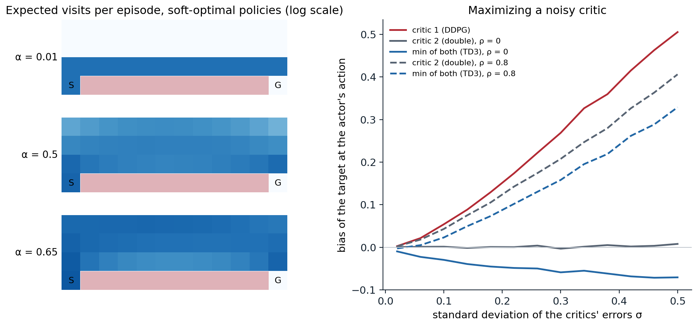

[ML Mastery Notes](../README.md) › [Reinforcement Learning](README.md)

# 21. Continuous Control and Maximum-Entropy RL

[← 20. Trust Regions and Proximal Policy Optimization](20-trust-regions-and-proximal-policy-optimization.md) · [22. Exploration in Deep RL →](22-exploration-in-deep-rl.md)

## <a id="continuous-actions"></a>Continuous actions

Robots, vehicles, and simulated bodies act with torques, forces, and velocities, not with a handful of buttons. The on-policy methods of chapters 19 and 20 handle continuous actions with a Gaussian policy, but they discard every batch after a few epochs, and a simulated humanoid then needs tens of millions of steps. This chapter develops the **off-policy actor–critics** that learn continuous control from a replay memory, in a few hundred thousand to a few million steps: the deterministic policy gradient and DDPG, the fixes for its overestimation in TD3, and the maximum-entropy framework behind soft actor–critic (SAC), with its interpretation as probabilistic inference. It ends with the recent critics that learn from far fewer samples, and with the question of how to compare such agents fairly.

### <a id="stochastic-policies-over-continuous-actions"></a>Stochastic policies over continuous actions

The standard stochastic policy is a Gaussian, $`a\sim\mathcal N\bigl(\boldsymbol\mu_{\boldsymbol\theta}(s),\operatorname{diag}\boldsymbol\sigma^2\bigr)`$, with the mean computed by a network and the standard deviations either computed by the network as well, as SAC does, or kept as free parameters independent of the state, as PPO usually does. Real actuators are bounded, and a Gaussian is not. Clipping the sampled action to the bounds, as the PPO code of Lab 10 does, leaves the policy's log-probabilities those of the unclipped sample, so the gradient treats actions beyond the bounds as different even though the environment cannot distinguish them. The cleaner solution is a **squashed Gaussian**: sample $`u\sim\mathcal N(\boldsymbol\mu,\operatorname{diag}\boldsymbol\sigma^2)`$, act with $`a=\tanh(u)`$, rescaled to the bounds, and account for the change of variables in the log-density,

```math
\ln\pi(a\mid s)=\ln\mathcal N(u;\boldsymbol\mu,\operatorname{diag}\boldsymbol\sigma^2)-\sum_i\ln\bigl(1-\tanh^2(u_i)\bigr)
```

(exercise 21.1). Beta distributions, which live on an interval, are another option ([Chou, Maturana, and Scherer, 2017](https://proceedings.mlr.press/v70/chou17a.html)).

### <a id="deterministic-policy-gradients"></a>Deterministic policy gradients

A deterministic policy $`a=\mu_{\boldsymbol\theta}(s)`$ has its own policy gradient theorem ([Silver et al., 2014](https://proceedings.mlr.press/v32/silver14.html)):

```math
\nabla_{\boldsymbol\theta}J=\mathbb E_{s\sim\rho}\Bigl[\nabla_{\boldsymbol\theta}\mu_{\boldsymbol\theta}(s)\,\nabla_aQ(s,a)\big|_{a=\mu_{\boldsymbol\theta}(s)}\Bigr].
```

The actor follows the critic's slope in action space: it moves each state's action in the direction that increases the critic's estimate, as fast as the critic's gradient says. The theorem is the limit of the stochastic policy gradient as the policy's variance goes to zero (exercise 21.2), but it has a practical advantage over it: the expectation is over states only, so the gradient needs no importance weights on the actions. With a critic of the target policy learned from any data, the states can come from any behavior, and learning is off-policy. Chapter 13 introduced the theorem; here it becomes the basis of a family of deep agents.

### <a id="ddpg"></a>DDPG

**Deep deterministic policy gradient** (DDPG) ([Lillicrap et al., 2016](https://arxiv.org/abs/1509.02971)) is DQN for continuous actions: the maximization over actions in the target, $`\max_{a'}Q(s',a')`$, which is intractable for continuous actions (chapter 16), is replaced by the actor's action, $`Q(s',\mu(s'))`$. It trains a critic by regression on the targets $`y=r+\gamma Q_{\mathbf w^-}(s',\mu_{\boldsymbol\theta^-}(s'))`$ from a replay memory, and an actor by the deterministic policy gradient through the critic, with slowly updated target networks for both, $`\mathbf w^-\leftarrow(1-\tau)\mathbf w^-+\tau\mathbf w`$ with $`\tau=0.001`$, and exploration by noise added to the actor's actions (an Ornstein–Uhlenbeck process in the paper, simple Gaussian noise in later work). It solved more than 20 simulated control tasks, some from pixels, with one set of hyperparameters. But it was notoriously brittle: its performance varied widely across seeds and collapsed on some tasks, for reasons that include the one the next section identifies.

## <a id="overestimation-and-td3"></a>Overestimation and TD3

### <a id="actors-exploit-their-critics"></a>Actors exploit their critics

An actor trained to maximize a critic finds the critic's errors as well as its signal. Wherever the critic overestimates, the actor moves toward that action, and the bootstrap target, evaluated at the actor's action, inherits the overestimate; bootstrapping then propagates it to earlier states. This is the maximization bias of Q-learning (chapter 16) in continuous form, with the maximization done by gradient ascent instead of a max. [Fujimoto, van Hoof, and Meger (2018)](https://arxiv.org/abs/1802.09477) measured it in DDPG and found that the double DQN remedy, evaluating the target with a second network, works poorly in actor–critic methods: the policy changes slowly, so the online and target critics are too similar to give independent estimates. The next code isolates the effect in one state, where the true action values are known, two critics with smooth errors estimate them, and the actor picks the maximizer of the first.

```python
import numpy as np

# Why actor-critic methods overestimate, and what TD3's clipped double Q does. The true action values in one state
# are Q(a) = -(a - 0.3)^2 for a in [-1, 1]. Two critics estimate them with smooth errors of standard deviation
# sigma (random sums of cosines), with correlation rho between the two critics' errors. The actor picks the action
# a* that maximizes critic 1, as a deterministic actor trained on critic 1 would. The bootstrap target then uses,
# at a*: critic 1 itself (as DDPG does), critic 2 (a double estimator), or min(critic 1, critic 2) (TD3).
# Averages over 20,000 draws of the errors: the bias of each target, and the true value lost by the chosen action.
rng = np.random.default_rng(0)
a = np.linspace(-1, 1, 401)
Q = -(a - 0.3) ** 2


def smooth_errors(n, J=8):
    f = rng.uniform(0, 6, (n, J, 1)); phase = rng.uniform(0, 2 * np.pi, (n, J, 1)); w = rng.normal(size=(n, J, 1))
    return (w * np.cos(f * a + phase)).sum(1) / np.sqrt(J / 2)            # unit variance at every action


print("   rho   sigma   bias of the target:  critic 1   critic 2   min of both   true value lost")
for rho in (0.0, 0.8):
    for sigma in (0.05, 0.1, 0.2, 0.5):
        u, v = smooth_errors(20000), smooth_errors(20000)
        e1, e2 = sigma * u, sigma * (rho * u + np.sqrt(1 - rho ** 2) * v)
        k = np.argmax(Q + e1, 1); rows = np.arange(len(k))
        b1, b2, bmin = e1[rows, k].mean(), e2[rows, k].mean(), np.minimum(e1[rows, k], e2[rows, k]).mean()
        print(f"   {rho:3.1f}   {sigma:5.2f}   {'':18s}{b1:+9.3f}   {b2:+8.3f}   {bmin:+11.3f}   {(Q.max() - Q[k]).mean():14.4f}")
#    rho   sigma   bias of the target:  critic 1   critic 2   min of both   true value lost
#    0.0    0.05                        +0.015     -0.000        -0.021           0.0074
#    0.0    0.10                        +0.053     +0.000        -0.031           0.0238
#    0.0    0.20                        +0.155     +0.001        -0.043           0.0581
#    0.0    0.50                        +0.510     +0.001        -0.079           0.1392
#    0.8    0.05                        +0.015     +0.012        +0.001           0.0072
#    0.8    0.10                        +0.053     +0.043        +0.023           0.0240
#    0.8    0.20                        +0.154     +0.122        +0.087           0.0596
#    0.8    0.50                        +0.513     +0.412        +0.333           0.1417
```

The first critic's target is biased upward at the actor's action, by an amount that grows faster than the errors themselves: with errors of standard deviation 0.5, by 0.51, since the actor has more room to find a spurious peak. A second critic with independent errors would be unbiased, but critics trained on the same data from the same targets have correlated errors, and with a correlation of 0.8 the second critic's estimate inherits most of the bias. The minimum of the two is biased downward when their errors are independent and remains the least overestimated when they are correlated. An underestimate is the safer error: the actor does not seek out underestimated actions, so, unlike overestimation, it is not amplified by the maximization. The right panel of the figure below plots the same computation across error sizes.

### <a id="td3-s-three-fixes"></a>TD3's three fixes

**Twin delayed DDPG** (TD3) ([Fujimoto, van Hoof, and Meger, 2018](https://arxiv.org/abs/1802.09477)) changes DDPG in three ways:

1. **Clipped double Q-learning.** Two critics are trained on the same target, which uses the smaller of their target networks' estimates, $`y=r+\gamma\min_{i=1,2}Q_{\mathbf w_i^-}(s',\tilde a')`$.
2. **Target policy smoothing.** The target action is perturbed with clipped noise, $`\tilde a'=\mu_{\boldsymbol\theta^-}(s')+\operatorname{clip}(\varepsilon,-c,c)`$ with $`\varepsilon\sim\mathcal N(0,\tilde\sigma^2)`$, $`\tilde\sigma=0.2`$ and $`c=0.5`$, which fits the critic to a small neighborhood of each target action and denies the actor narrow spurious peaks.
3. **Delayed policy updates.** The actor and the target networks are updated once for every two critic updates, so that the actor follows a critic whose errors have had time to shrink.

The first two fixes addressed failures the authors measured, overestimation and value divergence when the policy changes quickly; the third is a regularizer. Together they made DDPG's successor reliable. In their ablation the importance of each component varied by task, but removing the clipped double Q hurt most on three of the four (Hopper, Walker2d, Ant). The same minimum over twin critics is used by SAC and by most later off-policy actor–critics.

## <a id="maximum-entropy-reinforcement-learning"></a>Maximum-entropy reinforcement learning

### <a id="the-objective"></a>The objective

The **maximum-entropy** objective adds the policy's entropy to the reward at every step:

```math
J(\pi)=\mathbb E_\pi\Bigl[\sum_t\gamma^t\bigl(R_{t+1}+\alpha\,\mathcal H(\pi(\cdot\mid S_t))\bigr)\Bigr],
```

with a **temperature** $`\alpha>0`$ that sets the price of randomness. Unlike the entropy bonus of A2C and PPO, which regularizes each update, this changes the problem: the optimal policy is the one that collects the most reward *and entropy* over the whole future, so it prefers states from which many actions are good. Its value functions satisfy the **soft Bellman equations**

```math
Q(s,a)=r(s,a)+\gamma\,\mathbb E\bigl[V(S')\bigr],\qquad V(s)=\mathbb E_{a\sim\pi}\bigl[Q(s,a)-\alpha\ln\pi(a\mid s)\bigr],
```

and the optimal policy is a Boltzmann distribution over the optimal soft action values, with the soft maximum as its value (exercise 21.3):

```math
\pi^*(a\mid s)=\exp\Bigl(\frac{Q^*(s,a)-V^*(s)}{\alpha}\Bigr),\qquad V^*(s)=\alpha\ln\sum_a\exp\bigl(Q^*(s,a)/\alpha\bigr),
```

with an integral for continuous actions. As $`\alpha\to0`$ the soft maximum becomes a maximum, and the standard objective returns. The framework goes back to work on control with KL costs and to maximum-entropy inverse RL (chapter 25), and **soft Q-learning** ([Haarnoja, Tang, Abbeel, and Levine, 2017](https://arxiv.org/abs/1702.08165)) brought it to deep RL, sampling from the energy-based policy $`\pi\propto e^{Q/\alpha}`$ with a learned sampler. Its attractions: the policy keeps exploring where rewards do not distinguish actions; it represents several good behaviors instead of committing to one, which later fine-tuning can use; its objective is smoother; and it is robust, in a precise sense, to some perturbations of the dynamics and rewards ([Eysenbach and Levine, 2022](https://arxiv.org/abs/2103.06257)). Entropy-regularized policy gradients and soft Q-learning are, moreover, the same algorithm in different parameterizations ([Schulman, Chen, and Abbeel, 2017](https://arxiv.org/abs/1704.06440)).

### <a id="what-the-temperature-does"></a>What the temperature does

The next code solves the maximum-entropy problem exactly on the cliff-walking gridworld of chapter 7, by soft value iteration, for several temperatures.

```python
import numpy as np

# Maximum-entropy RL, solved exactly by soft value iteration on the cliff-walking gridworld (4 x 12, reward -1 per
# step, stepping into the cliff ends the episode with -100, the goal ends it; gamma = 0.99):
#   Q(s, a) = r(s, a) + gamma V(s'),   V(s) = alpha log sum_a exp(Q(s, a) / alpha),   pi(a|s) = exp((Q(s, a) - V(s)) / alpha)
# For each temperature alpha: the policy's expected return (rewards only) and number of steps from the start, its
# average entropy per step, and how its time is shared among the three rows above the cliff.
H, W, gamma = 4, 12, 0.99
moves = [(-1, 0), (1, 0), (0, -1), (0, 1)]                     # up, down, left, right
start, goal = (3, 0), (3, 11)
S = H * W
nxt, rew, end = np.zeros((S, 4), int), np.full((S, 4), -1.0), np.zeros((S, 4), bool)
for r in range(H):
    for c in range(W):
        for a, (dr, dc) in enumerate(moves):
            r2, c2 = min(max(r + dr, 0), H - 1), min(max(c + dc, 0), W - 1)
            s, s2 = r * W + c, r2 * W + c2
            nxt[s, a] = s2
            if r2 == 3 and 0 < c2 < 11:
                rew[s, a], end[s, a] = -100.0, True            # into the cliff
            elif (r2, c2) == goal:
                end[s, a] = True


def soft_policy(alpha, iters=3000):
    V = np.zeros(S)
    for _ in range(iters):
        Q = rew + gamma * np.where(end, 0.0, V[nxt])
        m = Q.max(1)
        V = m + alpha * np.log(np.exp((Q - m[:, None]) / alpha).sum(1)) if alpha > 0 else m
    return np.exp((Q - V[:, None]) / alpha)


def statistics(pi):
    """Occupancy of the start state's episodes: expected return, length, entropy, share of time in each row."""
    P = np.zeros((S, S)); r_pi = (pi * rew).sum(1)
    for a in range(4):
        live = ~end[:, a]
        P[np.arange(S)[live], nxt[live, a]] += pi[live, a]
    visits = np.linalg.solve(np.eye(S) - P.T, np.eye(S)[start[0] * W + start[1]])   # undiscounted occupancy
    ret = np.linalg.solve(np.eye(S) - gamma * P, r_pi)[start[0] * W + start[1]]
    entropy = -(pi * np.log(np.maximum(pi, 1e-300))).sum(1)
    rows = visits.reshape(H, W)[:3, 1:11].sum(1)
    return ret, visits.sum(), visits @ entropy / visits.sum(), rows / rows.sum()


print("   alpha   discounted return   steps   entropy per step   share of time in columns 2-11 by row (3 = edge)")
for alpha in (0.01, 0.2, 0.4, 0.5, 0.6, 0.65):
    ret, steps, ent, rows = statistics(soft_policy(alpha))
    print(f"   {alpha:5.2f}   {ret:17.1f}   {steps:5.1f}   {ent:16.2f}   " + " ".join(f"{x:5.2f}" for x in rows))
#    alpha   discounted return   steps   entropy per step   share of time in columns 2-11 by row (3 = edge)
#     0.01               -12.2    13.0               0.00    0.00  0.00  1.00
#     0.20               -12.3    13.1               0.03    0.00  0.00  1.00
#     0.40               -14.4    15.5               0.46    0.05  0.24  0.71
#     0.50               -18.1    19.9               0.81    0.20  0.37  0.43
#     0.60               -25.1    29.0               1.09    0.38  0.38  0.24
#     0.65               -31.9    39.0               1.20    0.44  0.37  0.18
```

At low temperature the soft-optimal policy is the optimal one, 13 steps along the cliff's edge. As the temperature rises, the policy moves away from the edge, although falling is never a real risk: stepping into the cliff costs 100, so the probability of that action, $`e^{(Q-V)/\alpha}`$, is of order $`e^{-100}`$ even at $`\alpha=0.65`$, and the returns show no trace of it. The policy leaves the edge because along the edge one of its four actions is fatal, so it can spread its probability over only three, while in the open it can use all four: it pays a few steps of reward for states that allow more entropy. This is the preference for states with many good options, which makes maximum-entropy policies robust. The temperature also has a limit specific to this problem: above $`1/\ln4\approx0.72`$, the entropy bonus of a uniformly random step, $`\alpha\ln4`$, exceeds the step's cost of 1; the soft values of the open grid become positive, and the soft-optimal policy stops seeking the goal, ending the episode only by rare accident (exercise 21.4). The scale of $`\alpha`$ is meaningful only relative to the rewards, which is why SAC tunes it automatically.



*Left: expected visits per episode to each cell of the cliff-walking gridworld (start S, goal G, cliff in red) for soft-optimal policies at three temperatures, on a log scale. At α = 0.01 the policy walks the edge of the cliff; at higher temperatures it spreads over the grid, away from the edge, where more of its actions are safe. Right: the bias of a bootstrap target evaluated at the action that maximizes critic 1, for three estimators, as the critics' errors grow (the code of [the section on overestimation](#actors-exploit-their-critics)); solid lines for independent errors, dashed for errors with correlation 0.8.*

### <a id="soft-actorcritic"></a>Soft actor–critic

**Soft actor–critic** ([Haarnoja, Zhou, Abbeel, and Levine, 2018](https://arxiv.org/abs/1801.01290); [Haarnoja et al., 2018](https://arxiv.org/abs/1812.05905)) is an off-policy actor–critic for the maximum-entropy objective. Its theory is **soft policy iteration**: evaluate the current policy's soft action values, then improve the policy by projecting the Boltzmann distribution of those values onto the policy class,

```math
\pi_{\text{new}}=\arg\min_{\pi'}D_{\mathrm{KL}}\Bigl(\pi'(\cdot\mid s)\,\Big\|\,\frac{\exp(Q^{\pi_{\text{old}}}(s,\cdot)/\alpha)}{Z(s)}\Bigr),
```

which improves the soft values monotonically and, in the tabular case, converges to the optimal maximum-entropy policy. The practical algorithm alternates single gradient steps on the two parts, with the second version of the algorithm as the standard:

- **Critics.** Two soft Q-networks, each regressed on the target $`y=r+\gamma\bigl(\min_iQ_{\mathbf w_i^-}(s',a')-\alpha\ln\pi(a'\mid s')\bigr)`$ with $`a'\sim\pi(\cdot\mid s')`$, and target networks updated with $`\tau=0.005`$.
- **Actor.** A squashed Gaussian whose mean and standard deviation are computed by the network, trained to minimize $`\mathbb E_{s\sim\mathcal D,\varepsilon}\bigl[\alpha\ln\pi(\tilde a\mid s)-\min_iQ_{\mathbf w_i}(s,\tilde a)\bigr]`$ with $`\tilde a=\tanh(\boldsymbol\mu(s)+\boldsymbol\sigma(s)\odot\varepsilon)`$: the **reparameterization trick** of variational autoencoders (GenAI chapter 3), which passes the critic's action gradient through the sampled action, as the deterministic policy gradient does.
- **Temperature.** Instead of fixing $`\alpha`$, SAC constrains the policy's average entropy to a target $`\bar{\mathcal H}`$, usually $`-\dim\mathcal A`$, and adjusts $`\alpha`$ by gradient descent on $`\mathbb E\bigl[-\alpha(\ln\pi(a\mid s)+\bar{\mathcal H})\bigr]`$, which raises $`\alpha`$ when the entropy falls below the target and lowers it otherwise (exercise 21.7).

SAC learned the MuJoCo locomotion tasks with better sample efficiency and far more stability across seeds than DDPG, matched or exceeded TD3, and was used to train real robots: a quadruped that learned to walk in about two hours of real-world data and a robot hand that learned to turn a valve from images. With twin critics, target networks, a replay ratio of one update per step, and automatic temperature, it became the default off-policy method for continuous control, and TD3 and SAC remain the baselines against which newer methods are measured. Lab 11 implements DDPG, TD3, and SAC and compares them.

## <a id="control-as-inference"></a>Control as inference

### <a id="optimality-variables-and-messages"></a>Optimality variables and messages

The maximum-entropy objective is not an ad hoc bonus; it arises from casting control as probabilistic inference ([Levine, 2018](https://arxiv.org/abs/1805.00909); [Toussaint, 2009](https://doi.org/10.1145/1553374.1553508); [Rawlik, Toussaint, and Vijayakumar, 2012](https://www.roboticsproceedings.org/rss08/p45.html)). Add to each time step a binary **optimality variable** $`O_t`$ with $`p(O_t=1\mid s_t,a_t)=\exp\bigl(r(s_t,a_t)\bigr)`$, for rewards scaled to be nonpositive, and ask for the distribution of trajectories given that every step was optimal. The backward messages of this graphical model, $`\beta_t(s_t,a_t)=p(O_{t:T}=1\mid s_t,a_t)`$, have logarithms that obey a soft Bellman recursion with a log-sum-exp over actions, so the posterior policy is the Boltzmann policy of the soft action values. Exact inference, however, also reshapes the dynamics: conditioning on optimality makes lucky transitions more likely, and the resulting values are optimistic, $`\ln\mathbb E[e^{V(S')}]`$ instead of $`\mathbb E[V(S')]`$, a risk-seeking objective. **Variational inference** with the dynamics held fixed, approximating the posterior by trajectories of a policy acting in the real environment, removes the optimism, and its evidence lower bound is exactly the maximum-entropy objective with $`\alpha=1`$. This view connects reinforcement learning with the machinery of the generative models module: policy search becomes variational inference, the temperature becomes the scale of the rewards, and the same framework yields maximum-entropy inverse RL (chapter 25) and a principled way to combine priors with rewards.

### <a id="linearly-solvable-mdps"></a>Linearly solvable MDPs

One class of problems becomes linear under this view. In a **linearly solvable MDP** ([Todorov, 2006](https://papers.nips.cc/paper_files/paper/2006/hash/d806ca13ca3449af72a1ea5aedbed26a-Abstract.html); [Todorov, 2009](https://doi.org/10.1073/pnas.0710743106)), the controller chooses the next-state distribution $`u(\cdot\mid x)`$ directly and pays a state cost $`q(x)`$ plus the KL divergence from the uncontrolled, **passive** dynamics $`p(\cdot\mid x)`$. The minimization over $`u`$ has a closed form, and the Bellman equation for the cost-to-go $`v`$ becomes linear in the **desirability** $`z=e^{-v}`$:

```math
v(x)=q(x)-\ln\sum_{x'}p(x'\mid x)e^{-v(x')}\qquad\Longleftrightarrow\qquad z=e^{-q}\odot Pz,
```

with the optimal controlled dynamics $`u^*(x'\mid x)\propto p(x'\mid x)z(x')`$. A first-exit problem is then one linear system and an infinite-horizon average-cost problem a principal eigenvector (exercise 21.6). The continuous-time counterpart is **path integral control** ([Kappen, 2005](https://arxiv.org/abs/physics/0505066)), in which the desirability is an expectation over trajectories of the passive dynamics, estimated by sampling; it is the basis of the MPPI controller of chapter 15.

## <a id="sample-efficient-critics"></a>Sample-efficient critics

### <a id="ensembles-and-high-update-to-data-ratios"></a>Ensembles and high update-to-data ratios

SAC and TD3 make one gradient step per environment step. Making more, a higher **update-to-data ratio** (UTD), should extract more from each transition but, as with the value-based agents of chapter 18, it makes critics overfit and overestimate. **REDQ** ([Chen, Wang, Zhou, and Ross, 2021](https://arxiv.org/abs/2101.05982)) controls this with an ensemble of ten critics, each target using the minimum over a random pair of them, and a UTD of 20; it matched the sample efficiency of the model-based MBPO (chapter 23) on MuJoCo with a model-free agent. **DroQ** ([Hiraoka et al., 2022](https://arxiv.org/abs/2110.02034)) obtained the same with two critics regularized by dropout and layer normalization, at a fraction of the computation, and an agent built on it, with layer-normalized critics and a UTD of 20, let a real quadruped learn to walk in about 20 minutes of wall-clock time, from fewer than 20,000 samples ([Smith, Kostrikov, and Levine, 2023](https://arxiv.org/abs/2208.07860)). **TQC** ([Kuznetsov, Shvechikov, Grishin, and Vetrov, 2020](https://arxiv.org/abs/2005.04269)) controls overestimation more finely, with distributional critics (chapter 17) whose largest quantiles are dropped from the target.

### <a id="normalization-and-architecture"></a>Normalization and architecture

The next advances came from the architecture of the critic, following the plasticity and normalization results of chapter 18. **CrossQ** ([Bhatt et al., 2024](https://arxiv.org/abs/1902.05605)) uses batch renormalization in the critic, computes the current and next state–action pairs in one forward pass so that their batch statistics match, and removes the target networks; with one update per step it matched the sample efficiency of REDQ and DroQ at a fraction of their cost. **BRO** ([Nauman et al., 2024](https://arxiv.org/abs/2405.16158)) showed that critics scale when regularized: a larger residual network with layer normalization, a high UTD, and optimistic exploration set new results on the hardest DeepMind Control tasks, such as the dog and humanoid. **SimBa** ([Lee et al., 2025](https://arxiv.org/abs/2410.09754)) distilled the architectural lessons, running observation normalization, residual blocks, and layer normalization, into a network that makes larger models help rather than hurt. **TD7** ([Fujimoto et al., 2023](https://arxiv.org/abs/2306.02451)) added learned state–action embeddings (SALE), prioritized replay adapted to actor–critics, and policy checkpoints to TD3, and **MR.Q** ([Fujimoto et al., 2025](https://arxiv.org/abs/2501.16142)) learned representations with model-based objectives while acting model-free, to reach strong results on proprioceptive and visual control and on Atari with a single set of hyperparameters. At the other extreme, **FastTD3** ([Seo et al., 2025](https://arxiv.org/abs/2505.22642)) combined TD3 with massively parallel simulation (128 to 4,096 environments), very large batches, and a distributional critic, and solved HumanoidBench humanoid tasks in under three hours on a single GPU, bringing off-policy methods into the massively parallel regime of chapter 19.

### <a id="benchmarks-and-reproducibility"></a>Benchmarks and reproducibility

Continuous-control results are reported on a few suites: the MuJoCo tasks of Gymnasium (HalfCheetah, Hopper, Walker2d, Ant, Humanoid), the DeepMind Control Suite with its bounded rewards and proprioceptive or pixel observations ([Tassa et al., 2018](https://arxiv.org/abs/1801.00690)), and robotic manipulation and humanoid benchmarks built on them. [Henderson et al. (2018)](https://arxiv.org/abs/1709.06560) showed how fragile comparisons on these suites are: the same algorithm in different code bases, with different network sizes, reward scales, or random seeds, can give significantly different results, and two sets of five seeds of the same algorithm could produce learning curves that a significance test declared different. Their recommendations, and the statistical tools of chapter 18, are now standard practice: many seeds, confidence intervals, the same implementation details for all methods compared, and hyperparameters tuned with the same budget.

## <a id="exercises"></a>Exercises

### <a id="exercise-21-1-the-squashed-gaussian"></a>Exercise 21.1 — The squashed Gaussian

Let $`u\sim\mathcal N(\mu,\sigma^2)`$ in one dimension and $`a=\tanh u`$. (a) Derive the density of $`a`$. (b) Why must SAC compute $`\ln\pi(a\mid s)`$ with this correction, and what goes wrong numerically near $`|a|=1`$? (c) What does clipping $`u`$ to $`[-1,1]`$ instead do to the gradient of a policy-gradient method?


<details>
<summary><b>Solution</b></summary>


(a) The map is monotone with $`da/du=1-\tanh^2u`$, so $`\pi(a)=\mathcal N(u;\mu,\sigma^2)/(1-\tanh^2u)`$ with $`u=\operatorname{artanh}a`$, and $`\ln\pi(a)=\ln\mathcal N(u;\mu,\sigma^2)-\ln(1-\tanh^2u)`$; in several dimensions the Jacobian is diagonal and the correction is summed over the components.

(b) SAC's objective contains $`\alpha\ln\pi(a\mid s)`$, the log-density of the action actually taken. Without the correction, the entropy would be that of $`u`$, which can grow without bound by pushing $`u`$ into the saturated region where every $`u`$ maps to nearly the same $`a`$; the correction charges for that saturation. Numerically, $`1-\tanh^2u`$ rounds to zero for large $`|u|`$ (beyond $`|u|\approx9`$ in single precision, where $`\tanh u`$ rounds to $`\pm1`$), so implementations compute $`\ln(1-\tanh^2u)=2(\ln2-u-\operatorname{softplus}(-2u))`$, and compute everything from $`u`$ rather than from $`a`$.

(c) The environment receives $`\operatorname{clip}(u)`$, but the gradient of $`\ln\mathcal N(u)`$ still distinguishes $`u=1.5`$ from $`u=3`$, which have the same effect. The policy can drift into regions of $`u`$ where all samples are clipped to the bound; its gradient then carries no information about the reward, and its variance is spent on differences the environment ignores. PPO implementations tolerate this in practice; SAC's objective does not.

</details>


### <a id="exercise-21-2-deterministic-policy-gradients-as-a-limit"></a>Exercise 21.2 — Deterministic policy gradients as a limit

For a Gaussian policy $`a\sim\mathcal N(\mu_{\boldsymbol\theta}(s),\sigma^2)`$ in one dimension and a smooth $`Q(s,a)`$, show that $`\nabla_{\boldsymbol\theta}\mathbb E_a[Q(s,a)]\to\nabla_{\boldsymbol\theta}\mu_{\boldsymbol\theta}(s)\,\partial_aQ(s,\mu_{\boldsymbol\theta}(s))`$ as $`\sigma\to0`$, and explain why the score-function estimator of this gradient becomes useless in the same limit.


<details>
<summary><b>Solution</b></summary>


Reparameterize: $`a=\mu_{\boldsymbol\theta}(s)+\sigma\varepsilon`$ with $`\varepsilon\sim\mathcal N(0,1)`$, so $`\nabla_{\boldsymbol\theta}\mathbb E[Q(s,\mu+\sigma\varepsilon)]=\nabla_{\boldsymbol\theta}\mu\;\mathbb E[\partial_aQ(s,\mu+\sigma\varepsilon)]\to\nabla_{\boldsymbol\theta}\mu\;\partial_aQ(s,\mu)`$. The score-function form of the same gradient is $`\mathbb E\bigl[Q(s,a)\,\nabla_{\boldsymbol\theta}\mu\,(a-\mu)/\sigma^2\bigr]=\nabla_{\boldsymbol\theta}\mu\,\mathbb E[Q(s,\mu+\sigma\varepsilon)\,\varepsilon]/\sigma`$. Its expectation has the same limit, but a single sample has standard deviation of order $`|Q|/\sigma`$, which diverges. The deterministic gradient uses the critic's slope in action space, which the score function has to estimate from the correlation between random actions and their values.

</details>


### <a id="exercise-21-3-the-boltzmann-policy"></a>Exercise 21.3 — The Boltzmann policy

In one state with action values $`Q(a)`$ over finitely many actions, maximize $`\sum_a\pi(a)Q(a)+\alpha\mathcal H(\pi)`$ over distributions $`\pi`$. Show that the maximizer is $`\pi^*(a)=e^{Q(a)/\alpha}/\sum_be^{Q(b)/\alpha}`$ and that the maximum is $`\alpha\ln\sum_ae^{Q(a)/\alpha}`$. Then find the limits as $`\alpha\to0`$ and $`\alpha\to\infty`$.


<details>
<summary><b>Solution</b></summary>


The objective equals $`-\alpha D_{\mathrm{KL}}(\pi\,\|\,\pi^*)+\alpha\ln Z`$ with $`Z=\sum_be^{Q(b)/\alpha}`$, as expanding $`\ln\pi^*(a)=Q(a)/\alpha-\ln Z`$ shows: $`\sum_a\pi(Q-\alpha\ln\pi)=\alpha\sum_a\pi(\ln\pi^*+\ln Z-\ln\pi)`$. The KL divergence is nonnegative and zero only at $`\pi=\pi^*`$, so the maximum is $`\alpha\ln Z`$, the soft maximum. As $`\alpha\to0`$, $`\alpha\ln Z\to\max_aQ(a)`$ and $`\pi^*`$ concentrates on the maximizers; as $`\alpha\to\infty`$, $`\pi^*`$ becomes uniform and $`\alpha\ln Z-\alpha\ln|\mathcal A|\to`$ the average of $`Q`$. Applied at every state with $`Q`$ the soft action values, this is the soft Bellman optimality equation.

</details>


### <a id="exercise-21-4-when-the-entropy-outweighs-the-reward"></a>Exercise 21.4 — When the entropy outweighs the reward

In the cliff-walking code, every step costs 1 and there are four actions. (a) Show that for $`\alpha>1/\ln4\approx0.72`$ a policy that wanders forever has a higher soft value than one that reaches the goal. (b) What does this say about entropy bonuses in episodic tasks with per-step costs, and how does SAC avoid choosing $`\alpha`$ by hand?


<details>
<summary><b>Solution</b></summary>


(a) A uniformly random step in the open earns $`-1+\alpha\ln4`$ in the maximum-entropy objective, positive when $`\alpha>1/\ln4`$. A policy that avoids the cliff and the goal forever collects this positive amount at every step, a discounted total of up to $`(\alpha\ln4-1)/(1-\gamma)`$, while reaching the goal ends the stream. At $`\alpha=0.65`$ the policy of the code still reaches the goal, but only after 39 steps on average.

(b) The entropy bonus is a reward, and its scale relative to the task's rewards decides the behavior: too large, and it can change which states are worth reaching, including whether an episode is worth ending. Tasks with termination as a goal (reach and stop) and tasks with termination as a failure (fall and stop) are affected in opposite directions, since a bonus paid only while alive rewards staying alive. SAC sets a target for the entropy instead of its price, and adjusts $`\alpha`$ to meet it, which keeps the bonus small once the policy is reasonably random. Note also that $`\alpha`$ is not scale-free: doubling all rewards is equivalent to halving $`\alpha`$, which is why the threshold of (a) depends on the step cost of 1.

</details>


### <a id="exercise-21-5-the-minimum-of-two-estimates"></a>Exercise 21.5 — The minimum of two estimates

(a) For independent $`X_1,X_2\sim\mathcal N(0,\sigma^2)`$, show that $`\mathbb E[\min(X_1,X_2)]=-\sigma/\sqrt\pi\approx-0.56\,\sigma`$. (b) If the two estimates have correlation $`\rho`$, what is it? (c) Relate this to the code's table.


<details>
<summary><b>Solution</b></summary>


(a) $`\min(X_1,X_2)=\frac12(X_1+X_2)-\frac12|X_1-X_2|`$, and $`X_1-X_2\sim\mathcal N(0,2\sigma^2)`$ has $`\mathbb E|X_1-X_2|=\sqrt{2\sigma^2}\sqrt{2/\pi}=2\sigma/\sqrt\pi`$. So $`\mathbb E[\min]=-\sigma/\sqrt\pi`$.

(b) Now $`X_1-X_2`$ has variance $`2\sigma^2(1-\rho)`$, so $`\mathbb E[\min]=-\sigma\sqrt{(1-\rho)/\pi}`$: correlated critics give a smaller downward correction, $`-0.25\,\sigma`$ for $`\rho=0.8`$.

(c) At the actor's action the errors are not centered: critic 1's error has been selected to be large. By the identity in (a), the minimum's bias is the average of the two critics' biases minus half their expected absolute difference. With independent errors and $`\sigma=0.5`$, the table's $`-0.079`$ is the average of $`+0.510`$ and $`+0.001`$, about $`+0.26`$, minus a correction of about $`0.33`$. That correction is larger than $`\sigma/\sqrt\pi\approx0.28`$ because the selection has pushed the two errors apart, and the minimum mostly picks critic 2's unselected error. With $`\rho=0.8`$, the correction, about $`0.13`$ (close to $`\sigma\sqrt{(1-\rho)/\pi}\approx0.13`$), is too small to cancel the selection, and the minimum stays biased upward, but by less than either critic.

</details>


### <a id="exercise-21-6-a-linearly-solvable-mdp"></a>Exercise 21.6 — A linearly solvable MDP

(a) Show that $`\min_u\bigl\{D_{\mathrm{KL}}(u\,\|\,p)+\mathbb E_u[v(x')]\bigr\}=-\ln\sum_{x'}p(x')e^{-v(x')}`$, attained at $`u^*(x')\propto p(x')e^{-v(x')}`$. (b) Run the next code, which solves a first-exit problem on a grid both by iterating the Bellman equation and by one linear solve, and interpret the numbers.


<details>
<summary><b>Solution</b></summary>


(a) The objective is $`\sum_{x'}u(x')\bigl(\ln\frac{u(x')}{p(x')}+v(x')\bigr)=D_{\mathrm{KL}}(u\,\|\,u^*)-\ln\sum_{x'}p(x')e^{-v(x')}`$ with $`u^*`$ as given, the same computation as in exercise 21.3 with costs in place of rewards and a passive distribution in place of the uniform one. So $`v=q-\ln(Pe^{-v})`$, and exponentiating, $`z=e^{-q}\odot Pz`$.

```python
import numpy as np

# A linearly solvable MDP (Todorov, 2006): a 10 x 10 grid whose passive dynamics p are a random walk to the four
# neighbors (staying put at walls). The controller chooses any next-state distribution u(.|x), paying the state
# cost q(x) plus KL(u(.|x) || p(.|x)); the episode ends at the goal (top right corner, cost 0). The Bellman equation
#   v(x) = q(x) + min_u [ KL(u || p) + E_u v(x') ] = q(x) - log sum_x' p(x'|x) exp(-v(x'))
# is linear in the desirability z = exp(-v):  z = exp(-q) * (P z). Solve it both ways.
n = 10
S = n * n
goal = n - 1                                                   # row 0, column n-1
q = np.full(S, 0.1)
for r in range(3, 8):
    for c in range(2, 8):
        q[r * n + c] = 1.0                                     # a costly swamp in the middle
P = np.zeros((S, S))
for r in range(n):
    for c in range(n):
        for dr, dc in ((-1, 0), (1, 0), (0, -1), (0, 1)):
            r2, c2 = r + dr, c + dc
            s2 = r2 * n + c2 if 0 <= r2 < n and 0 <= c2 < n else r * n + c
            P[r * n + c, s2] += 0.25
interior = np.arange(S) != goal

# (a) value iteration on the nonlinear Bellman equation
v = np.zeros(S)
for it in range(1, 20001):
    v_new = v.copy()
    v_new[interior] = q[interior] - np.log(P[interior] @ np.exp(-v))
    v_new[goal] = 0.0
    if np.abs(v_new - v).max() < 1e-12:
        break
    v = v_new
# (b) one linear solve: z_I = exp(-q_I) (P_II z_I + P_Ig z_g), with z_g = 1
G = np.diag(np.exp(-q[interior]))
A = np.eye(S - 1) - G @ P[np.ix_(interior, interior)]
z_I = np.linalg.solve(A, G @ P[interior, goal])
v_lin = np.zeros(S); v_lin[interior] = -np.log(z_I)
print(f"value iteration: {it} sweeps; linear solve: one system of {S - 1} equations")
diff = np.abs(v - v_lin).max()
print("largest difference between the two value functions: " + ("below 1e-10" if diff < 1e-10 else f"{diff:.1e}"))
z = np.exp(-v_lin)
u = P * z[None, :]; u /= u.sum(1, keepdims=True)               # the optimal controlled dynamics
start = (n - 1) * n                                            # bottom left corner
U = u[np.ix_(interior, interior)]                              # expected visits before reaching the goal
visits = np.linalg.solve(np.eye(S - 1) - U.T, np.eye(S - 1)[start])
passive = np.linalg.solve(np.eye(S - 1) - P[np.ix_(interior, interior)].T, np.eye(S - 1)[start])
swamp = q[interior] == 1.0
print(f"from the bottom left corner: cost-to-go {v_lin[start]:.2f}")
print(f"  optimal controlled dynamics: {visits.sum():6.1f} expected steps to the goal, {visits[swamp].sum():5.2f} of them in the swamp")
print(f"  passive random walk:         {passive.sum():6.1f} expected steps to the goal, {passive[swamp].sum():5.2f} of them in the swamp")
kl = (u * np.log(np.maximum(u, 1e-300) / np.maximum(P, 1e-300))).sum(1)[interior]
print(f"  check: expected state cost + control cost along the optimal dynamics = {visits @ (q[interior] + kl):.2f}")
# value iteration: 260 sweeps; linear solve: one system of 99 equations
# largest difference between the two value functions: below 1e-10
# from the bottom left corner: cost-to-go 11.93
#   optimal controlled dynamics:   41.8 expected steps to the goal,  0.66 of them in the swamp
#   passive random walk:          600.3 expected steps to the goal, 185.99 of them in the swamp
#   check: expected state cost + control cost along the optimal dynamics = 11.93
```

(b) The two methods agree to rounding error, but the linear solve replaces 260 sweeps of a nonlinear iteration by one sparse linear system. The optimal dynamics reach the goal in about 42 steps on average, against 600 for the passive random walk, and spend less than one step in the swamp on average (0.66), against 186 for the passive random walk. The controller does not take the shortest path, 18 steps: every deviation from the passive dynamics costs KL divergence, so it biases the random walk just enough, and the total cost of 11.93 splits between the state costs of a longer path and the control costs of steering. The last line checks that the expected state and control costs along the optimal dynamics add up to the cost-to-go.

</details>


### <a id="exercise-21-7-tuning-the-temperature"></a>Exercise 21.7 — Tuning the temperature

SAC updates $`\alpha`$ by gradient descent on $`J(\alpha)=\mathbb E_{s\sim\mathcal D,a\sim\pi}\bigl[-\alpha\bigl(\ln\pi(a\mid s)+\bar{\mathcal H}\bigr)\bigr]`$. (a) Show that $`\alpha`$ increases when the policy's entropy is below $`\bar{\mathcal H}`$. (b) What problem does this solve, and why is the target $`-\dim\mathcal A`$ reasonable for a squashed Gaussian on $`[-1,1]^d`$?


<details>
<summary><b>Solution</b></summary>


(a) $`\partial J/\partial\alpha=-\mathbb E[\ln\pi+\bar{\mathcal H}]=\mathcal H(\pi)-\bar{\mathcal H}`$, since $`-\mathbb E[\ln\pi]`$ is the entropy. Gradient descent changes $`\alpha`$ by $`-\eta(\mathcal H(\pi)-\bar{\mathcal H})`$: it raises $`\alpha`$ when the entropy is below the target and lowers it when above. The update is the dual gradient descent (SAC's term) of the constrained problem "maximize reward subject to an average entropy of at least $`\bar{\mathcal H}`$", with $`\alpha`$ as the Lagrange multiplier; implementations optimize $`\ln\alpha`$ to keep it positive.

(b) A fixed $`\alpha`$ has to be matched to the scale of the rewards, which differs across tasks and changes during training (exercise 21.4). A target entropy is a statement about the policy only, and it transfers across tasks. The uniform distribution on $`[-1,1]^d`$ has entropy $`d\ln2`$, so a target of $`-d`$, about $`-1`$ nat per dimension, asks for a distribution substantially narrower than uniform but not deterministic: roughly the entropy of a Gaussian with a standard deviation near 0.1 in each dimension. It is a heuristic; tasks that need precise actions can require lower targets.

</details>


### <a id="exercise-21-8-redq-s-random-minimum"></a>Exercise 21.8 — REDQ's random minimum

REDQ keeps $`N=10`$ critics and computes each target with the minimum over a random subset of $`M=2`$. (a) Using that the expected minimum of $`M`$ independent standard normals is about $`-0.56`$ for $`M=2`$ and $`-1.54`$ for $`M=10`$, what happens to the bias of the target if the minimum is taken over all ten? (b) Why does a high update-to-data ratio need this control, and what does the ensemble add beyond the minimum?


<details>
<summary><b>Solution</b></summary>


(a) With independent errors of size $`\sigma`$, the minimum over all ten would pull the target down by about $`1.5\sigma`$ against $`0.56\sigma`$ for a pair: a strong underestimation that grows with the size of the ensemble, and which bootstrapping accumulates over the horizon. The random pair keeps the correction at the level of TD3's pair, which REDQ found to work best, while the subset changes from target to target, which averages the choice of critics.

(b) With 20 updates per environment step, the critics fit the replay memory much more closely, their errors on the actor's actions grow, and the actor exploits them more (the code's table: the bias grows faster than the errors). The in-target minimum limits the overestimation; the ensemble's average, used for the actor's update, reduces the variance of the actor's gradient, and the diversity of the ten critics makes their errors less correlated than those of a single pair, which makes the minimum more effective.

</details>


## <a id="appendices"></a>Appendices


<details>
<summary><a id="block-rl21-appendix-a"></a><b>A. Soft actor–critic</b></summary>


Networks: a policy network outputting the mean and log standard deviation (clipped, for example to $`[-20,2]`$) of a Gaussian, squashed by tanh; two Q-networks and their target copies. Typical settings: two hidden layers of 256 ReLU units, Adam with step size $`3\times10^{-4}`$ for all three losses, minibatches of 256, a replay memory of $`10^6`$ transitions, $`\gamma=0.99`$, $`\tau=0.005`$, target entropy $`-\dim\mathcal A`$, 5,000 to 10,000 initial steps of uniformly random actions, and one gradient step per environment step.

For each environment step: sample $`a\sim\pi(\cdot\mid s)`$, step the environment, store $`(s,a,r,s',d)`$, with $`d=1`$ only for true terminations. Then sample a minibatch and:

1. **Critics.** Sample $`a'\sim\pi(\cdot\mid s')`$; compute $`y=r+\gamma(1-d)\bigl(\min_iQ_{\mathbf w_i^-}(s',a')-\alpha\ln\pi(a'\mid s')\bigr)`$; take a step on $`\sum_i(Q_{\mathbf w_i}(s,a)-y)^2`$.
2. **Actor.** Sample $`\tilde a=\tanh(\boldsymbol\mu+\boldsymbol\sigma\odot\varepsilon)`$ with the reparameterization; take a step on $`\alpha\ln\pi(\tilde a\mid s)-\min_iQ_{\mathbf w_i}(s,\tilde a)`$.
3. **Temperature.** Take a step on $`-\ln\alpha\,(\ln\pi(\tilde a\mid s)+\bar{\mathcal H})`$, with the log-probability treated as a constant.
4. **Targets.** $`\mathbf w_i^-\leftarrow(1-\tau)\mathbf w_i^-+\tau\mathbf w_i`$.

</details>


<details>
<summary><a id="block-rl21-appendix-b"></a><b>B. TD3</b></summary>


Networks: a deterministic actor with tanh outputs and two critics, each with target copies; the original used two hidden layers of 400 and 300 units, later implementations 256 and 256. Settings: Adam with step size $`3\times10^{-4}`$ (the paper used $`10^{-3}`$), minibatches of 256 (the paper used 100), $`\gamma=0.99`$, $`\tau=0.005`$, exploration noise $`\mathcal N(0,0.1^2)`$ on the actions, target smoothing noise $`\tilde\sigma=0.2`$ clipped at $`c=0.5`$, a policy delay of 2, and 25,000 initial random steps (the paper used 1,000, or 10,000 for HalfCheetah and Ant).

For each environment step: act with $`\operatorname{clip}(\mu(s)+\varepsilon)`$, store the transition, sample a minibatch, and:

1. **Critics.** $`\tilde a'=\operatorname{clip}\bigl(\mu_{\boldsymbol\theta^-}(s')+\operatorname{clip}(\varepsilon',-c,c)\bigr)`$; $`y=r+\gamma(1-d)\min_iQ_{\mathbf w_i^-}(s',\tilde a')`$; step on both critics' squared errors.
2. **Every second step: actor and targets.** Step the actor along $`\nabla_{\boldsymbol\theta}Q_{\mathbf w_1}(s,\mu_{\boldsymbol\theta}(s))`$, using the first critic only, and update all target networks with $`\tau`$.

</details>

---

[← 20. Trust Regions and Proximal Policy Optimization](20-trust-regions-and-proximal-policy-optimization.md) · [22. Exploration in Deep RL →](22-exploration-in-deep-rl.md)
