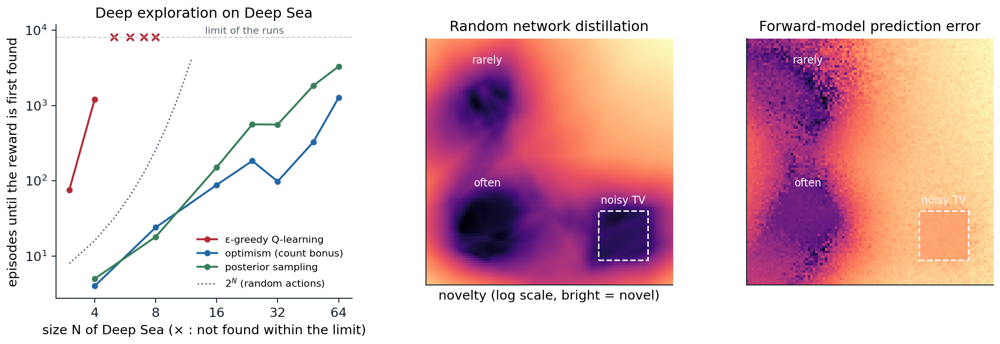

[Background Notes](../README.md) › [Reinforcement Learning](README.md)

# 22. Exploration in Deep RL

> [!WARNING]
> Work in progress: this part of the notes is still being revised.

[← 21. Continuous Control and Maximum-Entropy RL](21-continuous-control-and-maximum-entropy-rl.md) · [23. Model-Based RL and World Models →](23-model-based-rl-and-world-models.md)

## <a id="the-exploration-problem-in-deep-rl"></a>The exploration problem in deep RL

### <a id="why-dithering-fails"></a>Why dithering fails

The agents of the previous chapters explore by **dithering**: they add random noise to a greedy policy, as ε-greedy, Boltzmann exploration, or Gaussian action noise do. This works when a few random deviations from the current policy reach anything worth learning about, as in most Atari games or locomotion tasks with dense rewards. It fails when rewards are sparse and far away. If a reward requires a specific sequence of $`N`$ decisions, random deviations find it with probability that shrinks exponentially in $`N`$, and until they do, the agent has nothing to learn from. The bandits of [chapter 3](03-multi-armed-bandits.md) showed that the remedy is to direct exploration toward what is uncertain, with optimism or posterior sampling. In an MDP, uncertainty about a distant state must also drive the actions that lead there, possibly many steps ahead, even though each of those steps looks worse than the alternatives. Osband and colleagues call this **deep exploration**: planning to learn, rather than learning by accident.

**Deep Sea** ([Osband et al., 2020](https://arxiv.org/abs/1908.03568)) isolates the problem. The agent descends an $`N\times N`$ grid one row per step, choosing left or right; moving right costs a little, and only a path that moves right at every step, from the top-left to the bottom-right corner, finds a reward that outweighs the costs. Which action index means right is randomized in every cell. A dithering agent learns early that right costs something, and afterward moves right only when its exploration noise says so, so it reaches the reward with probability about $`(\varepsilon/2)^N`$ per episode (exercise 22.1). The next code compares it with two agents that explore deeply, by optimism and by posterior sampling, both of which are told the grid's dynamics and must learn its rewards.

```python
import numpy as np

# Deep Sea (Osband et al., 2020): an N x N grid; the agent starts in the top-left corner and descends one row per
# step, choosing left or right (which action means "right" is randomized in every cell). Moving right costs 0.01/N;
# reaching the bottom-right corner, by moving right at every step, pays 1. Episodes last N steps. Three tabular
# agents, each run until it first finds the reward (at most 6,000 episodes), 5 seeds per size. The two planning
# agents are given the dynamics and must learn the rewards:
#   epsilon-greedy Q-learning (epsilon = 0.1, step size 0.1, values initialized to 0);
#   optimism: plan each episode in the learned model, with a bonus 1/sqrt(n(s, a) + 1) added to every reward;
#   posterior sampling: plan each episode in the learned model with rewards sampled from a Gaussian posterior,
#     r ~ N(mean(s, a), 1 / (n(s, a) + 1)): unvisited pairs keep their prior uncertainty.


def deep_sea(N, rng):
    flip = rng.integers(2, size=(N, N))                        # which action index means "right" in each cell
    succ = np.zeros((N, N, 2), int)                            # the next column for each cell and action
    for r in range(N):
        for c in range(N):
            for a in range(2):
                succ[r, c, a] = min(c + 1, N - 1) if a != flip[r, c] else max(c - 1, 0)
    def step(r, c, a):
        right = a != flip[r, c]
        reward = (-0.01 / N if right else 0.0) + (1.0 if (r == N - 1 and c == N - 1 and right) else 0.0)
        return r + 1, succ[r, c, a], reward
    return step, succ


def plan(N, succ, rbar):
    """Finite-horizon value iteration with the known dynamics and estimated rewards, backward over the rows."""
    Q = np.zeros((N, N, 2)); Vnext = np.zeros(N)
    for r in reversed(range(N)):
        Q[r] = rbar[r] + Vnext[succ[r]]
        Vnext = Q[r].max(1)
    return Q


def run(N, agent, rng, max_episodes=6000):
    step, succ = deep_sea(N, rng)
    Q = np.zeros((N, N, 2)); n = np.zeros((N, N, 2)); rsum = np.zeros((N, N, 2))
    for ep in range(1, max_episodes + 1):
        if agent == "optimism":
            Qp = plan(N, succ, rsum / np.maximum(n, 1) + 1 / np.sqrt(n + 1))
        elif agent == "posterior":
            Qp = plan(N, succ, rsum / np.maximum(n, 1) + rng.normal(size=n.shape) / np.sqrt(n + 1))
        r, c, found = 0, 0, False
        while r < N:
            if agent == "epsilon":
                a = int(rng.integers(2)) if rng.random() < 0.1 else int(rng.choice(np.flatnonzero(Q[r, c] == Q[r, c].max())))
            else:
                a = int(rng.choice(np.flatnonzero(Qp[r, c] == Qp[r, c].max())))
            r2, c2, rew = step(r, c, a)
            found |= rew > 0.5
            n[r, c, a] += 1; rsum[r, c, a] += rew
            target = rew + (Q[r2, c2].max() if r2 < N else 0.0)
            Q[r, c, a] += 0.1 * (target - Q[r, c, a])
            r, c = r2, c2
        if found:
            return ep
    return np.inf


print("   N    episodes until the reward is first found (median of 5 seeds; inf = not within 6,000)")
print("        epsilon-greedy   optimism (bonus)   posterior sampling")
for N in (4, 8, 16, 32, 64):
    res = {}
    for agent in ("epsilon", "optimism", "posterior"):
        rng = np.random.default_rng(N)
        res[agent] = np.median([run(N, agent, rng) for _ in range(5)])
    print(f"  {N:3d}   {res['epsilon']:14.0f}   {res['optimism']:16.0f}   {res['posterior']:18.0f}")
#    N    episodes until the reward is first found (median of 5 seeds; inf = not within 6,000)
#         epsilon-greedy   optimism (bonus)   posterior sampling
#     4              122                  6                    4
#     8              inf                 13                   35
#    16              inf                 88                  166
#    32              inf                326                  638
#    64              inf               1185                 4735
```

The dithering agent finds the reward only in the smallest grid. Once it has learned that moving right costs something, it moves right only when its exploration noise says so, with probability $`\varepsilon/2=0.05`$ per step, and for $`N=8`$ an all-right path then has probability $`4\times10^{-11}`$ per episode (exercise 22.1). The optimistic agent adds a bonus $`1/\sqrt{n(s,a)+1}`$ to every reward and plans with the result, so every unvisited action looks worth a full unit of reward and the plan leads toward the least-visited part of the grid, whatever lies in between; it needs a number of episodes that grows polynomially, 1,185 for $`N=64`$. The posterior-sampling agent draws a plausible set of rewards each episode and acts optimally for it: in cells it has never tried, the draws are wide, and when a draw happens to favor a long unexplored path, the agent commits to it for the whole episode. It is slower here, 4,735 episodes for $`N=64`$, since its draws are noisier than a bonus, but its cost also grows polynomially, roughly like $`N^3`$ rather than $`2^N`$. What makes both deep is that the uncertainty enters the *values*, through planning, and so propagates backward to the first step of a long path; a bonus applied only when choosing among the current actions would not (exercise 22.2). Deep RL's exploration methods are approximations of these two ideas for problems where states cannot be counted and values cannot be computed exactly.

### <a id="optimism-in-the-face-of-uncertainty"></a>Optimism in the face of uncertainty

The tabular theory of optimism is well developed ([chapter 30](30-the-theory-of-reinforcement-learning.md)). **R-max** ([Brafman and Tennenholtz, 2002](https://www.jmlr.org/papers/v3/brafman02a.html)) treats every state–action pair visited fewer than $`m`$ times as leading to a fictitious state of maximal reward, plans in the resulting model, and is guaranteed to learn a near-optimal policy in polynomial time. **MBIE-EB** ([Strehl and Littman, 2008](https://doi.org/10.1016/j.jcss.2007.08.009)) replaces the fictitious state with the bonus $`\beta/\sqrt{n(s,a)}`$ in the rewards of the learned model, the form used in the code above, and UCB-style algorithms such as UCBVI achieve near-optimal regret with bonuses of the same form. Deep RL keeps the bonus and needs two things the tabular setting takes for granted: a count, or something like it, for states that are never exactly repeated; and a way to propagate the bonus through values, which the TD updates of a deep agent provide once the bonus is added to the reward.

## <a id="novelty-bonuses"></a>Novelty bonuses

### <a id="counts-and-pseudo-counts"></a>Counts and pseudo-counts

A count must generalize: two Atari frames that differ in a few pixels should count as the same state, and two that differ in the agent's room should not. [Bellemare et al. (2016)](https://arxiv.org/abs/1606.01868) derived **pseudo-counts** from a density model. If $`\rho_n(x)`$ is the model's probability of observation $`x`$ after training on $`n`$ observations and $`\rho'_n(x)`$ its probability after one more update on $`x`$ itself, then the pseudo-count

```math
\hat N_n(x)=\frac{\rho_n(x)\bigl(1-\rho'_n(x)\bigr)}{\rho'_n(x)-\rho_n(x)}
```

is the count that would make the model's change consistent with an empirical distribution (exercise 22.3): a state whose probability barely moves when the model sees it again has been seen many times. With a bonus $`\beta/\sqrt{\hat N_n(x)+0.01}`$ from a simple pixel density model, a DQN agent explored 15 of the 24 rooms of the first level of Montezuma's Revenge within 50 million frames, where the agent without the bonus explored 2. Later work used a PixelCNN as the density model ([Ostrovski, Bellemare, van den Oord, and Munos, 2017](https://arxiv.org/abs/1703.01310)) or simply counted hashes of learned or random projections of the observations ([Tang et al., 2017](https://arxiv.org/abs/1611.04717)).

### <a id="random-network-distillation"></a>Random network distillation

**Random network distillation** (RND) ([Burda, Edwards, Storkey, and Klimov, 2019](https://arxiv.org/abs/1810.12894)) replaced the density model by a regression. A **target** network $`f`$ with random, fixed weights maps each observation to a feature vector; a **predictor** network $`\hat f`$ is trained to reproduce $`f`$ on the observations the agent visits; and the intrinsic reward is the prediction error $`\|\hat f(x)-f(x)\|^2`$. The error is small where the predictor has been trained often and large elsewhere, a count-like signal that generalizes as neural networks do (exercise 22.4). Because the target is a deterministic function of the observation, the error has no irreducible part: it goes to zero wherever data accumulate. The details mattered as much as the idea: normalized observations and intrinsic rewards, separate value heads for the extrinsic and intrinsic returns with different discounts, intrinsic returns that do not stop at the end of an episode, and PPO with many parallel environments. RND was the first method to exceed average human performance on Montezuma's Revenge without demonstrations or access to the game's internal state, and it occasionally completed the first level.

### <a id="curiosity-and-the-noisy-tv"></a>Curiosity and the noisy TV

An older family measures novelty by the error of a learned model of the world. Schmidhuber's **curiosity** rewards the agent for the errors, or better the improvements, of its predictions ([Schmidhuber, 2010](https://doi.org/10.1109/TAMD.2010.2056368)), and the **intrinsic curiosity module** ([Pathak, Agrawal, Efros, and Darrell, 2017](https://arxiv.org/abs/1705.05363)) made it work from pixels, predicting the next state's features, learned by an inverse dynamics model so that they ignore what the agent cannot affect. A large study showed that curiosity alone, with no extrinsic reward at all, plays many Atari games well, since the games reward exactly the progress that produces new observations ([Burda et al., 2019](https://arxiv.org/abs/1808.04355)). Its weakness is the **noisy TV**: wherever the next observation is inherently unpredictable, a random channel on a screen or a coin flip, the model's error never shrinks, and a curious agent watches forever. The next code trains both signals on the same experience, which includes a noisy TV.

```python
import numpy as np
import torch

# Two novelty signals on a 2-D state space, trained on the same stream of experience. The agent spends most of
# its time near (0.25, 0.25), rarely visits (0.25, 0.75), has never been near (0.75, 0.75), and often watches a
# "noisy TV" in the square [0.7, 0.9] x [0.1, 0.3], where every next observation is a fresh random point.
# Elsewhere the dynamics are deterministic: the next state is the current one plus the action (a small move).
#   Random network distillation (Burda et al., 2019): a predictor learns to match a fixed random network's
#     features of each observation; the novelty of x is the prediction error ||g(x) - f(x)||^2.
#   Forward-model curiosity: a model learns to predict the next state from the state and action; the novelty
#     of a transition is its prediction error ||h(x, a) - x'||^2.
# The average novelty in each region, relative to the frequently visited one, after 1,000 to 10,000 updates.
torch.set_num_threads(1); torch.manual_seed(0); rng = np.random.default_rng(0)


def mlp(i, o):
    return torch.nn.Sequential(torch.nn.Linear(i, 64), torch.nn.ReLU(), torch.nn.Linear(64, 64), torch.nn.ReLU(), torch.nn.Linear(64, o))


def experience(n):
    """A batch of transitions (x, a, x') from the agent's stream."""
    kind = rng.choice(3, size=n, p=[0.7, 0.03, 0.27])            # frequent region, rare region, noisy TV
    centers = np.array([[0.25, 0.25], [0.25, 0.75]])
    x = np.where(kind[:, None] == 2, rng.uniform([0.7, 0.1], [0.9, 0.3], (n, 2)),
                 centers[np.minimum(kind, 1)] + 0.04 * rng.normal(size=(n, 2)))
    a = 0.02 * rng.normal(size=(n, 2))
    x2 = np.where(kind[:, None] == 2, rng.uniform([0.7, 0.1], [0.9, 0.3], (n, 2)), x + a)
    return [torch.as_tensor(v, dtype=torch.float32) for v in (x, a, x2)]


def region(center, n=2000, noisy_tv=False):
    if noisy_tv:
        x = rng.uniform([0.7, 0.1], [0.9, 0.3], (n, 2)); x2 = rng.uniform([0.7, 0.1], [0.9, 0.3], (n, 2))
    else:
        x = np.array(center) + 0.04 * rng.normal(size=(n, 2)); x2 = None
    a = 0.02 * rng.normal(size=(n, 2))
    x2 = x + a if x2 is None else x2
    return [torch.as_tensor(v, dtype=torch.float32) for v in (x, a, x2)]


target, predictor, forward = mlp(2, 16), mlp(2, 16), mlp(4, 2)
for p in target.parameters():
    p.requires_grad_(False)
opt = torch.optim.Adam(list(predictor.parameters()) + list(forward.parameters()), lr=1e-3)
tests = {"frequently visited": region((0.25, 0.25)), "rarely visited": region((0.25, 0.75)),
         "never visited": region((0.75, 0.75)), "noisy TV": region(None, noisy_tv=True)}


def novelty():
    with torch.no_grad():
        rnd = {k: ((predictor(x) - target(x)) ** 2).sum(1).mean().item() for k, (x, a, x2) in tests.items()}
        fwd = {k: ((forward(torch.cat([x, a], 1)) + x - x2) ** 2).sum(1).mean().item() for k, (x, a, x2) in tests.items()}
    return rnd, fwd


print("   novelty relative to the frequently visited region")
print("   updates   signal                  rarely visited   never visited   noisy TV")
for t in range(1, 10001):
    x, a, x2 = experience(128)
    loss = ((predictor(x) - target(x)) ** 2).sum(1).mean() + ((forward(torch.cat([x, a], 1)) + x - x2) ** 2).sum(1).mean()
    opt.zero_grad(); loss.backward(); opt.step()
    if t in (1000, 3000, 10000):
        rnd, fwd = novelty()
        for name, d in (("random network distill.", rnd), ("forward-model error", fwd)):
            base = d["frequently visited"]
            print(f"   {t:7,d}   {name:23s} {d['rarely visited'] / base:14.1f}   {d['never visited'] / base:13.1f}   {d['noisy TV'] / base:8.1f}")
#    novelty relative to the frequently visited region
#    updates   signal                  rarely visited   never visited   noisy TV
#      1,000   random network distill.           12.2          3000.9        3.5
#      1,000   forward-model error                1.6           482.8       95.1
#      3,000   random network distill.            9.8          3656.9        1.9
#      3,000   forward-model error                0.9           302.7       62.4
#     10,000   random network distill.            4.2          1721.5        1.0
#     10,000   forward-model error                0.7           819.4      211.9
```

RND quickly learns that the noisy TV's frames are familiar: they are random, but they come from a region of observations it sees constantly, and its random target is a fixed function of them. The forward model can never predict the next frame, and its error in front of the TV stays about 60 to 200 times larger than in the familiar region, however long it trains. The table also shows the forward model's other blind spot: its error is small in the rarely visited region, because the dynamics there are the same simple drift it learned elsewhere. Prediction error measures how surprising a transition is to the model, not how often the agent has been there. The remedies for prediction-based curiosity reward the reduction of uncertainty rather than the error itself: the information gain about a Bayesian dynamics model ([Houthooft et al., 2016](https://arxiv.org/abs/1605.09674)), or the disagreement among an ensemble of models, which vanishes where the models have enough data even if the outcome is random ([Pathak, Gandhi, and Gupta, 2019](https://arxiv.org/abs/1906.04161)).



*Left: episodes until the reward of Deep Sea is first found, for ε-greedy Q-learning, an optimistic planner with a count bonus, and a posterior-sampling planner, medians of 3 seeds (9 for ε-greedy) with a limit of 8,000 episodes, a separate run from the table above; × marks sizes where most runs did not find the reward. The dithering agent's cost grows exponentially with the size of the grid, faster even than the $`2^N`$ of random actions (dotted); the deep-exploration agents' cost grows polynomially. Center and right: the novelty that random network distillation and a forward model's prediction error assign to every point of a 2-D state space after training on the experience of the code in [the section on curiosity](#curiosity-and-the-noisy-tv) (bright is novel, log scale). The noisy TV (dashed square) is familiar to RND and permanently novel to the forward model.*

### <a id="episodic-novelty"></a>Episodic novelty

Counts over the agent's whole lifetime fail in procedurally generated environments, where every episode's layout is new, and they fade: once everything nearby has been seen, the bonus vanishes and the agent stops returning to explore further. **Episodic** bonuses reward novelty within the current episode. **Never Give Up** ([Badia et al., 2020](https://arxiv.org/abs/2002.06038)) keeps an episodic memory of embeddings, learned with an inverse dynamics model, and rewards states far from their nearest neighbors in it, modulated by a lifelong RND bonus; it was the exploration component of Agent57 ([chapter 18](18-data-efficient-and-scalable-value-based-agents.md#agent57)). **E3B** ([Henaff, Raileanu, Jiang, and Rocktäschel, 2022](https://arxiv.org/abs/2210.05805)) uses the elliptical bonus of linear bandits ([chapter 4](04-contextual-bayesian-and-adversarial-bandits.md#linear-bandits-and-linucb)), $`b(s)=\phi(s)^\top C^{-1}\phi(s)`$ with $`C=\lambda I+\sum\phi\phi^\top`$ over the episode so far, which reduces to $`1/(n(s)+\lambda)`$ for one-hot features (exercise 22.7), and it performed strongly on procedurally generated tasks such as MiniHack.

## <a id="randomized-value-functions"></a>Randomized value functions

### <a id="posterior-sampling"></a>Posterior sampling

The Bayesian alternative to optimism is **posterior sampling for reinforcement learning** (PSRL) ([Strens, 2000](https://dl.acm.org/doi/10.5555/645529.658114); [Osband, Russo, and Van Roy, 2013](https://arxiv.org/abs/1306.0940)): at the start of each episode, sample an MDP from the posterior, compute its optimal policy, and follow it for the whole episode. It is Thompson sampling ([chapter 3](03-multi-armed-bandits.md#thompson-sampling)) applied to MDPs, and its commitment to one sample per episode is what makes its exploration deep: a sample that happens to be optimistic about a distant region makes the agent travel there, whatever the intermediate steps cost. Its regret bounds match those of optimistic algorithms, and it is often better in practice. **Randomized least-squares value iteration** (RLSVI) ([Osband, Van Roy, Russo, and Wen, 2019](https://arxiv.org/abs/1703.07608)) makes the idea practical with function approximation: it samples a value function instead of an MDP, by fitting least-squares value iteration to rewards perturbed with noise and adding a random prior, and it too explores deeply, with a regret bound in the tabular setting and, in later work, in the linear setting ([Zanette, Brandfonbrener, Brunskill, Pirotta, and Lazaric, 2020](https://arxiv.org/abs/1911.00567)).

### <a id="bootstrapped-dqn-and-randomized-priors"></a>Bootstrapped DQN and randomized priors

**Bootstrapped DQN** ([Osband, Blundell, Pritzel, and Van Roy, 2016](https://arxiv.org/abs/1602.04621)) approximates posterior sampling with an ensemble: a shared torso with $`K`$ heads (10 in the paper), each trained by Q-learning on its own bootstrap sample of the data (in the paper's Atari experiments every head saw all the data, and the heads differed only through their random initializations), and one head sampled per episode to act greedily. Where data are plentiful, the heads agree; where they are scarce, they disagree, and different episodes follow different heads into different parts of the environment. An ensemble trained only on data, however, has no reason to disagree where there are no data, since every member extrapolates in similar ways. **Randomized prior functions** ([Osband, Aslanides, and Cassirer, 2018](https://arxiv.org/abs/1806.03335)) fix this: each member is $`Q_k=f_{\boldsymbol\theta_k}+\beta p_k`$, the sum of a trainable network and a fixed, randomly initialized **prior network** $`p_k`$. Training moves $`f_{\boldsymbol\theta_k}`$ to cancel the prior only where there are data, so the members keep their random disagreement everywhere else; for linear models with Gaussian noise this gives exact posterior samples (exercise 22.5). With priors, bootstrapped DQN solves Deep Sea at sizes where dithering is hopeless. The **epistemic neural network** of [Osband et al. (2023)](https://arxiv.org/abs/2107.08924) packages the same idea as a small **epinet** added to a base network, which produces the joint predictions of an ensemble at a fraction of its cost. Other ways to estimate epistemic uncertainty in deep agents include propagating it through a Bellman equation for the variance of the values ([O'Donoghue, Osband, Munos, and Mnih, 2018](https://arxiv.org/abs/1709.05380)) and the noisy networks of chapter 18.

### <a id="information-and-value"></a>Information and value

Optimism and posterior sampling explore to reduce regret, not to learn everything. When information has value only through the decisions it improves, an agent can do better by trading off the regret of an action against the information it yields, as **information-directed sampling** does ([Russo and Van Roy, 2018](https://arxiv.org/abs/1403.5556)). [Lu, Van Roy, Dwaracherla, Ibrahimi, Osband, and Wen (2023)](https://arxiv.org/abs/2103.04047) develop this view into a general framework in which an agent's exploration is judged by the information it acquires about what matters for its future rewards, a guide for designing agents that must learn in environments too complex ever to model completely.

## <a id="hard-exploration-games"></a>Hard-exploration games

### <a id="montezuma-s-revenge-and-go-explore"></a>Montezuma's Revenge and Go-Explore

A handful of Atari games, Montezuma's Revenge and Pitfall above all, became the benchmark of hard exploration: long sequences of precise actions before any reward, deadly mistakes, and rooms that must be visited in the right order. Pseudo-counts and RND made progress on them; Agent57 exceeded the human benchmark on all of them with tens of billions of frames. **Go-Explore** ([Ecoffet, Huizinga, Lehman, Stanley, and Clune, 2021](https://www.nature.com/articles/s41586-020-03157-9)) attacked them by diagnosing two failures of intrinsic motivation. **Detachment**: an agent driven by bonuses consumes the novelty near one frontier, is lured elsewhere, and forgets how to return to the first frontier, whose bonus it has already spent. **Derailment**: even when it knows a promising state, its exploration noise throws it off the path before it gets there. Go-Explore keeps an archive of **cells**, coarse downscaled images of the states it has reached, with the best trajectory to each; it repeatedly selects a promising cell, *first returns* to it, by restoring the simulator's saved state or with a goal-conditioned policy, and *then explores* from it with random actions, adding any new cells to the archive. A final phase makes the best trajectories robust to the games' stochasticity by imitation learning. Go-Explore surpassed the state of the art on all the hard-exploration Atari games, by orders of magnitude on Montezuma's Revenge and Pitfall. Its lesson, remembering and returning to the frontier rather than hoping to stumble on it again, carries over to later methods, including **Intelligent Go-Explore** ([Lu, Hu, and Clune, 2025](https://arxiv.org/abs/2405.15143)), which lets a foundation model judge which states are interesting.

## <a id="exploration-without-rewards"></a>Exploration without rewards

When no reward is given, exploration becomes a goal in itself, and a way to prepare for rewards that will come later. One objective is to cover the state space: maximize the entropy of the state distribution the policy visits, which can be done provably in the tabular case ([Hazan, Kakade, Singh, and Van Soest, 2019](https://arxiv.org/abs/1812.02690)) and approximately with nearest-neighbor entropy estimates in deep agents ([Liu and Abbeel, 2021](https://arxiv.org/abs/2103.04551)). Another is to learn a repertoire of distinguishable **skills**, by maximizing the mutual information between a skill variable and the states it reaches ([Eysenbach, Gupta, Ibarz, and Levine, 2019](https://arxiv.org/abs/1802.06070)). A third explores with a world model, seeking the states where an ensemble of learned models disagrees, and then solves new tasks zero-shot by planning in the model ([Sekar et al., 2020](https://arxiv.org/abs/2005.05960); [chapter 23](23-model-based-rl-and-world-models.md)). Reward-free exploration has its own theory: after a polynomial number of reward-free episodes, an agent can compute near-optimal policies for any reward function given afterward ([Jin, Krishnamurthy, Simchowitz, and Yu, 2020](https://arxiv.org/abs/2002.02794)). Benchmarks for exploration have moved from Atari to procedurally generated worlds that demand it at every episode: MiniGrid ([Chevalier-Boisvert et al., 2023](https://arxiv.org/abs/2306.13831)), MiniHack ([Samvelyan et al., 2021](https://arxiv.org/abs/2109.13202)), Crafter ([Hafner, 2022](https://arxiv.org/abs/2109.06780)), and Craftax, a fast JAX reimplementation and much harder extension of it ([Matthews et al., 2024](https://arxiv.org/abs/2402.16801)). Open-ended exploration, in which the agent also chooses what to learn next, is the subject of [chapter 29](29-generalist-agents-meta-rl-and-open-endedness.md).

## <a id="exercises"></a>Exercises

### <a id="exercise-22-1-dithering-on-deep-sea"></a>Exercise 22.1 — Dithering on Deep Sea

(a) A uniformly random policy finds Deep Sea's reward with probability $`2^{-N}`$ per episode. An ε-greedy agent that has learned to prefer moving left everywhere, because moving right costs something, moves right with probability $`\varepsilon/2`$ per step. How many episodes does each need on average for $`N=8`$ and $`N=30`$, with $`\varepsilon=0.1`$? (b) Why does Boltzmann exploration not help?


<details>
<summary><b>Solution</b></summary>


(a) The number of episodes until the first success is geometric, with mean one over the success probability. Random: $`2^8=256`$ and $`2^{30}\approx1.1\times10^9`$. ε-greedy: $`(0.05)^{-8}\approx2.6\times10^{10}`$ and $`(0.05)^{-30}=20^{30}\approx1.1\times10^{39}`$. The ε-greedy agent is worse than random, because what it has learned, that right costs something, steers it away from the reward.

(b) Boltzmann exploration picks right with probability $`1/(1+e^{\Delta/\tau})`$ where $`\Delta=0.01/N`$ is the learned preference for left. For a temperature large compared with $`\Delta`$ this is nearly $`\frac12`$, the random policy, whose cost grows as $`2^N`$; for a small temperature it is the greedy policy. No temperature makes a specific sequence of $`N`$ choices likely: any exploration that decides independently at each step, without a plan, fails exponentially on this problem.

</details>


### <a id="exercise-22-2-where-the-bonus-goes"></a>Exercise 22.2 — Where the bonus goes

The optimistic agent of the code adds its bonus to the rewards and plans. Suppose instead that it learned values from the extrinsic rewards only and chose actions by $`\arg\max_a\bigl(Q(s,a)+c/\sqrt{n(s,a)+1}\bigr)`$, a UCB rule applied at each state. Why would it fail on Deep Sea? Compare exercise 10.1.


<details>
<summary><b>Solution</b></summary>


The bonus at a state reflects only the counts of that state's own actions. Near the top of the grid, both actions are soon tried many times, so their bonuses are small and nearly equal, and the choice follows the extrinsic values, which favor left. The unexplored cells deep in the lower right, which is where the information is, never enter the values of the top cells, because the values are learned from extrinsic rewards alone. The agent explores the top rows thoroughly and the bottom right never. Added to the rewards, the bonus becomes part of the returns, so a state from which many unvisited pairs are reachable has a high value, and the TD updates or the planner carry that value back to the first step: this is deep exploration. Exercise 10.1 found the same difference between Dyna-Q+'s bonus in the model's rewards and a bonus used only when acting.

</details>


### <a id="exercise-22-3-deriving-the-pseudo-count"></a>Exercise 22.3 — Deriving the pseudo-count

Suppose that a density model behaves like an empirical distribution with an unknown count: $`\rho_n(x)=\hat N/\hat n`$ before seeing $`x`$ once more and $`\rho'_n(x)=(\hat N+1)/(\hat n+1)`$ after. Solve for $`\hat N`$ and $`\hat n`$. Why is the result reasonable even for a model that is not a counter?


<details>
<summary><b>Solution</b></summary>


From $`\rho\hat n=\hat N`$ and $`\rho'(\hat n+1)=\hat N+1`$: $`\rho'\hat n+\rho'=\rho\hat n+1`$, so $`\hat n=(1-\rho')/(\rho'-\rho)`$ and $`\hat N=\rho\hat n=\rho(1-\rho')/(\rho'-\rho)`$. The pseudo-count depends only on how much one more observation of $`x`$ raises the model's probability of $`x`$: a large increase means $`x`$ was rare, a small one means it was common. That is meaningful for any density model that learns from its inputs, and it inherits the model's generalization: an unseen observation similar to many seen ones has a small increase, and so a large pseudo-count. The model must be **learning-positive**, $`\rho'\ge\rho`$, for the pseudo-count to be nonnegative, and strictly so for it to be finite.

</details>


### <a id="exercise-22-4-what-random-network-distillation-measures"></a>Exercise 22.4 — What random network distillation measures

Let the observations be one-hot vectors $`\phi(x)`$ of $`S`$ states, the target $`f(x)=\mathbf w^\top\phi(x)`$ with random $`\mathbf w\sim\mathcal N(0,I)`$, and the predictor the ridge regression $`\hat f(x)=\hat{\mathbf w}^\top\phi(x)`$ fitted with penalty $`\lambda`$ on the visited states. (a) Show that the expected squared error at a state visited $`n`$ times is $`\lambda^2/(n+\lambda)^2`$. (b) Why is RND immune to the noisy TV of the code but not to a TV that shows an endless stream of new images?


<details>
<summary><b>Solution</b></summary>


(a) Ridge regression gives $`\hat{\mathbf w}=A^{-1}\Phi^\top\Phi\mathbf w`$ with $`A=\Phi^\top\Phi+\lambda I`$, so $`\mathbf w-\hat{\mathbf w}=\lambda A^{-1}\mathbf w`$ and the error at $`x`$ is $`\lambda\mathbf w^\top A^{-1}\phi(x)`$, with expected square $`\lambda^2\phi^\top A^{-2}\phi`$. With one-hot features, $`A`$ is diagonal with entries $`n(s)+\lambda`$, which gives $`\lambda^2/(n+\lambda)^2`$. The error is a decreasing function of the count, like a count-based bonus, and with general features it decreases in the directions that the data cover, as the elliptical bonus does. It decays faster than a UCB bonus, so its scale shrinks as training proceeds; RND divides its intrinsic rewards by a running estimate of their scale to keep them consistent across environments and over time.

(b) The noisy TV of the code shows random frames from a fixed distribution. Every frame is a sample from a region the predictor sees constantly, and the target is a fixed function of the frame, so the predictor learns the region like any other. A TV that keeps showing new images, unlike anything seen before, is novel to RND too, and would attract it. So would any source of endless visual novelty the agent can control. The distinction RND draws is between randomness, which it ignores, and novelty of the observations themselves, which it cannot tell apart from novelty that matters for the task.

</details>


### <a id="exercise-22-5-randomized-priors-give-posterior-samples"></a>Exercise 22.5 — Randomized priors give posterior samples

For Bayesian linear regression with prior $`\boldsymbol\theta\sim\mathcal N(0,\sigma_p^2I)`$ and noise variance $`\sigma^2`$, each ensemble member draws a prior sample $`\tilde{\boldsymbol\theta}_p\sim\mathcal N(0,\sigma_p^2I)`$ and noisy targets $`\tilde y_i=y_i+\epsilon_i`$, $`\epsilon_i\sim\mathcal N(0,\sigma^2)`$, and minimizes $`\sum_i(\tilde y_i-\mathbf x_i^\top\boldsymbol\theta)^2/\sigma^2+\|\boldsymbol\theta-\tilde{\boldsymbol\theta}_p\|^2/\sigma_p^2`$. (a) Show that the minimizer is a sample from the exact posterior. (b) Run the next code, which checks this numerically, and explain the last column.


<details>
<summary><b>Solution</b></summary>


(a) The minimizer is $`\boldsymbol\theta=A^{-1}\bigl(X^\top\tilde{\mathbf y}/\sigma^2+\tilde{\boldsymbol\theta}_p/\sigma_p^2\bigr)`$ with $`A=X^\top X/\sigma^2+I/\sigma_p^2`$, a linear function of Gaussians, hence Gaussian. Its mean is $`A^{-1}X^\top\mathbf y/\sigma^2`$, the posterior mean. Its covariance is $`A^{-1}\bigl(X^\top X/\sigma^2+I/\sigma_p^2\bigr)A^{-1}=A^{-1}`$, using $`\operatorname{Cov}(X^\top\boldsymbol\epsilon)=\sigma^2X^\top X`$ and $`\operatorname{Cov}(\tilde{\boldsymbol\theta}_p)=\sigma_p^2I`$. That is the posterior covariance. Writing $`\boldsymbol\theta=\tilde{\boldsymbol\theta}_p+\boldsymbol\delta`$ shows the network form $`Q=f_{\boldsymbol\theta}+p`$: a trainable part $`\boldsymbol\delta`$, regularized toward zero, plus a fixed random prior.

```python
import numpy as np

# Randomized prior functions give posterior samples for Bayesian linear regression (Osband et al., 2018).
# Model: y = x^T theta + noise, noise ~ N(0, sigma^2), prior theta ~ N(0, sigma_p^2 I). Each ensemble member k
# draws a prior sample theta_p and perturbed targets y + noise, then fits
#   theta_k = argmin_theta  sum_i (y_i + e_ik - x_i^T theta)^2 / sigma^2 + ||theta - theta_p||^2 / sigma_p^2.
# Compare the ensemble's mean and covariance with the exact posterior, and look at the spread of predictions
# near the data and along a direction the data barely explore, with and without the random prior samples.
rng = np.random.default_rng(0)
d, n, sigma, sigma_p = 3, 20, 0.5, 1.0
X = rng.normal(size=(n, d)) * np.array([1.0, 1.0, 0.05])       # the third direction is barely explored
theta_true = rng.normal(size=d)
y = X @ theta_true + sigma * rng.normal(size=n)

A = X.T @ X / sigma ** 2 + np.eye(d) / sigma_p ** 2              # exact posterior precision
post_cov = np.linalg.inv(A); post_mean = post_cov @ X.T @ y / sigma ** 2

K = 20000
theta_p = sigma_p * rng.normal(size=(K, d))
y_pert = y + sigma * rng.normal(size=(K, n))
thetas = np.linalg.solve(A, (X.T @ y_pert.T / sigma ** 2 + theta_p.T / sigma_p ** 2)).T
print("posterior mean (exact)    ", np.round(post_mean, 3))
print("ensemble mean             ", np.round(thetas.mean(0), 3))
print("posterior std (exact)     ", np.round(np.sqrt(np.diag(post_cov)), 3))
print("ensemble std              ", np.round(thetas.std(0), 3))
thetas0 = np.linalg.solve(A, X.T @ y_pert.T / sigma ** 2).T     # the same fits with the prior sample set to 0
for name, x in (("near the data", np.array([1.0, 0.0, 0.0])), ("along the unexplored direction", np.array([0.0, 0.0, 1.0]))):
    print(f"std of predictions {name:31s}: exact {np.sqrt(x @ post_cov @ x):.3f}, ensemble {(thetas @ x).std():.3f},"
          f" without prior samples {(thetas0 @ x).std():.3f}")
# posterior mean (exact)     [-0.438 -1.113 -0.006]
# ensemble mean              [-0.438 -1.113 -0.002]
# posterior std (exact)      [0.1   0.149 0.948]
# ensemble std               [0.1   0.148 0.944]
# std of predictions near the data                  : exact 0.100, ensemble 0.100, without prior samples 0.099
# std of predictions along the unexplored direction : exact 0.948, ensemble 0.944, without prior samples 0.302
```

(b) The ensemble reproduces the posterior's mean and standard deviations. Near the data, all methods agree, since the data pin down the prediction. Along the direction the data barely explore, the posterior is almost as uncertain as the prior, and the ensemble with prior samples reproduces that spread, 0.94 against 0.95. Without the prior samples, the members differ only through the noise added to the targets, and the penalty pulls every one of them toward zero where the data say nothing, so their spread is a third of what it should be. In a deep ensemble, similar initializations and weight decay play the role of that pull toward zero, which is why bootstrapped DQN without priors is overconfident exactly where exploration matters.

</details>


### <a id="exercise-22-6-reading-the-deep-sea-results"></a>Exercise 22.6 — Reading the Deep Sea results

In the code's table, the optimistic agent needs 1,185 episodes for $`N=64`$. (a) Roughly how many state–action pairs can the agent reach, and how many new ones can it try per episode? What is the least number of episodes an agent that tries every reachable pair once would need? (b) Why does the optimistic agent need more, and why is the posterior-sampling agent slower still?


<details>
<summary><b>Solution</b></summary>


(a) After $`r`$ steps the agent can be in any column from 0 to $`r`$, so about $`N^2/2`$ cells are reachable, each with two actions: about $`N^2=4{,}096`$ pairs for $`N=64`$. An episode tries at most $`N=64`$ pairs, so at least about 65 episodes are needed to try them all, and the reward is found only on the path that moves right in every cell of the diagonal.

(b) The bonus $`1/\sqrt{n+1}`$ decays slowly: a pair tried once still has a bonus of 0.71, so the planner often prefers paths through a few rarely tried pairs over paths that reach many new ones, and it revisits before it has covered everything; it still stays polynomial, about 18 times the lower bound here. The posterior-sampling agent explores only as far as its random draws make distant, unexplored pairs look better than known ones, and with Gaussian draws of standard deviation 1, a long path of unexplored pairs is favored only when many draws along it happen to be high at once; its exploration is more random, and therefore less systematic, than optimism's. Its advantage lies elsewhere: it needs no bonus scale, and it adapts to prior knowledge, as the regret analyses of chapter 30 show.

</details>


### <a id="exercise-22-7-the-elliptical-bonus-as-a-count"></a>Exercise 22.7 — The elliptical bonus as a count

Show that for one-hot features $`\phi(s)=\mathbf e_s`$ and $`C=\lambda I+\sum_{t}\phi(s_t)\phi(s_t)^\top`$, the bonus $`\phi(s)^\top C^{-1}\phi(s)`$ equals $`1/(n(s)+\lambda)`$. What does the bonus do for features that generalize, and why is it computed per episode in E3B?


<details>
<summary><b>Solution</b></summary>


The sum of $`\mathbf e_{s_t}\mathbf e_{s_t}^\top`$ is the diagonal matrix of counts, so $`C=\operatorname{diag}(n(s)+\lambda)`$ and $`\mathbf e_s^\top C^{-1}\mathbf e_s=1/(n(s)+\lambda)`$. With general features the bonus is large in directions of feature space that the visited states have not covered, however the states differ in other respects, so two states with similar features share their novelty; with features learned by an inverse dynamics model, the directions are those the agent's actions can affect. E3B resets $`C`$ at the start of every episode because its environments are procedurally generated: a state is novel if it differs from what the agent has seen *in this layout*, and counts from other layouts, whose states are never repeated exactly, would say nothing about it.

</details>


### <a id="exercise-22-8-go-explore-s-assumptions"></a>Exercise 22.8 — Go-Explore's assumptions

(a) Explain detachment and derailment, and how "first return, then explore" addresses each. (b) Go-Explore returns to cells by restoring the simulator's state. What does this assume, and how can the assumption be removed?


<details>
<summary><b>Solution</b></summary>


(a) **Detachment:** an agent that follows intrinsic rewards consumes them where it explores, and when two frontiers exist, it may exhaust the bonuses on the way to one, move to the other, and never return, since the path to the first no longer pays. Go-Explore's archive remembers every frontier explicitly, so no promising state is forgotten. **Derailment:** to explore from a distant frontier, an agent must first reach it, but the random actions that it uses to explore also perturb the journey there. Go-Explore separates the two: it returns without exploration, then explores only from the cell it reached.

(b) Restoring a saved state assumes a simulator that can be reset to any state it has visited, which holds for Atari emulators and physics simulators but not for real robots or for evaluation under standard protocols. The policy-based version removes the assumption: it trains a goal-conditioned policy to reach archived cells, which then does the returning. The robustification phase also removes the dependence on determinism from the final policy: it trains a policy by imitation of the best trajectories, starting near their ends and moving the start earlier (the backward algorithm), so that the result copes with sticky actions and random starts.

</details>


## <a id="appendices"></a>Appendices


<details>
<summary><a id="block-rl22-appendix-a"></a><b>A. Random network distillation in practice</b></summary>


- **Networks.** The target and predictor share the convolutional encoder of the Nature DQN followed by dense layers, the target with random weights that are never trained; in the released code the predictor has two more dense layers than the target.
- **Observation normalization.** The observations fed to both networks are normalized by running statistics, collected by a random policy for a few thousand steps before training, and clipped to $`[-5,5]`$; without it, the random target's features can carry little information.
- **Reward normalization.** The intrinsic rewards are divided by a running estimate of the standard deviation of the intrinsic returns, since their scale drifts as the predictor learns.
- **Two value heads.** The critic has one head for the extrinsic return, with $`\gamma=0.999`$ and episodic resets, and one for the intrinsic return, with $`\gamma=0.99`$ and **no** resets at episode ends, since dying should not erase the value of novelty that remains; the advantages are a weighted sum, with weights 2 and 1 in the paper.
- **Training.** PPO with many parallel environments (up to 1,024), the predictor trained on a random fraction of each batch so that its learning speed does not depend on the number of environments.

</details>


<details>
<summary><a id="block-rl22-appendix-b"></a><b>B. Bootstrapped DQN with randomized priors</b></summary>


Keep $`K`$ Q-networks (or heads on a shared torso), each the sum of a trainable network and a fixed random prior network scaled by $`\beta`$, with a target copy of each. Store each transition with a mask $`\mathbf m\in\{0,1\}^K`$ drawn independently, $`m_k\sim\text{Bernoulli}(p)`$ (with $`p=1`$, all members see all data and differ only through their priors and initializations).

1. At the start of each episode, sample $`k`$ uniformly and act greedily with $`Q_k`$ for the whole episode.
2. For each update, sample a minibatch, and for each member $`j`$ compute its own double-Q target from its own target network, $`y_j=r+\gamma Q^-_j\bigl(s',\arg\max_{a'}Q_j(s',a')\bigr)`$, and a loss weighted by the masks, $`\sum_im_{ij}(Q_j(s_i,a_i)-y_{ij})^2`$.
3. Copy the target networks periodically.

The scale $`\beta`$ of the priors sets the prior uncertainty: it should be comparable to the scale of the values. Committing to one member per episode is essential; sampling a member at every step dithers between them and loses the depth of the exploration.

</details>

---

[← 21. Continuous Control and Maximum-Entropy RL](21-continuous-control-and-maximum-entropy-rl.md) · [23. Model-Based RL and World Models →](23-model-based-rl-and-world-models.md)
