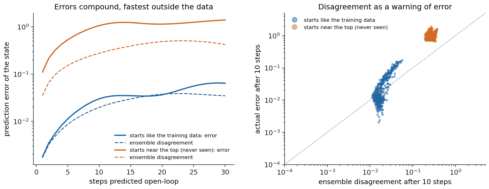

[ML Mastery Notes](../README.md) › [Reinforcement Learning](README.md)

# 23. Model-Based RL and World Models

[← 22. Exploration in Deep RL](22-exploration-in-deep-rl.md) · [24. Planning with Learned Models →](24-planning-with-learned-models.md)

## <a id="learning-models-of-the-world"></a>Learning models of the world

### <a id="what-a-model-buys"></a>What a model buys

Every deep agent of the previous chapters is **model-free**: it learns values or policies directly from experience, and it needs a great deal of it, hundreds of thousands of steps for a simulated cheetah and millions for an Atari game. A **model** of the environment, a predictor of the next state and reward given the current state and action, changes the economics. Once learned, it can be queried without acting, so each real transition can be reused through planning (chapter 10); it can be optimized through, as optimal control does (chapter 15); it transfers to new rewards in the same environment, since the dynamics do not change with the task; and it is trained by supervised learning, whose data are every transition the agent has ever seen, whatever policy produced it. Lab 7 showed the payoff in a small setting: a model fitted to 1,000 random transitions controlled a pendulum as well as its true dynamics. This chapter develops **model-based RL** with neural networks: how to learn models whose errors do not destroy the policies built on them, how to use them for planning and for generating experience, how to learn compact latent models from images, and what a model should predict in the first place. It ends with the generative world models that simulate interactive environments from video, and with agents trained entirely inside them. Chapter 24 continues with the search-based planning of AlphaZero and MuZero.

### <a id="why-errors-compound"></a>Why errors compound

A model trained to predict one step ahead is used many steps ahead, and its errors compound: each prediction starts from the previous one's mistake, in a state that the model may never have seen. Worse, an optimizer that plans or learns inside the model seeks out states where the model's predictions are too good, and those are where the model is most likely wrong, the same exploitation of errors as the actor's exploitation of its critic in chapter 21. The next code trains an ensemble of five networks on 2,000 random transitions of the pendulum, all from states far from the upright position, and measures the error of open-loop predictions over 30 steps from states like the training data and from states near the top.

```python
import numpy as np
import torch

# Learned dynamics models and why their errors compound. Gymnasium's pendulum (theta'' = 3g/(2l) sin(theta) + 3u/(ml^2),
# dt = 0.05, speed clipped to [-8, 8]), state (cos, sin, speed). An ensemble of 5 networks, each trained on its own
# bootstrap sample of 2,000 transitions from random torques starting near the bottom (|theta| > 2), predicts the
# change of the state. Then: the error of open-loop rollouts of 1 to 30 steps from states like the training data and
# from states near the top (never seen), and the ensemble's disagreement as a signal of that error.
torch.set_num_threads(1); torch.manual_seed(0); rng = np.random.default_rng(0)
g, m, l, dt = 10.0, 1.0, 1.0, 0.05


def step(th, thd, u):
    thd = np.clip(thd + (3 * g / (2 * l) * np.sin(th) + 3.0 / (m * l ** 2) * u) * dt, -8, 8)
    return th + thd * dt, thd


def obs(th, thd):
    return np.stack([np.cos(th), np.sin(th), thd / 8], -1)


def data(n, near_top):
    th = rng.uniform(-0.5, 0.5, n) if near_top else rng.choice([-1, 1], n) * rng.uniform(2.0, np.pi, n)
    thd, u = rng.uniform(-2, 2, n), rng.uniform(-2, 2, n)
    th2, thd2 = step(th, thd, u)
    return obs(th, thd), u, obs(th2, thd2)


X, U, X2 = data(2000, near_top=False)
inp = torch.as_tensor(np.column_stack([X, U / 2]), dtype=torch.float32)
out = torch.as_tensor(X2 - X, dtype=torch.float32)
ensemble = []
for k in range(5):
    idx = torch.as_tensor(rng.integers(len(X), size=len(X)))
    net = torch.nn.Sequential(torch.nn.Linear(4, 64), torch.nn.Tanh(), torch.nn.Linear(64, 64), torch.nn.Tanh(), torch.nn.Linear(64, 3))
    opt = torch.optim.Adam(net.parameters(), lr=3e-3)
    for it in range(1500):
        b = idx[torch.randint(len(idx), (256,))]
        loss = ((net(inp[b]) - out[b]) ** 2).mean()
        opt.zero_grad(); loss.backward(); opt.step()
    ensemble.append(net)


def rollout_errors(near_top, H=30, n=500):
    th = rng.uniform(-0.5, 0.5, n) if near_top else rng.choice([-1, 1], n) * rng.uniform(2.0, np.pi, n)
    thd = rng.uniform(-2, 2, n); u = rng.uniform(-2, 2, (H, n))
    x_true = obs(th, thd); x_pred = [torch.as_tensor(x_true, dtype=torch.float32) for _ in ensemble]
    errs, spread = [], []
    for h in range(H):
        th, thd = step(th, thd, u[h]); x_true = obs(th, thd)
        with torch.no_grad():
            ui = torch.as_tensor(u[h][:, None] / 2, dtype=torch.float32)
            x_pred = [x + net(torch.cat([x, ui], 1)) for x, net in zip(x_pred, ensemble)]
        P = torch.stack(x_pred).numpy()
        errs.append(np.sqrt(((P.mean(0) - x_true) ** 2).sum(1)).mean())
        spread.append(np.sqrt(P.var(0).sum(1)).mean())
    return np.array(errs), np.array(spread)


print("   open-loop prediction error (and ensemble spread) after h steps, mean over 500 random starts and torques")
print("   states              h=1              h=5             h=10             h=30")
for near_top, name in ((False, "like the training"), (True, "near the top")):
    e, s = rollout_errors(near_top)
    print(f"   {name:17s}" + "".join(f"   {e[h - 1]:.3f} ({s[h - 1]:.3f})" for h in (1, 5, 10, 30)))
#    open-loop prediction error (and ensemble spread) after h steps, mean over 500 random starts and torques
#    states              h=1              h=5             h=10             h=30
#    like the training   0.002 (0.002)   0.011 (0.009)   0.030 (0.020)   0.064 (0.035)
#    near the top        0.110 (0.035)   0.531 (0.152)   1.060 (0.276)   1.396 (0.422)
```

On states like its training data, the model's one-step error is 0.002, and it compounds to 0.064 after 30 steps, thirty times more. Near the top, a region its data never visited, the one-step error is already fifty times larger, and after ten steps the predictions are essentially unrelated to the truth. The ensemble's **disagreement**, the spread of its members' predictions, grows in the same way: it is small where the model is right and large where it is wrong, which makes it a usable warning (the figure below). Uncertainty comes in two kinds, and a model-based agent must represent both. **Aleatoric** uncertainty is the environment's own randomness, which more data cannot reduce; a network that outputs a distribution, such as a Gaussian with a learned variance, captures it. **Epistemic** uncertainty is the model's ignorance where data are scarce, which more data would reduce; disagreement among ensemble members trained on different samples or from different initializations captures it, as the ensembles of chapter 22 did for values.



*Left: open-loop prediction error of an ensemble of five networks trained on 2,000 random transitions of the pendulum, as a function of the number of steps predicted, for starting states like the training data and near the upright position, which the data never visited (solid), with the ensemble's disagreement (dashed). Right: for each of 500 starting states, the disagreement and the actual error after ten steps. Disagreement ranks the errors correctly, and separates the two regions, but underestimates the error far from the data.*

## <a id="planning-and-learning-with-learned-models"></a>Planning and learning with learned models

### <a id="probabilistic-ensembles-and-planning"></a>Probabilistic ensembles and planning

The first deep model-based agents to match model-free ones on continuous control combined the two kinds of uncertainty with model predictive control. **PETS** ([Chua, Calandra, McAllister, and Levine, 2018](https://arxiv.org/abs/1805.12114)) learns an ensemble of networks, each outputting a Gaussian over the next state, and at every step plans by the cross-entropy method (chapter 15): it samples action sequences, evaluates each by propagating particles through the ensemble, with each particle following a randomly chosen member, and executes the first action of the optimized sequence. Averaging over members penalizes plans that only some members consider good, which keeps the optimizer away from the model's errors. PETS reached the asymptotic performance of the model-free methods of its time on several MuJoCo tasks with a small fraction of their data. It inherited earlier lessons: **PILCO** ([Deisenroth and Rasmussen, 2011](https://dl.acm.org/doi/10.5555/3104482.3104541)) had used Gaussian-process models with analytic uncertainty propagation to swing up a cart-pole from a few trials, and [Nagabandi, Kahn, Fearing, and Levine (2018)](https://arxiv.org/abs/1708.02596) had shown that neural-network models with MPC learn locomotion quickly, and can initialize a model-free learner that then surpasses them.

### <a id="model-based-policy-optimization"></a>Model-based policy optimization

Planning at every step is expensive, and planning over long horizons compounds errors. **Dyna**-style methods (chapter 10) instead use the model to generate experience for a model-free learner. **MBPO** ([Janner, Fu, Zhang, and Levine, 2019](https://arxiv.org/abs/1906.08253)) found the key to making this work with neural models: **short branched rollouts**. It starts model rollouts from states in the real replay memory, runs them for only $k$ steps (from 1 up to 15 or 25 depending on the task, lengthened on a fixed linear schedule as training progresses), and trains a soft actor–critic on a mixture of real and model data, with many updates per real step. Starting from real states keeps the rollouts inside the data distribution, and short rollouts limit the compounding of errors, while the model still multiplies the data available near every state the agent has visited. The authors derived a bound on the policy's true return in terms of the model's error and the length of the rollouts that motivates this design (exercise 23.3). MBPO learned the MuJoCo locomotion tasks several times faster than SAC, an order of magnitude faster on some (on Ant it matched SAC's 3-million-step performance after 300,000 steps), and the model-free REDQ of chapter 21 later matched its efficiency with an ensemble of critics and a high replay ratio, which suggests that a large part of its gain comes from the many updates per real sample that the model makes possible.

A model can also sharpen the value targets rather than add data. **Model-based value expansion** ([Feinberg et al., 2018](https://arxiv.org/abs/1803.00101)) computes $h$-step targets with the model's rewards before bootstrapping, and **STEVE** ([Buckman, Hafner, Tucker, Brevdo, and Lee, 2018](https://arxiv.org/abs/1807.01675)) weights targets of different horizons by their uncertainty under an ensemble. And a differentiable model gives the policy gradients directly: **stochastic value gradients** ([Heess et al., 2015](https://arxiv.org/abs/1510.09142)) backpropagate the value of a trajectory through the model and the policy, the approach that Dreamer scales up.

## <a id="latent-world-models"></a>Latent world models

### <a id="models-of-observations"></a>Models of observations

Images cannot be predicted pixel by pixel over long horizons, and they do not need to be. **World models** ([Ha and Schmidhuber, 2018](https://arxiv.org/abs/1803.10122)) compressed each frame with a variational autoencoder (GenAI chapter 3), predicted the next latent code with a recurrent network that outputs a mixture of Gaussians, and trained a tiny linear controller on the latent code and the recurrent state with an evolution strategy. The agent could be trained entirely inside its own "dream" and transferred to the real game. A dream made less random than the model had learned let the controller exploit its flaws and fail in reality, and a dream made slightly more random transferred best. **PlaNet** ([Hafner et al., 2019](https://arxiv.org/abs/1811.04551)) made latent planning work for control from pixels. Its **recurrent state-space model** (RSSM) has a deterministic recurrent state, which carries information reliably over many steps, and a stochastic latent state, which represents what the model cannot predict; it is trained as a sequential variational autoencoder, reconstructing observations and rewards, with a KL term between the posterior over the latent state given the current observation and the prior predicted from the past. PlaNet planned by the cross-entropy method in latent space and solved visual control tasks from the DeepMind Control Suite with far fewer episodes than model-free agents.

### <a id="learning-behaviors-in-imagination-the-dreamer-agents"></a>Learning behaviors in imagination: the Dreamer agents

**Dreamer** ([Hafner, Lillicrap, Ba, and Norouzi, 2020](https://arxiv.org/abs/1912.01603)) replaced planning at every step by an actor and a critic trained entirely on **imagined** trajectories: starting from latent states of real sequences, it rolls the RSSM forward for 15 steps with the actor's actions, computes λ-returns from predicted rewards and the critic's values, and trains the actor by backpropagating these returns through the learned dynamics, a value gradient in the spirit of SVG. **DreamerV2** ([Hafner, Lillicrap, Norouzi, and Ba, 2021](https://arxiv.org/abs/2010.02193)) used discrete latent variables, 32 categorical variables of 32 classes, and **KL balancing**, which trains the prior faster than the posterior, and was the first agent to reach human-level performance on the Atari benchmark by learning behaviors inside a separately trained world model, on a single GPU. **DreamerV3** ([Hafner, Pasukonis, Ba, and Lillicrap, 2025](https://doi.org/10.1038/s41586-025-08744-2)) made the recipe robust across domains with one set of hyperparameters: **symlog** predictions that compress large values, a **two-hot** categorical representation of rewards and values, returns normalized by their percentiles, and free bits that stop the KL term from collapsing the latent (exercise 23.8). It outperformed specialized methods across more than 150 tasks, from Atari to continuous control to 3D worlds, and it was the first algorithm to collect diamonds in Minecraft from scratch, without human data or curricula. The Dreamer recipe also made learning on real robots practical: with **DayDreamer** ([Wu et al., 2022](https://arxiv.org/abs/2206.14176)), which applied DreamerV2 to physical robots, a quadruped learned to walk from scratch in about an hour of real-world experience.

### <a id="what-should-a-model-predict"></a>What should a model predict?

Reconstructing observations spends a model's capacity on everything in them, including what does not matter for control: the texture of a floor, the leaves of a tree, a flickering screen. Maximum-likelihood models also trade errors in ways unrelated to the task: a model can be more accurate on average and worse for control, the **objective mismatch** of [Lambert, Amos, Yadan, and Calandra (2020)](https://arxiv.org/abs/2002.04523). The alternative is to train models only to predict what planning needs. A model is **value-equivalent** to the environment for a set of policies and value functions if applying the model's Bellman operators to them gives the same results as the environment's ([Grimm, Barreto, Singh, and Silver, 2020](https://arxiv.org/abs/2011.03506); see also [Farahmand, Barreto, and Nikovski, 2017](https://proceedings.mlr.press/v54/farahmand17a.html)): it may be wrong about everything else. The next code makes the difference concrete with a linear system hidden among irrelevant, high-variance distractors, and three latent models of the same small size.

```python
import numpy as np
import scipy.linalg
import torch

# What should a world model predict? A 2-D controllable system, x' = A x + B u (a discretized double integrator),
# with reward -(x_1^2 + 0.1 x_2^2) - 0.01 u^2, observed together with 20 irrelevant, slowly varying distractors of
# much larger variance (they carry about 98% of the observations' variance), mixed by a random rotation into 22
# dimensions. Three latent models with a 2-D state z = W o, linear latent dynamics z' = F z + G u, and a quadratic
# reward model are trained on 20,000 random transitions (random controls, restarts every 50 steps) by rolling the
# latent model 10 steps ahead:
#   reconstruction only: the latent is shaped only by predicting the future observations (through a linear
#     decoder); the reward model is fitted on top of it;
#   reconstruction and reward: both losses shape the latent, as in Dreamer;
#   value-equivalent: only the future rewards, as in MuZero and TD-MPC.
# Each model is then used for control: the LQR of the latent model, applied through z = W o. Report the true
# average cost per step, against the optimal controller that knows the true state and against doing nothing.
torch.set_num_threads(1); torch.manual_seed(0); rng = np.random.default_rng(0)
A = np.array([[1.0, 0.1], [0.0, 1.0]]); B = np.array([[0.005], [0.1]])
Qx, Ru, nd = np.diag([1.0, 0.1]), 0.01, 20
M = np.linalg.qr(rng.normal(size=(2 + nd, 2 + nd)))[0]            # the mixing rotation


def simulate(n):
    x, d = rng.normal(size=2), 5 * rng.normal(size=nd)
    O, U, Rw = [], [], []
    for t in range(n):
        o = M @ np.concatenate([x, d])
        u = rng.normal()
        r = -(x @ Qx @ x) - Ru * u ** 2
        x = A @ x + B[:, 0] * u + 0.01 * rng.normal(size=2); d = 0.98 * d + rng.normal(size=nd)
        if t % 50 == 49:
            x = rng.normal(size=2)
        O.append(o); U.append(u); Rw.append(r)
    return np.array(O), np.array(U), np.array(Rw)


O, U, R = simulate(20000)
T = torch.as_tensor
O_, U_, R_ = T(O, dtype=torch.float32), T(U, dtype=torch.float32), T(R, dtype=torch.float32)


def train(reconstruct, reward_shapes_latent=True, H=10, steps=4000):
    W = torch.nn.Parameter(0.1 * torch.randn(2, 2 + nd)); F = torch.nn.Parameter(torch.eye(2)); G = torch.nn.Parameter(torch.zeros(2, 1))
    L = torch.nn.Parameter(torch.eye(2)); c = torch.nn.Parameter(torch.tensor(0.0)); D = torch.nn.Parameter(0.1 * torch.randn(2 + nd, 2))
    opt = torch.optim.Adam([W, F, G, L, c, D], lr=1e-2)
    for it in range(steps):
        idx = torch.randint(len(O) - H, (256,))
        z, loss = O_[idx] @ W.T, 0.0
        for h in range(H):
            u = U_[idx + h][:, None]
            zr = z if reward_shapes_latent else z.detach()
            r_hat = -((zr @ L) ** 2).sum(1) - c ** 2 * u[:, 0] ** 2         # a negative-definite quadratic reward
            loss = loss + ((r_hat - R_[idx + h]) ** 2).mean()
            if reconstruct:
                loss = loss + ((z @ D.T - O_[idx + h]) ** 2).sum(1).mean()
            z = z @ F.T + u @ G.T
        opt.zero_grad(); loss.backward(); opt.step()
    with torch.no_grad():
        Qz = (L @ L.T).numpy().astype(float); Rz = float(c ** 2) + 1e-6
        Fz, Gz = F.numpy().astype(float), G.numpy().astype(float)
    P = scipy.linalg.solve_discrete_are(Fz, Gz, Qz + 1e-6 * np.eye(2), np.array([[Rz]]))
    K = np.linalg.solve(Rz + Gz.T @ P @ Gz, Gz.T @ P @ Fz)
    return K, W.detach().numpy().astype(float)


def cost(K=None, W=None, true_state=False, n=4000):
    x, total = rng.normal(size=2), 0.0
    d = 5 * rng.normal(size=nd)
    for t in range(n):
        o = M @ np.concatenate([x, d])
        u = 0.0 if K is None else (-K @ (x if true_state else W @ o)).item()
        total += x @ Qx @ x + Ru * u ** 2
        if abs(x).max() > 1e6:
            return np.inf                                           # the closed loop is unstable
        x = A @ x + B[:, 0] * u + 0.01 * rng.normal(size=2); d = 0.98 * d + rng.normal(size=nd)
        if t % 200 == 199:
            x = rng.normal(size=2)
    return total / n


P = scipy.linalg.solve_discrete_are(A, B, Qx, np.array([[Ru]]))
K_opt = np.linalg.solve(Ru + B.T @ P @ B, B.T @ P @ A)
print("   controller                                   average cost per step")
print(f"   no control                                   {cost():10.3f}")
print(f"   optimal, with the true state                 {cost(K_opt, true_state=True):10.3f}")
for name, rec, shaped in (("latent model: reconstruction only", True, False),
                          ("latent model: reconstruction and reward", True, True),
                          ("latent model: value-equivalent", False, True)):
    K, W = train(rec, shaped)
    J = cost(K, W)
    print(f"   {name:44s} " + (f"{J:10.3f}" if np.isfinite(J) else "  unstable"))
#    controller                                   average cost per step
#    no control                                      122.504
#    optimal, with the true state                      0.023
#    latent model: reconstruction only              unstable
#    latent model: reconstruction and reward           0.267
#    latent model: value-equivalent                    0.112
```

The controllable part of the observation carries about 2% of its variance. A latent model shaped only by reconstructing future observations spends its two dimensions on the distractors, which explain most of the variance, and the controller built from it, acting on the wrong quantities through feedback it misunderstands, drives the system unstable. Adding the reward loss to the reconstruction pulls the latent partway toward the relevant state, and the controller works, at more than ten times the optimal cost. The value-equivalent model, trained only to predict future rewards under the actions taken, ignores the distractors and controls best of the three, at about five times the optimal cost; with its two dimensions it cannot represent the state perfectly either, but it spends them on what matters. The same logic underlies MuZero (chapter 24) and the TD-MPC agents.

### <a id="td-mpc"></a>TD-MPC

**TD-MPC** ([Hansen, Wang, and Su, 2022](https://arxiv.org/abs/2203.04955)) combines a value-equivalent latent model with planning. Its model encodes the observation into a latent state and is trained, over short multi-step rollouts in latent space, with three losses: predicting the rewards, predicting TD targets for a learned action-value function, and a **latent consistency** loss that makes the predicted latent states match the encodings of the observations actually reached, with no reconstruction at all. It acts by MPPI planning over a short horizon in latent space, with the learned value function as the terminal value beyond it, and a learned policy to propose action sequences. **TD-MPC2** ([Hansen, Su, and Wang, 2024](https://arxiv.org/abs/2310.16828)) scaled the recipe with normalization of the latent state (SimNorm), discrete regression of values and rewards, and a single set of hyperparameters, to 104 continuous-control tasks, and trained one agent with 317 million parameters on 80 tasks across several domains and embodiments.

## <a id="generative-world-models"></a>Generative world models

### <a id="transformers-and-diffusion-as-world-models"></a>Transformers and diffusion as world models

The generative models of the previous module have become world models. **IRIS** ([Micheli, Alonso, and Fleuret, 2023](https://arxiv.org/abs/2209.00588)) tokenizes each frame with a discrete autoencoder and predicts the next tokens, reward, and termination with an autoregressive transformer (GenAI chapter 2), and trains its policy entirely in imagination; it exceeded human performance on Atari 100k by the mean human-normalized score. **DIAMOND** ([Alonso et al., 2024](https://arxiv.org/abs/2405.12399)) generates the next frame with a diffusion model (GenAI chapter 7), argues that visual details lost by discrete latents matter for control, and reached a mean human-normalized score of 1.46 on Atari 100k, the best for an agent trained entirely inside a world model at the time; trained on recorded play, it also ran as an interactive, playable model of a 3D game. **GameNGen** ([Valevski, Leviathan, Arar, and Fruchter, 2025](https://arxiv.org/abs/2408.14837)) simulated the game DOOM with a diffusion model in real time, at 20 frames per second on a single TPU.

### <a id="generative-interactive-environments"></a>Generative interactive environments

**Genie** ([Bruce et al., 2024](https://arxiv.org/abs/2402.15391)) learned an interactive environment from unlabeled Internet videos of 2D platform games: a latent action model infers a small discrete set of actions (eight) from the past frames and the next frame, and a spatiotemporal transformer predicts the next frame's tokens from the past frames and the latent action, so that a user, or an agent, can step through a world generated from a single image. Its successors extended the idea to 3D worlds that stay consistent for longer, and **Genie 3** ([DeepMind, 2025](https://deepmind.google/discover/blog/genie-3-a-new-frontier-for-world-models/)) generates navigable environments from text prompts in real time, at 24 frames per second and 720p, consistent for a few minutes. Such models are a new kind of environment for training agents: unlimited, controllable, and generated on demand, though only as faithful to real physics as their training video. **Dreamer 4** ([Hafner, Yan, and Lillicrap, 2025](https://arxiv.org/abs/2509.24527)) closed the loop: a scalable transformer world model, trained with a **shortcut forcing** objective that lets it generate in a few steps, runs in real time on a single GPU, and an agent trained purely inside it, from offline data without any interaction with the game, obtained diamonds in Minecraft.

### <a id="when-models-help"></a>When models help

Models help most where data are expensive and the dynamics are learnable: robots, slow simulators, benchmarks that limit interaction. They cost computation, since the model must be trained and queried, and they add their own failure modes: compounding errors, exploitation by the planner or the policy, and capacity spent on irrelevant detail. For a long time, model-based agents learned fast but plateaued below model-free ones; the methods of this chapter have largely closed that gap, and in data-limited regimes they lead. [Moerland, Broekens, Plaat, and Jonker (2023)](https://arxiv.org/abs/2006.16712) survey the design space. Lab 12 builds probabilistic ensembles, plans with them, and uses them to generate experience for a model-free learner.

## <a id="exercises"></a>Exercises

### <a id="exercise-23-1-how-errors-compound"></a>Exercise 23.1 — How errors compound

A linear system $x_{t+1}=Ax_t$ is modeled by $\hat A=A+E$ with $\|E\|\le\epsilon$. (a) Show that the error of an $h$-step open-loop prediction satisfies $\|\hat A^hx_0-A^hx_0\|\le\epsilon\sum_{k=0}^{h-1}\|\hat A\|^k\|A\|^{h-1-k}\|x_0\|$. (b) Evaluate the bound for $\|A\|=\|\hat A\|=\rho$ with $\rho<1$, $\rho=1$, and $\rho>1$, and relate it to the code's two regions.


<details>
<summary><b>Solution</b></summary>


(a) Telescope: $\hat A^h-A^h=\sum_{k=0}^{h-1}\hat A^k(\hat A-A)A^{h-1-k}$, as expanding the sum shows, and bound each term by submultiplicativity.

(b) With both norms equal to $\rho$ the bound is $h\rho^{h-1}\epsilon\|x_0\|$. For $\rho<1$ it peaks (if $\rho>1/2$) and then decays to zero, so errors die out: stable systems forget their initial conditions and the model's past mistakes. For $\rho=1$ it grows linearly, as the in-distribution error of the code does over the first steps. For $\rho>1$ it grows exponentially, as near an unstable equilibrium such as the pendulum's upright position, where small errors in the predicted angle are amplified by gravity at every step. Nonlinear models add a second source of growth that this bound ignores: after a few steps the predictions leave the region where the model was trained, and $\epsilon$ itself grows, which is what the out-of-distribution row of the code shows.

</details>


### <a id="exercise-23-2-the-simulation-lemma"></a>Exercise 23.2 — The simulation lemma

Let $M$ and $\hat M$ be two MDPs with the same states and actions, rewards in $[0,R_{\max}]$, and $\|P(\cdot\mid s,a)-\hat P(\cdot\mid s,a)\|_1\le\epsilon_P$ and $|r(s,a)-\hat r(s,a)|\le\epsilon_R$ everywhere. Show that for every policy, $\|V^\pi_M-V^\pi_{\hat M}\|_\infty\le\frac{\epsilon_R}{1-\gamma}+\frac{\gamma\epsilon_PR_{\max}}{(1-\gamma)^2}$.


<details>
<summary><b>Solution</b></summary>


Write $V=V^\pi_M$ and $\hat V=V^\pi_{\hat M}$. From the Bellman equations,

$$
V(s)-\hat V(s)=\mathbb E_{a\sim\pi}\Bigl[r-\hat r+\gamma\sum_{s'}\bigl(P-\hat P\bigr)(s'\mid s,a)V(s')+\gamma\sum_{s'}\hat P(s'\mid s,a)\bigl(V-\hat V\bigr)(s')\Bigr].
$$

The first term is at most $\epsilon_R$. For the second, $\sum_{s'}(P-\hat P)(s')V(s')=\sum_{s'}(P-\hat P)(s')\bigl(V(s')-c\bigr)$ for any constant $c$, since both distributions sum to 1; with $c=R_{\max}/(2(1-\gamma))$ and $0\le V\le R_{\max}/(1-\gamma)$ it is at most $\frac{\epsilon_P}2\cdot\frac{R_{\max}}{1-\gamma}$, and at most $\epsilon_PR_{\max}/(1-\gamma)$ without this refinement. The last term is at most $\gamma\|V-\hat V\|_\infty$. Taking the maximum over $s$ and solving, $\|V-\hat V\|_\infty\le\bigl(\epsilon_R+\gamma\epsilon_PR_{\max}/(1-\gamma)\bigr)/(1-\gamma)$ (with the refinement, half the second term). The factor $(1-\gamma)^{-2}$ on the dynamics error is the compounding of errors over an effective horizon of $1/(1-\gamma)$ steps, in the form of a guarantee; this lemma underlies the analyses of R-max (chapter 22) and of MBPO.

</details>


### <a id="exercise-23-3-why-short-branched-rollouts"></a>Exercise 23.3 — Why short branched rollouts

MBPO's analysis bounds the true return of the policy by its return under branched model rollouts minus two penalties: one proportional to the rollout length $k$ times the model's error, and one proportional to the divergence between the current policy and the policy that collected the data, discounted by $\gamma^k$, so that it shrinks as $k$ grows. (a) Why does starting rollouts from states in the replay memory, rather than from the initial state, change the trade-off? (b) Why does MBPO lengthen the rollouts as training progresses?


<details>
<summary><b>Solution</b></summary>


(a) A rollout of the full episode length from the initial state compounds the model's error over the whole horizon, and it visits states determined by the model's own predictions, where the model is least reliable. A branched rollout of $k$ steps starting from a real state compounds errors over only $k$ steps, and starts where the model was trained. The policy still sees states along the whole distribution of real experience, because the starting states cover it. The penalty in the bound grows with $k$ rather than with the effective horizon, and the gain, more data near every visited state, remains.

(b) As the model sees more data, its error shrinks, and the penalty per step of rollout falls, so longer rollouts, which propagate information further and correct more of the value function's bootstrapping errors, become affordable. MBPO grows $k$ linearly over a schedule chosen per task, from 1 to at most 25 (Ant, Humanoid), and keeps $k=1$ on some tasks.

</details>


### <a id="exercise-23-4-two-kinds-of-uncertainty"></a>Exercise 23.4 — Two kinds of uncertainty

A robot pushes a puck on a table whose friction varies randomly from push to push. (a) Which part of the uncertainty in the puck's next position is aleatoric and which epistemic? (b) What would a single network that outputs a Gaussian report in a region of states it has never seen, and what does an ensemble of such networks add? (c) PETS's TS∞ variant propagates each particle through one randomly chosen member for the whole rollout. What does this gain over averaging the members at every step?


<details>
<summary><b>Solution</b></summary>


(a) The random friction is aleatoric: even a perfect model predicts a distribution. The model's ignorance of how the puck behaves near the table's edge, where it has never been pushed, is epistemic: more data there would remove it.

(b) A single network extrapolates both its mean and its variance, and nothing forces the variance to grow away from the data: it may report a confident, narrow prediction that is wrong. An ensemble trained on bootstrap samples or from different initializations agrees where the data constrain it and disagrees elsewhere, so the spread of the members' means estimates the epistemic part, and each member's own variance the aleatoric part.

(c) Keeping one member per particle, the "TS∞" scheme, samples a whole consistent dynamics hypothesis per trajectory, so that the spread of the particles' returns reflects the uncertainty about the model, as posterior sampling does in chapter 22. Averaging members at each step would blend incompatible hypotheses into one smoothed trajectory and understate the uncertainty about where the plan leads. PETS's other scheme, TS1, resamples each particle's member at every step; the two performed similarly, and the paper's main results use TS1, which also samples members rather than averaging them.

</details>


### <a id="exercise-23-5-imagination-and-value-gradients"></a>Exercise 23.5 — Imagination and value gradients

Dreamer trains its actor by backpropagating the λ-return of imagined trajectories through the learned dynamics. (a) Compare this gradient with the score-function (REINFORCE) gradient of chapter 13 in terms of variance and bias. (b) What happens if the model's dynamics are wrong in a way that favors some action?


<details>
<summary><b>Solution</b></summary>


(a) The value gradient uses the model's derivatives with respect to the actions, like the deterministic policy gradient and the reparameterization trick (exercise 21.2), so its variance is low and it does not depend on the scale of the returns in the same way. Its bias is that of the model's derivatives: a model can predict states accurately and their derivatives poorly, and over long horizons the gradients through many steps of dynamics can explode or vanish, as in backpropagation through time (DL chapter 8). DreamerV3 uses the score-function gradient in all domains, relying on its normalization of the returns to control the variance.

(b) The actor exploits the error: it follows the model's gradients toward the favored action and learns a behavior that works in imagination and fails in reality. Dreamer limits this by imagining only 15 steps ahead, starting from real states, and by retraining the model continually on the data the new behavior collects, which exposes and corrects the errors that the actor has found. That loop is essential: a world model trained once, on fixed data, has no way to correct the errors that a policy trained inside it discovers, which is why Dreamer 4, trained purely offline, relies on a very large and accurate model.

</details>


### <a id="exercise-23-6-multi-step-losses"></a>Exercise 23.6 — Multi-step losses

(a) Why do MuZero and TD-MPC train their latent models by rolling them several steps forward from an encoded state, rather than only one step? (b) What does TD-MPC's latent consistency loss prevent that a reward loss alone would not?


<details>
<summary><b>Solution</b></summary>


(a) The model is used for multi-step rollouts, and a one-step loss trains it only on encoded states, never on its own predictions. Errors that do not matter after one step, a small drift in the latent state, compound over many, and only a multi-step loss sees and penalizes them. It also trains the model on the distribution of latent states it will produce at planning time.

(b) With only rewards and values to predict, the model's latent states can drift away from anything the encoder would produce from real observations, since many latent trajectories predict the same rewards; the planner's value function, trained on encoded states, is then evaluated on latents it has never seen. The consistency loss ties the predicted latent to the encoding of the observation actually reached, which keeps the dynamics on the encoder's manifold, without requiring the latent to reconstruct the observation. It is the self-predictive loss of SPR (chapter 18) used as the model's own training signal.

</details>


### <a id="exercise-23-7-reading-the-value-equivalence-experiment"></a>Exercise 23.7 — Reading the value-equivalence experiment

In the code on what a model should predict: (a) why does the reconstruction-only model make the system unstable rather than merely fail to control it? (b) The value-equivalent model does not reach the optimal cost. Give two reasons.


<details>
<summary><b>Solution</b></summary>


(a) Its two latent dimensions track mostly the distractors, with a small admixture of the controllable state. Its fitted latent dynamics and reward are those of the distractors, and its LQR gain acts on them; the control it applies depends on the true state only through that admixture, with a sign and a size that nothing in its training constrained. When that accidental feedback has the wrong sign, it pushes the state further in the direction it already moves, and the double integrator, which is only marginally stable without control, diverges. Doing nothing would have been better; a model that misunderstands what it controls is worse than no model.

(b) First, the random controls in the data excite the dynamics only moderately, and the reward loss constrains the model only through the rewards of the next 10 steps; directions of the true state that affect the rewards little are estimated imprecisely. Second, its latent $z=Wo$ is a linear function of the whole observation, and ignoring the distractors requires the weights on them to vanish exactly; any residual weight injects distractor noise into the control. Both shrink with more data and training; the reconstruction losses, in contrast, do not improve with more data, since they are optimized by modeling the distractors.

</details>


### <a id="exercise-23-8-symlog-and-two-hot"></a>Exercise 23.8 — Symlog and two-hot

DreamerV3 predicts quantities with $\operatorname{symlog}(x)=\operatorname{sign}(x)\ln(|x|+1)$ and represents rewards and values as **two-hot** vectors over bins $b_1<\dots<b_K$: a scalar $y$ between $b_k$ and $b_{k+1}$ puts weight $(b_{k+1}-y)/(b_{k+1}-b_k)$ on bin $k$ and the rest on bin $k+1$. (a) Give the inverse of symlog, and compare it with the value rescaling of R2D2 (exercise 18.6). (b) Show that the two-hot vector's expectation over the bins is $y$, and explain why training a categorical output with cross-entropy against it is robust to the scale of the targets.


<details>
<summary><b>Solution</b></summary>


(a) $\operatorname{symexp}(x)=\operatorname{sign}(x)(e^{|x|}-1)$. Both symlog and R2D2's $h(x)=\operatorname{sign}(x)(\sqrt{|x|+1}-1)+\epsilon x$ are odd, monotone, linear near zero (symlog with slope 1, $h$ with slope $1/2+\epsilon$), and compress large magnitudes, logarithmically for symlog and like a square root for $h$. DreamerV3 applies symlog to vector observations, as encoder inputs and as reconstruction targets, and places the two-hot bins uniformly in symlog space, so that the bins cover rewards and returns from very small to very large magnitudes.

(b) $b_k\frac{b_{k+1}-y}{b_{k+1}-b_k}+b_{k+1}\frac{y-b_k}{b_{k+1}-b_k}=\frac{b_kb_{k+1}-b_ky+b_{k+1}y-b_{k+1}b_k}{b_{k+1}-b_k}=y$. The cross-entropy loss's gradient with respect to the logits is the difference between the predicted and the target probabilities, which is bounded whatever the magnitude of $y$, unlike the gradient of a squared error, which grows with the error. Large targets therefore cannot produce large updates, and the same learning rate works across tasks whose rewards differ by orders of magnitude: the classification losses of chapter 18 and the distributional losses of chapter 17 exploit the same property.

</details>


## <a id="appendices"></a>Appendices


<details>
<summary><a id="block-rl23-appendix-a"></a><b>A. The Dreamer training loop</b></summary>


Alternate between acting and training:

1. **Act.** Encode each observation into the RSSM's posterior latent state, given the previous state and action, and act with the actor on the latent state; store the observations, actions, rewards, and continuation flags in the replay memory.
2. **World model.** Sample a batch of subsequences (for example 16 sequences of 64 steps). Compute the posterior latent states with the encoder and the recurrent dynamics, and minimize the losses of reconstructing the observations, predicting the rewards and continuation flags, and the KL divergence between the posterior and the prior of each step, with KL balancing and free bits.
3. **Imagination.** From every latent state of the batch, roll the prior dynamics forward for 15 steps (16 in DreamerV3) with the actor's actions, predicting rewards and continuations.
4. **Critic.** Regress the critic on λ-returns of the imagined trajectories (as two-hot targets in DreamerV3), with a slowly updated copy of the critic for the bootstrap (DreamerV2) or as a regularization target (DreamerV3).
5. **Actor.** Maximize the normalized λ-returns plus an entropy bonus, with gradients through the dynamics (DreamerV1, and DreamerV2 for continuous actions) or by the score function (DreamerV3, in all domains).

The world model and the behavior are trained from the same replay memory, but the actor and critic never see real observations, only latent states.

</details>


<details>
<summary><a id="block-rl23-appendix-b"></a><b>B. Model-based policy optimization</b></summary>


Keep a replay memory of real transitions $\mathcal D_{\text{env}}$ and one of model transitions $\mathcal D_{\text{model}}$.

1. Every so often (for example every 250 steps), train an ensemble of probabilistic dynamics models, predicting the next state and the reward, on $\mathcal D_{\text{env}}$.
2. At each real step, act with the SAC policy and add the transition to $\mathcal D_{\text{env}}$.
3. Also at each step, sample a batch of states from $\mathcal D_{\text{env}}$ (for example 400), and roll the policy out from them for $k$ steps in the model, choosing a random ensemble member at each step, adding the transitions to $\mathcal D_{\text{model}}$.
4. Take $G$ SAC updates (for example 20) on minibatches drawn mostly (95%) from $\mathcal D_{\text{model}}$.
5. Increase $k$ according to a schedule as training progresses.

</details>

---

[← 22. Exploration in Deep RL](22-exploration-in-deep-rl.md) · [24. Planning with Learned Models →](24-planning-with-learned-models.md)
