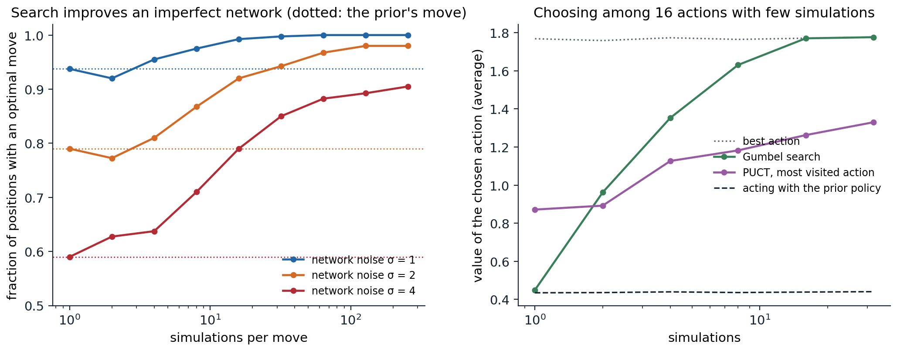

[Background Notes](../README.md) › [Reinforcement Learning](README.md)

# 24. Planning with Learned Models

[← 23. Model-Based RL and World Models](23-model-based-rl-and-world-models.md) · [25. Imitation Learning and Inverse RL →](25-imitation-learning-and-inverse-rl.md)

## <a id="search-as-policy-improvement"></a>Search as policy improvement

### <a id="planning-at-decision-time-with-learned-guidance"></a>Planning at decision time with learned guidance

The model-based agents of chapter 23 use their models mainly to generate experience or to plan a short trajectory of continuous actions. This chapter follows the other great line of model-based RL: **tree search** at decision time, guided by networks that the search itself trains. Chapter 10 introduced Monte Carlo tree search (MCTS) and AI chapter 4 its use in games. Here the focus is on why search and learning reinforce each other, and on the algorithms that turned the idea into superhuman play in Go, chess, and Atari, and then into discoveries in mathematics and computer science.

The key observation is that search is a **policy improvement operator**. Given a policy network $`p(a\mid s)`$ and a value network $`v(s)`$, a search that looks ahead from $`s`$, using $`p`$ to decide which actions to examine and $`v`$ to evaluate the positions it reaches, chooses better actions than $`p`$ alone, because it corrects the network's mistakes with lookahead. Training $`p`$ to imitate the search's choices, and $`v`$ to predict the outcomes of games played with search, then improves the networks, which makes the next search better. This is policy iteration (chapter 2) with search as the improvement step and the networks as a compact, generalizing memory of its results. [Anthony, Tian, and Barber (2017)](https://arxiv.org/abs/1705.08439) named it **expert iteration**: the search is an expert, the network an apprentice that imitates it, and the apprentice in turn makes the expert stronger. The next code measures the improvement directly: in tic-tac-toe, whose exact values are known, it gives a search networks with controlled amounts of error and counts how often the search picks an optimal move.

```python
import functools
import math

import numpy as np

# Search as policy improvement. In tic-tac-toe, whose exact values are known, give AlphaZero's search an imperfect
# "network": a prior over moves, softmax(2 q* + noise), and a value v* + noise, where q* and v* are the exact action
# and state values of the player to move and the noise (standard deviation sigma, fixed per position) models the
# network's errors. On 400 positions where some legal move is a mistake, count how often each method picks an
# optimal move: the prior's most likely move, a one-step lookahead with the value, and PUCT search with 8 to 256
# simulations (c_puct = 1.5, exact outcomes at terminal positions).
LINES = [(0, 1, 2), (3, 4, 5), (6, 7, 8), (0, 3, 6), (1, 4, 7), (2, 5, 8), (0, 4, 8), (2, 4, 6)]


def winner(b):
    for i, j, k in LINES:
        if b[i] != 0 and b[i] == b[j] == b[k]:
            return b[i]
    return 0


def to_move(b):
    return 1 if b.count(1) == b.count(-1) else -1


def moves(b):
    return [i for i in range(9) if b[i] == 0]


def play(b, m):
    c = list(b); c[m] = to_move(b); return tuple(c)


@functools.lru_cache(maxsize=None)
def value(b):
    """Exact value for the player to move: +1 win, 0 draw, -1 loss."""
    w = winner(b)
    if w != 0:
        return -1.0                                   # the previous player just won
    if not moves(b):
        return 0.0
    return max(-value(play(b, m)) for m in moves(b))


def network(b, sigma, rng_seed):
    rng = np.random.default_rng(abs(hash((b, rng_seed))) % 2 ** 32)
    ms = moves(b)
    q = np.array([-value(play(b, m)) for m in ms])
    logits = 2 * q + sigma * rng.normal(size=len(ms))
    prior = np.exp(logits - logits.max()); prior /= prior.sum()
    v = float(np.clip(value(b) + sigma * rng.normal(), -1, 1))
    return dict(zip(ms, prior)), v


def mcts(root, n_sim, sigma, seed, c_puct=1.5):
    N, W, P = {}, {}, {}

    def expand(b):
        P[b], v = network(b, sigma, seed); N[b] = {m: 0 for m in P[b]}; W[b] = {m: 0.0 for m in P[b]}
        return v

    expand(root)
    for _ in range(n_sim):
        b, path = root, []
        while True:
            total = sum(N[b].values())
            m = max(N[b], key=lambda a: (W[b][a] / N[b][a] if N[b][a] else 0.0) + c_puct * P[b][a] * math.sqrt(total + 1) / (1 + N[b][a]))
            path.append((b, m)); b = play(b, m)
            if winner(b) != 0 or not moves(b):
                v = 1.0 if winner(b) != 0 else 0.0           # exact outcome for the player who just moved
                break
            if b not in N:
                v = -expand(b)                                # the new node's value, for the player who moved into it
                break
        for pb, pm in reversed(path):                         # back up, alternating perspectives
            N[pb][pm] += 1; W[pb][pm] += v; v = -v
    return max(N[root], key=N[root].get)


def all_positions():
    seen, stack = set(), [tuple([0] * 9)]
    while stack:
        b = stack.pop()
        if b in seen or winner(b) != 0 or not moves(b):
            continue
        seen.add(b); stack.extend(play(b, m) for m in moves(b))
    return [b for b in seen if len({-value(play(b, m)) for m in moves(b)}) > 1]


rng = np.random.default_rng(0)
positions = all_positions()
test = [positions[i] for i in rng.choice(len(positions), 400, replace=False)]
print(f"{len(positions)} positions where some move is a mistake; testing on 400")
print("   noise   prior's move   value lookahead   search:   8 sims   32 sims   128 sims   256 sims")
for sigma in (1.0, 2.0, 4.0):
    optimal = lambda b, m: -value(play(b, m)) == value(b)
    acc_prior = np.mean([optimal(b, max(network(b, sigma, 0)[0].items(), key=lambda kv: kv[1])[0]) for b in test])
    look = lambda b: max(moves(b), key=lambda m: 1.0 if winner(play(b, m)) else (0.0 if not moves(play(b, m)) else -network(play(b, m), sigma, 0)[1]))
    acc_look = np.mean([optimal(b, look(b)) for b in test])
    accs = [np.mean([optimal(b, mcts(b, n, sigma, 0)) for b in test]) for n in (8, 32, 128, 256)]
    print(f"   {sigma:5.1f}   {acc_prior:12.2f}   {acc_look:15.2f}   {'':7s}" + "".join(f"{a:9.2f}" for a in accs))
# 3191 positions where some move is a mistake; testing on 400
#    noise   prior's move   value lookahead   search:   8 sims   32 sims   128 sims   256 sims
#      1.0           0.94              0.81               0.97     1.00     1.00     1.00
#      2.0           0.79              0.65               0.87     0.94     0.98     0.98
#      4.0           0.59              0.55               0.71     0.85     0.89     0.91
```

With moderately noisy networks, the prior's most likely move is optimal in 79% of the test positions, and a one-step lookahead with the noisy value is worse still, at 65%, though in this construction the prior's logits carry twice the signal of the value for the same noise. A search of 32 simulations raises the accuracy to 94%, and 128 to 98%. The search combines the two networks and the game's exact rules, and it helps even when the networks are very noisy. It is not a free improvement, though: with 2 simulations and the two lower noise levels, the search picked optimal moves less often than the prior did (left panel of the figure: 0.92 against 0.94 for σ = 1, 0.77 against 0.79 for σ = 2). Too little search replaces the prior's judgment by noisy value estimates of one or two moves, a failure that the Gumbel search at the end of this chapter was designed to avoid.

## <a id="from-alphago-to-alphazero"></a>From AlphaGo to AlphaZero

### <a id="alphago"></a>AlphaGo

**AlphaGo** ([Silver et al., 2016](https://doi.org/10.1038/nature16961)) was the first program to defeat a professional Go player on a full board, beating the European champion Fan Hui 5–0 in 2015 and the world-class player Lee Sedol 4–1 in 2016. It combined neural networks with MCTS. A **policy network** was trained by supervised learning to predict the moves of strong human players, reaching 57% accuracy; it was then improved by self-play with a policy gradient (REINFORCE, chapter 13). A **value network** was trained by regression on the outcomes of 30 million positions, each from a different game of the improved policy playing itself, to avoid the correlations of consecutive positions. A fast **rollout policy**, a linear softmax over small pattern features, played games to the end. The search selected moves by an upper-confidence rule with the supervised policy as a prior, and evaluated each new leaf by an equal mixture of the value network and the outcome of a fast rollout.

### <a id="alphago-zero-and-alphazero"></a>AlphaGo Zero and AlphaZero

**AlphaGo Zero** ([Silver et al., 2017](https://doi.org/10.1038/nature24270)) removed the human data and the rollouts. One residual network with a policy head and a value head, $`(\mathbf p,v)=f_{\boldsymbol\theta}(s)`$, is trained entirely by self-play: every move of every game is chosen by an MCTS of 1,600 simulations guided by the current best network, and the network is trained to predict the search's **visit distribution** $`\boldsymbol\pi`$ and the game's final **outcome** $`z\in\{-1,1\}`$ ($`\{-1,0,1\}`$ in AlphaZero, where draws occur) with the loss

```math
\ell(\boldsymbol\theta)=(z-v)^2-\boldsymbol\pi^\top\ln\mathbf p+c\|\boldsymbol\theta\|^2.
```

Starting from random play, it surpassed the version that beat Lee Sedol after three days of self-play, winning 100–0, and a larger network trained for 40 days surpassed every previous version, beating AlphaGo Master 89–11. **AlphaZero** ([Silver et al., 2018](https://doi.org/10.1126/science.aar6404)) applied the same algorithm, with the same settings, to chess, shogi, and Go, and within hours of self-play for chess and shogi defeated the strongest programs of the time, Stockfish and Elmo, which embodied decades of human engineering. Its search is the one of the tic-tac-toe code. Each simulation descends the tree by the **PUCT** rule,

```math
a=\arg\max_a\Bigl(Q(s,a)+c_{\text{puct}}\,P(s,a)\,\frac{\sqrt{\sum_bN(s,b)}}{1+N(s,a)}\Bigr),
```

a variant of the UCB rule of chapter 3 in which the network's prior $`P(s,a)`$ decides which moves deserve exploration (AlphaZero let $`c_{\text{puct}}`$ grow slowly with the number of visits, as MuZero does in [appendix B](#block-rl24-appendix-b)). When it reaches a new position, it evaluates it with the network rather than with a rollout, and backs up the value along the path, with alternating signs for the two players. After 800 simulations, the move is chosen in proportion to the visit counts, with a temperature that makes play varied in the opening moves and nearly greedy afterward. Exploration at the root comes from **Dirichlet noise** added to the prior, $`P=(1-\epsilon)\mathbf p+\epsilon\boldsymbol\eta`$ with $`\boldsymbol\eta\sim\operatorname{Dir}(\alpha)`$, $`\epsilon=0.25`$, and $`\alpha`$ smaller for games with more legal moves (0.3 for chess, 0.03 for Go), so that the search sometimes examines moves the network considers unlikely (exercise 24.2).

Why train the policy on visit counts rather than on the search's best move? The visit distribution is a smoothed version of the search's preferences: moves the search found nearly as good as the best still receive probability, so the network learns a policy that keeps them in consideration, and its cross-entropy loss provides a rich target at every position (exercise 24.3). And why train the value on the final outcome rather than on the search's value? The outcome is unbiased, while the search's value is only as good as the current network, though MuZero and its successors do use bootstrapped targets where games are long.

## <a id="muzero"></a>MuZero

### <a id="planning-with-a-learned-model"></a>Planning with a learned model

AlphaZero needs the rules of the game to simulate moves inside its search. **MuZero** ([Schrittwieser et al., 2020](https://www.nature.com/articles/s41586-020-03051-4)) learns a model instead, and it learns only what the search needs: the value-equivalent model of chapter 23. It has three functions. A **representation** $`h`$ encodes the past observations into a hidden state $`s^0`$; a **dynamics** function $`g`$ maps a hidden state and an action to the next hidden state and a predicted reward, $`(r^k,s^k)=g(s^{k-1},a^k)`$; and a **prediction** function $`f`$ outputs a policy and a value for each hidden state, $`(\mathbf p^k,v^k)=f(s^k)`$. The search runs entirely on hidden states, as AlphaZero's does on game positions. Training unrolls the model for $`K=5`$ steps along the actions actually taken, and at every step $`k`$ matches the predicted policy to the search's visit distribution, the predicted value to a target $`z`$ (the game outcome in board games, an $`n`$-step bootstrapped return in Atari), and the predicted reward to the observed one:

```math
\ell=\sum_{k=0}^{K}\Bigl(\ell^p(\boldsymbol\pi_{t+k},\mathbf p^k)+\ell^v(z_{t+k},v^k)+\ell^r(u_{t+k},r^k)\Bigr)+c\|\boldsymbol\theta\|^2.
```

Nothing requires the hidden states to reconstruct the observations or to resemble the game's states; they only need to support accurate predictions of the quantities the search uses. MuZero matched AlphaZero in chess and shogi and exceeded it slightly in Go, without being told the rules, and set a new state of the art on the 57 Atari games. A variant, **MuZero Reanalyze**, periodically reruns the search on old trajectories with the latest network to produce fresher targets, which makes it far more data-efficient.

### <a id="extensions"></a>Extensions

Several extensions carry MuZero to settings it could not handle. **MuZero Unplugged** ([Schrittwieser et al., 2021](https://arxiv.org/abs/2104.06294)) trains from fixed data sets by reanalysis alone, making the same algorithm an offline RL method (chapter 26). **Sampled MuZero** ([Hubert et al., 2021](https://arxiv.org/abs/2104.06303)) handles action spaces too large to enumerate, including continuous ones, by searching over a sample of actions drawn from the policy and correcting the search's improved policy for the sampling. **Stochastic MuZero** ([Antonoglou et al., 2022](https://openreview.net/forum?id=X6D9bAHhBQ1)) handles chance events, such as the dice of backgammon, by learning **afterstates**, the state after the agent's action and before the environment's random response, and a discrete code for the environment's response. **EfficientZero** ([Ye, Liu, Kurutach, Abbeel, and Gao, 2021](https://arxiv.org/abs/2111.00210)) made MuZero data-efficient with three changes: a self-supervised consistency loss between predicted hidden states and the encodings of the observations reached, as in SPR (chapter 18); a **value prefix**, predicting the sum of the rewards over the unroll with a recurrent network rather than each reward, which is easier when their exact timing is uncertain; and off-policy corrections of the value targets for old data. It exceeded human performance on Atari 100k by both the mean and the median human-normalized score, with two hours of experience per game. **EfficientZero V2** ([Wang et al., 2024](https://arxiv.org/abs/2403.00564)) extended it to continuous control and outperformed DreamerV3 across most of a broad set of tasks with limited data (50 of 66).

## <a id="mcts-as-regularized-policy-optimization"></a>MCTS as regularized policy optimization

### <a id="what-the-visit-counts-approximate"></a>What the visit counts approximate

Why does training on visit counts improve the policy, and what happens with few simulations? [Grill et al. (2020)](https://arxiv.org/abs/2007.12509) showed that the visit distribution of PUCT approximately solves a regularized policy optimization problem at the root,

```math
\bar{\boldsymbol\pi}=\arg\max_{\mathbf y}\Bigl\{\mathbf q^\top\mathbf y-\lambda_N\,D_{\mathrm{KL}}(\mathbf p\,\|\,\mathbf y)\Bigr\},\qquad\lambda_N=c_{\text{puct}}\frac{\sqrt{\sum_bN_b}}{|\mathcal A|+\sum_bN_b},
```

where $`\mathbf q`$ are the search's action values: the improvement of the prior toward higher values with a KL regularizer whose weight decreases as the search progresses. This is the regularized, mirror-descent form of policy improvement of chapter 20, with the KL divergence in the other direction (exercise 24.5). The approximation is poor when the number of simulations is small compared with the number of actions, since visit counts are integers and most actions receive none; Grill et al. showed that computing $`\bar{\boldsymbol\pi}`$ exactly and using it for acting and training improves MuZero with few simulations.

### <a id="gumbel-search"></a>Gumbel search

**Gumbel MuZero** ([Danihelka, Guez, Schrittwieser, and Silver, 2022](https://openreview.net/forum?id=bERaNdoegnO)) redesigned the search, chiefly at the root, so that it improves the policy even with very few simulations. It samples $`n`$ distinct actions without replacement from the prior with the **Gumbel-top-k trick**: add independent Gumbel noise $`g(a)`$ to the logits and take the $`n`$ largest, which samples from the policy without replacement (exercise 24.6). It divides the simulations among them by **sequential halving**, repeatedly discarding the worse half by $`g(a)+\text{logits}(a)+\sigma(\hat q(a))`$, where $`\sigma`$ is an increasing transformation of the estimated values, and acts with the survivor. Because the Gumbel-max trick makes $`\arg\max_a(g(a)+\text{logits}(a))`$ a sample from the prior, adding $`\sigma(\hat q)`$ can only move the choice toward better actions: the expected value of the chosen action is at least that of the prior policy, a guarantee PUCT lacks. Its training target is the improved policy $`\operatorname{softmax}(\text{logits}+\sigma(\text{completed }\hat q))`$, where unvisited actions receive an estimate of the state's value. The next code compares the two in the one-step setting, where each simulation reveals an action's value exactly.

```python
import math

import numpy as np

# Policy improvement with very few simulations, in the one-step setting where a simulation of an action reveals
# its value q(a) exactly. 16 actions with values q ~ N(0, 1); the prior policy is softmax(logits), with logits
# correlated 0.5 with q. With a budget of n simulations:
#   PUCT (AlphaZero): each simulation visits argmax_a Q(a) + c P(a) sqrt(sum N) / (1 + N(a)), c = 1.25, with
#     unvisited actions valued at 0; it acts with the most visited action, and its training target is the
#     distribution of visit counts;
#   Gumbel (Gumbel MuZero): it samples min(n, 16) distinct actions with the Gumbel-top-k trick on the logits,
#     simulates each, and acts with argmax g(a) + logits(a) + sigma(q(a)) among them, sigma(q) = 50 q; its training
#     target is softmax(logits + 5 q_completed), where unvisited actions get the prior-weighted mean of the
#     visited values.
# Averages over 20,000 problems: the value of the chosen action and the expected value under the training target,
# against the prior policy's expected value and the best action's value.
rng = np.random.default_rng(0)
K, trials = 16, 20000


def puct(q, prior, n, c=1.25):
    N, W = np.zeros(K), np.zeros(K)
    for t in range(n):
        Q = np.where(N > 0, W / np.maximum(N, 1), 0.0)
        a = int(np.argmax(Q + c * prior * math.sqrt(N.sum() + 1) / (1 + N)))
        N[a] += 1; W[a] += q[a]
    return int(np.argmax(N + 1e-6 * prior)), N / N.sum()


def gumbel(q, logits, prior, n):
    g = rng.gumbel(size=K)
    visited = np.argsort(-(g + logits))[:min(n, K)]               # top-n without replacement
    act = visited[np.argmax(g[visited] + logits[visited] + 50 * q[visited])]
    v_mix = prior[visited] @ q[visited] / prior[visited].sum()
    completed = np.full(K, v_mix); completed[visited] = q[visited]
    target = np.exp(logits + 5 * completed - (logits + 5 * completed).max()); target /= target.sum()
    return int(act), target


print("                 prior's      PUCT (AlphaZero)        Gumbel          best")
print("   simulations   expected   chosen    target    chosen    target    action")
for n in (1, 2, 4, 8, 16, 32):
    res = np.zeros((trials, 6))
    for i in range(trials):
        q = rng.normal(size=K)
        logits = 0.5 * q + np.sqrt(0.75) * rng.normal(size=K)
        prior = np.exp(logits - logits.max()); prior /= prior.sum()
        a_p, t_p = puct(q, prior, n); a_g, t_g = gumbel(q, logits, prior, n)
        res[i] = prior @ q, q[a_p], t_p @ q, q[a_g], t_g @ q, q.max()
    print(f"   {n:11d}" + "".join(f"{x:10.3f}" for x in res.mean(0)))

# A prior that is confidently wrong: 90% on the only bad action (q = -1), the rest spread over 15 good ones (q = 1).
q = np.array([-1.0] + [1.0] * 15)
prior = np.array([0.9] + [0.1 / 15] * 15); logits = np.log(prior)
print("\n   confidently wrong prior (expected value -0.80)")
print("   simulations   PUCT chosen   PUCT target   Gumbel chosen   Gumbel target")
for n in (1, 2, 4, 8, 16):
    a_p, t_p = puct(q, prior, n)
    gum = [gumbel(q, logits, prior, n) for _ in range(2000)]
    print(f"   {n:11d}   {q[a_p]:11.2f}   {t_p @ q:11.2f}   {np.mean([q[a] for a, _ in gum]):13.2f}   {np.mean([t @ q for _, t in gum]):13.2f}")
#                  prior's      PUCT (AlphaZero)        Gumbel          best
#    simulations   expected   chosen    target    chosen    target    action
#              1     0.437     0.894     0.894     0.435     0.437     1.768
#              2     0.436     0.889     0.978     0.962     0.764     1.770
#              4     0.427     1.111     1.056     1.353     1.211     1.762
#              8     0.432     1.186     1.137     1.628     1.545     1.762
#             16     0.438     1.260     1.218     1.775     1.700     1.776
#             32     0.432     1.332     1.287     1.766     1.691     1.767
#
#    confidently wrong prior (expected value -0.80)
#    simulations   PUCT chosen   PUCT target   Gumbel chosen   Gumbel target
#              1         -1.00         -1.00           -0.78           -0.80
#              2         -1.00          0.00            1.00            0.98
#              4          1.00          0.50            1.00            1.00
#              8          1.00          0.75            1.00            1.00
#             16          1.00          0.75            1.00            1.00
```

On average over random problems, both searches improve on acting with the prior policy, but in different ways. With one simulation, PUCT acts with the prior's most likely action, which here is a good heuristic, while Gumbel samples from the prior, its guaranteed minimum. With more simulations, Gumbel improves quickly and reaches the best action with 16 simulations, one per action, while PUCT, which keeps returning to the actions it has found good, has not reached it with 32. The second table shows why the guarantee matters. When the prior is confidently wrong, PUCT with 2 simulations visits the favored bad action and one good one, ties, and acts with the bad action, and even with 16 simulations its visit-count target keeps an eighth of its probability on it, since the prior keeps drawing visits there; Gumbel acts well from 2 simulations on, and its target has nearly all its probability on good actions. Gumbel MuZero kept learning with as few as 2 simulations per move in 9×9 Go and Atari, where MuZero failed to learn, and with the same budget of 400 simulations it matched MuZero in 19×19 Go and AlphaZero in chess, and its search, like AlphaZero's and MuZero's, is available in DeepMind's [mctx](https://github.com/google-deepmind/mctx) library.



*Left: the fraction of 400 tic-tac-toe positions in which PUCT search, guided by a prior and a value with noise of standard deviation σ, picks an optimal move, as the number of simulations per move grows; the dotted lines show the prior's most likely move. With two simulations and σ = 1 or 2, the search does worse than the prior. Right: the average value of the action chosen among 16 by PUCT and by Gumbel search, with the values of acting with the prior policy and of the best action, in one-step problems like those of the code on Gumbel search (a separate run with fewer problems).*

## <a id="search-beyond-games"></a>Search beyond games

The AlphaZero recipe applies wherever a problem can be cast as a game with a simulator and a score. **AlphaTensor** ([Fawzi et al., 2022](https://www.nature.com/articles/s41586-022-05172-4)) cast the discovery of matrix multiplication algorithms as a single-player game, TensorGame, in which each move subtracts a rank-one tensor from the tensor that represents matrix multiplication, and the fewer moves needed to reach zero, the fewer multiplications the algorithm uses. It found algorithms better than the best known for several matrix sizes, including 47 multiplications for $`4\times4`$ matrices in arithmetic modulo 2, improving on the 49 of Strassen's algorithm applied recursively, which had stood for fifty years. **AlphaDev** ([Mankowitz et al., 2023](https://www.nature.com/articles/s41586-023-06004-9)) played a game of writing assembly instructions, rewarded for correct and fast programs, and discovered sorting routines for short sequences faster than the human-written ones, which were integrated into the standard C++ library of LLVM. **AlphaProof** ([Hubert et al., 2025](https://www.nature.com/articles/s41586-025-09833-y)) searched for proofs in the Lean proof assistant, learning from millions of formalized problems and adapting to each new problem by reinforcement learning on generated variants at test time; with AlphaGeometry 2, it achieved a silver-medal standard at the 2024 International Mathematical Olympiad. Search over the outputs of language models, and the reinforcement learning that trains them to reason, are the subject of chapter 28; search in imperfect-information games, which requires reasoning about what the opponent knows, is part of chapter 27.

Lab 13 implements AlphaZero on small board games, trains it by self-play, and compares PUCT and Gumbel search at small simulation budgets.

## <a id="exercises"></a>Exercises

### <a id="exercise-24-1-puct-and-ucb"></a>Exercise 24.1 — PUCT and UCB

Compare PUCT's exploration term $`c\,P(s,a)\sqrt{\sum_bN(s,b)}/(1+N(s,a))`$ with UCB1's $`c\sqrt{\ln\sum_bN(s,b)/N(s,a)}`$. (a) How does each treat an action never visited? (b) How fast does each bonus shrink with the action's own visits and grow with the total? (c) What role does the prior play, and what happens if it assigns an optimal move probability $`10^{-4}`$?


<details>
<summary><b>Solution</b></summary>


(a) UCB1 must try every action once, since its bonus is infinite at $`N=0`$. PUCT's bonus at $`N=0`$ is finite, $`cP\sqrt{\sum N}`$, so an action with a small prior may never be visited in a search of a few hundred simulations: the prior prunes the tree, which is what makes search in Go's 361 moves affordable.

(b) UCB1's bonus shrinks like $`1/\sqrt N`$ in the action's visits and grows like $`\sqrt{\ln\sum N}`$; PUCT's shrinks like $`1/N`$ and grows like $`\sqrt{\sum N}`$. PUCT therefore explores less within an action and more as the total grows, and its visits concentrate on actions in proportion to the prior and the values, rather than logarithmically, which is what makes the visit counts a useful policy target.

(c) The prior scales the bonus: an action is visited when $`cP\sqrt{\sum N}`$ exceeds the value gap to the best action. With $`P=10^{-4}`$ and $`c\approx1`$, that needs $`\sqrt{\sum N}\gtrsim10^4`$ times the gap, 100 million simulations for a gap of 1: the search effectively never considers the move. This is why AlphaZero adds Dirichlet noise to the prior at the root during self-play, and why a network that has learned to rule out good moves can stay blind to them.

</details>


### <a id="exercise-24-2-dirichlet-noise"></a>Exercise 24.2 — Dirichlet noise

AlphaZero mixes the root prior with $`\boldsymbol\eta\sim\operatorname{Dir}(\alpha,\dots,\alpha)`$ over the $`L`$ legal moves, with weight 0.25, and chooses $`\alpha`$ in inverse proportion to the typical number of legal moves, roughly $`10/L`$ (0.3 for chess, 0.15 for shogi, 0.03 for Go). (a) What is the expected noise mass on each move, and what does a small $`\alpha`$ do to the distribution of that mass? (b) Why scale $`\alpha`$ with $`1/L`$?


<details>
<summary><b>Solution</b></summary>


(a) The mean of each component is $`1/L`$, whatever $`\alpha`$, so the noise adds $`0.25/L`$ in expectation to every move. With $`\alpha<1`$ the samples are sparse: most components are near zero and a few carry most of the mass. The noise therefore gives a large boost to a few random moves in each search, rather than a small boost to all, which is what lets the search examine a move the network has ruled out.

(b) With $`\alpha L\approx10`$, the number of moves that receive a substantial share of the noise is roughly constant, about ten, across games: a Dirichlet with total concentration $`\alpha L`$ puts most of its mass on about that many components. The number of moves that the noise forces the search to consider then does not grow with the size of the game.

</details>


### <a id="exercise-24-3-training-on-visit-counts"></a>Exercise 24.3 — Training on visit counts

(a) Why is the cross-entropy against the visit distribution a better policy target than the search's most visited move? (b) What would be lost by training the value on the search's root value instead of the game's outcome?


<details>
<summary><b>Solution</b></summary>


(a) A one-hot target tells the network only which move won; the visit distribution also says which moves were close, so the network learns to keep them in consideration, and its gradient carries information about every examined move at every position. By the analysis of Grill et al., the visit distribution approximates a KL-regularized improvement of the prior, so training on it moves the network a controlled step toward the improved policy, a trust region in the sense of chapter 20. A one-hot target is the unregularized greedy step, which is noisy when the search is short.

(b) The root value is a bootstrapped estimate: it inherits the network's errors, and training on it can reinforce them, the deadly-triad risk of bootstrapping (chapter 12). The outcome is an unbiased Monte Carlo target that anchors the values to reality. It has high variance in long games, which is why MuZero uses $`n`$-step bootstrapped targets in Atari, where episodes last thousands of steps, and outcomes in board games.

</details>


### <a id="exercise-24-4-two-player-backups"></a>Exercise 24.4 — Two-player backups

In the tic-tac-toe code, the search backs up a value $`v`$ along the path and flips its sign at every level. (a) Why? (b) What would happen if the flip were forgotten? (c) How must the backup change in a single-agent problem with rewards and discounting, as in MuZero's Atari games?


<details>
<summary><b>Solution</b></summary>


(a) The statistics $`W(s,a)`$ and $`Q(s,a)`$ at each node are from the point of view of the player who chooses at that node. A leaf's value for the player who moved into it is the negative of its value for the player to move there, and the value alternates at each level; this is the negamax form of minimax (AI chapter 4).

(b) Every node would prefer the moves that are good for the opponent at every other level: the search would help the opponent on alternate moves. Its choices would be nearly random or worse, and the policy trained on them would degrade. It is one of the most common bugs in game-playing search, and one that the accuracy test of the code would reveal immediately.

(c) With one agent, there is no sign flip; instead the value backed up to the parent is $`r+\gamma v`$, the reward of the transition plus the discounted value of the child. Because rewards in Atari have arbitrary scales, MuZero also normalizes the Q-values in the PUCT rule by the minimum and maximum values seen in the tree, so that the same $`c_{\text{puct}}`$ works in every game.

</details>


### <a id="exercise-24-5-mcts-as-regularized-policy-optimization"></a>Exercise 24.5 — MCTS as regularized policy optimization

(a) Show that the maximizer of $`\mathbf q^\top\mathbf y-\lambda D_{\mathrm{KL}}(\mathbf p\,\|\,\mathbf y)`$ over distributions $`\mathbf y`$ is $`y(a)=\lambda p(a)/(\alpha-q(a))`$, with $`\alpha>\max_aq(a)`$ chosen so that $`\mathbf y`$ sums to 1. (b) Compare it with the maximizer of $`\mathbf q^\top\mathbf y-\lambda D_{\mathrm{KL}}(\mathbf y\,\|\,\mathbf p)`$, the mirror descent step of chapter 20. How do the two treat an action with a small prior and a large value?


<details>
<summary><b>Solution</b></summary>


(a) $`D_{\mathrm{KL}}(\mathbf p\,\|\,\mathbf y)=\sum_ap(a)\ln(p(a)/y(a))`$. With a multiplier $`\alpha`$ for the constraint, stationarity gives $`q(a)+\lambda p(a)/y(a)-\alpha=0`$, so $`y(a)=\lambda p(a)/(\alpha-q(a))`$, positive when $`\alpha>q(a)`$. The sum decreases from infinity to 0 as $`\alpha`$ increases from $`\max_aq`$, so exactly one $`\alpha`$ normalizes it; it can be found by bisection.

(b) Mirror descent gives $`y(a)\propto p(a)e^{q(a)/\lambda}`$. Both multiply the prior by an increasing function of the value. The exponential factor can overcome any prior: with a large value and a small $`\lambda`$, even a tiny prior probability becomes large. The factor $`1/(\alpha-q(a))`$ is bounded by $`1/(\alpha-\max q)`$ and diverges only for the best action as $`\lambda\to0`$, when $`\alpha`$ approaches $`\max q`$: the reverse KL is **mass-covering**, never letting $`\mathbf y`$ put too little probability where $`\mathbf p`$ has it, so it changes the prior more conservatively where values are close. In both, the weight $`\lambda`$ plays the role of an inverse step size; in MCTS it decreases like $`1/\sqrt{\sum N}`$, so more search means a larger step away from the prior.

</details>


### <a id="exercise-24-6-sampling-with-gumbel-noise"></a>Exercise 24.6 — Sampling with Gumbel noise

(a) Show that if $`g(a)`$ are independent standard Gumbel variables, then $`\arg\max_a(g(a)+\ell(a))`$ is distributed as $`\operatorname{softmax}(\boldsymbol\ell)`$. (b) Why does the set of the $`n`$ largest values of $`g(a)+\ell(a)`$ form a sample of $`n`$ actions without replacement from the same distribution? (c) Use (a) to prove that $`\mathbb E[q(A)]\ge\sum_a\operatorname{softmax}(\boldsymbol\ell)_aq(a)`$ for $`A=\arg\max_{a\in S}(g(a)+\ell(a)+\sigma(q(a)))`$, where $`S`$ is the set of the $`n`$ sampled actions and $`\sigma`$ is increasing, when the values are known exactly.


<details>
<summary><b>Solution</b></summary>


(a) Adding $`\ell(a)`$ to a standard Gumbel variable gives a Gumbel variable with location $`\ell(a)`$, whose CDF is $`\exp(-e^{-(x-\ell(a))})`$. The probability that $`a`$ attains the maximum is $`\int f_a(x)\prod_{b\ne a}F_b(x)\,dx`$, which evaluates to $`e^{\ell(a)}/\sum_be^{\ell(b)}`$: the Gumbel-max trick.

(b) Transform: $`E(a)=e^{-(g(a)+\ell(a))}`$ is exponentially distributed with rate $`e^{\ell(a)}`$, and the largest perturbed values are the smallest $`E(a)`$, the first arrivals in a race of independent exponential clocks. The first clock to ring is $`a`$ with probability $`e^{\ell(a)}/\sum_be^{\ell(b)}`$, and by the memorylessness of exponential distributions, the remaining clocks then restart as fresh independent exponentials with the same rates, so the second to ring is a softmax sample from the remaining actions, and so on. The top $`n`$, in order, are therefore a sample of $`n`$ actions without replacement ([Kool, van Hoof, and Welling, 2019](https://arxiv.org/abs/1903.06059)).

(c) Let $`A_0=\arg\max_a(g(a)+\ell(a))`$, which is in $`S`$ and is distributed as the prior by (a). Among the actions of $`S`$, $`A`$ maximizes $`g+\ell+\sigma(q)`$ and $`A_0`$ maximizes $`g+\ell`$, so $`g(A)+\ell(A)+\sigma(q(A))\ge g(A_0)+\ell(A_0)+\sigma(q(A_0))`$ and $`g(A)+\ell(A)\le g(A_0)+\ell(A_0)`$. Together these give $`\sigma(q(A))\ge\sigma(q(A_0))`$, so $`q(A)\ge q(A_0)`$ for every draw of the noise, and taking expectations, $`\mathbb E[q(A)]\ge\mathbb E[q(A_0)]=\sum_a\operatorname{softmax}(\boldsymbol\ell)_aq(a)`$. With estimated rather than exact values, the guarantee holds for the estimates, which is why Gumbel MuZero also uses sequential halving to spend its simulations on the most promising sampled actions.

</details>


### <a id="exercise-24-7-what-muzero-s-hidden-state-must-encode"></a>Exercise 24.7 — What MuZero's hidden state must encode

MuZero's model is trained only to predict policies, values, and rewards over $`K`$ steps. (a) Give an example of information about the environment that its hidden state need not represent. (b) What does this imply for reusing the model for a new task in the same environment? (c) Why unroll for $`K`$ steps rather than predicting only from the encoded current state?


<details>
<summary><b>Solution</b></summary>


(a) Anything that does not affect the rewards, the search's action values, or the policy within the unroll: the colors of the background in an Atari game, the exact position of a harmless sprite, or in Go, which of two equivalent move orders led to the position. The hidden state may merge states that differ only in such details.

(b) A model that is value-equivalent for one reward need not be for another: if the new task rewards something the old one ignored, say visiting a particular corner, the hidden state may not encode where the agent is relative to it. MuZero's models are specialized to their task, unlike reconstruction-based world models; this is the price of spending no capacity on irrelevant detail.

(c) The search uses the dynamics function repeatedly, so the hidden states it produces after one, two, or more imagined actions must also support accurate predictions. Training only on encoded states would never check the dynamics' outputs; unrolling trains them on the states the search will actually use, the multi-step losses of exercise 23.6.

</details>


### <a id="exercise-24-8-measuring-progress-in-self-play"></a>Exercise 24.8 — Measuring progress in self-play

Self-play progress is measured by **Elo ratings**: a player rated $`R_A`$ is expected to score $`1/(1+10^{(R_B-R_A)/400})`$ against one rated $`R_B`$. (a) What score does a 200-point difference predict? (b) Why is winning against the previous version of oneself not enough to establish progress? (c) How did AlphaGo Zero evaluate new networks, and how did AlphaZero change this?


<details>
<summary><b>Solution</b></summary>


(a) $`1/(1+10^{-0.5})\approx0.76`$: the stronger player scores about 76%.

(b) Strength in games need not be transitive: a new version can beat its predecessor by exploiting a specific weakness while losing to older versions or to other styles of play, and self-play can cycle through such strategies without improving. Measuring against a fixed pool of opponents, or against many past versions, detects this; multi-agent training with populations and leagues (chapter 27) addresses it directly.

(c) AlphaGo Zero pitted each new network against the current best in 400 games and replaced the best, which generated the self-play data, only if the new network won more than 55%. AlphaZero dropped this gating: it kept a single network, updated continually, and generated self-play games with the latest parameters, which is simpler.

</details>


## <a id="appendices"></a>Appendices


<details>
<summary><a id="block-rl24-appendix-a"></a><b>A. The AlphaZero training loop</b></summary>


- **Self-play actors** play games with the latest network. At each move they run MCTS (800 simulations in AlphaZero, 1,600 in AlphaGo Zero), with Dirichlet noise added to the root prior, choose moves in proportion to the visit counts for the first moves (30 in AlphaGo Zero) and greedily afterward, and store each position with its visit distribution and, at the end of the game, the outcome from the point of view of the player to move.
- **The learner** samples positions uniformly from recent games (the last 500,000 games in AlphaGo Zero, a million in AlphaZero's pseudocode) and minimizes $`(z-v)^2-\boldsymbol\pi^\top\ln\mathbf p+c\|\boldsymbol\theta\|^2`$ with SGD with momentum and a decreasing step size. AlphaGo Zero also augmented the data with the eight rotations and reflections of the Go board; AlphaZero, designed for games without these symmetries, did not.
- **Scale.** AlphaZero trained for 700,000 steps with minibatches of 4,096 positions, with self-play generated by 5,000 first-generation TPUs.
- **Search details.** The network evaluates positions in batches, with a **virtual loss** that temporarily counts a node being evaluated as a loss so that parallel simulations explore different paths; unvisited children are initialized with a value (the parent's value, or a loss, depending on the implementation); and the search tree is reused for the next move, keeping the subtree below the move played.

</details>


<details>
<summary><a id="block-rl24-appendix-b"></a><b>B. MuZero in practice</b></summary>


- **Unroll and targets.** $`K=5`$ steps; value targets are game outcomes in board games and $`n`$-step returns in Atari ($`n=10`$, $`\gamma=0.997`$), bootstrapped from the root value of the search run when the data were generated; MuZero Reanalyze instead bootstraps from a target network's value, with $`n=5`$. Values and rewards in Atari are represented as categorical distributions over a transformed scale, with the invertible rescaling of R2D2 (exercise 18.6).
- **Search.** The PUCT constant grows slowly with the number of visits, $`c=c_1+\ln\bigl((\sum_bN_b+c_2+1)/c_2\bigr)`$ with $`c_1=1.25`$ and $`c_2=19{,}652`$; Q-values are normalized by the minimum and maximum seen in the tree; 800 simulations per move in board games, 50 in Atari.
- **Gradient scaling.** The gradient through the dynamics function is halved at each unroll step, and the loss of each unrolled step is scaled by $`1/K`$, so that the total gradient does not grow with the unroll length.
- **Reanalyze.** A fraction of each batch comes from old trajectories whose policy targets are recomputed by a fresh search with the latest network (MuZero Unplugged also takes the value targets from it); with a high fraction, MuZero becomes highly data-efficient and, with only reanalysis, an offline algorithm.

</details>

---

[← 23. Model-Based RL and World Models](23-model-based-rl-and-world-models.md) · [25. Imitation Learning and Inverse RL →](25-imitation-learning-and-inverse-rl.md)
