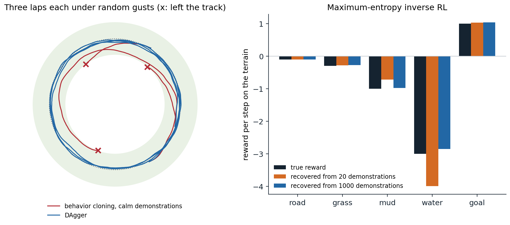

[Background Notes](../README.md) › [Reinforcement Learning](README.md)

# 25. Imitation Learning and Inverse RL

[← 24. Planning with Learned Models](24-planning-with-learned-models.md) · [26. Offline Reinforcement Learning →](26-offline-reinforcement-learning.md)

## <a id="learning-from-demonstrations"></a>Learning from demonstrations

### <a id="why-imitate"></a>Why imitate

Specifying a reward is often harder than showing what to do. Nobody writes down the reward function of good driving, of a surgeon's knot, or of a helpful answer, but people can demonstrate all three. **Imitation learning** learns a policy from demonstrations of an expert, and **inverse reinforcement learning** (IRL) learns the reward that explains them, which can then be optimized by the methods of the previous chapters. Both sidestep reward design and exploration, and both have become central to robotics, where demonstrations are collected by teleoperation, and to language models, which are first trained to imitate human text and then fine-tuned with rewards learned from human judgments ([chapter 28](28-reinforcement-learning-for-language-models-and-reasoning.md)). This chapter develops the two, from behavior cloning and its failure mode through the theory of IRL to adversarial imitation and the expressive policies that make imitation work on real robots.

### <a id="behavior-cloning"></a>Behavior cloning

The simplest approach treats demonstrations as a supervised data set of state–action pairs and fits a policy by maximum likelihood: **behavior cloning** (BC). It is how **ALVINN**, one of the first neural-network drivers, learned to steer a vehicle from camera images in the late 1980s, first from simulated road images ([Pomerleau, 1988](https://papers.nips.cc/paper_files/paper/1988/hash/812b4ba287f5ee0bc9d43bbf5bbe87fb-Abstract.html)) and then by watching a human drive ([Pomerleau, 1991](https://doi.org/10.1162/neco.1991.3.1.88)), and with enough data and expressive models it remains the backbone of robot learning today. Its difficulty is not the supervised learning but what happens afterward. A classifier's mistakes are independent: a wrong label on one image does not change the next image. A policy's mistakes are not: a small error moves the agent to a state slightly different from the expert's, where the policy, trained only on the expert's states, is less accurate, which makes the next error larger. The training data come from the expert's state distribution and the test data from the learner's, a **covariate shift** that the learner itself creates.

### <a id="compounding-errors"></a>Compounding errors

[Ross and Bagnell (2010)](https://proceedings.mlr.press/v9/ross10a.html) quantified the effect. If the cloned policy errs with probability $`\varepsilon`$ on the expert's states, and once it errs, it may never recover, its expected cost over an episode of $`T`$ steps can exceed the expert's by order $`\varepsilon T^2`$, not $`\varepsilon T`$: an error at step $`t`$ can spoil all the $`T-t`$ steps that follow (exercise 25.1). The next code shows the effect in a small driving task: a car circling a track under random gusts, imitated by a nearest-neighbor policy that is accurate near the states it has seen and uninformed elsewhere.

```python
import numpy as np

# Behavior cloning versus DAgger. A car drives around a circular track of radius 1 at constant speed; its state is
# (x, y, heading), and it chooses a steering rate in [-3, 3]. At every step a gust perturbs its heading by N(0, 0.05^2).
# The expert steers toward a point ahead on the track. The learner is a k-nearest-neighbor regressor (k = 5) on
# rotation-invariant features of the state: it imitates well near the states it has seen and has no idea elsewhere.
#   behavior cloning, calm demonstrations: expert laps recorded without gusts, so they trace the circle exactly;
#   behavior cloning, gusty demonstrations: expert laps recorded with the gusts, and the expert's corrections;
#   DAgger: an expert rollout of a third of the labels (at most one lap), then laps driven by the learner, whose
#     states the expert labels, retraining each time.
# All get the same number of expert labels. A lap is 300 steps; it fails if the car leaves |r - 1| < 0.25.
# Report the average distance from the track and the fraction of failed laps over 100 laps from random starts.
rng = np.random.default_rng(0)
dt, speed, T = 0.05, 0.5, 300


def expert(s):
    x, y, h = s[..., 0], s[..., 1], s[..., 2]
    ang = np.arctan2(y, x) + 0.4                                  # a target point ahead on the circle
    err = np.arctan2(np.sin(ang) - y, np.cos(ang) - x) - h
    return np.clip(4.0 * np.arctan2(np.sin(err), np.cos(err)), -3, 3)


def step(s, u, gusts=True):
    x, y, h = s
    return np.array([x + speed * np.cos(h) * dt, y + speed * np.sin(h) * dt,
                     h + u * dt + (0.05 * rng.normal() if gusts else 0.0)])


def start(exact=False):
    a = rng.uniform(0, 2 * np.pi)
    if exact:
        return np.array([np.cos(a), np.sin(a), a + np.pi / 2])
    r = 1 + rng.uniform(-0.1, 0.1)
    return np.array([r * np.cos(a), r * np.sin(a), a + np.pi / 2 + rng.uniform(-0.3, 0.3)])


def features(S):
    """Rotation-invariant features: radius, and the heading relative to the tangent of the track."""
    S = np.atleast_2d(S)
    r = np.hypot(S[:, 0], S[:, 1]); rel = S[:, 2] - np.arctan2(S[:, 1], S[:, 0]) - np.pi / 2
    return np.column_stack([r, np.sin(rel), np.cos(rel)])


class KNN:
    def __init__(self, X, y, k=5):
        self.X, self.y, self.k = X, y, k

    def __call__(self, s):
        d = ((self.X - features(s)) ** 2).sum(1)
        return self.y[np.argpartition(d, self.k)[:self.k]].mean()


def rollout(policy, n=T, gusts=True, exact_start=False):
    s = start(exact_start); states, dev, failed = [], [], False
    for t in range(n):
        states.append(s); s = step(s, policy(s), gusts)
        r = np.hypot(s[0], s[1]); dev.append(abs(r - 1))
        if abs(r - 1) > 0.25:
            failed = True; break
    return np.array(states), np.mean(dev), failed


def evaluate(policy, laps=100):
    res = [rollout(policy)[1:] for _ in range(laps)]
    return np.mean([r[0] for r in res]), np.mean([r[1] for r in res])


def demonstrations(labels, gusts):
    X, y = np.zeros((0, 3)), np.zeros(0)
    while len(y) < labels:
        S, _, _ = rollout(expert, n=min(T, labels - len(y)), gusts=gusts, exact_start=not gusts)
        X, y = np.concatenate([X, features(S)]), np.concatenate([y, expert(S)])
    return X, y


dev, fail = evaluate(expert)
print(f"expert: distance from the track {dev:.3f}, failed laps {fail:.0%}")
print("   expert    BC, calm demos      BC, gusty demos         DAgger")
print("   labels   distance  failed    distance  failed    distance  failed")
for labels in (300, 1000, 3000):
    bc_calm = KNN(*demonstrations(labels, gusts=False))
    bc_gusty = KNN(*demonstrations(labels, gusts=True))
    S, _, _ = rollout(expert, n=min(T, labels // 3))
    DX, Dy = features(S), expert(S)
    while len(Dy) < labels:                                        # DAgger rounds
        S, _, _ = rollout(KNN(DX, Dy), n=min(T, labels - len(Dy)))
        DX, Dy = np.concatenate([DX, features(S)]), np.concatenate([Dy, expert(S)])
    row = [evaluate(p) for p in (bc_calm, bc_gusty, KNN(DX, Dy))]
    print(f"   {labels:6,d}" + "".join(f"   {d:8.3f}  {f:6.0%}" for d, f in row))
# expert: distance from the track 0.026, failed laps 0%
#    expert    BC, calm demos      BC, gusty demos         DAgger
#    labels   distance  failed    distance  failed    distance  failed
#       300      0.103     90%      0.028      0%      0.028      0%
#     1,000      0.091     89%      0.027      0%      0.027      0%
#     3,000      0.096     94%      0.026      0%      0.026      0%
```

Cloned from demonstrations recorded in calm conditions, which trace the circle exactly, the learner fails nine laps out of ten, and more of the same data does not help: the demonstrations never show what to do off the circle, and the gusts push the car there. Demonstrations recorded in the gusts include the expert's corrections of its own disturbances, and cloning them works as well as the expert. The difference is not the amount of data but its coverage of the states the learner will visit. Two remedies follow. One injects noise into the expert's demonstrations deliberately, so that they show recoveries, as **DART** does ([Laskey, Lee, Fox, Dragan, and Goldberg, 2017](https://arxiv.org/abs/1703.09327)). The other lets the learner visit its own states and asks the expert what to do there.

### <a id="dagger-and-interactive-imitation"></a>DAgger and interactive imitation

**DAgger** (dataset aggregation) ([Ross, Gordon, and Bagnell, 2011](https://arxiv.org/abs/1011.0686)) collects data in rounds. It trains a policy on the data so far, runs it (in the first rounds, possibly mixed with the expert), asks the expert to label every state the policy visited with the action it would have taken, adds these pairs to the data set, and retrains. Because the data eventually come from the learner's own state distribution, the covariate shift disappears. Ross, Gordon, and Bagnell proved that DAgger is a no-regret online learning algorithm in disguise, and that its policy's extra cost is at most $`u\varepsilon T`$, where $`u`$ bounds how much a single mistake can increase the expert's cost-to-go: linear in the horizon when the expert can recover from a mistake at bounded cost (exercise 25.2). In the code, DAgger matches the expert with the same number of expert labels as BC. Its price is an expert available to label arbitrary states, which is easy for a planner or a simulated expert and hard for a human, who must say what they would do in a situation they are not controlling; variants reduce the burden by letting a human take over only when the learner errs (HG-DAgger, [Kelly et al., 2019](https://arxiv.org/abs/1810.02890)) or by asking only in uncertain states.

## <a id="inverse-reinforcement-learning"></a>Inverse reinforcement learning

### <a id="the-problem-and-its-ambiguity"></a>The problem and its ambiguity

Instead of copying actions, IRL asks why the expert acts as it does: find a reward for which the expert's behavior is optimal. A learned reward is a compact, transferable description of the task: it can be optimized in new situations, under new dynamics, or by a different body, where the expert's actions would not apply. [Ng and Russell (2000)](https://ai.stanford.edu/~ang/papers/icml00-irl.pdf) formalized the problem, first posed by Russell (1998), and identified its central difficulty: it is **ill-posed**. Many rewards make the same behavior optimal. The zero reward makes every policy optimal. Shaping a reward by a potential, $`r'(s,a,s')=r(s,a,s')+\gamma\Phi(s')-\Phi(s)`$, changes no optimal policy ([chapter 1](01-markov-decision-processes.md)); and scaling a reward by a positive constant changes nothing either. IRL algorithms differ in how they resolve the ambiguity: by preferring rewards under which the expert is optimal by a large margin, by matching statistics of the expert's behavior, or by a probabilistic model of the expert.

### <a id="feature-matching"></a>Feature matching

Suppose the reward is linear in known features, $`r(s)=\mathbf w^\top\boldsymbol\phi(s)`$ with $`\|\mathbf w\|_1\le1`$. Then a policy's return is $`\mathbf w^\top\boldsymbol\mu(\pi)`$, where $`\boldsymbol\mu(\pi)=\mathbb E_\pi[\sum_t\gamma^t\boldsymbol\phi(S_t)]`$ are its **feature expectations**, and any policy whose feature expectations match the expert's, $`\|\boldsymbol\mu(\pi)-\boldsymbol\mu_E\|_2\le\epsilon`$, has a return within $`\epsilon`$ of the expert's for every such reward, whatever the true $`\mathbf w`$ is. **Apprenticeship learning** ([Abbeel and Ng, 2004](https://doi.org/10.1145/1015330.1015430)) finds such a policy, in general a mixture of the policies it computes, by alternating: find the reward on which the expert beats all policies found so far by the largest margin, compute an optimal policy for it, and repeat until the margin is small. The learner may not recover the expert's reward, but it performs as well as the expert under the true one. Feature matching is the first instance of a principle that runs through the rest of the chapter: imitation as matching the statistics, the **moments**, of the expert's behavior.

### <a id="maximum-entropy-irl"></a>Maximum-entropy IRL

Feature matching still leaves many policies, and many distributions over trajectories, that match the expert's features. **Maximum-entropy IRL** ([Ziebart, Maas, Bagnell, and Dey, 2008](https://cdn.aaai.org/AAAI/2008/AAAI08-227.pdf)) chooses the least committed one: the distribution of maximum entropy among those that match the expert's feature counts. It is an exponential family, in which trajectories are exponentially more likely the higher their reward,

```math
p_{\mathbf w}(\tau)\propto\exp\bigl(\mathbf w^\top\boldsymbol\phi(\tau)\bigr),\qquad\boldsymbol\phi(\tau)=\sum_t\boldsymbol\phi(s_t),
```

(with the dynamics' probabilities as a factor in stochastic environments; the causally consistent version of [Ziebart, Bagnell, and Dey (2010)](https://icml.cc/Conferences/2010/papers/28.pdf) is the soft-optimal policy of [chapter 21](21-continuous-control-and-maximum-entropy-rl.md#maximum-entropy-reinforcement-learning)). The reward weights are fitted by maximum likelihood on the demonstrations, and the gradient of the log-likelihood has a simple form: the demonstrations' feature counts minus the feature counts expected under the current model,

```math
\nabla_{\mathbf w}\frac1N\sum_i\ln p_{\mathbf w}(\tau_i)=\boldsymbol\mu_E-\mathbb E_{\tau\sim p_{\mathbf w}}\bigl[\boldsymbol\phi(\tau)\bigr],
```

computed by a backward pass of soft value iteration, which gives the model's policy, and a forward pass that propagates its state visitation (exercise 25.3). The model treats the expert as noisily rational, which also resolves the ambiguity: suboptimal actions are explained as less likely, not impossible. The next code recovers the rewards of five kinds of terrain from demonstrations of a soft-optimal expert, and plans with them on a map whose layout it has never seen.

```python
import numpy as np

# Maximum-entropy inverse RL (Ziebart et al., 2008) on a 10 x 10 terrain map. Each cell is road, grass, mud, or
# water, or the goal; the true reward of standing on a cell depends only on its terrain: road -0.1, grass -0.3,
# mud -1, water -3, goal +1. Five actions (four moves and staying), deterministic; episodes of 30 steps from random
# starts. The expert follows the soft-optimal (maximum-entropy) policy for the true reward. From N demonstrations,
# MaxEnt IRL fits reward weights w on the five terrain indicators by gradient ascent on the likelihood of the
# demonstrations: the gradient is the demonstrations' feature counts minus those of the soft-optimal policy for w,
# computed by a backward soft Bellman pass and a forward pass of state visitation.
# Report the recovered weights (shifted so that road = -0.1, since adding a constant to every reward changes nothing
# when all episodes have the same length), and the true return of the policy that plans with them, on the map
# of the demonstrations and on a new map with a different layout, relative to the expert's.
rng = np.random.default_rng(0)
n, H, A = 10, 30, 5
true_w = np.array([-0.1, -0.3, -1.0, -3.0, 1.0])                  # road, grass, mud, water, goal
moves = [(0, 0), (-1, 0), (1, 0), (0, -1), (0, 1)]


def make_map():
    terrain = rng.choice(4, size=(n, n), p=[0.3, 0.35, 0.2, 0.15])
    terrain[rng.integers(n), rng.integers(n)] = 4                  # the goal
    phi = np.eye(5)[terrain.reshape(-1)]                           # (states, 5) terrain indicators
    nxt = np.zeros((n * n, A), int)
    for r in range(n):
        for c in range(n):
            for a, (dr, dc) in enumerate(moves):
                nxt[r * n + c, a] = min(max(r + dr, 0), n - 1) * n + min(max(c + dc, 0), n - 1)
    return phi, nxt


def soft_policy(reward, nxt):
    """Finite-horizon soft value iteration: time-dependent policies pi[t] (H, S, A)."""
    V = np.zeros(n * n); pis = []
    for t in reversed(range(H)):
        Q = reward[:, None] + V[nxt]
        V = np.log(np.exp(Q - Q.max(1, keepdims=True)).sum(1)) + Q.max(1)
        pis.append(np.exp(Q - V[:, None]))
    return pis[::-1]


def visitation(pis, nxt, d0):
    D, d = np.zeros(n * n), d0.copy()
    for t in range(H):
        D += d
        d_next = np.zeros(n * n)
        np.add.at(d_next, nxt, d[:, None] * pis[t])
        d = d_next
    return D


def true_return(w, phi, nxt, d0):
    return visitation(soft_policy(phi @ w, nxt), nxt, d0) @ (phi @ true_w)


def sample_demos(phi, nxt, N):
    pis = soft_policy(phi @ true_w, nxt); counts = np.zeros(5)
    for _ in range(N):
        s = rng.integers(n * n)
        for t in range(H):
            counts += phi[s]
            s = nxt[s, rng.choice(A, p=pis[t][s])]
    return counts / N


phi, nxt = make_map(); phi_new, nxt_new = make_map()
d0 = np.full(n * n, 1 / (n * n))
expert_A, expert_B = true_return(true_w, phi, nxt, d0), true_return(true_w, phi_new, nxt_new, d0)
uniform_A = true_return(np.zeros(5), phi, nxt, d0)
print(f"true return of the expert: {expert_A:.1f} on the demonstrations' map, {expert_B:.1f} on the new map;"
      f" of a random policy: {uniform_A:.1f}")
print("   demos   recovered weights (road, grass, mud, water, goal)   return, same map   return, new map")
for N in (5, 20, 100, 1000):
    mu_demo = sample_demos(phi, nxt, N)
    w = np.zeros(5)
    for it in range(300):
        grad = mu_demo - visitation(soft_policy(phi @ w, nxt), nxt, d0) @ phi
        w += 0.05 * grad
    w_shown = w - w[0] - 0.1
    print(f"   {N:5d}   " + " ".join(f"{x:7.2f}" for x in w_shown) + f"   {true_return(w, phi, nxt, d0):23.1f}"
          f"   {true_return(w, phi_new, nxt_new, d0):15.1f}")
# true return of the expert: 4.7 on the demonstrations' map, 1.1 on the new map; of a random policy: -29.7
#    demos   recovered weights (road, grass, mud, water, goal)   return, same map   return, new map
#        5     -0.10    0.11   -0.88   -1.92    1.32                       5.6               0.5
#       20     -0.10   -0.24   -0.85   -2.52    0.88                       2.0              -1.4
#      100     -0.10   -0.33   -1.00   -2.88    1.01                       4.9               1.4
#     1000     -0.10   -0.27   -0.96   -3.23    1.02                       4.9               1.2
```

With 100 or more demonstrations, the recovered rewards are close to the true ones, up to the constant that no demonstration can reveal when all episodes have the same length, and planning with them performs like the expert on both maps. The transfer to a new map is what distinguishes IRL from cloning: the learned reward is about terrain, not about places, so it applies to any layout, while a cloned policy for one map has nothing to say about another. With 20 demonstrations the estimates are rougher, and planning with them loses reward on both maps (2.0 instead of 4.7 on the demonstrations' map, $`-1.4`$ instead of 1.1 on the new one). The returns can also exceed the expert's, because the expert is soft-optimal: it gives up some reward for randomness, and a policy planned with a slightly different reward, for example one with a larger scale, which acts as an inverse temperature, can be less random and collect more of the true reward.



*Left: three laps each, under the same kind of random gusts, of a policy cloned from 1,000 expert labels recorded in calm conditions (red) and of a DAgger policy trained with 1,000 expert labels (blue); the shaded band is the track. The cloned policy drifts inward and leaves the track three times. Right: the per-step rewards of five kinds of terrain, true and recovered by maximum-entropy IRL from 20 and from 1,000 demonstrations (from a separate run of the code), shifted so that road has its true value.*

### <a id="from-maxent-irl-to-deep-reward-learning"></a>From MaxEnt IRL to deep reward learning

MaxEnt IRL as written needs the model's feature expectations, which require solving the forward problem, planning or reinforcement learning, inside every gradient step. **Guided cost learning** ([Finn, Levine, and Abbeel, 2016](https://arxiv.org/abs/1603.00448)) made it work with neural-network rewards and unknown dynamics by estimating the partition function with samples from a policy that is itself improved toward the current reward, and [Finn, Christiano, Abbeel, and Levine (2016)](https://arxiv.org/abs/1611.03852) showed that the resulting procedure is a generative adversarial network in which the policy is the generator and the reward defines the discriminator. That connection became the basis of adversarial imitation.

## <a id="adversarial-imitation"></a>Adversarial imitation

### <a id="gail"></a>GAIL

**Generative adversarial imitation learning** (GAIL) ([Ho and Ermon, 2016](https://arxiv.org/abs/1606.03476)) skips the reward and matches the expert's behavior directly. Ho and Ermon showed that running RL on the reward recovered by entropy-regularized IRL gives the policy whose **occupancy measure**, the distribution of state–action pairs it visits, is closest to the expert's under a divergence determined by the regularizer of the reward. Choosing the regularizer that makes the divergence the Jensen–Shannon divergence gives a GAN ([GenAI chapter 5](../generative-ai/05-generative-adversarial-networks.md)): a discriminator $`D(s,a)`$ is trained to tell expert pairs from the policy's, and the policy is trained by RL, TRPO in the paper, with the reward $`-\ln D(s,a)`$ (with $`D`$ the probability of coming from the policy), which is high where the policy's behavior looks like the expert's. Because the policy is evaluated on its own states, GAIL does not suffer from the covariate shift of BC: it learns to return to the expert's distribution. It imitated MuJoCo experts from a few trajectories where BC needed many more, at the price of many environment interactions, since its inner loop is on-policy RL, and of the instability of adversarial training.

### <a id="recovering-rewards-airl"></a>Recovering rewards: AIRL

GAIL's discriminator is not a reward that can be reused: at convergence it is uninformative, and it entangles the reward with the dynamics. **Adversarial IRL** (AIRL) ([Fu, Luo, and Levine, 2018](https://arxiv.org/abs/1710.11248)) structures the discriminator as $`D(s,a,s')=\exp(f(s,a,s'))/\bigl(\exp(f(s,a,s'))+\pi(a\mid s)\bigr)`$, with $`f(s,a,s')=g(s)+\gamma h(s')-h(s)`$: a reward term $`g`$ and a shaping term $`h`$. At the optimum, for deterministic dynamics and a true reward that depends only on the state, $`f`$ recovers the advantage, $`g`$ the reward up to a constant, and $`h`$ the optimal value, disentangled from shaping, and the learned $`g`$ transfers to new dynamics, for example to a quadruped ant whose two front legs have been disabled and shortened, where a policy or a shaped reward would not.

### <a id="imitation-with-soft-q-functions"></a>Imitation with soft Q-functions

Adversarial training is fragile, and several methods avoid it by using the structure of maximum-entropy RL. **SQIL** ([Reddy, Dragan, and Levine, 2020](https://arxiv.org/abs/1905.11108)) is soft Q-learning with a fixed reward: 1 for every demonstration transition, 0 for every transition of the agent's own, with both kinds in the replay memory. The agent is thus rewarded for reaching and staying in the expert's states, which gives it an incentive to recover from deviations that BC lacks, and it performs close to GAIL with a far simpler algorithm. **IQ-Learn** ([Garg et al., 2021](https://arxiv.org/abs/2106.12142)) learns a single soft Q-function from which both the reward and the policy follow: by the soft Bellman equation, a Q-function implies a reward, $`r(s,a)=Q(s,a)-\gamma\mathbb E[V(s')]`$, and a policy, $`\pi\propto e^{Q}`$, so the inverse problem can be posed directly over Q-functions, as a concave maximization in the tabular case. It reached expert performance on MuJoCo tasks from a single demonstration and expert or near-expert performance on Atari games from 20.

### <a id="moment-matching"></a>Moment matching

[Swamy, Choudhury, Bagnell, and Wu (2021)](https://arxiv.org/abs/2103.03236) unified these methods as **moment matching** under three regimes. BC matches the expert's actions on the expert's states, **off-policy** moments, and inherits the $`\varepsilon T^2`$ compounding. DAgger and its relatives match actions on the learner's states with an interactive expert. GAIL, AIRL, and IRL match **on-policy** moments, the distributions of states and actions under the learner, which requires interaction with the environment but not with the expert, and they achieve $`O(\varepsilon T)`$, while DAgger's interactive matching achieves $`O(\varepsilon HT)`$, linear in $`T`$ when mistakes can be recovered from at a bounded cost $`H`$. The price of on-policy matching is that every reward update requires solving an RL problem. **IRL without RL** ([Swamy, Wu, Choudhury, Bagnell, and Wu, 2023](https://arxiv.org/abs/2303.14623)) cuts this cost by resetting the learner to states from the demonstrations, so that the inner RL problem need not solve exploration from scratch.

## <a id="imitation-at-scale"></a>Imitation at scale

### <a id="expressive-policies"></a>Expressive policies

Human demonstrations are **multimodal**: at an obstacle, one demonstrator goes left and another right, and the same person may pause, hesitate, or change strategy. A Gaussian policy trained by maximum likelihood averages the modes and drives into the obstacle (exercise 25.6). Modern robot imitation therefore uses expressive action distributions. **Diffusion Policy** ([Chi et al., 2023](https://arxiv.org/abs/2303.04137)) generates actions with a conditional diffusion model ([GenAI chapter 7](../generative-ai/07-denoising-diffusion-models.md)), which represents multimodal distributions and high-dimensional action sequences, and outperformed earlier methods by a wide margin on a range of manipulation tasks. **Action chunking** predicts a sequence of future actions at once rather than one at a time: **ACT** ([Zhao, Kumar, Levine, and Finn, 2023](https://arxiv.org/abs/2304.13705)) trains a transformer, as a conditional variational autoencoder, to output chunks of actions, which reduces the effective horizon over which errors compound and handles pauses in the demonstrations; with the low-cost bimanual ALOHA hardware it learned fine manipulation such as opening a cup and inserting a battery from about 50 demonstrations per task. Vision–language–action models extend the approach to many tasks and robots: pretrained vision–language models fine-tuned on large robot data sets to output actions, such as RT-2 ([Brohan et al., 2023](https://arxiv.org/abs/2307.15818)) and π0 ([Black et al., 2025](https://arxiv.org/abs/2410.24164)), which adds a flow-matching action expert ([GenAI chapter 9](../generative-ai/09-flow-matching.md)); [chapter 29](29-generalist-agents-meta-rl-and-open-endedness.md) returns to them.

### <a id="learning-from-video"></a>Learning from video

Most demonstrations in the world come without actions: videos of people doing things. **Video pretraining** (VPT) ([Baker et al., 2022](https://arxiv.org/abs/2206.11795)) labeled them. It trained an **inverse dynamics model**, which infers each action from the surrounding frames, past and future, on about 2,000 hours of Minecraft play recorded with keyboard and mouse actions; used it to label 70,000 hours of unlabeled online Minecraft video; and trained a policy by behavior cloning on the pseudo-labels. The cloned policy performed basic skills zero-shot, and fine-tuning it with imitation and reinforcement learning produced the first agent to craft a diamond pickaxe, a task that can take a proficient human over 20 minutes and 24,000 actions. Genie's latent actions ([chapter 23](23-model-based-rl-and-world-models.md#generative-interactive-environments)) pursue the same goal without any action labels.

### <a id="learning-rewards-from-human-preferences"></a>Learning rewards from human preferences

Demonstrations are one kind of human feedback; comparisons are another, and often easier to give. [Christiano et al. (2017)](https://arxiv.org/abs/1706.03741) learned a reward model from human choices between pairs of short clips of an agent's behavior, fitted with the Bradley–Terry model, $`P(\tau_1\succ\tau_2)=\sigma\bigl(\hat r(\tau_1)-\hat r(\tau_2)\bigr)`$, and optimized it with RL, teaching a simulated robot to do a backflip with about 900 bits of human feedback. With language models in place of robots, this recipe became **reinforcement learning from human feedback** ([chapter 28](28-reinforcement-learning-for-language-models-and-reasoning.md)), which inherits the problems of this chapter: the ambiguity of rewards inferred from behavior, and the tendency of a policy to exploit a learned reward wherever it is wrong ([chapter 26](26-offline-reinforcement-learning.md) and the safety module).

[Lab 14](labs/lab-14-imitation-and-offline-reinforcement-learning.md) compares behavior cloning and DAgger with a trained expert, and then learns from fixed data sets without one.

## <a id="exercises"></a>Exercises

### <a id="exercise-25-1-why-errors-compound-quadratically"></a>Exercise 25.1 — Why errors compound quadratically

A cloned policy agrees with the expert with probability $`1-\varepsilon`$ in every state the expert visits, and once it deviates it is in states it has never seen and incurs cost 1 at every remaining step; the expert incurs cost 0. (a) Show that the expected cost over $`T`$ steps is at most $`\varepsilon T(T+1)/2`$, and approximately that when $`\varepsilon T\ll1`$. (b) Why is the bound tight in the worst case, and what assumption does it make about recovery?


<details>
<summary><b>Solution</b></summary>


(a) The cost at step $`t`$ is 1 only if the policy has deviated at some step $`s\le t`$, which happens with probability $`1-(1-\varepsilon)^t\le\varepsilon t`$ by the union bound. Summing over $`t=1,\dots,T`$ gives at most $`\varepsilon\sum_tt=\varepsilon T(T+1)/2`$, and when $`\varepsilon T\ll1`$ the union bound is nearly tight, so the cost is about $`\varepsilon T^2/2`$.

(b) An environment in which a single deviation leads to an unrecoverable region, a car off the road or a robot that has dropped the object, attains the bound: the learner's per-step error $`\varepsilon`$ is multiplied by the remaining horizon. The bound assumes that the learner never recovers once it has deviated, because it has no data there. If the learner could recover within a bounded number of steps, the cost would be $`O(\varepsilon T)`$; supplying data for recovery, by DAgger or by noisy demonstrations, is what makes that possible.

</details>


### <a id="exercise-25-2-dagger-as-online-learning"></a>Exercise 25.2 — DAgger as online learning

In round $`i`$, DAgger trains $`\pi_i`$ on all data so far and collects states from $`d_{\pi_i}`$, the learner's own state distribution. Let $`\ell_i(\pi)`$ be the expected disagreement of $`\pi`$ with the expert on $`d_{\pi_i}`$. (a) Why is choosing $`\pi_{i+1}`$ to minimize $`\sum_{j\le i}\ell_j`$ an instance of "follow the leader", and what does no-regret give? (b) Why does this bound the cost linearly in $`T`$?


<details>
<summary><b>Solution</b></summary>


(a) Each round reveals a new loss function $`\ell_i`$, and the learner picks the policy that minimizes the sum of the losses seen so far: follow the leader, which is no-regret for strongly convex losses (follow the regularized leader for convex ones). No regret means $`\frac1N\sum_i\ell_i(\pi_i)\le\min_\pi\frac1N\sum_i\ell_i(\pi)+\gamma_N`$ with $`\gamma_N\to0`$. The minimum on the right is at most the error $`\varepsilon_N`$ of the best policy in the class on the aggregated distribution, so some policy among the $`\pi_i`$ has a disagreement of at most $`\varepsilon_N+\gamma_N`$ *on its own state distribution*.

(b) A policy that disagrees with the expert with probability $`\varepsilon`$ on its own states incurs at most $`u\varepsilon`$ extra expected cost per step, if a single disagreement increases the expert's cost-to-go by at most a constant $`u`$ (the expert can recover from one mistake at cost $`u`$), so its total extra cost is at most $`u\varepsilon T`$. Behavior cloning's guarantee is about the expert's states, which the learner leaves; DAgger's is about the learner's own, which is what the cost depends on.

</details>


### <a id="exercise-25-3-the-gradient-of-maxent-irl"></a>Exercise 25.3 — The gradient of MaxEnt IRL

For $`p_{\mathbf w}(\tau)=\exp(\mathbf w^\top\boldsymbol\phi(\tau))/Z(\mathbf w)`$ over trajectories with deterministic dynamics, show that the average log-likelihood of $`N`$ demonstrations has gradient $`\boldsymbol\mu_E-\mathbb E_{p_{\mathbf w}}[\boldsymbol\phi(\tau)]`$ and is concave in $`\mathbf w`$. What does the maximum-likelihood solution satisfy?


<details>
<summary><b>Solution</b></summary>


$`\frac1N\sum_i\ln p_{\mathbf w}(\tau_i)=\mathbf w^\top\boldsymbol\mu_E-\ln Z(\mathbf w)`$, with $`\boldsymbol\mu_E=\frac1N\sum_i\boldsymbol\phi(\tau_i)`$. Differentiating $`\ln Z=\ln\sum_\tau e^{\mathbf w^\top\boldsymbol\phi(\tau)}`$ gives $`\sum_\tau p_{\mathbf w}(\tau)\boldsymbol\phi(\tau)=\mathbb E_{p_{\mathbf w}}[\boldsymbol\phi]`$, and its Hessian is the covariance of $`\boldsymbol\phi`$ under $`p_{\mathbf w}`$, which is positive semidefinite, so the log-likelihood is concave. At the maximum the gradient vanishes: the model's expected feature counts equal the demonstrations', which is the feature-matching condition of Abbeel and Ng, now reached by the maximum-entropy distribution among all that satisfy it, the duality between maximum entropy and maximum likelihood in exponential families. The expected counts are computed as in the code: a backward soft Bellman pass for the policy, a forward pass for the visitation.

</details>


### <a id="exercise-25-4-what-irl-cannot-identify"></a>Exercise 25.4 — What IRL cannot identify

(a) In the code, why can the recovered rewards only be shown after fixing the road's reward? (b) Show that adding a potential-based shaping term $`\gamma\Phi(s')-\Phi(s)`$ to a reward leaves the optimal policies unchanged, and explain why AIRL separates such a term explicitly.


<details>
<summary><b>Solution</b></summary>


(a) All episodes last 30 steps, so adding a constant $`c`$ to every state's reward adds $`30c`$ to every trajectory's total, which cancels in the normalization of $`p_{\mathbf w}(\tau)`$: the likelihood of the demonstrations does not depend on $`c`$. With terrain indicators that partition the states, a constant is the direction $`\mathbf w+c\mathbf 1`$, so one weight must be fixed by convention. The gradient ascent from zero leaves this direction wherever its initialization put it.

(b) Along any trajectory, the shaping terms telescope: $`\sum_t\gamma^t(\gamma\Phi(s_{t+1})-\Phi(s_t))=-\Phi(s_0)+\lim\gamma^T\Phi(s_T)`$, which is $`-\Phi(s_0)`$ for bounded $`\Phi`$ and $`\gamma<1`$. Every policy's value from $`s_0`$ shifts by the same amount, so the ranking of policies, and the optimal ones, do not change. A reward inferred from demonstrations under one set of dynamics is therefore determined only up to such terms; the shaping part depends on the dynamics, since it rewards progress toward states that the dynamics make valuable, and it stops making sense when they change. AIRL's discriminator isolates it in $`h`$, so that $`g`$ can be transferred.

</details>


### <a id="exercise-25-5-gail-s-discriminator"></a>Exercise 25.5 — GAIL's discriminator

(a) For fixed occupancy measures $`\rho_\pi`$ and $`\rho_E`$ over state–action pairs, show that the discriminator maximizing $`\mathbb E_{\rho_\pi}[\ln D]+\mathbb E_{\rho_E}[\ln(1-D)]`$ is $`D^*=\rho_\pi/(\rho_\pi+\rho_E)`$. (b) What is the policy's reward $`-\ln D^*`$ where the policy visits pairs the expert never visits, and where the expert visits pairs the policy rarely does? (c) Why does this need interaction with the environment while BC does not?


<details>
<summary><b>Solution</b></summary>


(a) Pointwise, $`\rho_\pi\ln D+\rho_E\ln(1-D)`$ is maximized at $`D=\rho_\pi/(\rho_\pi+\rho_E)`$, as for any GAN. Substituting, the objective is $`2\,\mathrm{JS}(\rho_\pi\|\rho_E)-\ln4`$, so the policy that minimizes it after the discriminator's best response minimizes the Jensen–Shannon divergence between the occupancies.

(b) Where the expert never goes, $`\rho_E=0`$, $`D^*=1`$, and the reward $`-\ln D^*=0`$ is its minimum: the policy is not rewarded for being there. Where the expert goes and the policy rarely does, $`D^*`$ is near 0 and the reward $`-\ln D^*`$ is large: the policy is drawn toward the expert's state–action pairs. In practice the discriminator is trained for a few steps per iteration and never reaches $`D^*`$; the reward is its current estimate.

(c) The reward is defined on the policy's own occupancy, which must be sampled by running the policy: that is what lets GAIL correct the covariate shift, since its policy is trained on the states it actually reaches, but it also means many environment interactions. BC only needs the demonstrations.

</details>


### <a id="exercise-25-6-averaging-the-modes"></a>Exercise 25.6 — Averaging the modes

At an obstacle, half the demonstrators steer $`-1`$ and half $`+1`$. (a) What does a Gaussian policy fitted by maximum likelihood output, and why is that bad? (b) What does a mixture of two Gaussians, or a diffusion policy, do instead? (c) How does predicting chunks of actions help with multimodality over time?


<details>
<summary><b>Solution</b></summary>


(a) The maximum-likelihood Gaussian has mean 0, the average of the modes, and a standard deviation of 1 to cover both: its most likely action drives straight into the obstacle, which no demonstrator did.

(b) A two-component mixture puts a component on each mode, and a diffusion policy learns the bimodal density directly; sampling from either picks one side, with probability one half each, and never the average. Expressive policies need expressive models; the diffusion and flow models of the generative module are the current choice for high-dimensional actions.

(c) Even with an expressive single-step policy, sampling a mode independently at every step can switch sides midway, which is another way to hit the obstacle. Predicting a chunk of future actions at once commits the policy to a coherent maneuver for the duration of the chunk, and it reduces the number of decisions per episode, which also reduces the compounding of errors; ACT further averages the overlapping predictions of consecutive chunks, temporal ensembling, for smooth motion.

</details>


### <a id="exercise-25-7-sqil-as-regularized-behavior-cloning"></a>Exercise 25.7 — SQIL as regularized behavior cloning

SQIL runs soft Q-learning with reward 1 on demonstration transitions and 0 on the agent's own. (a) Why does the soft Q-function's policy imitate the expert on the expert's states? (b) What does the reward 0 on the agent's transitions add, compared with BC? (c) Why do the Q-values not simply grow without bound?


<details>
<summary><b>Solution</b></summary>


(a) On demonstration states, the expert's actions are the ones that receive reward 1 and lead to further demonstration states, which also have high values, so their soft Q-values are the highest and the Boltzmann policy favors them: on the expert's states, SQIL behaves like BC.

(b) Transitions of the agent that leave the expert's distribution receive reward 0 and lead to states from which reward 1 is reachable only by returning, so their values are lower; the Q-function learns which actions bring the agent back to the demonstrations. BC has no signal about states outside the demonstrations; SQIL propagates a signal there by bootstrapping, the incentive to recover that DAgger obtains from the expert and GAIL from the discriminator.

(c) The rewards are bounded by 1, so the soft values are bounded too, by $`(1+\alpha\ln|\mathcal A|)/(1-\gamma)`$ with temperature $`\alpha`$, since the entropy bonus adds to the reward. As the agent imitates better, its own expert-like transitions enter the replay memory with reward 0, so the effective reward for imitating decays and the values do not saturate; sampling demonstrations and agent transitions in equal proportions keeps that effective reward at least 1/2 instead of letting it decay to zero. Reddy et al. show that SQIL's gradient is, up to a term on the initial state's value, that of behavior cloning regularized by the squared soft Bellman error with reward 0, which propagates the high values of demonstrated actions to nearby states.

</details>


### <a id="exercise-25-8-coverage-not-quantity"></a>Exercise 25.8 — Coverage, not quantity

In the driving code, behavior cloning from 3,000 calm labels fails more often than from 300 gusty labels. (a) Explain. (b) DART injects noise into the expert's own execution while recording its intended actions. How should the amount of noise be chosen? (c) When is DAgger preferable to DART?


<details>
<summary><b>Solution</b></summary>


(a) The calm demonstrations lie on a single curve in the state space: the circle, with the expert's heading. More laps add more points on the same curve, and none off it, so the learner has no example of a correction, and the first gust puts it outside its data. The gusty demonstrations, though fewer, cover a band around the circle with the expert's corrective actions in it.

(b) The noise should make the demonstrations visit the states the learner will visit, which depend on the learner's own errors: too little, and they do not reach far enough from the ideal path; too much, and the demonstrations waste labels on states the learner will never reach, and the expert may not be able to demonstrate at all. Laskey et al. set the noise to match the learner's estimated error distribution, iteratively.

(c) DAgger adapts exactly to the learner's state distribution, and it can reach states that noise around the expert's path would not, when the learner's errors are systematic rather than random. It needs an expert that can label states it is not controlling, which is natural for algorithmic experts and awkward for humans; DART needs only ordinary demonstrations under perturbed conditions.

</details>


## <a id="appendices"></a>Appendices


<details>
<summary><a id="block-rl25-appendix-a"></a><b>A. DAgger</b></summary>


1. Initialize $`\mathcal D\leftarrow\emptyset`$ and $`\hat\pi_1`$ arbitrarily.
2. For $`i=1,\dots,N`$: let $`\pi_i=\beta_i\pi^*+(1-\beta_i)\hat\pi_i`$, a mixture that executes the expert's action with probability $`\beta_i`$ (with $`\beta_1=1`$ and $`\beta_i=0`$ afterward, the parameter-free choice, which Ross et al. found often works best); run $`\pi_i`$ to collect states; ask the expert to label them, $`\mathcal D_i=\{(s,\pi^*(s))\}`$; aggregate, $`\mathcal D\leftarrow\mathcal D\cup\mathcal D_i`$; and train $`\hat\pi_{i+1}`$ on $`\mathcal D`$.
3. Return the best $`\hat\pi_i`$ on validation, or the last.

The guarantee requires the learner to be trained on the aggregate of all rounds, not only the latest, which is what makes it follow-the-leader.

</details>


<details>
<summary><a id="block-rl25-appendix-b"></a><b>B. GAIL</b></summary>


Alternate:

1. Collect trajectories with the current policy $`\pi_{\boldsymbol\theta}`$.
2. Take a few gradient steps on the discriminator $`D_{\mathbf w}(s,a)`$ with the binary cross-entropy that labels the policy's pairs 1 and the expert's 0 (conventions differ on which is which).
3. Take a policy update with a trust-region method (TRPO in the paper, PPO in later implementations) on the reward $`-\ln D_{\mathbf w}(s,a)`$, optionally with an entropy bonus (the paper's causal-entropy term, set to zero in most of its experiments).

Practical details: a gradient penalty or spectral normalization on the discriminator stabilizes training; the reward's form biases the agent toward surviving ($`-\ln D>0`$) or toward ending episodes ($`\ln(1-D)<0`$), which must be matched to the task's termination conditions; and initializing the policy by BC saves many interactions.

</details>

---

[← 24. Planning with Learned Models](24-planning-with-learned-models.md) · [26. Offline Reinforcement Learning →](26-offline-reinforcement-learning.md)
