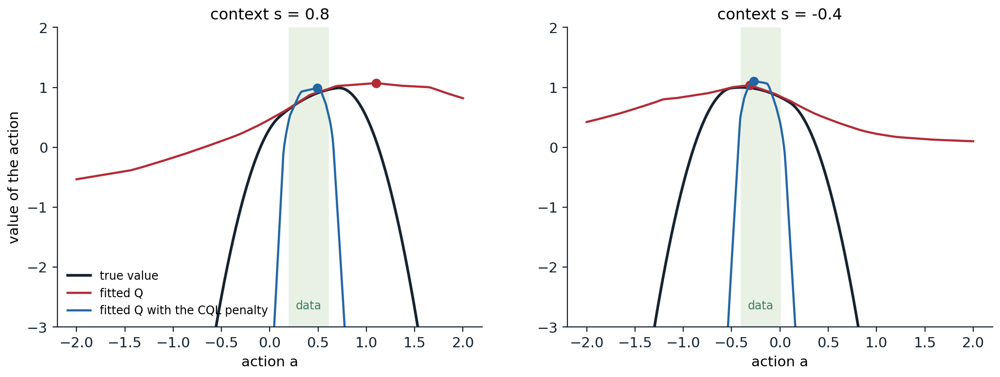

[Background Notes](../README.md) › [Reinforcement Learning](README.md)

# 26. Offline Reinforcement Learning

[← 25. Imitation Learning and Inverse RL](25-imitation-learning-and-inverse-rl.md) · [27. Multi-Agent RL and Self-Play →](27-multi-agent-rl-and-self-play.md)

## <a id="learning-from-fixed-data"></a>Learning from fixed data

### <a id="the-offline-setting"></a>The offline setting

Every algorithm of the previous chapters learns by acting: it tries actions, observes the consequences, and corrects its mistakes with new data. In many applications acting is exactly what cannot be done freely: a clinical policy cannot be tested on patients, a recommender or a self-driving car cannot explore dangerous actions, and a robot's time is expensive. Yet such domains often have large logs of past behavior. **Offline reinforcement learning**, also called batch RL, learns a policy from a fixed data set of transitions $`\mathcal D=\{(s,a,r,s')\}`$ collected by some **behavior policy** $`\pi_\beta`$, without any further interaction ([Levine, Kumar, Tucker, and Fu, 2020](https://arxiv.org/abs/2005.01643)). Unlike imitation ([chapter 25](25-imitation-learning-and-inverse-rl.md)), it uses rewards, so it can improve on the behavior; unlike off-policy RL ([chapter 9](09-off-policy-learning.md), [chapter 16](16-deep-q-learning.md)), it cannot collect the data that would correct its errors. That last difference turns out to be decisive.

### <a id="why-off-policy-algorithms-fail-offline"></a>Why off-policy algorithms fail offline

An off-policy algorithm such as DQN or SAC can in principle learn from any data. In practice, trained on a fixed data set, even one collected by an expert, it often fails completely ([Fujimoto, Meger, and Precup, 2019](https://arxiv.org/abs/1812.02900)). The reason is **extrapolation error**. The Bellman target $`r+\gamma\max_{a'}Q(s',a')`$ evaluates the Q-function at actions $`a'`$ chosen to maximize it, which are often actions the data never contain in $`s'`$. There the Q-function is an extrapolation, arbitrary for a table and unpredictable for a network, and the maximization selects exactly the actions whose values happen to be overestimated. Online, the agent would try those actions, observe their true consequences, and correct the estimates; offline, nothing ever does, and the errors propagate backward through bootstrapping. The problem is the **distribution shift** between the behavior policy that produced the data and the learned policy, which queries actions outside it. The next code shows the effect on a tabular problem, where values of state–action pairs absent from the data simply stay at their initial value of zero, and compares four remedies.

```python
import numpy as np

# Offline RL in a gridworld. A 7 x 7 grid with a goal in the far corner (+10, ends the episode), a band of pits in
# the middle (-10, ends the episode) with one gap, and -1 per step; gamma = 0.95, episodes of at most 40 steps from
# the opposite corner. A fixed data set of 60 episodes comes from a behavior policy; nothing else is available.
# Five tabular learners, each iterated to convergence on the data only (Q-values start at 0 for pairs never seen):
#   behavior cloning: the most frequent action in each state (random where the data say nothing);
#   naive Q-learning: fitted Q iteration with max over all actions, as an off-policy agent would do;
#   policy constraint: the max only over actions the data contain at least twice in that state (as BCQ does);
#   CQL: fitted Q iteration with the conservative penalty alpha (logsumexp_a Q(s, a) - Q(s, a_data)), alpha = 2;
#   IQL: values fitted in-sample by expectile regression (tau = 0.9), never querying unseen actions.
# Report the true return of each greedy policy from the start, and the value it predicts there.
rng = np.random.default_rng(0)
n, gamma = 7, 0.95
S, A = n * n, 4
moves = [(-1, 0), (1, 0), (0, -1), (0, 1)]
start, goal = (n - 1) * n, n - 1                                   # bottom left, top right
pits = {3 * n + c for c in range(n) if c != 5}                     # row 3, except a gap at column 5
nxt, rew, done = np.zeros((S, A), int), np.full((S, A), -1.0), np.zeros((S, A), bool)
for s in range(S):
    r, c = divmod(s, n)
    for a, (dr, dc) in enumerate(moves):
        s2 = min(max(r + dr, 0), n - 1) * n + min(max(c + dc, 0), n - 1)
        nxt[s, a] = s2
        if s2 == goal:
            rew[s, a], done[s, a] = 10.0, True
        elif s2 in pits:
            rew[s, a], done[s, a] = -10.0, True

Qstar = np.zeros((S, A))                                           # optimal values, for the behavior policies
for _ in range(500):
    Qstar = rew + gamma * np.where(done, 0.0, Qstar[nxt].max(-1))


def collect(eps, episodes=60):
    data = []
    for _ in range(episodes):
        s = start
        for t in range(40):
            a = int(rng.integers(A)) if rng.random() < eps else int(np.argmax(Qstar[s]))
            data.append((s, a, rew[s, a], nxt[s, a], done[s, a]))
            if done[s, a]:
                break
            s = nxt[s, a]
    return data


def true_return(policy):
    s, G = start, 0.0
    for t in range(40):
        a = policy[s]; G += gamma ** t * rew[s, a]
        if done[s, a]:
            break
        s = nxt[s, a]
    return G


def fit(data, method, iters=300):
    s_, a_, r_, s2_, d_ = map(np.array, zip(*data))
    count = np.zeros((S, A)); np.add.at(count, (s_, a_), 1)
    if method == "bc":
        return np.where(count.sum(1, keepdims=True) > 0, count, rng.random((S, A))).argmax(1), None
    Q, V = np.zeros((S, A)), np.zeros(S)
    allowed = count >= 2
    for it in range(iters):
        if method == "naive":
            target = r_ + gamma * np.where(d_, 0.0, Q[s2_].max(1))
        elif method == "constraint":
            target = r_ + gamma * np.where(d_, 0.0, np.where(allowed[s2_], Q[s2_], -1e9).max(1).clip(-1e3))
        elif method == "cql":
            target = r_ + gamma * np.where(d_, 0.0, Q[s2_].max(1))
        else:                                                      # IQL: Q from in-sample V
            target = r_ + gamma * np.where(d_, 0.0, V[s2_])
        for _ in range(20):                                       # regress Q on the targets (a few gradient steps)
            grad = np.zeros((S, A)); np.add.at(grad, (s_, a_), Q[s_, a_] - target)
            if method == "cql":                                    # conservative penalty: push down softmax(Q), up data
                soft = np.exp(Q[s_] - Q[s_].max(1, keepdims=True)); soft /= soft.sum(1, keepdims=True)
                np.add.at(grad, s_, 2.0 * soft); np.add.at(grad, (s_, a_), -2.0)
            Q -= 0.5 * grad / np.maximum(count.sum(1, keepdims=True), 1)
        if method == "iql":                                        # expectile regression of V on Q(s, a_data)
            for _ in range(20):
                u = Q[s_, a_] - V[s_]
                w = np.where(u > 0, 0.9, 0.1)
                g = np.zeros(S); np.add.at(g, s_, -w * u)
                V -= 0.5 * g / np.maximum(count.sum(1), 1)
    if method == "constraint":
        Q = np.where(allowed, Q, -1e9)                             # act only with well-supported actions
    elif method == "iql":
        Q = np.where(count > 0, Q, -1e9)                           # extract the policy among seen actions
    policy = Q.argmax(1)
    return policy, Q[start].max()


optimal = true_return(Qstar.argmax(1))
print(f"optimal return from the start: {optimal:.2f}")
print("                     data from a noisy expert (eps = 0.3)     data from a mostly random policy (eps = 0.8)")
print("   learner            return    predicted value at start       return    predicted value at start")
data_expert, data_random = collect(0.3), collect(0.8)
for name, method in (("behavior cloning", "bc"), ("naive Q-learning", "naive"), ("policy constraint", "constraint"),
                     ("CQL", "cql"), ("IQL", "iql")):
    row = []
    for data in (data_expert, data_random):
        policy, pred = fit(data, method)
        row.append((true_return(policy), pred))
    print(f"   {name:18s}" + "".join(f"{g:9.2f}   " + (f"{p:24.2f}" if p is not None else f"{'-':>24s}") + "      " for g, p in row))
# optimal return from the start: -2.94
#                      data from a noisy expert (eps = 0.3)     data from a mostly random policy (eps = 0.8)
#    learner            return    predicted value at start       return    predicted value at start
#    behavior cloning      -2.94                          -         -17.43                          -
#    naive Q-learning     -17.43                      -1.00         -17.43                      -2.85
#    policy constraint     -2.94                      -2.94         -10.97                     -10.97
#    CQL                   -2.94                      -3.15          -2.94                     -10.25
#    IQL                   -2.94                      -3.91          -2.94                      -6.47
```

From the noisy expert's data, naive Q-learning, the off-policy algorithm used as is, fails: its values for unseen actions stay at zero, higher than the true values of the seen ones, which are negative because every step costs 1, so its greedy policy heads for unseen actions and wanders for the whole episode. Its predicted value at the start, $`-1`$, is wildly optimistic. Behavior cloning, which only copies, does fine on these good data. The mostly random data show what offline RL is for. Cloning a mostly random policy gives a mostly random policy, but the random episodes contain, piece by piece, every step of the good path, and a learner that uses the rewards can assemble them. The two conservative methods, CQL and IQL, find the optimal path of 12 steps from these data, although only one of the 60 episodes reached the goal at all, in 14 steps, while the naive learner still fails. The policy constraint, which allows only actions seen at least twice, protects itself from unseen actions but, with the sparse coverage of these data, cannot find a supported path around the pits; it walks into one, which its values correctly rank above wandering for the whole episode. The rest of the chapter develops these families.

## <a id="staying-close-to-the-data"></a>Staying close to the data

### <a id="policy-constraints"></a>Policy constraints

The most direct remedy is to keep the learned policy close to the behavior policy, so that the Q-function is only queried where the data support it. **BCQ** ([Fujimoto, Meger, and Precup, 2019](https://arxiv.org/abs/1812.02900)) learns a generative model of the behavior's actions, a variational autoencoder ([GenAI chapter 3](../generative-ai/03-variational-autoencoders.md)), and chooses, among a few actions sampled from it and slightly perturbed by a learned network, the one with the highest Q-value; both the policy and the Bellman targets use only such actions. **BEAR** ([Kumar, Fu, Tucker, and Levine, 2019](https://arxiv.org/abs/1906.00949)) argued that the constraint should be on the *support* of the behavior distribution rather than on its density, allowing any action the behavior takes with non-negligible probability, and enforced it with a kernel divergence (MMD). The simplest method of this kind is also one of the strongest: **TD3+BC** ([Fujimoto and Gu, 2021](https://arxiv.org/abs/2106.06860)) adds a behavior cloning term to the actor of TD3 ([chapter 21](21-continuous-control-and-maximum-entropy-rl.md#td3-s-three-fixes)),

```math
\max_{\pi}\ \mathbb E_{(s,a)\sim\mathcal D}\bigl[\lambda\,Q(s,\pi(s))-(\pi(s)-a)^2\bigr],\qquad\lambda=\frac{\alpha}{\frac1N\sum_{(s,a)}|Q(s,a)|},
```

with $`\alpha=2.5`$ and the normalization making the balance between the two terms independent of the scale of the rewards (exercise 26.5). With normalized states and no other change, it matched the far more complex methods of its time on the standard benchmark.

### <a id="conservative-q-learning"></a>Conservative Q-learning

Instead of constraining the policy, **conservative Q-learning** (CQL) ([Kumar, Zhou, Tucker, and Levine, 2020](https://arxiv.org/abs/2006.04779)) makes the Q-function itself pessimistic where the data are silent. It adds to the Bellman error a penalty that pushes down the values of the actions the policy might choose and pushes up those of the actions in the data,

```math
\min_Q\ \alpha\,\mathbb E_{s\sim\mathcal D}\Bigl[\ln\sum_a\exp Q(s,a)-\mathbb E_{a\sim\pi_\beta(\cdot\mid s)}Q(s,a)\Bigr]+\tfrac12\,\mathbb E_{(s,a,s')\sim\mathcal D}\Bigl[\bigl(Q(s,a)-\hat{\mathcal B}^\pi\hat Q(s,a)\bigr)^2\Bigr],
```

where the log-sum-exp is a soft maximum over all actions. Kumar et al. proved that, with a large enough $`\alpha`$, the resulting values lower-bound the true values of the policy in expectation, so that a policy improved against them cannot exploit overestimated actions (exercise 26.2). CQL was the first offline method to perform well on the hardest data sets of its time, often two to five times better than earlier ones. The next code shows its effect on a neural Q-function fitted to data from a narrow behavior, in a one-step problem where actions far from the behavior's are dangerous.

```python
import numpy as np
import torch

# Extrapolation error with a neural network. One-step problem: context s in [-1, 1], action a in [-2, 2], true value
# Q(s, a) = 1 - (a - s)^2 - 5 max(0, |a - s/2| - 0.3)^2: aiming at s pays, but actions far from what the behavior
# does are dangerous (think of a robot beyond its tested range). The data, 2,000 samples, come from a narrow behavior policy a ~ N(0.5 s, 0.1^2) with rewards
# observed with noise of standard deviation 0.1. Fit an MLP Q(s, a) to the data, then choose actions:
#   naive: the argmax of the fitted Q over the whole action range;
#   constrained: the argmax within two standard deviations of the behavior's mean (as policy-constraint methods do);
#   CQL: the argmax of a Q fitted with the conservative penalty alpha * (logsumexp_a Q(s, a) - Q(s, a_data)),
#     alpha = 0.5, with the logsumexp over a grid of actions.
# Report, averaged over 200 test contexts, the value the fitted Q predicts for the chosen action and its true value.
torch.set_num_threads(1); torch.manual_seed(0); rng = np.random.default_rng(0)
N = 2000
s = rng.uniform(-1, 1, N); a = 0.5 * s + 0.1 * rng.normal(size=N)
true_q = lambda s_, a_: 1 - (a_ - s_) ** 2 - 5 * np.maximum(0, np.abs(a_ - s_ / 2) - 0.3) ** 2
r = true_q(s, a) + 0.1 * rng.normal(size=N)
S, Aa, R = (torch.as_tensor(x, dtype=torch.float32) for x in (s, a, r))
grid = torch.linspace(-2, 2, 41)


def fit(alpha):
    torch.manual_seed(1)
    net = torch.nn.Sequential(torch.nn.Linear(2, 64), torch.nn.ReLU(), torch.nn.Linear(64, 64), torch.nn.ReLU(), torch.nn.Linear(64, 1))
    opt = torch.optim.Adam(net.parameters(), lr=1e-3)
    for it in range(2000):
        idx = torch.randint(N, (256,))
        q = net(torch.stack([S[idx], Aa[idx]], 1))[:, 0]
        loss = ((q - R[idx]) ** 2).mean()
        if alpha > 0:
            sg = S[idx][:, None].expand(-1, len(grid)); ag = grid[None].expand(len(idx), -1)
            q_all = net(torch.stack([sg, ag], -1))[..., 0]
            loss = loss + alpha * (torch.logsumexp(q_all, 1) - q).mean()
        opt.zero_grad(); loss.backward(); opt.step()
    return net


test = torch.linspace(-1, 1, 200)
t_ = test.numpy(); g_ = np.linspace(-2, 2, 401)
best = np.mean(true_q(t_[:, None], g_[None]).max(1))
print("   method        predicted value   true value of the chosen action   (best possible: %.2f; behavior: %.2f)"
      % (best, np.mean(true_q(t_, 0.5 * t_))))
for name, alpha, constrained in (("naive", 0.0, False), ("constrained", 0.0, True), ("CQL", 0.5, False)):
    net = fit(alpha)
    with torch.no_grad():
        Q = net(torch.stack([test[:, None].expand(-1, len(grid)), grid[None].expand(len(test), -1)], -1))[..., 0]
        if constrained:
            Q = torch.where((grid[None] - 0.5 * test[:, None]).abs() <= 0.2, Q, torch.tensor(-1e9))
        k = Q.argmax(1)
        pred = Q[torch.arange(len(test)), k].mean().item()
        a_star = grid[k].numpy()
    true = np.mean(true_q(test.numpy(), a_star))
    print(f"   {name:14s}{pred:15.2f}   {true:31.2f}")
#    method        predicted value   true value of the chosen action   (best possible: 1.00; behavior: 0.92)
#    naive                    1.03                              0.80
#    constrained              0.99                              0.97
#    CQL                      1.05                              0.93
```

The fitted network extrapolates smoothly beyond the data, and here that extrapolation is optimistic: the naive policy chooses actions outside the data, where the network predicts a value of 1.03 and the truth is 0.80, worse than simply imitating the behavior. Constraining the choice to the data's support gives 0.97, an improvement on the behavior that stays within what the data can vouch for. The CQL penalty collapses the values outside the data, as the figure shows, so its policy stays inside; in this one-step problem its predicted values remain somewhat optimistic, since the penalty's second term also raises the values of the data's own actions, and the lower-bound guarantee concerns the policy's value in expectation, not every action's.



*Action values fitted to 2,000 samples from a narrow behavior policy (shaded: its central range), for two contexts, without and with the CQL penalty, against the true values; the dots mark the actions each fitted function would choose. Outside the data the plain fit extrapolates optimistically and chooses a dangerous action in the first context; the penalized fit falls steeply outside the data.*

### <a id="in-sample-learning-implicit-q-learning"></a>In-sample learning: implicit Q-learning

Both families still evaluate the Q-function at actions the data may not contain, one to maximize it and the other to penalize it. **Implicit Q-learning** (IQL) ([Kostrikov, Nair, and Levine, 2022](https://arxiv.org/abs/2110.06169)) never does. It learns a state-value function $`V`$ by **expectile regression** on the Q-values of the data's own actions,

```math
\min_V\ \mathbb E_{(s,a)\sim\mathcal D}\Bigl[L^\tau_2\bigl(Q(s,a)-V(s)\bigr)\Bigr],\qquad L^\tau_2(u)=|\tau-\mathbb 1(u<0)|\,u^2,
```

which for $`\tau`$ close to 1 approximates the maximum of $`Q(s,a)`$ over the actions the data contain in $`s`$ (exercise 26.3), and trains $`Q`$ on the targets $`r+\gamma V(s')`$, which involve only data. Its values thus approximate those of the best policy *supported by the data*, without ever querying an unseen action. The policy is extracted at the end by **advantage-weighted regression**, a behavior cloning that weights each data action by $`\exp\bigl(\beta(Q(s,a)-V(s))\bigr)`$: the solution of a KL-constrained policy improvement projected onto the policy class (exercise 26.4), as in AWR ([Peng, Kumar, Zhang, and Levine, 2019](https://arxiv.org/abs/1910.00177)) and AWAC ([Nair, Gupta, Dalal, and Levine, 2020](https://arxiv.org/abs/2006.09359)). IQL is simple, stable, and fast, and it became a standard baseline, especially on tasks that require stitching together parts of suboptimal trajectories, such as the navigation mazes of the D4RL benchmark.

## <a id="models-theory-and-sequence-models"></a>Models, theory, and sequence models

### <a id="model-based-offline-rl"></a>Model-based offline RL

A learned model can generate data beyond the data set, but in regions the data do not cover it is exactly as unreliable as the Q-function, and a policy optimized in it exploits its errors ([chapter 23](23-model-based-rl-and-world-models.md)). Model-based offline methods therefore penalize uncertainty. **MOPO** ([Yu et al., 2020](https://arxiv.org/abs/2005.13239)) subtracts from the model's reward a multiple of the model ensemble's uncertainty, and proves that the policy's return under the penalized model lower-bounds its true return. **MOReL** ([Kidambi, Rajeswaran, Netrapalli, and Joachims, 2020](https://arxiv.org/abs/2005.05951)) builds a pessimistic MDP in which transitions where the ensemble disagrees lead to an absorbing state with a large penalty. **COMBO** ([Yu et al., 2021](https://arxiv.org/abs/2102.08363)) applies the CQL penalty to model-generated data instead, avoiding explicit uncertainty estimates.

### <a id="pessimism-and-coverage-in-theory"></a>Pessimism and coverage in theory

The common principle has a precise justification. Without further assumptions, no offline algorithm can guarantee a good policy unless the data **cover** the relevant state–action pairs, since the value of a pair never observed is unknown. Early analyses required the data to cover every policy's distribution, a condition rarely met. Pessimism weakens it to covering a *single* good policy. **Pessimistic value iteration**, which subtracts from each estimated value an uncertainty bonus, the mirror image of the optimism of [chapter 22](22-exploration-in-deep-rl.md#optimism-in-the-face-of-uncertainty), learns a policy whose suboptimality is bounded by the uncertainty along the trajectories of the optimal policy only ([Jin, Yang, and Wang, 2021](https://arxiv.org/abs/2012.15085)). [Rashidinejad, Zhu, Ma, Jiao, and Russell (2021)](https://arxiv.org/abs/2103.12021) showed that the resulting lower-confidence-bound algorithm adapts to the data: it is near-optimal when the data cover the optimal policy well, and it behaves like imitation when the data come from an expert, which unifies offline RL and imitation learning (exercise 26.6). Optimism explores because the agent can collect data to resolve its doubts; pessimism is right when it cannot.

### <a id="offline-rl-as-sequence-modeling"></a>Offline RL as sequence modeling

A different line treats offline RL as conditional generative modeling. The **Decision Transformer** ([Chen et al., 2021](https://arxiv.org/abs/2106.01345)) trains a transformer to predict actions from the history of states, actions, and **returns-to-go**, the sum of future rewards, and at test time conditions it on a high target return, so that it generates the actions that led to such returns in the data. The **Trajectory Transformer** ([Janner, Li, and Levine, 2021](https://arxiv.org/abs/2106.02039)) models whole trajectories and plans with beam search. **RvS** ([Emmons, Eysenbach, Kostrikov, and Levine, 2022](https://arxiv.org/abs/2112.10751)) showed that an ordinary network conditioned on a goal or a target return, with careful tuning, is competitive, so the transformer is not what matters. Such **return-conditioned supervised learning** avoids bootstrapping and its instabilities, but it cannot combine pieces of different trajectories as dynamic programming does: it can only reproduce behavior whose returns it has seen, and it can fail in stochastic environments, where a high return in the data may reflect luck rather than good actions ([Brandfonbrener, Bietti, Buckman, Laroche, and Bruna, 2022](https://arxiv.org/abs/2206.01079); exercise 26.7). In the mostly random data of the gridworld above, return conditioning could at best copy the one successful 14-step episode, while the value-based methods stitch together the optimal 12-step path.

### <a id="expressive-policies"></a>Expressive policies

As in imitation, offline data are often multimodal, and Gaussian policies average their modes. **Diffuser** ([Janner, Du, Tenenbaum, and Levine, 2022](https://arxiv.org/abs/2205.09991)) plans by sampling whole trajectories from a diffusion model guided by predicted returns; **Diffusion-QL** ([Wang, Hunt, and Zhou, 2023](https://arxiv.org/abs/2208.06193)) and **IDQL** ([Hansen-Estruch et al., 2023](https://arxiv.org/abs/2304.10573)) combine diffusion policies with Q-learning, the latter by resampling actions from a diffusion model of the behavior with weights from an IQL critic. **Flow Q-learning** ([Park, Li, and Levine, 2025](https://arxiv.org/abs/2502.02538)) trains a flow-matching policy on the data and distills it into a one-step policy that maximizes the Q-function while staying close to the flow's outputs, avoiding backpropagation through the flow's iterative sampling. [Park et al. (2024)](https://arxiv.org/abs/2406.09329) found that in many benchmarks the limiting factor is not learning the values but extracting a policy from them and generalizing at test time to states outside the data, and that extracting the policy by a behavior-regularized policy gradient, as in TD3+BC and flow Q-learning, uses the values better than advantage-weighted regression.

## <a id="offline-rl-in-practice"></a>Offline RL in practice

### <a id="evaluation-and-model-selection"></a>Evaluation and model selection

Offline RL has no environment in which to tune it. Choosing hyperparameters or checkpoints by evaluating them online defeats the purpose, and estimating a policy's value from the data is itself a hard problem: the off-policy evaluation of [chapter 9](09-off-policy-learning.md#off-policy-evaluation-in-practice). **Fitted Q evaluation** ([Le, Voloshin, and Yue, 2019](https://arxiv.org/abs/1903.08738)), which learns the evaluated policy's Q-function by regression on the data, is usually the most reliable estimator for this purpose, but benchmarks of off-policy evaluation show that all estimators can rank policies poorly ([Fu et al., 2021](https://arxiv.org/abs/2103.16596)). Offline results are also sensitive to implementation details, which is why single-file reference implementations such as CORL ([Tarasov et al., 2023](https://arxiv.org/abs/2210.07105)) matter.

### <a id="from-offline-to-online"></a>From offline to online

When some online interaction is possible after offline training, the offline policy is a starting point for fine-tuning, but the transition is delicate. A conservative critic's values, including those of the offline policy's own actions, sit well below their true scale; when the online policy tries other actions, even worse ones, their values are corrected upward toward the truth and look better, and the first online updates can **unlearn** much of the offline policy's performance before the critic recalibrates. **Cal-QL** ([Nakamoto et al., 2023](https://arxiv.org/abs/2303.05479)) calibrates CQL's conservatism so that its values never fall below those of a reference policy, such as the behavior's, which removes the dip. **RLPD** ([Ball, Smith, Kostrikov, and Levine, 2023](https://arxiv.org/abs/2302.02948)) skips offline pretraining altogether: an online SAC agent with layer normalization in its critics, an ensemble of critics, a high update-to-data ratio, and minibatches drawn half from the offline data and half from its own experience learned faster than offline-then-online methods on the standard tasks.

### <a id="when-to-prefer-offline-rl"></a>When to prefer offline RL

Offline RL is not always better than cloning the data. [Kumar, Hong, Singh, and Levine (2022)](https://arxiv.org/abs/2204.05618) characterized when it is: with expert data, cloning is often as good and simpler, although offline RL can still win when rewards are sparse or only a few critical states demand precise actions; with suboptimal or noisy data, especially with sparse rewards and long horizons where stitching matters, offline RL can be much better, as the gridworld above shows. The field's benchmarks reflect these regimes. **D4RL** ([Fu, Kumar, Nachum, Tucker, and Levine, 2020](https://arxiv.org/abs/2004.07219)) provides data sets of varying quality for MuJoCo locomotion ("random", "medium", "expert", "medium-replay", and mixtures), navigation mazes for an ant robot that require stitching, and dexterous manipulation from human demonstrations, now maintained in the **Minari** format; **OGBench** ([Park, Frans, Eysenbach, and Levine, 2025](https://arxiv.org/abs/2410.20092)) provides goal-conditioned tasks that test stitching and long-horizon reasoning at larger scale. Offline RL's ideas also reach beyond robotics: training language models on fixed data sets of text and preferences is an offline problem, and the pessimism that keeps a policy near its data reappears there as the KL penalty toward the reference model ([chapter 28](28-reinforcement-learning-for-language-models-and-reasoning.md)).

[Lab 14](labs/lab-14-imitation-and-offline-reinforcement-learning.md) builds data sets of different quality with a trained agent and compares behavior cloning, DAgger, plain TD3, TD3+BC, and IQL on them.

## <a id="exercises"></a>Exercises

### <a id="exercise-26-1-extrapolation-error-in-a-table"></a>Exercise 26.1 — Extrapolation error in a table

In the gridworld code, all Q-values start at 0 and every step costs $`-1`$. (a) Why does naive Q-learning prefer actions never seen in the data, and why does more data from the same noisy expert fix this only slowly? (b) Would initializing the unseen values to $`-100`$ fix the problem? What would be the analogous remedy with a neural network, and why is it harder?


<details>
<summary><b>Solution</b></summary>


(a) The true values of all actions are negative, and the fitted values of seen actions converge toward them, while the values of unseen actions stay at 0 and look better than everything seen. The greedy policy therefore picks them, and the bootstrapped targets of neighboring states, which take the maximum over all actions, inherit the spurious zeros. More data from the same noisy expert fill in more pairs, but as long as some pair along the greedy path remains unseen, its zero wins; and the data of a good behavior policy concentrate on a narrow set of actions, leaving many pairs unseen: here several hundred episodes are needed before every pair near the good path has been tried, and with a deterministic behavior or continuous actions the gap never closes.

(b) A pessimistic initialization makes unseen pairs unattractive, which is the tabular form of CQL and of the policy constraint: it removes the problem as long as the initial value is below every achievable value. A network has no "unseen" entries to initialize: its values at unseen actions are determined by how it extrapolates from the seen ones, which can be optimistic anywhere. The remedies must therefore act on the extrapolation itself, by penalizing values away from the data (CQL), by never evaluating them (IQL, constraints), or by estimating uncertainty (ensembles).

</details>


### <a id="exercise-26-2-why-cql-is-conservative"></a>Exercise 26.2 — Why CQL is conservative

In a tabular setting with exact Bellman backups, CQL's policy evaluation step minimizes $`\alpha\,\mathbb E_{s}\bigl[\mathbb E_{a\sim\mu}Q(s,a)-\mathbb E_{a\sim\pi_\beta}Q(s,a)\bigr]+\frac12\mathbb E_{s,a\sim\pi_\beta}\bigl[(Q-\mathcal B^\pi\hat Q_k)^2\bigr]`$ over $`Q`$, where $`\mu`$ is the distribution whose values are pushed down. (a) Setting the derivative to zero for each $`(s,a)`$, show that $`\hat Q_{k+1}(s,a)=\mathcal B^\pi\hat Q_k(s,a)-\alpha\bigl(\mu(a\mid s)/\pi_\beta(a\mid s)-1\bigr)`$. (b) Show that $`\mathbb E_{a\sim\mu}\hat Q(s,a)`$ at the fixed point is below its true value when $`\mu=\pi`$. (c) Why are individual Q-values not all lower bounds?


<details>
<summary><b>Solution</b></summary>


(a) With weights $`d(s)`$ on states, the objective's derivative with respect to $`Q(s,a)`$ is $`d(s)\bigl[\alpha(\mu(a\mid s)-\pi_\beta(a\mid s))+\pi_\beta(a\mid s)(Q(s,a)-\mathcal B^\pi\hat Q_k(s,a))\bigr]`$. Setting it to zero and dividing by $`d(s)\pi_\beta(a\mid s)`$ gives the update.

(b) Averaging the penalty over $`a\sim\mu`$: $`\mathbb E_\mu[\mu/\pi_\beta-1]=\sum_a\mu^2/\pi_\beta-1\ge0`$, by the Cauchy–Schwarz inequality ($`(\sum_a\mu)^2\le\sum_a\mu^2/\pi_\beta\cdot\sum_a\pi_\beta`$), with equality only when $`\mu=\pi_\beta`$. So, with $`\mu=\pi`$, each backup lowers the expected value of the policy's actions by a nonnegative amount, and at the fixed point $`\mathbb E_\pi\hat Q\le\mathbb E_\pi Q^\pi`$: the policy's value is underestimated. With sampling error, $`\alpha`$ must be large enough to dominate the error of the empirical backup, which is the condition in Kumar et al.'s theorem.

(c) The penalty $`\mu/\pi_\beta-1`$ is negative for actions that the behavior takes more often than $`\mu`$ does, so their values are pushed *up*. Only the expectation under $`\mu`$ is guaranteed to be low, which is enough to stop the policy from exploiting overestimates but means individual values, such as those of the data's own actions in the code, can be too high.

</details>


### <a id="exercise-26-3-expectiles"></a>Exercise 26.3 — Expectiles

The $`\tau`$-expectile $`m_\tau`$ of a random variable $`X`$ minimizes $`\mathbb E[L^\tau_2(X-m)]`$ with $`L^\tau_2(u)=|\tau-\mathbb 1(u<0)|u^2`$. (a) Show that $`m_{1/2}`$ is the mean and that $`m_\tau`$ increases with $`\tau`$ toward the supremum of $`X`$'s support as $`\tau\to1`$. (b) Why does IQL use expectiles of $`Q(s,a)`$ over the data's actions, rather than their maximum?


<details>
<summary><b>Solution</b></summary>


(a) At $`\tau=\frac12`$, $`L^\tau_2(u)=\frac12u^2`$, whose minimizer is the mean. In general the minimizer satisfies $`\tau\,\mathbb E[(X-m)^+]=(1-\tau)\,\mathbb E[(m-X)^+]`$: the weighted mass above $`m`$ balances the weighted mass below. As $`\tau`$ grows, the weight on values above $`m`$ grows, so $`m`$ must rise to reduce $`\mathbb E[(X-m)^+]`$; as $`\tau\to1`$, the balance requires $`\mathbb E[(X-m)^+]\to0`$, that is, $`m`$ approaches the supremum of the support.

(b) The maximum over the data's actions in a state is not observable: each state typically appears with one action in continuous spaces, and the maximum of noisy Q estimates is biased upward. The expectile is estimated by regression over all data, generalizes across similar states through the network, and $`\tau`$ trades off between the behavior's value ($`\tau=\frac12`$, SARSA-like) and the best supported action's ($`\tau\to1`$), with values of 0.7 to 0.9 typical. Crucially, it involves only actions that appear in the data.

</details>


### <a id="exercise-26-4-advantage-weighted-regression"></a>Exercise 26.4 — Advantage-weighted regression

(a) Show that the policy maximizing $`\mathbb E_{a\sim\pi}[A(s,a)]-\frac1\beta D_{\mathrm{KL}}(\pi(\cdot\mid s)\,\|\,\pi_\beta(\cdot\mid s))`$ is $`\pi^*(a\mid s)\propto\pi_\beta(a\mid s)\exp(\beta A(s,a))`$. (b) Show that projecting it onto a parametric class by minimizing $`D_{\mathrm{KL}}(\pi^*\,\|\,\pi_\theta)`$ is a weighted maximum-likelihood regression on the data. (c) What does $`\beta`$ control?


<details>
<summary><b>Solution</b></summary>


(a) This is the mirror descent step of [chapter 20](20-trust-regions-and-proximal-policy-optimization.md#kl-regularized-policy-iteration) with the behavior as the reference: the Lagrangian's stationarity condition gives $`\ln\pi(a\mid s)=\ln\pi_\beta(a\mid s)+\beta A(s,a)-\ln Z(s)`$.

(b) $`D_{\mathrm{KL}}(\pi^*\|\pi_\theta)=\text{const}-\mathbb E_{a\sim\pi^*}\ln\pi_\theta(a\mid s)=\text{const}-\mathbb E_{a\sim\pi_\beta}\bigl[\frac{e^{\beta A(s,a)}}{Z(s)}\ln\pi_\theta(a\mid s)\bigr]`$, an expectation over the data's actions: behavior cloning with weights $`e^{\beta A}`$ (the normalizer $`Z(s)`$ is usually dropped). The policy never needs the Q-function's values at unseen actions.

(c) $`\beta`$ is the inverse temperature of the improvement: $`\beta\to0`$ gives behavior cloning, and $`\beta\to\infty`$ puts all weight on the best action in the data. Large $`\beta`$ improves more but uses fewer samples effectively, since a few actions dominate the weights, which is why the weights are usually clipped.

</details>


### <a id="exercise-26-5-td3-bc-s-normalization"></a>Exercise 26.5 — TD3+BC's normalization

TD3+BC's actor maximizes $`\lambda Q(s,\pi(s))-(\pi(s)-a)^2`$ with $`\lambda=\alpha/\overline{|Q|}`$. (a) Why divide by the average magnitude of the Q-values? (b) What happens with $`\alpha\to0`$ and $`\alpha\to\infty`$? (c) Why might a fixed trade-off be suboptimal across data sets?


<details>
<summary><b>Solution</b></summary>


(a) The Q-values scale with the rewards and with $`1/(1-\gamma)`$, while the cloning term is bounded by the squared range of the actions. Without normalization, the same $`\alpha`$ would mean almost pure cloning on a task with small rewards and almost pure Q maximization on one with large rewards. Dividing by $`\overline{|Q|}`$, computed on each minibatch and treated as a constant, makes the gradient of the first term of order $`\alpha`$ in the Q-function's relative units, so one value of $`\alpha`$ transfers across tasks.

(b) With $`\alpha\to0`$ the actor clones the data; with $`\alpha\to\infty`$ it is TD3, with the extrapolation error that motivated the method.

(c) The right amount of cloning depends on the data: expert data favor cloning and a small $`\alpha`$, random data need the Q-function and a large one. A fixed $`\alpha`$ is a compromise, which is why methods that adapt the constraint to the data's quality, or constrain the support rather than the distribution, can do better on mixed data sets.

</details>


### <a id="exercise-26-6-pessimism-and-coverage"></a>Exercise 26.6 — Pessimism and coverage

A tabular offline algorithm estimates $`\hat Q(s,a)`$ with confidence intervals of width $`b(s,a)\propto1/\sqrt{n(s,a)}`$. (a) Compare the policies that act greedily on $`\hat Q`$, on $`\hat Q+b`$, and on $`\hat Q-b`$ when some pairs have $`n=0`$. (b) Explain why the pessimistic policy needs the data to cover only the optimal policy's pairs, and what it does when the data come from an expert.


<details>
<summary><b>Solution</b></summary>


(a) Greedy on $`\hat Q`$ follows whatever arbitrary values the unseen pairs have. The optimistic $`\hat Q+b`$ is drawn to the unseen pairs, whose bonus is infinite, which is right online, where visiting them resolves the uncertainty, and disastrous offline, where it never does. The pessimistic $`\hat Q-b`$ avoids them, and more generally prefers actions whose values are both high and well estimated.

(b) Pessimism guarantees that the chosen policy's value is at least its lower confidence bound, which, by the choice of the maximizer, is at least the lower bound of the optimal policy's value, $`V^*-O(\text{width along the optimal policy's trajectories})`$. The suboptimality therefore depends only on how well the data cover the optimal policy's state–action pairs, the single-policy concentrability, and not on the coverage of other policies. With expert data, the expert's actions are the only well-covered ones, the lower bounds of the alternatives are poor, and the pessimistic policy picks the expert's actions: it reduces to imitation, as Rashidinejad et al. showed, and it improves on the data when they cover better actions.

</details>


### <a id="exercise-26-7-when-return-conditioning-fails"></a>Exercise 26.7 — When return conditioning fails

(a) Two data sets of trajectories share a middle state $`M`$: one goes from the start to $`M`$ and then fails, the other starts at $`M`$ and reaches the goal. Why can a return-conditioned policy not learn to go from the start to the goal, while Q-learning can? (b) In a stochastic environment, an action at the start leads to a jackpot with probability 0.1 and to nothing otherwise; another action gives a sure medium reward. Why does conditioning on the jackpot's return choose the wrong action?


<details>
<summary><b>Solution</b></summary>


(a) Conditioned on a high return at the start, the policy imitates the actions of trajectories that obtained high returns *from the start*, and there are none: every trajectory through the start failed. Q-learning's backup combines the value of reaching $`M`$, learned from the first data set, with the value of continuing from $`M`$, learned from the second, and so values the path from the start to the goal although no single trajectory contains it: dynamic programming stitches.

(b) The high-return trajectories in the data all took the risky action, since only it can produce the jackpot, so conditioning on that return selects it, although its expected return, 0.1 times the jackpot, may be lower than the sure reward. The conditioning treats a lucky outcome as if it were controllable; the returns-to-go are consistent targets only when the environment is (nearly) deterministic, which is one of Brandfonbrener et al.'s conditions, alongside coverage of the conditioned returns.

</details>


### <a id="exercise-26-8-the-offline-to-online-dip"></a>Exercise 26.8 — The offline-to-online dip

A CQL agent is fine-tuned online after offline training, and its performance first drops before improving. (a) Explain the drop. (b) How does Cal-QL prevent it, and how does RLPD avoid the problem?


<details>
<summary><b>Solution</b></summary>


(a) CQL pushes its values below their true scale, for actions outside the data directly and, through bootstrapping, for the offline policy's own actions too. Online, the policy tries new actions, observes their returns, and the critic raises their values toward the truth, which can make them look better than the offline policy's own actions, whose values are still far too low, even when the new actions are worse. The policy shifts toward them before their values, and those of the states they lead to, are well estimated, and performance drops, sometimes to near that of a random policy, until the critic recalibrates.

(b) Cal-QL bounds the conservatism from below: the pushed-down values may not fall below the values of a reference policy, such as the behavior, estimated from the data, so the policy's values are never so far below the truth that correcting other actions' values flips the policy. RLPD never trains a conservative critic: it learns online from the start, with the offline data mixed into every minibatch, and relies on normalization, ensembles, and a high update-to-data ratio to learn quickly and stably; the offline data speed up learning without creating pessimistic values that must later be undone.

</details>


## <a id="appendices"></a>Appendices


<details>
<summary><a id="block-rl26-appendix-a"></a><b>A. Implicit Q-learning</b></summary>


Networks: two Q-networks (use the minimum), their target copies, a value network $`V`$, and a policy.

1. **Value:** minimize $`\mathbb E_{(s,a)\sim\mathcal D}\bigl[L^\tau_2(\min_iQ^-_i(s,a)-V(s))\bigr]`$ with $`\tau=0.7`$ (locomotion) to 0.9 (mazes).
2. **Q:** minimize $`\mathbb E_{(s,a,r,s')\sim\mathcal D}\bigl[(r+\gamma V(s')-Q_i(s,a))^2\bigr]`$ for each $`i`$, and update the targets by Polyak averaging.
3. **Policy:** maximize $`\mathbb E_{(s,a)\sim\mathcal D}\bigl[\exp(\beta(\min_iQ^-_i(s,a)-V(s)))\ln\pi(a\mid s)\bigr]`$ with the weights clipped (for example at 100), $`\beta`$ from 3 to 10; this step can run after, or alongside, the others, since they do not depend on the policy.

The steps alternate on minibatches from the data set for a million gradient steps in the original experiments; rewards are often normalized by the range of the data set's returns.

</details>


<details>
<summary><a id="block-rl26-appendix-b"></a><b>B. Conservative Q-learning for continuous actions</b></summary>


Start from SAC ([chapter 21, appendix A](21-continuous-control-and-maximum-entropy-rl.md#block-rl21-appendix-a)) and add to each critic's loss

```math
\alpha\Bigl(\ln\sum_{j}\exp Q(s,a_j)-Q(s,a_{\mathcal D})\Bigr),
```

where the log-sum-exp over continuous actions is estimated by importance sampling with about 10 actions each from a uniform distribution and from the current policy at $`s`$ and at $`s'`$, each term corrected by its sampling density. Typical settings: $`\alpha`$ from 1 to 10, or tuned automatically by a Lagrangian to keep the gap $`\ln\sum\exp Q-Q(s,a_{\mathcal D})`$ near a threshold; a critic learning rate of $`3\times10^{-4}`$ and a smaller one for the actor; and a period of pure behavior cloning at the start. For discrete actions the log-sum-exp is computed exactly, and CQL is a one-line addition to DQN.

</details>

---

[← 25. Imitation Learning and Inverse RL](25-imitation-learning-and-inverse-rl.md) · [27. Multi-Agent RL and Self-Play →](27-multi-agent-rl-and-self-play.md)
