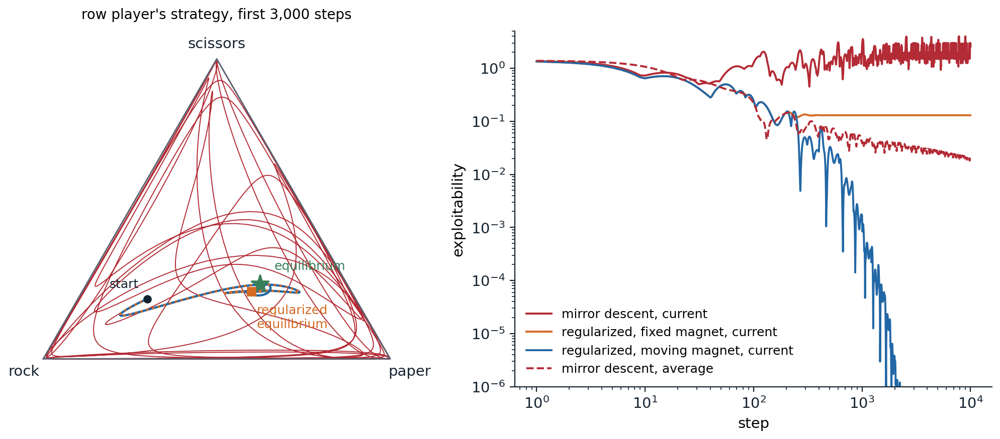

[ML Mastery Notes](../README.md) › [Reinforcement Learning](README.md)

# 27. Multi-Agent RL and Self-Play

[← 26. Offline Reinforcement Learning](26-offline-reinforcement-learning.md) · [28. Reinforcement Learning for Language Models and Reasoning →](28-reinforcement-learning-for-language-models-and-reasoning.md)

## <a id="many-learners"></a>Many learners

### <a id="from-one-agent-to-many"></a>From one agent to many

Every chapter so far has had one learner facing an environment that, however complex, did not care what the learner did. Many of the problems that matter involve several decision makers: players in a game, vehicles in traffic, robots in a warehouse, bidders in an auction, language models negotiating or debating. The standard model is the **stochastic game**, or Markov game ([Shapley, 1953](https://doi.org/10.1073/pnas.39.10.1095)), which extends the MDP of chapter 1 to $`n`$ agents. In state $`s`$ every agent $`i`$ chooses an action $`a^i`$; the **joint action** $`\mathbf a=(a^1,\dots,a^n)`$ determines the next state through $`P(s'\mid s,\mathbf a)`$; and each agent receives its own reward $`r^i(s,\mathbf a)`$. Agent $`i`$ wants a policy $`\pi^i`$ with a high return $`V^i_{\boldsymbol\pi}(s)=\mathbb E_{\boldsymbol\pi}\bigl[\sum_t\gamma^tr^i_t\mid s_0=s\bigr]`$, but its return depends on the **joint policy** $`\boldsymbol\pi=(\pi^1,\dots,\pi^n)`$. Three cases are usually distinguished. In **fully cooperative** games all agents share one reward, and with private observations the problem is the decentralized POMDP of chapter 14. In **two-player zero-sum** games, $`r^2=-r^1`$, as in chess, Go, and heads-up poker. Everything else is **general-sum**, or mixed: negotiation, traffic, markets, and most social life. Games with hidden information and alternating moves, such as poker, are usually described in the extensive form of AI chapter 15, as trees whose decision points are grouped into information sets.

Several difficulties appear that single-agent RL never had to face. From the point of view of one agent, the others are part of the environment, and when they learn, the transition and reward functions it experiences change: the environment is **nonstationary**, the Markov property fails from its point of view, and the convergence guarantees of the previous chapters no longer apply, while a replay memory fills with experience against opponents who no longer exist. There is no single optimal policy to learn, since what is good depends on what the others do; the objective must be replaced by an equilibrium concept, and there may be many equilibria. Teammates must solve a **credit assignment** problem, since a shared reward does not say who deserved it. The joint action space grows exponentially with the number of agents. And performance itself becomes relative: a policy that beats one opponent may lose to another, so evaluation needs a reference population or a worst case.

### <a id="solution-concepts"></a>Solution concepts

AI chapter 15 defines the solution concepts of game theory; here are the ones learning algorithms aim for. A **best response** of agent $`i`$ to the others' policies $`\boldsymbol\pi^{-i}`$ is a policy maximizing $`V^i(\pi^i,\boldsymbol\pi^{-i})`$, and a **Nash equilibrium** is a joint policy in which every agent's policy is a best response to the others'. How far a joint policy is from equilibrium is measured by what the agents could gain by deviating,

$$
\operatorname{NashConv}(\boldsymbol\pi)=\sum_{i=1}^n\Bigl(\max_{\pi'}V^i(\pi',\boldsymbol\pi^{-i})-V^i(\boldsymbol\pi)\Bigr)\ \ge0,
$$

which is zero exactly at a Nash equilibrium; in two-player zero-sum games, the sum is also called the **exploitability**, or that name is given to half of it. Computing it requires a best response, which is easy in small games and is itself a hard RL problem in large ones.

Two-player zero-sum games are special. By the **minimax theorem**, every such game has a **value** $`v^*`$: player 1 has a strategy guaranteeing at least $`v^*`$ against every opponent, player 2 one guaranteeing that player 1 gets at most $`v^*`$, and the Nash equilibria are exactly the pairs of such strategies, so they are interchangeable and all yield $`v^*`$. "Solving" such a game is therefore well defined, and an equilibrium strategy is safe: it guarantees at least the value in expectation against any opponent. Stochastic games of this kind can be solved by a value iteration in which the maximum of the Bellman equation becomes the value of a matrix game at every state, $`V(s)=\operatorname{val}\bigl[r(s,a,b)+\gamma\sum_{s'}P(s'\mid s,a,b)V(s')\bigr]_{a,b}`$, which is a contraction as in the single-agent case ([appendix B](#block-rl27-appendix-b)). **Minimax-Q** ([Littman, 1994](https://doi.org/10.1016/B978-1-55860-335-6.50027-1)) is the Q-learning version: its target uses the value of the matrix game of Q-values at the next state, computed by a small linear program.

In general-sum games, none of this survives. Equilibria are not interchangeable, there can be many with different payoffs, and which one the agents reach, the **equilibrium selection** problem, matters as much as reaching one. Computing a Nash equilibrium is PPAD-complete ([Daskalakis, Goldberg, and Papadimitriou, 2009](https://doi.org/10.1137/070699652)), even for two players ([Chen, Deng, and Teng, 2009](https://doi.org/10.1145/1516512.1516516)), a class believed to be intractable. **Nash-Q** ([Hu and Wellman, 2003](https://www.jmlr.org/papers/v4/hu03a.html)) extends minimax-Q by using a Nash equilibrium of the stage game in the target, but converges only under conditions, such as every stage game having a globally optimal or saddle-point equilibrium, that rarely hold. Learning algorithms for general-sum games therefore usually aim for the weaker **correlated** and **coarse correlated equilibria**, which no-regret learners reach, or for outcomes judged by welfare rather than stability. In fully cooperative games the goal is clear, the joint policy with the highest common return, which is also a Nash equilibrium; the difficulty is that the agents may converge to a worse equilibrium instead.

### <a id="the-dynamics-of-learning-in-games"></a>The dynamics of learning in games

What happens when agents simply learn against each other? The simplest scheme, and the one behind the self-play of chapter 24, has each agent improve against the others' current policies. In games where strength is **transitive**, where beating a strong opponent implies beating the weaker ones, this climbs steadily. In **non-transitive** games it can cycle forever: in rock–paper–scissors, the best response to rock is paper, to paper scissors, and to scissors rock. **Fictitious play**, proposed by Brown in 1951, instead best-responds to the opponent's *average* past play; in two-player zero-sum games the average strategies converge to an equilibrium ([Robinson, 1951](https://doi.org/10.2307/1969530)), although Shapley showed in 1964 that they need not in general-sum games. The no-regret algorithms of AI chapter 15, Hedge and regret matching, have the same property: when both players have average regret at most $`\epsilon`$, the pair of *average* strategies is within $`2\epsilon`$ of equilibrium (exercise 27.1).

The trouble is the word "average". Hedge updates a softmax policy by adding the payoffs to its logits, which is the mirror-descent step of chapter 20, or a natural policy gradient step with exact values; and in zero-sum games with a mixed equilibrium its *current* strategies do not converge. In continuous time they orbit the equilibrium, conserving a KL divergence to it (exercise 27.3), and with finite steps they spiral outward toward the boundary of the simplex. A deep RL agent is its current network, and averaging the policies of many networks is awkward: it requires storing them or training a separate network to imitate the average. Two remedies make the current strategies converge. **Optimistic** updates, which step with the predicted next gradient $`2g_t-g_{t-1}`$ instead of $`g_t`$, converge in the last iterate in unconstrained bilinear games ([Daskalakis, Ilyas, Syrgkanis, and Zeng, 2018](https://arxiv.org/abs/1711.00141)) and, as optimistic Hedge, in matrix games with a unique equilibrium ([Daskalakis and Panageas, 2019](https://arxiv.org/abs/1807.04252)). **Regularization** adds a penalty $`\alpha\,D_{\mathrm{KL}}(\pi\,\|\,\rho)`$ toward a fixed **magnet** policy $`\rho`$ to each player's objective. The regularized game is strongly monotone, so the updates converge in the last iterate, but to the equilibrium of the regularized game, a **quantal response equilibrium** ([McKelvey and Palfrey, 1995](https://doi.org/10.1006/game.1995.1023)) that is biased toward the magnet. Repeatedly moving the magnet to the point reached removes the bias, and the sequence converges to a Nash equilibrium: this is the principle of **R-NaD** ([Perolat et al., 2021](https://arxiv.org/abs/2002.08456)) and of **magnetic mirror descent** ([Sokota et al., 2023](https://arxiv.org/abs/2206.05825)). The next code compares these dynamics on a rock–paper–scissors in which winning with rock pays double, so that the equilibrium is not uniform.

```python
import numpy as np

# Self-play dynamics in a biased rock-paper-scissors, where winning with rock pays 2; its unique equilibrium is
# (1/4, 1/2, 1/4) for both players. Each method updates the two players' strategies from exact payoffs, starting
# from the same point; we measure the exploitability max_i (A y)_i - min_j (x^T A)_j of the current strategies
# and of their running averages. The regularized methods take the mirror-descent step
#   pi <- argmax_p  eta <g, p> - eta alpha KL(p || magnet) - KL(p || pi),
# with the magnet fixed at the uniform strategy, or reset to the current strategy every 200 steps (as R-NaD does).
A = np.array([[0.0, -1.0, 2.0],      # rock: ties rock, loses to paper, beats scissors and wins 2
              [1.0, 0.0, -1.0],      # paper
              [-2.0, 1.0, 0.0]])     # scissors
x0, y0 = np.array([0.6, 0.2, 0.2]), np.array([0.2, 0.2, 0.6])


def exploitability(x, y):
    return (A @ y).max() - (x @ A).min()


def run(method, T, eta=0.1, alpha=0.2, reset=200):
    x, y = x0.copy(), y0.copy()
    sx, sy = x0.copy(), y0.copy()                          # running sums for the averages
    mx = my = np.full(3, 1 / 3)                            # magnets
    for t in range(1, T + 1):
        gx, gy = A @ y, -(x @ A)                           # payoff of each action to each player
        if method == "best response":                      # naive self-play: best-respond to the latest strategy
            x, y = np.eye(3)[gx.argmax()], np.eye(3)[gy.argmax()]
        elif method == "fictitious play":                  # best-respond to the opponent's average strategy
            x, y = np.eye(3)[(A @ sy).argmax()], np.eye(3)[(-(sx @ A)).argmax()]
        else:
            a = 0.0 if method == "mirror descent" else alpha
            zx = (np.log(x) + eta * a * np.log(mx) + eta * gx) / (1 + eta * a)
            zy = (np.log(y) + eta * a * np.log(my) + eta * gy) / (1 + eta * a)
            x, y = np.exp(zx - zx.max()), np.exp(zy - zy.max()); x /= x.sum(); y /= y.sum()
            if method == "regularized, moving magnet" and t % reset == 0:
                mx, my = x.copy(), y.copy()
        sx += x; sy += y
    return exploitability(x, y), exploitability(sx / (T + 1), sy / (T + 1)), x


Ts = (10, 100, 1000, 3000)
print("exploitability of the current strategies (of the averages in parentheses); equilibrium (0.25, 0.50, 0.25)")
print(f"{'':28s}" + "".join(f"{'T = ' + format(T, ','):>18s}" for T in Ts) + "     current x at 3,000")
for m in ("best response", "fictitious play", "mirror descent", "regularized, fixed magnet", "regularized, moving magnet"):
    res = [run(m, T) for T in Ts]
    print(f"{m:28s}" + "".join(f"{c:9.3f} ({a:.3f})" for c, a, _ in res) + "     " + np.array2string(res[-1][2], precision=3))
# exploitability of the current strategies (of the averages in parentheses); equilibrium (0.25, 0.50, 0.25)
#                                         T = 10           T = 100         T = 1,000         T = 3,000     current x at 3,000
# best response                   2.000 (0.618)    2.000 (0.655)    2.000 (0.666)    3.000 (0.667)     [1. 0. 0.]
# fictitious play                 3.000 (0.545)    2.000 (0.218)    2.000 (0.070)    2.000 (0.037)     [0. 1. 0.]
# mirror descent                  0.727 (1.068)    1.259 (0.219)    2.599 (0.039)    2.342 (0.032)     [5.511e-07 9.215e-05 9.999e-01]
# regularized, fixed magnet       0.646 (1.017)    0.246 (0.228)    0.130 (0.142)    0.130 (0.134)     [0.289 0.487 0.224]
# regularized, moving magnet      0.646 (1.017)    0.246 (0.228)    0.002 (0.041)    0.000 (0.014)     [0.25 0.5  0.25]
```

Naive self-play never settles: each player jumps to the pure best response to the other's latest move, the play cycles, and even the average of the cycle, the uniform strategy, is not the equilibrium, since the cycle spends equal time on each action regardless of the payoffs; each player could gain $`1/3`$ by best-responding to it, so the pair's NashConv is $`2/3`$. Fictitious play and mirror descent both drive the exploitability of the *average* strategies toward zero, 0.037 and 0.032 after 3,000 rounds, but their current strategies are useless: fictitious play's are pure, and mirror descent's have spiraled out to nearly pure scissors, played with probability 0.9999. The regularized dynamics with a fixed uniform magnet converge in the last iterate, but to $`(0.29,0.49,0.22)`$ rather than $`(0.25,0.50,0.25)`$, which leaves an exploitability of 0.130. Moving the magnet every 200 steps fixes the bias: the current strategies converge to the equilibrium, to three decimals, with no averaging at all. The figure shows the trajectories.



*Self-play dynamics in the biased rock–paper–scissors of the code. Left: the row player's strategy during the first 3,000 steps, in the simplex whose corners are the pure strategies. Mirror descent (red) orbits outward and soon spends most of its time near the boundary; the regularized dynamics with a fixed uniform magnet (orange, dotted) spiral into the regularized equilibrium (square), and with the magnet moved every 200 steps (blue) they continue to the equilibrium (star). Right: the exploitability of the current strategies over 10,000 steps, and of mirror descent's average (dashed), which converges slowly. With the moving magnet, the current strategies' exploitability falls below $`10^{-6}`$ after about 2,000 steps.*

## <a id="imperfect-information-and-counterfactual-regret"></a>Imperfect information and counterfactual regret

### <a id="information-sets-and-why-they-are-hard"></a>Information sets and why they are hard

In chess and Go both players see everything, and the value of a position does not depend on how it was reached, which is what lets AlphaZero evaluate positions with a network and search from the current one. In poker it is otherwise. **Kuhn poker** ([Kuhn, 1950](https://doi.org/10.1515/9781400881727-010)), the smallest interesting poker game, makes this concrete: three cards, J, Q, and K; each player antes 1 chip and receives one card; player 1 checks or bets 1 chip; after a check, player 2 checks, ending the hand, or bets; after a bet, the other player folds, losing the ante, or calls; and a remaining showdown goes to the higher card. A player cannot distinguish the histories that differ only in the opponent's card, so its decision points are grouped into **information sets** $`I`$, such as "I hold the Q and my opponent bet", and a **behavioral strategy** $`\sigma_i`$ chooses a distribution $`\sigma_i(I)`$ over actions at each of them. The probability of reaching a history $`h`$ factorizes into the contributions of the players and chance, $`\pi^\sigma(h)=\pi^\sigma_i(h)\,\pi^\sigma_{-i}(h)`$, where $`\pi^\sigma_{-i}(h)`$ collects the probabilities of everyone else's actions and chance's.

The value of acting at an information set depends on the probabilities of the histories in it, which depend on the other player's strategy *elsewhere in the tree*. Whether calling a bet with the Q is right depends on how often the opponent bets with the J, that is, bluffs; and the opponent's best bluffing frequency depends on how often it gets called. A part of the game cannot be solved in isolation, as a subtree of a chess game can, and a single-agent RL method that treats the opponent as part of the environment converges, at best, to a best response to that opponent, which the opponent can then exploit. Optimal play mixes: in Kuhn poker's equilibria, player 1 bets the J with some probability $`\alpha\in[0,1/3]`$ and player 2 bluffs with the J after a check with probability $`1/3`$ (exercise 27.4).

### <a id="counterfactual-regret-minimization"></a>Counterfactual regret minimization

The regret-minimizing learners of the previous section solve a game by playing it repeatedly, but applied to the normal form of an extensive game they would need one "action" per complete strategy, exponentially many. **Counterfactual regret minimization** (CFR; [Zinkevich, Johanson, Bowling, and Piccione, 2007](https://proceedings.neurips.cc/paper/2007/hash/08d98638c6fcd194a4b1e6992063e944-Abstract.html)) instead runs a small regret minimizer at every information set. The **counterfactual value** of an information set $`I`$ of player $`i`$ is the expected payoff below it, weighted by the probability that *the others and chance* bring play to each of its histories, as if player $`i`$ had tried to reach it:

$$
v_i(\sigma,I)=\sum_{h\in I}\pi^\sigma_{-i}(h)\sum_{z}\pi^\sigma(h\to z)\,u_i(z),
$$

where $`z`$ ranges over the terminal histories below $`h`$ and $`\pi^\sigma(h\to z)`$ is the probability of going from $`h`$ to $`z`$; $`v_i(\sigma,I,a)`$ is the same with action $`a`$ taken at $`I`$. The **counterfactual regret** of $`a`$ after $`T`$ iterations is $`R^T(I,a)=\sum_{t=1}^T\bigl(v_i(\sigma^t,I,a)-v_i(\sigma^t,I)\bigr)`$, and CFR plays **regret matching** at every information set, $`\sigma^{t+1}(I,a)\propto\max\bigl(R^t(I,a),0\bigr)`$, or uniformly if no regret is positive. Zinkevich et al. proved that a player's overall regret is at most the sum of its positive counterfactual regrets over its information sets ([appendix A](#block-rl27-appendix-a)), so the average regret falls as $`O\bigl(\Delta\,|\mathcal I_i|\sqrt{|A|}/\sqrt T\bigr)`$, with $`\Delta`$ the range of payoffs, $`|\mathcal I_i|`$ the number of information sets, and $`|A|`$ the largest number of actions. In a two-player zero-sum game, the **average strategy**, with each iteration weighted by the player's own probability of reaching the information set,

$$
\bar\sigma^T_i(I,a)=\frac{\sum_{t=1}^T\pi^{\sigma^t}_i(I)\,\sigma^t(I,a)}{\sum_{t=1}^T\pi^{\sigma^t}_i(I)},
$$

therefore converges to a Nash equilibrium. Each iteration traverses the tree once, with work proportional to its size, instead of enumerating strategies. **CFR+** ([Tammelin, 2014](https://arxiv.org/abs/1407.5042)) floors the cumulative regrets at zero after every update, so an action that becomes good is not held back by old negative regret, updates the players alternately, and weights later iterations more in the average; it converges much faster in practice, and with it the Cepheus program **essentially solved** heads-up limit Texas hold'em, a game with $`3.19\times10^{14}`$ decision points: its strategy is exploitable by less than 1 milli-big-blind per hand, too little to be detected in a human lifetime of play ([Bowling, Burch, Johanson, and Tammelin, 2015](https://doi.org/10.1126/science.1259433)). The next code runs both on Kuhn poker, computing exploitability exactly by enumerating each player's 64 pure strategies.

```python
import itertools

import numpy as np

# Counterfactual regret minimization on Kuhn poker. Cards J < Q < K (0, 1, 2); each player antes 1 and holds one
# card; player 1 checks or bets 1, player 2 then checks or bets (after a check) or folds or calls (after a bet), and
# after "check, bet" player 1 folds or calls. Histories are strings of p (check or fold) and b (bet or call); an
# information set is the acting player's card and the history. CFR: one traversal of the whole tree per iteration.
# CFR+: regrets floored at zero, alternating updates, and an average weighted by the iteration number.
DEALS = list(itertools.permutations(range(3), 2))
TERMINAL = {"pp", "bp", "bb", "pbp", "pbb"}


def payoff(h, cards):
    """Payoff to player 1 at a terminal history."""
    if h in ("bp", "pbp"):                                  # a fold: the player who bet wins the other's ante
        return 1.0 if h == "bp" else -1.0
    stake = 2.0 if h[-2:] == "bb" else 1.0
    return stake if cards[0] > cards[1] else -stake


def cfr(h, cards, reach, sig, dR, S, t, update, plus):
    """Returns player 1's expected payoff below h under the iteration's strategies sig; accumulates regrets in dR
    and average-strategy sums in S at the information sets of the updated player(s)."""
    if h in TERMINAL:
        return payoff(h, cards)
    i = len(h) % 2
    I = (cards[i], h)
    sigma = sig[I]
    u = np.zeros(2)
    for a in range(2):
        r = reach.copy(); r[i] *= sigma[a]
        u[a] = cfr(h + "pb"[a], cards, r, sig, dR, S, t, update, plus)
    v = sigma @ u
    if i in update:
        sign = 1.0 if i == 0 else -1.0                       # player 2's payoff is minus player 1's
        dR[I] += reach[1 - i] * sign * (u - v)                # regret weighted by the opponent's reach
        S[I] += (t if plus else 1.0) * reach[i] * sigma
    return v


def average(S):
    return {I: s / s.sum() if s.sum() > 0 else np.full(2, 0.5) for I, s in S.items()}


def current(R):
    return {I: np.maximum(r, 0) / np.maximum(r, 0).sum() if np.maximum(r, 0).sum() > 0 else np.full(2, 0.5)
            for I, r in R.items()}


def value(h, cards, strat):
    """Player 1's expected payoff when both follow strat (a dict or, per player, a pure-strategy dict)."""
    if h in TERMINAL:
        return payoff(h, cards)
    i = len(h) % 2
    s = strat[i][(cards[i], h)]
    return sum(s[a] * value(h + "pb"[a], cards, strat) for a in range(2) if s[a] > 0)


INFOSETS = [[(c, h) for c in range(3) for h in ("", "pb")], [(c, h) for c in range(3) for h in ("p", "b")]]


def exploitability(strat):
    """NashConv: what each player gains by best-responding, found by enumerating their 64 pure strategies."""
    gains = []
    for i in range(2):
        best = -np.inf
        for bits in itertools.product(range(2), repeat=6):
            pure = {I: np.eye(2)[b] for I, b in zip(INFOSETS[i], bits)}
            pair = [pure, strat] if i == 0 else [strat, pure]
            v = np.mean([value("", c, pair) for c in DEALS])
            best = max(best, v if i == 0 else -v)
        gains.append(best)
    return sum(gains)                                        # the game value cancels in the sum


print("exploitability of the average strategy (and of the current one) after T iterations")
print(f"{'':8s}" + "".join(f"{'T = ' + format(T, ','):>20s}" for T in (10, 100, 1000, 10000)))
for plus in (False, True):
    R, S = {}, {}
    for I in INFOSETS[0] + INFOSETS[1]:
        R[I], S[I] = np.zeros(2), np.zeros(2)
    row = []
    for t in range(1, 10001):
        for update in (((0,), (1,)) if plus else ((0, 1),)):
            sig, dR = current(R), {I: np.zeros(2) for I in R}      # strategies fixed for the whole pass
            for cards in DEALS:
                cfr("", cards, np.ones(2), sig, dR, S, t, update, plus)
            for I in R:
                R[I] = np.maximum(R[I] + dR[I], 0.0) if plus else R[I] + dR[I]
        if t in (10, 100, 1000, 10000):
            avg = average(S)
            row.append(f"{exploitability(avg):10.4f} ({exploitability(current(R)):.3f})")
    print(f"{'CFR+' if plus else 'CFR':8s}" + "".join(row))

avg = average(S)
names = {0: "J", 1: "Q", 2: "K"}
print("\nCFR+ average strategy after 10,000 iterations: probability of betting or calling")
print("  player 1, first move:        " + "   ".join(f"{names[c]} {avg[(c, '')][1]:.3f}" for c in range(3)))
print("  player 1, after check, bet:  " + "   ".join(f"{names[c]} {avg[(c, 'pb')][1]:.3f}" for c in range(3)))
print("  player 2, after a check:     " + "   ".join(f"{names[c]} {avg[(c, 'p')][1]:.3f}" for c in range(3)))
print("  player 2, after a bet:       " + "   ".join(f"{names[c]} {avg[(c, 'b')][1]:.3f}" for c in range(3)))
print(f"  value of the game for player 1: {np.mean([value('', c, [avg, avg]) for c in DEALS]):.4f}  (-1/18 = {-1 / 18:.4f})")
# exploitability of the average strategy (and of the current one) after T iterations
#                       T = 10             T = 100           T = 1,000          T = 10,000
# CFR         0.1924 (0.382)    0.0513 (0.457)    0.0145 (0.430)    0.0046 (0.299)
# CFR+        0.0654 (0.078)    0.0024 (0.081)    0.0002 (0.039)    0.0000 (0.017)
#
# CFR+ average strategy after 10,000 iterations: probability of betting or calling
#   player 1, first move:        J 0.223   Q 0.000   K 0.668
#   player 1, after check, bet:  J 0.000   Q 0.556   K 1.000
#   player 2, after a check:     J 0.333   Q 0.000   K 1.000
#   player 2, after a bet:       J 0.000   Q 0.333   K 1.000
#   value of the game for player 1: -0.0556  (-1/18 = -0.0556)
```

CFR drives the exploitability of the average strategy from 0.19 chips per hand after 10 iterations to 0.005 after 10,000, roughly as $`T^{-0.5}`$ between 100 and 10,000 iterations, the rate of the worst-case bound. CFR+ is far faster: 0.002 after 100 iterations, and below $`10^{-4}`$ after 10,000, where it prints as zero. CFR's *current* strategy never converges, as in the previous section: it stays exploitable by 0.3 to 0.46 chips per hand. CFR+'s current strategy improves, to 0.017 after 10,000 iterations, but much more slowly than its average. The average strategy is one of Kuhn poker's equilibria: player 1 bets the J with probability $`\alpha=0.223`$, the K with probability $`0.668\approx3\alpha`$, and never the Q, and calls a bet with the Q with probability $`0.556\approx\alpha+1/3`$; player 2 bluffs with the J and calls with the Q, each with probability $`1/3`$; and the value to player 1 is $`-1/18`$, the price of acting first.

### <a id="scaling-up-sampling-networks-and-search"></a>Scaling up: sampling, networks, and search

Real poker is too large for a full traversal per iteration. **Monte Carlo CFR** ([Lanctot, Waugh, Zinkevich, and Bowling, 2009](https://proceedings.neurips.cc/paper_files/paper/2009/file/00411460f7c92d2124a67ea0f4cb5f85-Paper.pdf)) samples the chance outcomes, and in some variants the opponent's actions, and uses importance-weighted, unbiased estimates of the counterfactual values, so that an iteration costs a path or a partial tree rather than the whole game. Programs also **abstract** the game, grouping strategically similar hands into buckets and restricting bets to a few sizes, solve the abstract game, and map its strategy back. **Deep CFR** ([Brown, Lerer, Gross, and Sandholm, 2019](https://arxiv.org/abs/1811.00164)) removes the abstraction: a network trained on sampled counterfactual regrets generalizes them across information sets, and a second network learns the average strategy. **Neural fictitious self-play** (NFSP; [Heinrich and Silver, 2016](https://arxiv.org/abs/1603.01121)) comes from the RL side: each agent trains a DQN to best-respond to the others' average policies and a supervised network to imitate its own past best responses, which is fictitious play with both halves approximated by networks, and it approaches an equilibrium in Leduc hold'em, a small poker game.

The programs that beat professionals combined equilibrium computation with **search** during play, which requires care in imperfect-information games, since a subgame's solution must remain consistent with how the players reached it. **DeepStack** ([Moravčík et al., 2017](https://doi.org/10.1126/science.aam6960)) re-solved a depth-limited lookahead at every decision, with value networks estimating counterfactual values at the depth limit given both players' ranges of possible hands, and won 486 milli-big-blinds per hand against 33 professionals in heads-up no-limit hold'em. **Libratus** ([Brown and Sandholm, 2018](https://doi.org/10.1126/science.aao1733)) computed a blueprint strategy with MCCFR on an abstraction, refined it by **safe subgame solving** during play, and filled holes in the blueprint overnight; it beat four top specialists over 120,000 hands by 14.7 big blinds per 100 hands. **Pluribus** ([Brown and Sandholm, 2019](https://doi.org/10.1126/science.aay2400)) beat elite professionals at six-player no-limit hold'em, where equilibrium play has no guarantee, with a blueprint computed in 8 days on a 64-core server, about \$144 of cloud computing. **ReBeL** ([Brown, Bakhtin, Lerer, and Gong, 2020](https://arxiv.org/abs/2007.13544)) made the connection to AlphaZero explicit: it treats the game as a perfect-information game whose states are **public belief states**, the public history together with the probability distributions over each player's private information given it, learns values of these states by self-play, and searches over them, with a proof of convergence to an equilibrium in two-player zero-sum games. **Student of Games** ([Schmid et al., 2023](https://doi.org/10.1126/sciadv.adg3256)) unified the two lines in one algorithm, growing-tree CFR with learned counterfactual values, strong at chess and Go as well as at poker and Scotland Yard.

Search is not always needed. **DeepNash** ([Perolat et al., 2022](https://doi.org/10.1126/science.add4679)) learned the board game Stratego, whose hidden piece identities and long games put search out of reach, by model-free self-play with R-NaD, the regularized dynamics of the previous section, applied to a deep network, and it reached a top-three ranking of all time on the Gravon platform against human experts. Imperfect-information games have kept falling since: **Ataraxos** ([Sokota, Vinitsky, Hu, Kolter, and Farina, 2025](https://arxiv.org/abs/2511.07312)) beat a top human Stratego player 15–1 with 4 draws after training costing a few thousand dollars, and **Obscuro** ([Zhang and Sandholm, 2026](https://arxiv.org/abs/2506.01242)) became the first superhuman player of fog-of-war chess, in which each player sees only the squares its pieces can reach.

## <a id="self-play-and-populations"></a>Self-play and populations

### <a id="what-self-play-learns-and-what-it-misses"></a>What self-play learns and what it misses

Self-play turns a game into an automatic curriculum: the opponent is always about as strong as the learner, so the learner always has something to learn. It gave TD-Gammon (chapter 6), AlphaZero (chapter 24), and the systems below their strength. But training against oneself optimizes against one opponent, the current self, and three problems follow. In non-transitive games it can **cycle**, as the code above showed, with each generation beating the previous one and losing to an older one, so that progress against the latest opponent is not progress in the game (exercise 24.8). It can **forget**: a strategy abandoned long ago, which no current opponent uses, may be one that the current agent can no longer handle. And it can **overfit to itself**. [Lanctot et al. (2017)](https://arxiv.org/abs/1711.00832) trained independent RL agents in a two-player, partially observable laser-tag gridworld with different seeds and measured the **joint-policy correlation**: pairs of agents from the same run collected much more reward than pairs from different runs, which lost up to 72% of it on the largest map, because each agent had overfit to the particular behavior of the one it trained with. Even the strongest self-play agents keep blind spots: [Wang et al. (2023)](https://arxiv.org/abs/2211.00241) trained **adversarial policies** that beat the superhuman Go program KataGo in over 97% of games, not by playing Go well, but by steering it into positions, such as large groups encircling each other, that its self-play had never taught it to evaluate, and which human amateurs could then reproduce.

### <a id="populations-and-oracles"></a>Populations and oracles

The remedy for all three is to train against more than the latest self. Fictitious play suggests training against the average of past selves, and in practice agents sample opponents from a pool of past checkpoints ([Bansal, Pachocki, Sidor, Sutskever, and Mordatch, 2018](https://arxiv.org/abs/1710.03748)). **Policy-space response oracles** (PSRO; [Lanctot et al., 2017](https://arxiv.org/abs/1711.00832)) generalize this into an algorithm with a guarantee. PSRO maintains a population of policies for each player and the **empirical game** of their payoffs against each other, estimated by simulation. A **meta-solver** computes a distribution over each population, for instance a Nash equilibrium of the empirical game; an **oracle**, a deep RL learner, trains a best response to the opponents' meta-distribution; and the new policy is added to its population. With a Nash meta-solver and exact best responses, PSRO is the **double oracle** algorithm ([McMahan, Gordon, and Blum, 2003](https://cdn.aaai.org/ICML/2003/ICML03-071.pdf)), which converges to a Nash equilibrium of a finite game, often after adding only a small part of the strategies; with a uniform meta-solver, it is fictitious play; and with a meta-solver that puts all weight on the latest policy, it is naive self-play. [Balduzzi et al. (2019)](https://arxiv.org/abs/1901.08106) analyzed the geometry of non-transitive games and argued for meta-solvers that reward **diversity**, training each new policy to beat the parts of the population it can exploit, so that the population expands in the directions the game actually has.

### <a id="leagues-and-large-scale-self-play"></a>Leagues and large-scale self-play

**AlphaStar** ([Vinyals et al., 2019](https://doi.org/10.1038/s41586-019-1724-z)) played the real-time strategy game StarCraft II, with imperfect information, thousands of time steps per game, and a combinatorial action space. After supervised learning from human games, it trained a **league**: **main agents** trained against the whole league by **prioritized fictitious self-play**, which samples opponents in proportion to how often they beat the learner; **main exploiters** trained only against the current main agents, to find their weaknesses; and **league exploiters** trained against the whole league, to find strategies that no one handles. Exploiters were periodically reset, and their snapshots stayed in the league, where the main agents had to learn to beat them. With interface constraints comparable to a human's, AlphaStar reached Grandmaster level for all three races on the public ladder, above 99.8% of ranked players. **OpenAI Five** ([Berner et al., 2019](https://arxiv.org/abs/1912.06680)), described in chapter 19, trained Dota 2 teams by PPO with 80% of games against the current self and 20% against past versions, and beat the world champions. In Quake III's Capture the Flag, agents trained by self-play within a population whose hyperparameters and internal reward weights evolved by **population-based training** reached human-level teamwork from pixels ([Jaderberg et al., 2019](https://doi.org/10.1126/science.aau6249)).

Self-play also produces behavior no one designed. In OpenAI's hide-and-seek ([Baker et al., 2020](https://arxiv.org/abs/1909.07528)), teams of hiders and seekers rewarded only for hiding and finding went through six distinct phases of strategy, from running away to building shelters with boxes, using ramps to climb over walls, locking the ramps away, and "surfing" on boxes, each phase an **autocurriculum** created by the other team's last innovation. Self-play has moved from games into physical skills: **Gran Turismo Sophy** ([Wurman et al., 2022](https://doi.org/10.1038/s41586-021-04357-7)) beat champion drivers in head-to-head races, with rewards that encoded racing etiquette so that it could pass without causing crashes; simulated humanoids learned two-versus-two football through imitation, RL, and population-based self-play ([Liu et al., 2022](https://doi.org/10.1126/scirobotics.abo0235)), and small real humanoid robots learned one-versus-one soccer in simulation and transferred it to the real world ([Haarnoja et al., 2024](https://doi.org/10.1126/scirobotics.adi8022)); and **GigaFlow** ([Cusumano-Towner et al., 2025](https://arxiv.org/abs/2502.03349)) trained a driving policy entirely by self-play, over 1.6 billion kilometers of simulated driving among copies of itself, which outperformed specialized methods on standard autonomous-driving benchmarks without ever seeing human driving data.

## <a id="cooperation"></a>Cooperation

### <a id="independent-learners-and-their-failures"></a>Independent learners and their failures

The simplest approach to a cooperative task lets every agent run its own single-agent algorithm on its own observations and the shared reward, treating its teammates as part of the environment. [Tan (1993)](https://doi.org/10.1016/B978-1-55860-307-3.50049-6) compared such **independent Q-learners** with agents that shared observations, experience, or policies, and found that sharing helped, at a cost. [Claus and Boutilier (1998)](https://cdn.aaai.org/AAAI/1998/AAAI98-106.pdf) identified the failures. Each agent sees the value of its action averaged over what its teammates happen to do, including their exploration, so an action that is excellent when the others coordinate and disastrous when they do not looks worse than a mediocre action that is safe with any partner. The agents then settle on a suboptimal equilibrium, a pathology now called **relative overgeneralization** (exercise 27.6). When several joint actions are optimal, independent learners can also **miscoordinate**, each choosing its part of a different optimum. And a replay memory makes the nonstationarity worse, since it replays experience generated by teammates' old policies. Still, independent learning with modern algorithms is a strong baseline: **independent PPO** matched or beat more elaborate methods on hard StarCraft II micromanagement tasks ([de Witt et al., 2020](https://arxiv.org/abs/2011.09533)).

### <a id="centralized-training-decentralized-execution"></a>Centralized training, decentralized execution

When training happens in a simulator, the learner can see everything, including every agent's observations and actions and the true state, even though at execution each agent must act on its own observations. **Centralized training with decentralized execution** (CTDE) exploits this. In **MADDPG** ([Lowe et al., 2017](https://arxiv.org/abs/1706.02275)) each agent's actor uses only its own observations, while its critic $`Q_i(s,a^1,\dots,a^n)`$ sees the state and all actions, so that, from the critic's point of view, the environment is stationary again. **COMA** ([Foerster et al., 2018](https://arxiv.org/abs/1705.08926)) addresses credit assignment with a centralized critic and a **counterfactual baseline** for each agent,

$$
A^i(s,\mathbf a)=Q(s,\mathbf a)-\sum_{a'}\pi^i(a'\mid o^i)\,Q\bigl(s,(\mathbf a^{-i},a')\bigr),
$$

which compares the joint action's value with what agent $`i`$ would have obtained on average, drawing its action from its own policy, while the teammates' actions stay fixed, isolating its own contribution.

**Value factorization** methods keep decentralized greedy action selection. **VDN** ([Sunehag et al., 2018](https://arxiv.org/abs/1706.05296)) writes the team's action value as a sum of per-agent utilities, $`Q_{\text{tot}}(\boldsymbol\tau,\mathbf a)=\sum_iQ_i(\tau^i,a^i)`$, each depending on the agent's own action-observation history $`\tau^i`$, and trains the sum on the team reward by Q-learning; each agent then acts greedily on its own $`Q_i`$, and the joint greedy action is the greedy action of $`Q_{\text{tot}}`$. **QMIX** ([Rashid et al., 2018](https://arxiv.org/abs/1803.11485)) replaces the sum by a mixing network whose weights, generated from the state by **hypernetworks**, are constrained to be non-negative, so that $`Q_{\text{tot}}`$ is monotonic in every $`Q_i`$, which is enough for the same decentralized greedy selection. Monotonicity cannot represent tasks in which one agent's best action depends on what the others do, such as the payoff matrices of exercise 27.7, and **QTRAN** ([Son et al., 2019](https://arxiv.org/abs/1905.05408)) and later methods relax it. Policy-gradient methods caught up: **MAPPO** ([Yu et al., 2022](https://arxiv.org/abs/2103.01955)), PPO with a value function that sees the global state, was competitive with or better than the off-policy methods on the standard cooperative benchmarks, given careful implementation choices such as value normalization; **HAPPO** ([Kuba et al., 2022](https://arxiv.org/abs/2109.11251)) updates the agents one after another, each accounting for the others' updates, with a guarantee of monotonic improvement; and the **Multi-Agent Transformer** ([Wen et al., 2022](https://arxiv.org/abs/2205.14953)) generates the agents' actions one after another with a transformer, turning the joint decision into a sequence-modeling problem.

The field's benchmarks have had to evolve with its methods. On the **StarCraft Multi-Agent Challenge** (SMAC; [Samvelyan et al., 2019](https://arxiv.org/abs/1902.04043)), in which each unit of a team is an agent, [Ellis et al. (2023)](https://arxiv.org/abs/2212.07489) found that open-loop policies conditioned only on the time step, ignoring observations, solved many scenarios, and built **SMACv2** with randomized unit types and starting positions to force agents to react. **JaxMARL** ([Rutherford et al., 2024](https://arxiv.org/abs/2311.10090)) reimplemented the common environments in JAX, running thousands of them in parallel on an accelerator, with speedups of up to four orders of magnitude over the CPU implementations when many training runs are vectorized, which makes careful multi-seed evaluation affordable.

### <a id="conventions-and-strangers"></a>Conventions and strangers

Agents that train together can **communicate**: in RIAL and DIAL ([Foerster, Assael, de Freitas, and Whiteson, 2016](https://arxiv.org/abs/1605.06676)), agents send discrete messages through a limited channel, and DIAL learns the protocol by backpropagating through the channel during centralized training. Communication can also be implicit in actions. The cooperative card game **Hanabi** ([Bard et al., 2020](https://doi.org/10.1016/j.artint.2019.103216)) was proposed as a challenge for exactly this reason: each player sees everyone's cards but its own, and information can pass only through costly hints and through the choice of actions, which requires reasoning about why a partner acted as it did. Self-play in Hanabi produces strong teams that rely on arbitrary **conventions**, such as a hint about one color meaning "play your third card", which a new partner, human or AI, does not share, and such teams fail badly when paired with strangers. The **zero-shot coordination** problem asks for agents that coordinate with independently trained partners. **Other-Play** ([Hu, Lerer, Peysakhovich, and Foerster, 2020](https://arxiv.org/abs/2003.02979)) trains agents with partners whose actions and observations are relabeled by random symmetries of the game, such as permutations of the colors, so that no convention that breaks a symmetry arbitrarily can be learned. **Off-belief learning** ([Hu et al., 2021](https://arxiv.org/abs/2103.04000)) trains a policy to act as if its partner's past actions came from a fixed, convention-free policy, which rules out arbitrary conventions and produces grounded ones that humans can follow.

Coordinating with people raises the same issue. In the cooking game **Overcooked** ([Carroll et al., 2019](https://arxiv.org/abs/1910.05789)), agents trained with a behavior-cloned model of human play worked better with real humans than self-play agents, which expected their partner to behave like themselves. **Fictitious co-play** ([Strouse, McKee, Botvinick, Hughes, and Everett, 2021](https://arxiv.org/abs/2110.08176)) obtained good human partners without human data, by training a best response to a population of self-play agents and their earlier checkpoints, which range in skill and style; humans preferred it as a partner. **Melting Pot** ([Leibo et al., 2021](https://arxiv.org/abs/2107.06857)) turned such generalization into a benchmark: agents are tested in social situations, cooperative, competitive, and mixed, with co-players they never trained with.

## <a id="general-sum-games-language-and-learning-aware-agents"></a>General-sum games, language, and learning-aware agents

### <a id="social-dilemmas-and-opponent-shaping"></a>Social dilemmas and opponent shaping

In general-sum games, individually rational learning can produce collectively bad outcomes. In the **iterated prisoner's dilemma**, mutual cooperation pays both players more than mutual defection, but defecting is a best response to anything in a single round, and independent learners converge to mutual defection. **Sequential social dilemmas** ([Leibo et al., 2017](https://arxiv.org/abs/1702.03037)) embed the same tension in gridworlds: in Gathering, agents collecting apples learned to attack each other more as apples became scarce. People escape such dilemmas partly by anticipating how others will respond, and **learning with opponent-learning awareness** (LOLA; [Foerster et al., 2018](https://arxiv.org/abs/1709.04326)) gives agents the same ability: each agent differentiates its objective *through* the opponent's anticipated learning step, so that it takes into account how its own policy will change what the opponent learns. Two LOLA agents in the iterated prisoner's dilemma learned reciprocity, cooperating as long as the other did, as in tit-for-tat, and reached mutual cooperation. Shaping has pitfalls: LOLA can move agents away from stable equilibria, which **stable opponent shaping** ([Letcher et al., 2019](https://arxiv.org/abs/1811.08469)) corrects, and **model-free opponent shaping** ([Lu, Willi, de Witt, and Foerster, 2022](https://arxiv.org/abs/2205.01447)) meta-learns shaping policies that exploit naive learners and even LOLA agents, a reminder that awareness of others' learning is a capability that can be used for cooperation or for manipulation. With very many agents, each interacting with the population as a whole, as in traffic or markets, **mean-field games** ([Lasry and Lions, 2007](https://doi.org/10.1007/s11537-007-0657-8)) replace the others by their distribution, and mean-field RL ([Yang et al., 2018](https://arxiv.org/abs/1802.05438)) has each agent respond to the average action of its neighbors.

### <a id="negotiation-and-human-compatible-equilibria"></a>Negotiation and human-compatible equilibria

The board game **Diplomacy** combines all the difficulties: seven players, simultaneous moves, alliances formed and broken through private negotiation in natural language, and no way to win without cooperating. In its two-player variant, self-play from scratch produced a superhuman agent, but in the seven-player game self-play converged to conventions incompatible with human play, one of the many equilibria that humans do not use ([Bakhtin, Wu, Lerer, and Brown, 2021](https://arxiv.org/abs/2110.02924)). The fix was to regularize toward human behavior. **piKL** ([Jacob et al., 2022](https://arxiv.org/abs/2112.07544)) plans with a KL penalty toward a policy imitating humans, the regularized dynamics of the first section with a human magnet, which produces play that is both stronger than imitation and predictable to human partners; agents trained this way ranked first and third among 62 human participants in a no-press Diplomacy tournament ([Bakhtin et al., 2023](https://arxiv.org/abs/2210.05492)). **Cicero** ([Meta FAIR Diplomacy Team et al., 2022](https://doi.org/10.1126/science.ade9097)) played the full game with negotiation: a strategic planner using piKL chose intents for itself and its partners, and a language model generated messages conditioned on them. Playing anonymously in 40 online games, it scored more than twice the average human score and ranked in the top 10% of participants who played more than one game. The lesson extends beyond games: in general-sum settings with people, the equilibrium worth aiming for is one people can recognize and join, and regularizing toward human behavior is one way to find it.

### <a id="self-play-for-language-models"></a>Self-play for language models

Language models are now trained with the ideas of this chapter. RLHF (chapter 28) fits a reward model to human preferences under the Bradley–Terry assumption that preferences come from a scalar score, which cannot represent **intransitive** preferences, where A is preferred to B, B to C, and C to A. **Nash learning from human feedback** ([Munos et al., 2024](https://arxiv.org/abs/2312.00886)) instead learns a preference model $`\mathcal P(y\succ y'\mid x)`$ and seeks the Nash equilibrium of the two-player zero-sum game in which each player's payoff is the probability that its response is preferred to the other's, a policy that no other policy beats more often than it loses to it; its algorithm, Nash-MD, is regularized mirror descent toward a reference policy, and converges in the last iterate to the regularized equilibrium, as in the first section. **SPPO** ([Wu et al., 2025](https://arxiv.org/abs/2405.00675)) approximates the same equilibrium with multiplicative-weights self-play. In **debate** ([Du, Li, Torralba, Tenenbaum, and Mordatch, 2024](https://arxiv.org/abs/2305.14325)), several instances of a model argue over several rounds before answering, which improved reasoning and factual accuracy, and debates between strong models helped weaker judges, human or AI, pick correct answers more often ([Khan et al., 2024](https://arxiv.org/abs/2402.06782)), which makes debate a candidate for supervising systems more capable than their supervisors. Self-play is also a source of training tasks: **SPIRAL** ([Liu et al., 2026](https://arxiv.org/abs/2506.24119)) trained models by multi-turn self-play on simple zero-sum games, such as tic-tac-toe and Kuhn poker, and improved their performance on mathematical and general reasoning benchmarks, and **Absolute Zero** ([Zhao et al., 2025](https://arxiv.org/abs/2505.03335)) had one model propose programming tasks and solve them, with a code executor checking both, without any human-written training data. Chapter 28 develops the reinforcement learning that underlies these methods.

Lab 15 implements CFR, CFR+, and Monte Carlo CFR on Leduc hold'em, computes exact best responses, and compares the exploitability they reach with that of self-play dynamics that update their current strategies from exact action values, regularized or not, and of populations trained by PSRO.

## <a id="exercises"></a>Exercises

### <a id="exercise-27-1-no-regret-learning-solves-zero-sum-games"></a>Exercise 27.1 — No-regret learning solves zero-sum games

Two players repeatedly play a zero-sum matrix game with payoff matrix $`A`$ to player 1, using mixed strategies $`x_t`$ and $`y_t`$ in round $`t`$. Player 1's external regret after $`T`$ rounds is $`R_1=\max_x\sum_tx^\top Ay_t-\sum_tx_t^\top Ay_t`$ and player 2's is $`R_2=\max_y\sum_t(-x_t^\top Ay)-\sum_t(-x_t^\top Ay_t)`$. (a) Show that the average strategies $`\bar x=\frac1T\sum_tx_t`$ and $`\bar y=\frac1T\sum_ty_t`$ satisfy $`\max_xx^\top A\bar y-\min_y\bar x^\top Ay=(R_1+R_2)/T`$. (b) Deduce the minimax theorem, $`\max_x\min_yx^\top Ay=\min_y\max_xx^\top Ay`$, from the existence of algorithms whose regret grows sublinearly against any sequence of payoffs.


<details>
<summary><b>Solution</b></summary>

(a) Since $`\sum_tx^\top Ay_t=T\,x^\top A\bar y`$, we have $`R_1=T\max_xx^\top A\bar y-\sum_tx_t^\top Ay_t`$, and likewise $`R_2=-T\min_y\bar x^\top Ay+\sum_tx_t^\top Ay_t`$. Adding them, the realized payoffs cancel: $`R_1+R_2=T\bigl(\max_xx^\top A\bar y-\min_y\bar x^\top Ay\bigr)`$. The left side of the claim is the NashConv of $`(\bar x,\bar y)`$, so the average strategies are an $`\epsilon`$-equilibrium with $`\epsilon`$ equal to the sum of the average regrets.

(b) The inequality $`\max_x\min_y\le\min_y\max_x`$ always holds, since for any $`x'`$ and $`y'`$, $`\min_yx'^\top Ay\le x'^\top Ay'\le\max_xx^\top Ay'`$. For the other direction, run no-regret algorithms for both players. Then $`\min_y\max_xx^\top Ay\le\max_xx^\top A\bar y=\min_y\bar x^\top Ay+(R_1+R_2)/T\le\max_x\min_yx^\top Ay+(R_1+R_2)/T`$, and $`(R_1+R_2)/T\to0`$. This is the argument of [Freund and Schapire (1999)](https://doi.org/10.1006/game.1999.0738).

</details>


### <a id="exercise-27-2-the-biased-rockpaperscissors"></a>Exercise 27.2 — The biased rock–paper–scissors

The game of the first code has payoff matrix $`A=\begin{pmatrix}0&-1&2\\1&0&-1\\-2&1&0\end{pmatrix}`$ for rock, paper, and scissors. (a) Why is its value 0? (b) Show that $`(1/4,1/2,1/4)`$ is its unique equilibrium strategy. (c) Naive self-play cycles through the three pure strategies and spends equal time on each. What does a best response to the resulting average gain?


<details>
<summary><b>Solution</b></summary>

(a) $`A`$ is antisymmetric, $`A^\top=-A`$, so the game is symmetric: for every $`x`$, $`x^\top Ax=0`$. If $`x^*`$ and $`y^*`$ are equilibrium strategies, $`x^*`$ guarantees at least the value $`v`$ against every $`y`$, including $`x^*`$ itself, so $`v\le x^{*\top}Ax^*=0`$; likewise $`v\ge y^{*\top}Ay^*=0`$. Hence the value is 0.

(b) Since the value is 0, an equilibrium strategy $`y`$ for the column player must hold the row player to at most 0, so $`Ay\le0`$ componentwise: $`-y_2+2y_3\le0`$, $`y_1-y_3\le0`$, and $`-2y_1+y_2\le0`$. Adding the first, twice the second, and the third gives $`0\le0`$ exactly, so all three inequalities must hold with equality: $`y_2=2y_3`$, $`y_1=y_3`$, and $`y_2=2y_1`$, which with $`y_1+y_2+y_3=1`$ gives $`y=(1/4,1/2,1/4)`$. By symmetry, the same holds for the row player.

(c) Against the uniform strategy, the payoffs of rock, paper, and scissors are $`A\mathbf 1/3=(1/3,0,-1/3)`$, so rock gains $`1/3`$ over the value. The cycle's average is fixed by its structure, not by the payoffs, which is why naive self-play cannot find an equilibrium that weights the actions differently.

</details>


### <a id="exercise-27-3-why-mirror-descent-orbits-and-regularization-converges"></a>Exercise 27.3 — Why mirror descent orbits and regularization converges

Consider the continuous-time version of Hedge, the **replicator dynamics** $`\dot x_i=x_i\bigl((Ay)_i-x^\top Ay\bigr)`$ and $`\dot y_j=y_j\bigl(-(A^\top x)_j+x^\top Ay\bigr)`$, in a zero-sum game with an equilibrium $`(x^*,y^*)`$ in the interior of the simplices. (a) Show that $`D=D_{\mathrm{KL}}(x^*\,\|\,x)+D_{\mathrm{KL}}(y^*\,\|\,y)`$ is constant along trajectories. (b) What does this imply for the current strategies, and what does a discrete step do? (c) With an entropy regularizer toward magnets $`\rho`$ and $`\varsigma`$, each player's payoff vector becomes $`Ay-\alpha(\ln x-\ln\rho)`$ and $`-A^\top x-\alpha(\ln y-\ln\varsigma)`$. Show that the analogous divergence to the regularized equilibrium $`(\hat x,\hat y)`$ decreases.


<details>
<summary><b>Solution</b></summary>

(a) $`\frac d{dt}D_{\mathrm{KL}}(x^*\,\|\,x)=-\sum_ix^*_i\dot x_i/x_i=-x^{*\top}Ay+x^\top Ay`$, and similarly $`\frac d{dt}D_{\mathrm{KL}}(y^*\,\|\,y)=x^\top Ay^*-x^\top Ay`$. The sum is $`x^\top Ay^*-x^{*\top}Ay`$. At an interior equilibrium every action is a best response, so $`Ay^*=v\mathbf 1`$ and $`A^\top x^*=v\mathbf 1`$, and both terms equal the value $`v`$: the derivative is 0.

(b) The strategies stay on a level set of $`D`$ forever. Unless they start at the equilibrium, they never reach it: they orbit it, while their time averages converge. A discrete step moves along the tangent of the orbit, and since $`D`$ is convex, a step along the tangent of a level set leaves it outward: each step increases $`D`$, and the iterates spiral toward the boundary, as the mirror-descent row of the code shows.

(c) Repeating the computation with the regularized payoffs, the bilinear terms give $`x^\top A\hat y-\hat x^\top Ay`$, and the regularized equilibrium conditions, $`A\hat y=\alpha(\ln\hat x-\ln\rho)+c_1\mathbf 1`$ and $`-A^\top\hat x=\alpha(\ln\hat y-\ln\varsigma)+c_2\mathbf 1`$, turn them into $`\alpha(x-\hat x)^\top(\ln\hat x-\ln\rho)+\alpha(y-\hat y)^\top(\ln\hat y-\ln\varsigma)`$. Adding the regularization terms $`\alpha(\hat x-x)^\top(\ln x-\ln\rho)+\alpha(\hat y-y)^\top(\ln y-\ln\varsigma)`$, the magnets cancel and
$$\frac{d}{dt}\Bigl(D_{\mathrm{KL}}(\hat x\,\|\,x)+D_{\mathrm{KL}}(\hat y\,\|\,y)\Bigr)=-\alpha\Bigl((x-\hat x)^\top(\ln x-\ln\hat x)+(y-\hat y)^\top(\ln y-\ln\hat y)\Bigr)\le0,$$
since $`(u-w)^\top(\ln u-\ln w)=D_{\mathrm{KL}}(u\,\|\,w)+D_{\mathrm{KL}}(w\,\|\,u)\ge0`$, with equality only at the regularized equilibrium. The regularization turns the orbit into a spiral inward, at a rate proportional to $`\alpha`$.

</details>


### <a id="exercise-27-4-kuhn-poker-by-hand"></a>Exercise 27.4 — Kuhn poker by hand

Use the rules of Kuhn poker in the text. (a) Suppose player 2 calls a bet with the K and folds the J. Show that betting with the Q gives player 1 an expected payoff of $`-1/2`$, and that checking, then calling a bet with a suitable probability, gives at least $`-1/3`$, whatever player 2's bluffing probability $`\beta`$ with the J after a check (assume player 2 bets the K after a check). (b) Suppose player 1 bets the J with positive probability, and that after a check with the J it loses 1 chip whatever player 2 holds. Show that player 2 must call a bet with the Q with probability exactly $`1/3`$.


<details>
<summary><b>Solution</b></summary>

(a) Holding the Q, player 1 faces the J or the K with probability $`1/2`$ each. Betting, it is called by the K and loses 2, and wins the ante of 1 when the J folds: $`\frac12(-2)+\frac12(1)=-\frac12`$. Checking and then calling a bet with probability $`c`$: against the K, which bets, player 1 loses 2 if it calls and 1 if it folds, $`-1-c`$; against the J, which bets with probability $`\beta`$, player 1 wins 2 if it calls and loses 1 if it folds, and wins 1 at the showdown otherwise, $`\beta(3c-1)+1-\beta`$. The average is $`\frac12\bigl(c(3\beta-1)-2\beta\bigr)`$, and choosing $`c=0`$ or $`c=1`$ gives $`\max\bigl(-\beta,(\beta-1)/2\bigr)`$, which is smallest, $`-1/3`$, at $`\beta=1/3`$. Checking is always better, so player 1 never bets the Q, as the code found.

(b) If player 1 bets the J with positive probability, it must be indifferent between betting and checking. Betting the J, it is always called by the K and loses 2, and called by the Q with probability $`c`$, losing 2, or else wins 1: $`\frac12(-2)+\frac12\bigl(-2c+(1-c)\bigr)=-\frac12-\frac32c`$. Checking gives $`-1`$. Equating, $`c=1/3`$. By a similar indifference argument, player 2's bluffing probability with the J must make player 1 indifferent between calling and folding with the Q, which also gives $`1/3`$.

</details>


### <a id="exercise-27-5-the-two-weightings-of-cfr"></a>Exercise 27.5 — The two weightings of CFR

CFR weights the regrets at an information set by the probability that the *other* players and chance reach it, $`\pi_{-i}`$, but weights the average strategy by the player's *own* probability of reaching it, $`\pi_i`$. (a) Why is it right for the regrets to ignore the player's own reach probability? (b) Why must the average use it? Consider an information set that player $`i`$ reaches only if it made an unlikely move earlier.


<details>
<summary><b>Solution</b></summary>

(a) The regret at $`I`$ should measure what the player would gain by acting differently *given that play reaches $`I`$*, which is what a regret minimizer at $`I`$ controls. The player's own probability of reaching $`I`$ multiplies the values of all actions at $`I`$ equally, so including it would only scale the regrets, and would slow learning at information sets the current strategy rarely visits, although their strategies matter as soon as the player changes its earlier moves. With perfect recall, $`\pi_i`$ is the same for all histories in $`I`$, and the counterfactual weighting $`\pi_{-i}`$ is exactly what makes the overall regret decompose into the local ones ([appendix A](#block-rl27-appendix-a)).

(b) The equilibrium guarantee of exercise 27.1 is about the average of the players' *overall* strategies. In an extensive game, averaging overall strategies corresponds to averaging the probabilities $`\pi_i^{\sigma^t}(I)\sigma^t(I,a)`$ of reaching $`I`$ and taking $`a`$, the **realization plan**, and converting back to a behavioral strategy divides by the average reach of $`I`$, which gives the weighted formula. An unweighted average would give equal weight to iterations in which the player's earlier moves made $`I`$ irrelevant; if player $`i`$ reached $`I`$ in only 1% of the iterations, the behavior at $`I`$ in the other 99% never affected play and should not dominate the average.

</details>


### <a id="exercise-27-6-climbing-to-the-wrong-summit"></a>Exercise 27.6 — Climbing to the wrong summit

Two cooperating agents share the payoffs of the **climbing game** of Claus and Boutilier, in which the row agent chooses the row and the column agent the column:

$$
\begin{pmatrix}11&-30&0\\-30&7&6\\0&0&5\end{pmatrix}.
$$

(a) Which joint actions are Nash equilibria? (b) Early in learning, each agent's partner acts nearly uniformly at random. Which action does each agent's value estimate favor? (c) Describe how independent learners then climb to a suboptimal equilibrium, and name the pathology.


<details>
<summary><b>Solution</b></summary>

(a) The first action pair, worth 11, is an equilibrium: deviating gives $`-30`$ or 0. The second, worth 7, is also one: the row agent's deviations give $`-30`$ or 0, and the column agent's $`-30`$ or 6. The third, worth 5, is not, since the row agent gains by switching to the second row, which gives 6.

(b) Averaging over a uniform partner, the row agent's actions are worth $`-19/3`$, $`-17/3`$, and $`5/3`$, and the column agent's $`-19/3`$, $`-23/3`$, and $`11/3`$: both favor their third action, the one that is never punished severely.

(c) Starting from the third joint action, the row agent learns that its second action does better against a partner playing the third column (6 against 5), and moves to it; the column agent, now facing the second row, learns that its second action is best (7 against 6), and the pair settles at the equilibrium worth 7. The optimal joint action, worth 11, is surrounded by penalties of $`-30`$ that make it look bad whenever the partner explores. This is **relative overgeneralization**: each agent evaluates its actions against the average of its partner's behavior rather than against the partner's best response.

</details>


### <a id="exercise-27-7-what-value-factorization-can-represent"></a>Exercise 27.7 — What value factorization can represent

(a) Fit the climbing game's payoffs by least squares with an additive VDN decomposition $`Q_{\text{tot}}(a,b)=Q_1(a)+Q_2(b)`$, with every joint action weighted equally, and find the greedy joint action of the fit. (b) Show that no mixing function that is monotonic in each agent's utility can represent the payoffs exactly while making the optimal joint action greedy. (c) Why is representing the argmax, without the values, not enough for methods trained by TD learning?


<details>
<summary><b>Solution</b></summary>

(a) The least-squares additive fit is the grand mean plus row and column effects: the mean payoff is $`-31/9\approx-3.44`$, the row means are $`-6.33,-5.67,1.67`$, and the column means are $`-6.33,-7.67,3.67`$. The greedy joint action maximizes both effects separately, the third row and the third column, where the fit predicts $`1.67+3.67+3.44=8.78`$ against a true payoff of 5; the optimal joint action is ranked near the bottom.

(b) For the first joint action to be the unique greedy one of a monotonic mixing $`f(Q_1(a),Q_2(b))`$, the agents' utilities must favor it, $`Q_1(1)\ge Q_1(2)`$ and $`Q_2(1)\ge Q_2(2)`$, among others. Monotonicity in the first argument then gives $`f(Q_1(1),Q_2(2))\ge f(Q_1(2),Q_2(2))`$, that is, $`Q_{\text{tot}}(1,2)\ge Q_{\text{tot}}(2,2)=7`$, while the true payoff of $`(1,2)`$ is $`-30`$. Any monotonic factorization that gets the argmax right must overestimate the joint actions that combine one agent's best action with a different action of its partner.

(c) Q-learning fits the values of the joint actions actually tried, including exploratory ones, and bootstraps from them. A factorization that cannot fit the values makes errors that the loss spreads over all joint actions, and it is the values fitted under exploration, as in part (a), that determine the argmax. This is why QMIX can fail on such payoff structures, and why methods such as QTRAN add terms that correct the factorization where it matters.

</details>


### <a id="exercise-27-8-intransitive-preferences"></a>Exercise 27.8 — Intransitive preferences

Three responses $`A`$, $`B`$, and $`C`$ to a prompt are compared by people, with $`\mathcal P(A\succ B)=0.8`$, $`\mathcal P(B\succ C)=0.6`$, and $`\mathcal P(C\succ A)=0.7`$. (a) Show that no Bradley–Terry model, $`\mathcal P(y\succ y')=\sigma(s(y)-s(y'))`$, reproduces these preferences. (b) Find the Nash equilibrium of the symmetric game in which each player picks a distribution over responses and receives the probability that its response is preferred, minus $`1/2`$. (c) Interpret the equilibrium.


<details>
<summary><b>Solution</b></summary>

(a) $`\sigma(u)>1/2`$ exactly when $`u>0`$, so the preferences would require $`s(A)>s(B)>s(C)>s(A)`$, a contradiction. Any scalar reward imposes a transitive order.

(b) The payoff matrix, $`M_{yy'}=\mathcal P(y\succ y')-1/2`$, is antisymmetric, $`\begin{pmatrix}0&0.3&-0.2\\-0.3&0&0.1\\0.2&-0.1&0\end{pmatrix}`$, so as in exercise 27.2 the value is 0 and an interior equilibrium $`p`$ satisfies $`Mp=0`$: $`0.3p_B=0.2p_C`$, $`0.3p_A=0.1p_C`$, and $`0.2p_A=0.1p_B`$. Hence $`p_B=2p_A`$ and $`p_C=3p_A`$, so $`p=(1/6,1/3,1/2)`$.

(c) Since $`Mp=0`$, a response drawn from $`p`$ is preferred to each of $`A`$, $`B`$, and $`C`$ exactly half the time, and so to any other policy at least half the time: no policy beats it. It puts most weight on $`C`$, which loses to $`B`$ only mildly and beats $`A`$ strongly. This is the solution concept of Nash learning from human feedback, which remains defined when preferences are intransitive and no reward model exists.

</details>


## <a id="appendices"></a>Appendices


<details>
<summary><a id="block-rl27-appendix-a"></a><b>A. Why local regrets bound the overall regret</b></summary>


Fix player $`i`$ and a sequence of strategy profiles $`\sigma^1,\dots,\sigma^T`$, and assume perfect recall. For an information set $`I`$ of player $`i`$, write $`\sigma|_{I\to\sigma'}`$ for the profile that follows player $`i`$'s alternative strategy $`\sigma'`$ at $`I`$ and at all of its information sets below $`I`$, and $`\sigma`$ everywhere else. The **full counterfactual regret** of $`I`$ is
$$R_{\text{full}}(I)=\max_{\sigma'}\sum_{t=1}^T\Bigl(v_i(\sigma^t|_{I\to\sigma'},I)-v_i(\sigma^t,I)\Bigr).$$
At player $`i`$'s topmost information sets, those not preceded by another of its own, the player's own reach probability is 1, so counterfactual values are ordinary expected payoffs weighted by the probability that chance and the opponents lead there; since the subtrees below different topmost information sets are disjoint, player $`i`$'s overall regret is at most the sum of their full counterfactual regrets.

Now let $`\sigma'`$ play action $`a`$ at $`I`$; since the counterfactual value is linear in the strategy at $`I`$, a pure action suffices. Let $`\operatorname{Succ}(I,a)`$ be the information sets of player $`i`$ that can be reached next after $`a`$, without another decision of player $`i`$ in between. By perfect recall, the histories below $`(I,a)`$ split into those ending without another decision of player $`i`$, whose payoffs do not depend on $`\sigma'`$, and those passing through exactly one $`I'\in\operatorname{Succ}(I,a)`$, where the opponents' and chance's reach probabilities carry over. Therefore
$$v_i(\sigma|_{I\to\sigma'},I)=v_i(\sigma,I,a)+\sum_{I'\in\operatorname{Succ}(I,a)}\Bigl(v_i(\sigma|_{I'\to\sigma'},I')-v_i(\sigma,I')\Bigr).$$
Subtracting $`v_i(\sigma^t,I)`$, summing over $`t`$, and maximizing separately over the disjoint subtrees,
$$R_{\text{full}}(I)\le\max_a\Bigl(R^T(I,a)+\sum_{I'\in\operatorname{Succ}(I,a)}R_{\text{full}}(I')\Bigr)\le R^{T,+}(I)+\sum_{I'\in\operatorname{Succ}(I)}R^+_{\text{full}}(I'),$$
where $`R^{T,+}(I)=\max\bigl(\max_aR^T(I,a),0\bigr)`$ is the positive counterfactual regret and $`\operatorname{Succ}(I)`$ collects the successors of all actions. Unrolling the recursion, each information set of player $`i`$ contributes its positive counterfactual regret at most once, so the overall regret is at most $`\sum_{I\in\mathcal I_i}R^{T,+}(I)`$ ([Zinkevich et al., 2007](https://proceedings.neurips.cc/paper/2007/hash/08d98638c6fcd194a4b1e6992063e944-Abstract.html), theorem 3). Regret matching keeps each $`R^{T,+}(I)`$ below $`\Delta\sqrt{|A|T}`$, where $`\Delta`$ bounds the range of the counterfactual values, and summing over the information sets gives the bound in the text. With exercise 27.1, the average strategies of two CFR players are an $`\epsilon`$-equilibrium with $`\epsilon=O(1/\sqrt T)`$.

</details>


<details>
<summary><a id="block-rl27-appendix-b"></a><b>B. Value iteration for zero-sum stochastic games</b></summary>


Consider a two-player zero-sum stochastic game with finite states and actions, discount factor $`\gamma<1`$, and payoff $`r(s,a,b)`$ to player 1. For a value function $`V`$, define at each state the matrix game
$$M_s(V)_{ab}=r(s,a,b)+\gamma\sum_{s'}P(s'\mid s,a,b)\,V(s'),$$
and the **Shapley operator** $`(\mathcal TV)(s)=\operatorname{val}M_s(V)=\max_x\min_yx^\top M_s(V)\,y`$, where $`x`$ and $`y`$ range over the players' mixed strategies. The value of a matrix game is monotone in its entries and shifts with constants: if $`M\le M'+c`$ entrywise, then $`\operatorname{val}M\le\operatorname{val}M'+c`$. Hence $`|\operatorname{val}M-\operatorname{val}M'|\le\max_{a,b}|M_{ab}-M'_{ab}|`$, and since the entries of $`M_s(V)`$ and $`M_s(V')`$ differ by at most $`\gamma\|V-V'\|_\infty`$,
$$\|\mathcal TV-\mathcal TV'\|_\infty\le\gamma\|V-V'\|_\infty.$$
The operator is a contraction, as the Bellman operator of chapter 2 is, so value iteration converges to its unique fixed point $`V^*`$. [Shapley (1953)](https://doi.org/10.1073/pnas.39.10.1095) showed that $`V^*(s)`$ is the value of the game started in $`s`$, and that the stationary strategies that play, at every state, equilibrium strategies of the matrix game $`M_s(V^*)`$ form an equilibrium of the stochastic game: in the zero-sum case, stationary Markov strategies suffice, as they do for MDPs.

**Minimax-Q** replaces the model by samples. After observing $`(s,a,b,r,s')`$, it updates
$$Q(s,a,b)\leftarrow Q(s,a,b)+\alpha\Bigl(r+\gamma\operatorname{val}Q(s',\cdot,\cdot)-Q(s,a,b)\Bigr),$$
where the value of the matrix game $`Q(s',\cdot,\cdot)`$ is computed by the linear program that maximizes $`v`$ over mixed strategies $`x`$ subject to $`\sum_ax_aQ(s',a,b)\ge v`$ for every $`b`$. Its convergence follows from the contraction as Q-learning's does, and it learns a safe, equilibrium policy, but not one that exploits a weak opponent: against an opponent who always plays rock, it keeps playing the equilibrium mixture.

</details>

---

[← 26. Offline Reinforcement Learning](26-offline-reinforcement-learning.md) · [28. Reinforcement Learning for Language Models and Reasoning →](28-reinforcement-learning-for-language-models-and-reasoning.md)
