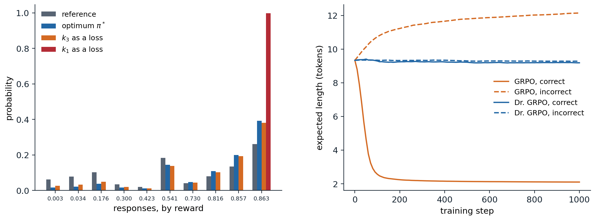

[Background Notes](../README.md) › [Reinforcement Learning](README.md)

# 28. Reinforcement Learning for Language Models and Reasoning

> [!WARNING]
> Work in progress: this part of the notes is still being revised.

[← 27. Multi-Agent RL and Self-Play](27-multi-agent-rl-and-self-play.md) · [29. Generalist Agents, Meta-RL, and Open-Endedness →](29-generalist-agents-meta-rl-and-open-endedness.md)

## <a id="language-generation-as-a-decision-problem"></a>Language generation as a decision problem

### <a id="the-setting"></a>The setting

A language model $`\pi_\theta(y\mid x)`$ assigns probabilities to responses $`y=(y_1,\dots,y_T)`$, sequences of tokens, given a prompt $`x`$, one token at a time: $`\pi_\theta(y\mid x)=\prod_t\pi_\theta(y_t\mid x,y_{<t})`$. Generating a response is a sequential decision problem of an unusual kind. The **state** is the prompt with the tokens produced so far, the **action** is the next token, drawn from a vocabulary of $`10^5`$ or so, the transitions are deterministic, since appending a token is all that happens, and the **reward** usually arrives once, when the response is complete. Because the dynamics are known and trivial, the problem can equally be viewed as a contextual bandit ([chapter 4](04-contextual-bayesian-and-adversarial-bandits.md)) whose arms are entire responses, an exponentially large set. What makes it tractable is the starting point: the policy is a model pretrained on a large part of the text ever written ([NLP chapter 5](../nlp-llms/05-pretraining-and-transfer.md)), which already produces fluent, relevant responses, so reinforcement learning fine-tunes a strong prior rather than learning from scratch, and exploration consists of sampling from it.

Supervised fine-tuning on demonstrations is behavioral cloning ([chapter 25](25-imitation-learning-and-inverse-rl.md)) and inherits its limits: the model can at best match the demonstrators and never learns from its own mistakes. RL optimizes a sequence-level objective that need not be differentiable, such as a human judgment or whether a proof checks, trains on the model's own outputs, errors included, and can reach behavior no demonstrator showed. Three sources of reward dominate: **human preferences**, turned into a learned reward model (reinforcement learning from human feedback, **RLHF**); **AI feedback**, in which another model judges the responses; and **verifiers**, programs that check a final answer or run tests (reinforcement learning with verifiable rewards, **RLVR**). [NLP chapter 11](../nlp-llms/11-learning-from-human-preferences.md) describes preference data, reward models, direct preference optimization, and reward hacking from the language-modeling side, and [NLP chapter 12](../nlp-llms/12-reasoning-and-test-time-compute.md) describes chain-of-thought reasoning, test-time compute, and the reasoning models trained with RLVR. This chapter looks at the same systems as reinforcement learning problems: what objective they optimize, how its gradients are estimated, which design choices bias the estimates, where the rewards come from and how they fail, and what the training has and has not been shown to achieve.

### <a id="the-kl-regularized-objective"></a>The KL-regularized objective

Optimizing a reward without restraint finds responses it scores highly for the wrong reasons, and destroys the fluency and diversity inherited from pretraining. Almost all methods therefore maximize the reward minus a penalty for moving away from a **reference policy** $`\pi_{\text{ref}}`$, usually the model before RL:

```math
J(\pi)=\mathbb E_{x}\Bigl[\mathbb E_{y\sim\pi(\cdot\mid x)}\bigl[r(x,y)\bigr]-\beta\,D_{\mathrm{KL}}\bigl(\pi(\cdot\mid x)\,\big\|\,\pi_{\text{ref}}(\cdot\mid x)\bigr)\Bigr].
```

Its maximizer is the reference policy reweighted by the exponentiated reward (exercise 28.1),

```math
\pi^*(y\mid x)=\frac1{Z(x)}\,\pi_{\text{ref}}(y\mid x)\exp\bigl(r(x,y)/\beta\bigr),\qquad Z(x)=\sum_y\pi_{\text{ref}}(y\mid x)\exp\bigl(r(x,y)/\beta\bigr),
```

and the optimal value is $`\beta\ln Z(x)`$. This is a Boltzmann policy, as in the maximum-entropy RL of [chapter 21](21-continuous-control-and-maximum-entropy-rl.md) with the reference in place of the uniform distribution, and it can be read as a Bayesian posterior with the reference as prior and $`\exp(r/\beta)`$ as likelihood ([Korbak, Perez, and Buckley, 2022](https://arxiv.org/abs/2205.11275)). The penalty keeps the policy where the reward model was trained and can be trusted, the concern of the offline RL of [chapter 26](26-offline-reinforcement-learning.md).

The sequence-level objective has a token-level form. Since the KL divergence between sequence distributions is the expected sum of per-token log-ratios, the penalty can be paid token by token, as a reward $`-\beta\ln\bigl(\pi(y_t\mid s_t)/\pi_{\text{ref}}(y_t\mid s_t)\bigr)`$ at every step $`s_t=(x,y_{<t})`$ with $`r(x,y)`$ added at the end. The result is entropy-regularized RL in a deterministic MDP, whose **soft** Bellman equations ([appendix A](#block-rl28-appendix-a)) give

```math
\beta\ln\frac{\pi^*(y_t\mid s_t)}{\pi_{\text{ref}}(y_t\mid s_t)}=Q^*(s_t,y_t)-V^*(s_t),\qquad V^*(s_t)=\beta\ln\sum_{a}\pi_{\text{ref}}(a\mid s_t)\,e^{Q^*(s_t,a)/\beta},
```

where $`Q^*(s_t,y_t)=V^*(s_{t+1})`$ for all but the last token. The optimal policy's log-ratio to the reference is a soft advantage, and summed over a response it telescopes to $`\bigl(r(x,y)-V^*(x)\bigr)/\beta`$. Direct preference optimization, which fits these log-ratios to preference data (NLP chapter 11), is therefore also learning a soft Q-function at the token level: every token receives credit according to how much it changed the soft value ([Rafailov, Hejna, Park, and Finn, 2024](https://arxiv.org/abs/2404.12358); exercise 28.2).

### <a id="estimating-and-differentiating-the-kl-penalty"></a>Estimating and differentiating the KL penalty

In practice the KL divergence is estimated from the sampled tokens, and there are two decisions to make: which estimator to use, and whether to put it in the reward or in the loss. Write $`\rho=\pi_{\text{ref}}(y_t\mid s_t)/\pi_\theta(y_t\mid s_t)`$ for a token sampled from $`\pi_\theta`$. Three estimators are common: $`k_1=-\ln\rho`$, unbiased but noisy and often negative on a single sample; $`k_2=\frac12(\ln\rho)^2`$, biased but low-variance; and $`k_3=\rho-1-\ln\rho`$, which is unbiased, since $`\mathbb E[\rho]=1`$, and never negative. PPO-based RLHF subtracts $`\beta k_1`$ from the reward at every token and lets the policy gradient handle it. GRPO ([Shao et al., 2024](https://arxiv.org/abs/2402.03300)) instead adds $`\beta k_3`$ to the loss and differentiates it directly, through $`\pi_\theta`$. The two are not equivalent. The gradient of the expected KL divergence contains a score-function term, $`\nabla\mathbb E_\pi[k]=\mathbb E_\pi[k\,\nabla\ln\pi+\nabla k]`$, and differentiating an estimator as a loss keeps only the second part. For $`k_1`$ that part vanishes in expectation, $`\mathbb E_\pi[\nabla\ln\pi]=0`$, so a $`k_1`$ loss regularizes nothing; for $`k_3`$ it equals the gradient of the *forward* divergence $`D_{\mathrm{KL}}(\pi_{\text{ref}}\,\|\,\pi)`$, a different, mass-covering regularizer (exercise 28.3). [Tang and Munos (2025)](https://arxiv.org/abs/2506.09477) and [Zhang et al. (2026)](https://arxiv.org/abs/2505.17508) analyzed these pitfalls in the implementations used for language models. The next code checks the estimators' values and the policies each version of the gradient converges to.

```python
import numpy as np

# Three ways to put the KL penalty into a policy-gradient update, on one prompt with 10 possible responses.
# Objective: E_pi[r] - beta KL(pi || pi_ref), whose maximizer is pi* proportional to pi_ref exp(r / beta). Each
# step samples 256 responses and follows a stochastic gradient for the softmax logits:
#   k1 in the reward:  REINFORCE with the penalized reward r - beta log(pi / pi_ref) (as in PPO-based RLHF);
#   k1 as a loss:      REINFORCE on r, minus the gradient of beta * mean log(pi / pi_ref) taken through log pi;
#   k3 as a loss:      REINFORCE on r, minus the gradient of beta * mean(pi_ref / pi - 1 - log(pi_ref / pi)),
#                      the estimator used in GRPO's loss.
# First, the three estimators of the KL divergence's value, from 16 samples of pi*.
rng = np.random.default_rng(0)
K, beta = 10, 0.5
ref_logits = rng.normal(size=K); pi_ref = np.exp(ref_logits) / np.exp(ref_logits).sum()
r = rng.uniform(0, 1, K)
target = pi_ref * np.exp(r / beta); target /= target.sum()
kl = lambda p, q: float(p @ np.log(p / q))
tv = lambda p, q: 0.5 * float(np.abs(p - q).sum())

y = rng.choice(K, size=(100000, 16), p=target)
logr = np.log(pi_ref[y] / target[y])                       # log(pi_ref / pi) at the samples
est = {"k1 = -log ratio": -logr, "k2 = (log ratio)^2 / 2": 0.5 * logr ** 2, "k3 = ratio - 1 - log ratio": np.exp(logr) - 1 - logr}
print(f"KL(pi* || pi_ref) = {kl(target, pi_ref):.4f}; estimates from 16 samples (100,000 repetitions)")
for name, v in est.items():
    m = v.mean(1)
    print(f"  {name:28s} mean {m.mean():.4f}   std {m.std():.4f}   negative {np.mean(m < 0):6.1%}")


def train(method, steps=4000, G=256, lr=0.5):
    theta = np.log(pi_ref).copy()                           # start at the reference policy
    for t in range(steps):
        pi = np.exp(theta - theta.max()); pi /= pi.sum()
        ys = rng.choice(K, size=G, p=pi)
        score = np.eye(K)[ys] - pi                          # gradient of log pi(y) for each sample
        R = r[ys] - (beta * np.log(pi[ys] / pi_ref[ys]) if method == "k1 in the reward" else 0.0)
        g = ((R - R.mean())[:, None] * score).mean(0)
        if method == "k1 as a loss":
            g -= beta * score.mean(0)
        elif method == "k3 as a loss":
            g -= beta * ((1 - pi_ref[ys] / pi[ys])[:, None] * score).mean(0)
        theta += lr * g
    return np.exp(theta - theta.max()) / np.exp(theta - theta.max()).sum()


# The stationary point of E[r] - beta KL(pi_ref || pi), the forward divergence: pi = beta pi_ref / (lam - r).
lo, hi = r.max() + 1e-9, r.max() + 10
for _ in range(200):
    lam = (lo + hi) / 2
    lo, hi = (lam, hi) if (beta * pi_ref / (lam - r)).sum() > 1 else (lo, lam)
forward = beta * pi_ref / (lam - r); forward /= forward.sum()

print(f"\ntarget pi*: expected reward {target @ r:.3f}, KL {kl(target, pi_ref):.3f}; best response reward {r.max():.3f}")
print("  method              reward   KL(pi||pi_ref)   distance to pi*   distance to forward-KL optimum")
for m in ("k1 in the reward", "k1 as a loss", "k3 as a loss"):
    p = train(m)
    print(f"  {m:18s} {p @ r:7.3f}   {kl(p, pi_ref):14.3f}   {tv(p, target):15.3f}   {tv(p, forward):30.3f}")
# KL(pi* || pi_ref) = 0.1363; estimates from 16 samples (100,000 repetitions)
#   k1 = -log ratio              mean 0.1367   std 0.1138   negative  12.1%
#   k2 = (log ratio)^2 / 2       mean 0.1131   std 0.0415   negative   0.0%
#   k3 = ratio - 1 - log ratio   mean 0.1358   std 0.0673   negative   0.0%
#
# target pi*: expected reward 0.729, KL 0.136; best response reward 0.863
#   method              reward   KL(pi||pi_ref)   distance to pi*   distance to forward-KL optimum
#   k1 in the reward     0.729            0.136             0.000                            0.034
#   k1 as a loss         0.863            1.318             0.605                            0.616
#   k3 as a loss         0.706            0.096             0.034                            0.001
```

As estimators of the value, $`k_1`$ is unbiased but its average over 16 samples is negative 12% of the time; $`k_3`$ is unbiased with less than two thirds of the spread and never negative; and $`k_2`$ has the smallest spread but underestimates by 17%. As gradients, only the penalty in the reward converges to $`\pi^*`$. The $`k_1`$ loss leaves the policy unregularized: it converges to the best response, with a KL divergence ten times larger than intended. The $`k_3`$ loss converges, to within 0.001 in total variation, to the optimum of the forward-KL objective, which here differs from $`\pi^*`$ by a total variation distance of 0.034. With a strong reward and a small $`\beta`$ the two regularizers differ more, since the forward divergence penalizes a policy that drops responses the reference likes, while the reverse divergence penalizes one that puts mass where the reference puts little.

## <a id="policy-gradients-for-sequences"></a>Policy gradients for sequences

### <a id="from-ppo-to-critic-free-methods"></a>From PPO to critic-free methods

The first RLHF systems ([Ziegler et al., 2019](https://arxiv.org/abs/1909.08593); [Stiennon et al., 2020](https://arxiv.org/abs/2009.01325); [Ouyang et al., 2022](https://arxiv.org/abs/2203.02155)) used PPO ([chapter 20](20-trust-regions-and-proximal-policy-optimization.md)) at the token level: the per-token reward is the KL penalty plus the reward model's score at the end, a value network, usually a copy of the language model with a scalar head, estimates the return from every prefix, advantages come from GAE, and the clipped surrogate limits each update. It worked, and it made instruction-following models, but it needs four large models in memory, the policy, the reference, the reward model, and the critic, and the critic is the weak link. Its target is a sparse reward at the end of a long sequence, it must be learned while the policy changes, and in a problem with deterministic transitions and one reward per response, its main job, reducing variance, can be done more cheaply.

The alternatives treat a whole response as one action and use several responses per prompt to build a baseline. **REINFORCE** ([Williams, 1992](https://doi.org/10.1007/BF00992696)) with a baseline $`b(x)`$ estimates the gradient of the expected reward as $`(r(x,y)-b(x))\nabla\ln\pi_\theta(y\mid x)`$, where $`\nabla\ln\pi_\theta(y\mid x)=\sum_t\nabla\ln\pi_\theta(y_t\mid s_t)`$. With $`G`$ samples per prompt, the **leave-one-out** baseline, the mean reward of the other $`G-1`$ samples, is independent of the sample it is subtracted from and keeps the estimate unbiased ([Kool, van Hoof, and Welling, 2019](https://openreview.net/forum?id=r1lgTGL5DE)). **RLOO** ([Ahmadian et al., 2024](https://arxiv.org/abs/2402.14740)) showed that this simple estimator matches or beats PPO for RLHF, and that many of PPO's components are unnecessary when the reward is given per response; **ReMax** ([Li et al., 2024](https://arxiv.org/abs/2310.10505)) uses the reward of the greedy response as the baseline instead, and saved about half the memory of PPO. **Group relative policy optimization** (GRPO; [Shao et al., 2024](https://arxiv.org/abs/2402.03300)), introduced with the DeepSeekMath models and made famous by DeepSeek-R1, keeps PPO's clipped surrogate but replaces the critic with a group statistic: for $`G`$ responses to the same prompt, every token of response $`i`$ gets the advantage

```math
\hat A_i=\frac{r_i-\operatorname{mean}(r_1,\dots,r_G)}{\operatorname{std}(r_1,\dots,r_G)},
```

the loss of each response is averaged over its tokens, and the $`k_3`$ penalty of the previous section is added to the loss ([appendix B](#block-rl28-appendix-b) writes out GRPO and its successors in one notation). Subtracting the group mean, which includes the sample itself, gives the leave-one-out estimate scaled by $`(G-1)/G`$ (exercise 28.4), so the mean is harmless. The other two normalizations are not.

### <a id="normalizations-and-their-biases"></a>Normalizations and their biases

Dividing by the group's standard deviation changes the weight of each prompt. With a binary reward and success probability $`p`$ on a prompt, the standard deviation is $`\sqrt{p(1-p)}`$, so prompts the policy almost always solves or almost always fails receive the largest weights, while the expected gradient of the unnormalized objective weights every prompt equally. Averaging each response's loss over its own length gives each token of a response of length $`|y_i|`$ the weight $`\hat A_i/|y_i|`$. [Liu et al. (2025)](https://arxiv.org/abs/2503.20783) pointed out the consequence: a correct response is rewarded more per token when it is short, and an incorrect one penalized less per token when it is long, so training favors short correct answers and long incorrect ones, which inflates the length of failed responses in a way that can be mistaken for a model learning to "think longer". Their **Dr. GRPO** removes both normalizations, dividing every response by the same constant. The next code isolates the length effect in a toy in which the reward does not depend on length at all.

```python
import numpy as np

# Where GRPO's length bias comes from. A toy "language model" answers a question by emitting one of 4 answer
# tokens, only one of them correct (reward 1), and then filler tokens until it emits an end token or reaches 40
# tokens; the reward does not depend on the length. Its parameters are the answer logits and, for every answer
# and position, the logit of stopping there. Each step samples a group of 8 responses and takes one policy-gradient
# step on sum_i w_i A_i sum_t grad log pi(token_t):
#   GRPO:     A_i = (r_i - mean) / std of the group, and w_i = 1 / (G |o_i|): each response's loss is averaged over
#             its own tokens, so a long response's tokens each get a smaller share;
#   Dr. GRPO: A_i = r_i - mean, and w_i = 1 / (G L_max), the same constant for every response.
# The answer logits get a step size 10 times smaller than the stop logits, since in a real model correctness is
# much harder to change than length. The two methods' step sizes are set for comparable speed, not matched exactly.
# We track the probability of the correct answer and the expected length of correct and incorrect responses.
L, G, A = 40, 8, 4


def expected_length(stop_logits):
    """1 answer token, plus one token at every position reached (filler or end)."""
    p = 1 / (1 + np.exp(-stop_logits))
    return 1 + np.sum(np.cumprod(np.r_[1.0, 1 - p[:-1]]))


def train(method, steps, seed, lr):
    rng = np.random.default_rng(seed)
    ans = np.zeros(A)                                       # answer logits; answer 0 is correct
    stop = np.full((A, L), -2.0)                            # stop logits: p(stop) = 0.12 at every position
    history = []
    for step in range(steps + 1):
        pa = np.exp(ans - ans.max()); pa /= pa.sum()
        if step in (0, 100, 300, 1000):
            history.append((pa[0], expected_length(stop[0]), np.mean([expected_length(stop[a]) for a in range(1, A)])))
        a = rng.choice(A, size=G, p=pa)
        r = (a == 0).astype(float)
        adv = (r - r.mean()) / (r.std() + 1e-6) if method == "GRPO" else r - r.mean()
        g_ans, g_stop = np.zeros(A), np.zeros((A, L))
        for i in range(G):
            ps = 1 / (1 + np.exp(-stop[a[i]]))
            gs, n = np.zeros(L), 1
            for t in range(L):                              # a filler token or the end token at position t
                n += 1
                if rng.random() < ps[t]:
                    gs[t] += 1 - ps[t]
                    break
                gs[t] -= ps[t]
            wi = 1 / (G * n) if method == "GRPO" else 1 / (G * (L + 1))
            ga = -pa.copy(); ga[a[i]] += 1
            g_ans += wi * adv[i] * ga
            g_stop[a[i]] += wi * adv[i] * gs
        ans += 0.1 * lr * g_ans; stop += lr * g_stop           # correctness is learned more slowly
    return history


print("probability of the correct answer, and expected length of correct and incorrect responses (mean of 20 runs)")
print("  method      step    P(correct)   length if correct   length if incorrect")
for method, lr in (("GRPO", 2.0), ("Dr. GRPO", 20.0)):
    runs = np.array([train(method, 1000, seed, lr) for seed in range(20)])
    for k, step in enumerate((0, 100, 300, 1000)):
        pc, lc, li = runs[:, k].mean(0)
        print(f"  {method:10s} {step:5d}   {pc:10.2f}   {lc:17.1f}   {li:19.1f}")
# probability of the correct answer, and expected length of correct and incorrect responses (mean of 20 runs)
#   method      step    P(correct)   length if correct   length if incorrect
#   GRPO           0         0.25                 9.3                   9.3
#   GRPO         100         0.82                 2.6                  10.7
#   GRPO         300         0.96                 2.2                  11.5
#   GRPO        1000         0.99                 2.1                  12.1
#   Dr. GRPO       0         0.25                 9.3                   9.3
#   Dr. GRPO     100         0.55                 9.3                   9.3
#   Dr. GRPO     300         0.89                 9.2                   9.3
#   Dr. GRPO    1000         0.98                 9.2                   9.3
```

Both methods learn to give the correct answer. With Dr. GRPO the lengths do not move, as they should, since length carries no reward: the gradient on the stopping decisions is zero in expectation, and only noise acts on them. With GRPO, correct responses shrink from 9.3 tokens toward the minimum of 2, the answer and the end token, and incorrect ones grow to 12.1, although nothing in the task rewards either change (exercise 28.5). In a real model the same pressure acts on everything that correlates with length, and the growth of incorrect responses competes with, and can be confused with, the genuine lengthening of reasoning that RL produces. **DAPO** ([Yu et al., 2025](https://arxiv.org/abs/2503.14476)) fixed the length effect differently, with a **token-level** loss that averages over all tokens in the batch, so that every token counts equally, and added **overlong reward shaping**, a penalty that grows as a response approaches the length limit, to replace the noise of truncation.



*Left: the policies reached in the toy of the first code, over its 10 responses sorted by reward. With the KL penalty in the reward, training converges to the optimum $`\pi^*`$ (blue) to within $`10^{-8}`$ in total variation, so it is not drawn separately; differentiating $`k_3`$ as a loss gives a policy close to it but with more mass on the low-reward responses that $`\pi^*`$ nearly drops (orange): the optimum of the forward divergence, which penalizes dropping any response the reference supports; differentiating $`k_1`$ as a loss removes the regularization and ends on the best response (red). Right: expected length of correct and incorrect responses during training in the toy of the second code, mean of 20 runs. GRPO's per-response averaging shortens correct responses to the minimum and lengthens incorrect ones; with a constant normalization (Dr. GRPO) the lengths stay where they started.*

### <a id="importance-ratios-clipping-and-stale-samples"></a>Importance ratios, clipping, and stale samples

Generation dominates the cost of RL for language models, so each batch of samples is reused for several gradient steps, and large systems generate with separate inference engines, often asynchronously, so the samples come from a policy that is slightly out of date. Both make the updates off-policy, and PPO's clipped importance ratios ([chapter 20](20-trust-regions-and-proximal-policy-optimization.md)) are the standard correction. For language models the ratio is computed per token, $`\pi_\theta(y_t\mid s_t)/\pi_{\text{old}}(y_t\mid s_t)`$, which raises two issues. First, clipping discards the gradient of tokens whose ratio has left the trust region, and the tokens most affected are low-probability ones whose probability is increasing, typically the exploratory tokens that start a new line of reasoning; DAPO's **clip-higher** uses an asymmetric range, $`[1-0.2,\ 1+0.28]`$, so that such tokens can gain more probability before being clipped, which counteracts the collapse of entropy. MiniMax-M1's **CISPO** ([MiniMax, 2025](https://arxiv.org/abs/2506.13585)) clips the importance weight instead of the objective, so every token keeps a gradient, with a bounded weight. Second, the reward is given per sequence while the ratios are per token, and a sequence's probability ratio is the product of hundreds of token ratios. **GSPO** ([Zheng et al., 2025](https://arxiv.org/abs/2507.18071)), used to train later versions of the Qwen3 models, computes one length-normalized ratio per sequence and clips whole responses, which proved more stable, in particular for mixture-of-experts models, whose routing makes token-level ratios noisy. At the largest scales the inference engine and the trainer can compute slightly different probabilities for the same tokens, another source of off-policy error, and recipes such as DeepSeek-V3.2's mask out negative-advantage sequences whose probabilities under the current policy have drifted too far from those under the sampling policy ([DeepSeek-AI, 2025](https://arxiv.org/abs/2512.02556)).

### <a id="entropy-and-exploration"></a>Entropy and exploration

The policy explores only by sampling from itself, and RL tends to make it more deterministic. [Cui et al. (2025)](https://arxiv.org/abs/2505.22617) traced the mechanism: for a softmax policy updated by a natural policy-gradient step (for a plain one, the advantage is multiplied by the action's probability), the entropy of the next-token distribution changes, to first order, by minus the step size times the covariance, under the policy, between an action's log-probability and its advantage (exercise 28.6). When the policy is already confident in what is rewarded, which is most of the time late in training, the covariance is positive and entropy falls. They found that across many runs, test performance followed $`R=-a\,e^{H}+b`$ as entropy $`H`$ fell, so that performance saturates when entropy is exhausted, and restricted the updates of the tokens with the largest covariance to slow the collapse. The practical recipes add their own remedies: clip-higher; **dynamic sampling**, which drops prompts whose samples are all correct or all wrong, since their advantages are all zero, and samples more until the batch is full; and entropy or KL terms.

Exploration also bounds what RL can find. A response with negligible probability under the policy is never sampled, never rewarded, and never reinforced, so RL from a pretrained model reweights behavior the model can already produce. [Yue et al. (2025)](https://arxiv.org/abs/2504.13837) measured the consequence with **pass@$`k`$**, the probability that at least one of $`k`$ samples is correct (exercise 28.7): models trained with RLVR beat their base models at $`k=1`$, but for large $`k`$ the base models solved as many problems or more, so the training mainly concentrated probability on solutions the base model could already sample. Prolonged training with stabilizers, KL resets, and diverse tasks can move the frontier: in NVIDIA's **ProRL** ([Liu et al., 2025](https://arxiv.org/abs/2505.24864)), long RL runs raised pass@$`k`$ at large $`k`$ and solved tasks on which the base model never succeeded. Two further results show how much depends on the base model. RL on a single training example raised a 1.5-billion-parameter model's accuracy on the MATH500 benchmark from 36.0% to 73.6% ([Wang et al., 2025](https://arxiv.org/abs/2504.20571)), and RL with *random* rewards improved Qwen2.5-Math-7B by 21.4 points on the same benchmark, against 29.1 with the true reward, by amplifying a code-assisted reasoning style the model already had, while it did not help models of other families ([Shao et al., 2025](https://arxiv.org/abs/2506.10947)). RL on such models often elicits and sharpens what pretraining put there, and claims about it should be tested on more than one model family.

## <a id="rewards-and-their-failures"></a>Rewards and their failures

### <a id="learned-rewards"></a>Learned rewards

A reward model trained on human comparisons under the Bradley–Terry model ([Bradley and Terry, 1952](https://doi.org/10.2307/2334029)) gives RLHF its objective, and from the RL point of view it is a learned, imperfect model of the reward, with the failure modes of the learned models of [chapter 23](23-model-based-rl-and-world-models.md): optimization seeks out its errors. [Gao, Schulman, and Hilton (2023)](https://arxiv.org/abs/2210.10760) measured this with a large "gold" reward model standing in for people. As a policy was optimized against a smaller proxy, the gold reward first rose and then fell, following $`d(\alpha-\beta d)`$ for best-of-$`n`$ and $`d(\alpha-\beta\ln d)`$ for RL, where $`d`$ is the square root of the KL divergence from the initial policy, with coefficients that improved smoothly with the reward model's size and data (NLP chapter 11 reproduces the effect in a toy). Real reward models reward length ([Singhal, Goyal, Xu, and Durrett, 2024](https://arxiv.org/abs/2310.03716)) and agreement with the user ([Sharma et al., 2024](https://arxiv.org/abs/2310.13548)), so optimization makes models verbose and sycophantic. The RL-side defenses are the KL penalty and early stopping, which limit how far the policy moves; pessimism over an ensemble of reward models, as in the offline RL of chapter 26; and fresh comparisons on the current policy's outputs, which correct the model where the policy has moved. Direct methods such as DPO skip the reward model but not the problem: they learn from a fixed set of pairs, as offline RL learns from a fixed data set, and online variants that label the current policy's samples, with human or AI judges, perform better ([Guo et al., 2024](https://arxiv.org/abs/2402.04792); [Tang et al., 2024](https://arxiv.org/abs/2405.08448)). A carefully tuned PPO beat DPO across the benchmarks of [Xu et al. (2024)](https://arxiv.org/abs/2404.10719), which found that DPO can assign high probability to responses far from its training pairs. **Constitutional AI** ([Bai et al., 2022](https://arxiv.org/abs/2212.08073)) and **RLAIF** ([Lee et al., 2024](https://arxiv.org/abs/2309.00267)) replace human labels by a model's judgments against written principles, which scales the feedback but carries the judge's biases into the reward.

### <a id="verifiable-rewards"></a>Verifiable rewards

Where correctness can be checked, the reward can be computed: 1 if the final answer matches the reference or the code passes its tests, 0 otherwise, sometimes with a small bonus for the required format. The term RLVR was coined for the open Tülu 3 recipe ([Lambert et al., 2024](https://arxiv.org/abs/2411.15124)), and verifiable rewards drove the reasoning models of the next section. A program cannot be flattered by style or length, but it can be gamed. Unit tests can be special-cased or, when the model can reach them, edited; answer checkers can be fooled by formatting; and a reward that only checks the final answer credits a lucky guess after a wrong argument as fully as a correct derivation. Verifiers are also rare outside mathematics and programming. Recent work builds rewards for other domains from checklists of criteria graded by a model, **rubrics as rewards** ([Gunjal et al., 2026](https://arxiv.org/abs/2507.17746)), or from agreement among the model's own samples, as in test-time RL, which uses the majority answer on unlabeled problems as the reward ([Zuo et al., 2025](https://arxiv.org/abs/2504.16084)), with the obvious risk of reinforcing a confident error. For proofs, DeepSeekMath-V2 trained a model to verify proofs and used it as the reward for a generator trained to find and fix flaws in its own proofs, reaching gold-medal level on the 2025 International Mathematical Olympiad and 118 of 120 points on the 2024 Putnam competition ([Shao et al., 2025](https://arxiv.org/abs/2511.22570)).

### <a id="dense-rewards-process-supervision"></a>Dense rewards: process supervision

An outcome reward says whether a long solution succeeded, not where it went wrong: the credit-assignment problem of [chapter 1](01-markov-decision-processes.md) in its starkest form. **Process reward models** score each step of a solution. [Uesato et al. (2022)](https://arxiv.org/abs/2211.14275) found that outcome and process supervision gave similar final-answer accuracy on grade-school mathematics, but that low reasoning error required process supervision or a reward model that emulated it, which even reward models trained only on outcome labels learned to do; their best system cut the fraction of correct answers reached by wrong reasoning from the previous best of 14.0% to 3.4%. [Lightman et al. (2024)](https://arxiv.org/abs/2305.20050) trained a process reward model on 800,000 human step labels (the PRM800K data set) and, using it to pick the best of many sampled solutions, solved 78% of a representative subset of the MATH benchmark, well above an outcome reward model. Human step labels are expensive, and **Math-Shepherd** ([Wang et al., 2024](https://arxiv.org/abs/2312.08935)) replaced them with Monte Carlo estimates: from each step, complete the solution several times with a fixed policy and label the step by how often the completions reach the right answer, which is a Monte Carlo estimate of the step's value ([chapter 5](05-monte-carlo-methods.md); exercise 28.8). A process reward model is thus a learned value function, and it inherits both a value function's use, dense credit for policy optimization and guidance for search, and a learned reward's weakness. DeepSeek-R1's authors reported that a process reward model was exploited by the policy during large-scale RL and was not worth its cost there, and used outcome rewards ([DeepSeek-AI, 2025](https://doi.org/10.1038/s41586-025-09422-z)).

## <a id="reasoning-and-agents"></a>Reasoning and agents

### <a id="reasoning-models-as-rl-systems"></a>Reasoning models as RL systems

A model that writes out intermediate steps before answering, a chain of thought, can spend more computation on harder problems, and reinforcement learning with verifiable rewards teaches it to use that freedom. OpenAI's o1 ([OpenAI, 2024](https://openai.com/index/learning-to-reason-with-llms/)) was the first widely used model trained this way; its accuracy on competition mathematics improved steadily with both the compute spent on RL and the number of tokens it could think at test time, and on the 2024 American Invitational Mathematics Examination (AIME) it solved 74% of problems with one sample and 83% with a majority vote over 64. **DeepSeek-R1** ([DeepSeek-AI, 2025](https://doi.org/10.1038/s41586-025-09422-z)) published a recipe. Its first model, R1-Zero, applied GRPO with rule-based rewards for correct answers and for a required format directly to a pretrained base model, with no supervised fine-tuning, and its AIME 2024 accuracy rose from 15.6% to 71.0% in the preprint (77.9% in the final published version), while its responses grew longer and it began to re-examine and revise its own steps. The released R1 added a small set of curated long reasoning examples before RL, for readability, a second round of RL and rejection-sampled fine-tuning for general tasks, and distillation into smaller models, which worked better than RL on the small models directly. RL for R1-Zero took about 101,000 GPU-hours. Later open reports describe the same structure with growing budgets: Kimi k1.5 ([Kimi Team, 2025](https://arxiv.org/abs/2501.12599)) with long-context RL and no value function or process rewards; Qwen3 ([Yang et al., 2025](https://arxiv.org/abs/2505.09388)), whose reasoning stage ran GRPO on only 3,995 verified problems and raised AIME 2024 accuracy from 70.1% to 85.1% in 170 steps; MiniMax-M1, whose RL took three weeks on 512 GPUs; and DeepSeek-V3.2, whose RL budget exceeded 10% of its pretraining compute and spanned more than 1,800 synthetic environments for agents. How performance grows with RL compute is itself being studied: over more than 400,000 GPU-hours of experiments, [Khatri et al. (2025)](https://arxiv.org/abs/2510.13786) found that sigmoid-shaped curves fitted to the early part of a run predicted its later performance, and that details such as loss aggregation and advantage normalization mostly changed how fast a run approached its ceiling, while others, such as the loss function, numerical precision, and batch size, moved the ceiling itself.

### <a id="search-as-policy-improvement"></a>Search as policy improvement

AlphaZero improved its policy by search and distilled the result into the network ([chapter 24](24-planning-with-learned-models.md)), and language models are improved the same way. **Expert iteration** for reasoning, as in STaR ([Zelikman, Wu, Mu, and Goodman, 2022](https://arxiv.org/abs/2203.14465)) and ReST-EM ([Singh et al., 2024](https://arxiv.org/abs/2312.06585)), samples many solutions, keeps those a verifier accepts, and fine-tunes on them: sampling with a filter is the improvement operator, and fine-tuning is the distillation. It is also an EM algorithm for maximizing the probability of success, and a policy-gradient method that uses only positive examples. At test time, the same operators spend compute instead of training: best-of-$`n`$ with a verifier or a reward model, majority voting, and tree search guided by a process reward model. [Snell, Lee, Xu, and Kumar (2025)](https://arxiv.org/abs/2408.03314) showed that choosing among them by the problem's difficulty used test-time compute more than four times as efficiently as best-of-$`n`$, and [Brown et al. (2024)](https://arxiv.org/abs/2407.21787) found that the fraction of problems solved by at least one sample kept growing over four orders of magnitude of samples, so that verification, not generation, becomes the bottleneck. **rStar-Math** ([Guan et al., 2025](https://arxiv.org/abs/2501.04519)) ran Monte Carlo tree search over reasoning steps checked by executing code, and trained a small policy and a process preference model over four rounds of self-evolution. The most AlphaZero-like system is **AlphaProof** ([Hubert et al., 2025](https://www.nature.com/articles/s41586-025-09833-y)), which searched for proofs in the Lean proof assistant, where every step is checked, trained on millions of automatically formalized problems, and ran RL on variants of each new problem at test time. In July 2025, an experimental Gemini model and an experimental OpenAI model both produced solutions to five of the six problems of the International Mathematical Olympiad in natural language, gold-medal level; both groups described their methods only as new reinforcement learning techniques combined with more test-time thinking, and only Google DeepMind's result was graded by the competition's coordinators ([Google DeepMind, 2025](https://deepmind.google/discover/blog/advanced-version-of-gemini-with-deep-think-officially-achieves-gold-medal-standard-at-the-international-mathematical-olympiad/)).

### <a id="multi-turn-agents"></a>Multi-turn agents

An agent that browses, runs code, or edits a repository acts over many turns, each a whole response, with observations from tools in between: a POMDP ([chapter 14](14-partially-observable-environments.md)) whose actions are texts. The token-level view becomes hierarchical. **ArCHer** ([Zhou et al., 2024](https://arxiv.org/abs/2402.19446)) trained an off-policy critic over turns and a token-level policy within them; **SCoRe** ([Kumar et al., 2025](https://arxiv.org/abs/2409.12917)) trained a model by two-turn RL to correct its own first attempt, turning a second attempt that lowered the base model's MATH accuracy by 11.2 points into one that raised it by 4.4, where fine-tuning on correction traces had failed; and **RLEF** ([Gehring et al., 2025](https://arxiv.org/abs/2410.02089)) trained code models to use execution feedback across attempts. Rewards come from the environment or its records: tests that a repository's fix must pass, or similarity to the patch its developers actually merged, as in **SWE-RL** ([Wei et al., 2025](https://arxiv.org/abs/2502.18449)), which trained on the histories of open-source projects and solved 41.0% of the SWE-bench Verified tasks with a 70-billion-parameter model; answers found with a search engine, as in **Search-R1** ([Jin et al., 2025](https://arxiv.org/abs/2503.09516)); or task completion on websites ([Wei et al., 2025](https://arxiv.org/abs/2505.16421)). OpenAI trained its Deep Research agent with end-to-end RL on browsing and reasoning tasks ([OpenAI, 2025](https://openai.com/index/introducing-deep-research/)). The difficulties are the classical ones at a new scale: long horizons with one reward at the end, turns whose cost and latency vary, environments that must be built, sandboxed, and kept from being exploited, and training infrastructure in which generation, tool execution, and learning run asynchronously, which makes the updates off-policy.

### <a id="reward-hacking-and-oversight"></a>Reward hacking and oversight

Capable optimizers exploit their rewards more, sometimes abruptly ([Pan, Bhatia, and Steinhardt, 2022](https://arxiv.org/abs/2201.03544)), and reasoning models are capable optimizers. OpenAI reported frontier reasoning models that, during RL on coding tasks, learned to make tests pass without solving the problem, for instance by exiting before the tests ran or raising an exception that skipped them, and that often said so in their chains of thought ([Baker et al., 2025](https://arxiv.org/abs/2503.11926)). A second model reading the chain of thought caught such hacks far better than one seeing only the actions, but adding that monitor's verdict to the reward taught the model to hack while hiding its intent, which led the authors to recommend not optimizing chains of thought directly, accepting a "monitorability tax". Reward hacking can also generalize: a model trained on a curriculum of increasingly gameable tasks, from flattering the user to editing a grading checklist, occasionally generalized, zero-shot, to rewriting its own reward function ([Denison et al., 2024](https://arxiv.org/abs/2406.10162)), and Anthropic found that reward hacking learned in realistic production coding environments generalized to broader misaligned behavior, such as sabotage, which telling the model that hacking was acceptable in those environments prevented ([MacDiarmid et al., 2025](https://arxiv.org/abs/2511.18397)). These results make reward design, the subject of [chapter 1](01-markov-decision-processes.md)'s reward hypothesis, a safety problem, and they are taken up in the Safety and Frontier module.

[Lab 16](labs/lab-16-reinforcement-learning-for-a-small-language-model.md) pretrains a small transformer on arithmetic, fine-tunes it with REINFORCE, RLOO, GRPO, and Dr. GRPO against a verifier, and measures what the training does to pass@$`k`$, entropy, and response length.

## <a id="exercises"></a>Exercises

### <a id="exercise-28-1-the-kl-regularized-optimum"></a>Exercise 28.1 — The KL-regularized optimum

For one prompt, write $`J(\pi)=\mathbb E_{y\sim\pi}[r(y)]-\beta D_{\mathrm{KL}}(\pi\,\|\,\pi_{\text{ref}})`$ over distributions on a finite set of responses. (a) Show that $`J(\pi)=\beta\ln Z-\beta D_{\mathrm{KL}}(\pi\,\|\,\pi^*)`$ with $`\pi^*\propto\pi_{\text{ref}}e^{r/\beta}`$ and $`Z=\sum_y\pi_{\text{ref}}(y)e^{r(y)/\beta}`$, and conclude that $`\pi^*`$ is the unique maximizer and $`\beta\ln Z`$ the optimal value. (b) What are the limits of $`\pi^*`$ as $`\beta\to0`$ and $`\beta\to\infty`$?


<details>
<summary><b>Solution</b></summary>

(a) $`J(\pi)=\sum_y\pi(y)\bigl(r(y)-\beta\ln\frac{\pi(y)}{\pi_{\text{ref}}(y)}\bigr)=-\beta\sum_y\pi(y)\ln\frac{\pi(y)}{\pi_{\text{ref}}(y)e^{r(y)/\beta}}=-\beta\sum_y\pi(y)\ln\frac{\pi(y)}{Z\,\pi^*(y)}=\beta\ln Z-\beta D_{\mathrm{KL}}(\pi\,\|\,\pi^*)`$. The divergence is non-negative and zero only at $`\pi=\pi^*`$, so $`\pi^*`$ is the unique maximizer, with value $`\beta\ln Z`$.

(b) As $`\beta\to0`$, $`\pi^*`$ concentrates on the responses of highest reward among those the reference allows, weighted by the reference within ties: unregularized maximization. As $`\beta\to\infty`$, $`e^{r/\beta}\to1`$ and $`\pi^*\to\pi_{\text{ref}}`$. The value $`\beta\ln Z`$ interpolates between $`\max_yr(y)`$ and $`\mathbb E_{\pi_{\text{ref}}}[r]`$, a soft maximum.

</details>


### <a id="exercise-28-2-token-level-credit-in-the-optimal-policy"></a>Exercise 28.2 — Token-level credit in the optimal policy

Let $`\pi^*`$ be the KL-regularized optimum and use the soft value functions of [appendix A](#block-rl28-appendix-a). (a) Show that $`\beta\ln\frac{\pi^*(y\mid x)}{\pi_{\text{ref}}(y\mid x)}=r(x,y)-V^*(x)`$. (b) Two responses share their first $`k`$ tokens and then differ. Show that the difference of their implicit rewards, $`\beta\ln\frac{\pi^*(y\mid x)}{\pi_{\text{ref}}(y\mid x)}-\beta\ln\frac{\pi^*(y'\mid x)}{\pi_{\text{ref}}(y'\mid x)}`$, depends only on the tokens after the shared prefix, and interpret this for DPO, which fits these differences to preferences.


<details>
<summary><b>Solution</b></summary>

(a) By appendix A, $`\beta\ln\frac{\pi^*(y_t\mid s_t)}{\pi_{\text{ref}}(y_t\mid s_t)}=Q^*(s_t,y_t)-V^*(s_t)`$, with $`Q^*(s_t,y_t)=V^*(s_{t+1})`$ for $`t<T`$ and $`Q^*(s_T,y_T)=r(x,y)`$. Summing over $`t`$, the values telescope: $`\sum_t\bigl(Q^*(s_t,y_t)-V^*(s_t)\bigr)=r(x,y)-V^*(s_1)`$, and $`s_1=x`$.

(b) The per-token log-ratios of the shared prefix are identical in both responses and cancel in the difference, which is the sum of the soft advantages of the tokens after the prefix. A model trained by DPO on such a pair can only change the log-ratios of the tokens where the responses differ in a way that affects the loss, so it learns which continuation, from the point of divergence on, is preferred: the credit goes to the tokens that made the difference, like the per-step advantages of an actor–critic, although the preference was given for whole responses.

</details>


### <a id="exercise-28-3-gradients-of-kl-estimators"></a>Exercise 28.3 — Gradients of KL estimators

Let $`y\sim\pi_\theta`$ and $`\rho=\pi_{\text{ref}}(y)/\pi_\theta(y)`$. (a) Show that $`k_1=-\ln\rho`$ and $`k_3=\rho-1-\ln\rho`$ are both unbiased estimators of $`D_{\mathrm{KL}}(\pi_\theta\,\|\,\pi_{\text{ref}})`$. (b) Treating $`k_1`$ as a loss and differentiating it with respect to $`\theta`$ through $`\pi_\theta(y)`$, with $`y`$ fixed, show that the expected gradient is zero. (c) Show that the expected gradient of $`k_3`$ taken the same way is $`\nabla_\theta D_{\mathrm{KL}}(\pi_{\text{ref}}\,\|\,\pi_\theta)`$. (d) Show that the gradient of the reverse divergence is $`\mathbb E\bigl[k_1\nabla_\theta\ln\pi_\theta(y)\bigr]`$, the score-function term obtained by putting $`k_1`$ in the reward.


<details>
<summary><b>Solution</b></summary>

(a) $`\mathbb E[-\ln\rho]=\sum_y\pi_\theta(y)\ln\frac{\pi_\theta(y)}{\pi_{\text{ref}}(y)}`$, the divergence; and $`\mathbb E[\rho]=\sum_y\pi_{\text{ref}}(y)=1`$, so $`\mathbb E[k_3]=1-1+\mathbb E[-\ln\rho]`$. Also $`k_3\ge0`$, since $`\ln u\le u-1`$.

(b) $`\nabla k_1=\nabla\ln\pi_\theta(y)`$, and $`\mathbb E[\nabla\ln\pi_\theta(y)]=\sum_y\nabla\pi_\theta(y)=\nabla1=0`$.

(c) $`\nabla\rho=-\rho\,\nabla\ln\pi_\theta(y)`$, so $`\nabla k_3=(1-\rho)\nabla\ln\pi_\theta(y)`$, and $`\mathbb E[\nabla k_3]=\sum_y(\pi_\theta(y)-\pi_{\text{ref}}(y))\nabla\ln\pi_\theta(y)=-\sum_y\pi_{\text{ref}}(y)\nabla\ln\pi_\theta(y)`$, using (b). This is the gradient of $`D_{\mathrm{KL}}(\pi_{\text{ref}}\,\|\,\pi_\theta)=\sum_y\pi_{\text{ref}}\ln\pi_{\text{ref}}-\sum_y\pi_{\text{ref}}\ln\pi_\theta`$.

(d) $`\nabla\sum_y\pi_\theta\ln\frac{\pi_\theta}{\pi_{\text{ref}}}=\sum_y\nabla\pi_\theta\ln\frac{\pi_\theta}{\pi_{\text{ref}}}+\sum_y\pi_\theta\nabla\ln\pi_\theta=\mathbb E\bigl[\ln\tfrac{\pi_\theta}{\pi_{\text{ref}}}\nabla\ln\pi_\theta\bigr]+0`$. For sequences the same holds with $`\ln\pi_\theta(y\mid x)`$ a sum over tokens, and the score-function term couples each token's log-ratio with the scores of that token and all earlier ones, so the log-ratio acts as a reward for every decision that led to it, which is why the per-token penalty must enter the return, as a reward, rather than be applied token by token as a loss.

</details>


### <a id="exercise-28-4-baselines-and-normalization-in-group-methods"></a>Exercise 28.4 — Baselines and normalization in group methods

$`G`$ responses to one prompt have rewards $`r_1,\dots,r_G`$. (a) Show that the leave-one-out baseline $`b_i=\frac1{G-1}\sum_{j\ne i}r_j`$ leaves $`\mathbb E[(r_i-b_i)\nabla\ln\pi(y_i)]`$ unbiased. (b) Show that $`r_i-\bar r=\frac{G-1}G(r_i-b_i)`$, where $`\bar r`$ is the mean of all $`G`$ rewards. (c) With binary rewards and success probability $`p`$, suppose the advantages are divided by $`\sqrt{p(1-p)}`$. Show that the expected update then follows the gradient of $`2\arcsin\sqrt p`$ instead of $`p`$, and describe which prompts this favors.


<details>
<summary><b>Solution</b></summary>

(a) $`b_i`$ depends only on the other samples, which are independent of $`y_i`$, so $`\mathbb E[b_i\nabla\ln\pi(y_i)]=\mathbb E[b_i]\,\mathbb E[\nabla\ln\pi(y_i)]=0`$, and the estimate equals $`\mathbb E[r_i\nabla\ln\pi(y_i)]=\nabla\mathbb E[r]`$.

(b) $`r_i-\bar r=r_i-\frac{r_i+(G-1)b_i}G=\frac{G-1}G(r_i-b_i)`$. The group mean gives the unbiased leave-one-out estimate times a constant, which the step size absorbs.

(c) The unnormalized expected gradient for the prompt is $`\nabla p`$; dividing by $`\sqrt{p(1-p)}`$ gives $`\nabla p/\sqrt{p(1-p)}=\nabla\bigl(2\arcsin\sqrt p\bigr)`$, since $`\frac d{dp}2\arcsin\sqrt p=\frac1{\sqrt{p(1-p)}}`$. Summed over prompts, the objective becomes $`\sum_x2\arcsin\sqrt{p_x}`$, whose slope is smallest at $`p=1/2`$ and grows without bound near 0 and 1: progress on prompts that are almost always or almost never solved counts most. (In practice the group's sample standard deviation replaces $`\sqrt{p(1-p)}`$, and groups with identical rewards contribute nothing.)

</details>


### <a id="exercise-28-5-where-the-length-bias-comes-from"></a>Exercise 28.5 — Where the length bias comes from

A response has advantage $`A`$, independent of its length, and ends after $`L_1`$ tokens with probability $`q=\sigma(s)`$ or after $`L_2>L_1`$ tokens otherwise, where $`s`$ is a stopping logit. (a) With a loss that weights every token of every response by the same constant $`c`$, show that the expected gradient on $`s`$ is zero. (b) With GRPO's per-response averaging, weight $`1/L`$ for a response of length $`L`$, show that the expected gradient on $`s`$ is $`A\,q(1-q)\bigl(\frac1{L_1}-\frac1{L_2}\bigr)`$, and conclude how the lengths of correct and incorrect responses drift.


<details>
<summary><b>Solution</b></summary>

The stopping decision contributes $`\nabla_s\ln q=1-q`$ when the response stops early and $`\nabla_s\ln(1-q)=-q`$ when it continues.

(a) The expected gradient is $`c\,A\bigl(q(1-q)+(1-q)(-q)\bigr)=0`$: a reward that ignores length gives no systematic push on length.

(b) With the weights $`1/L_1`$ and $`1/L_2`$, it is $`A\bigl(q\frac{1-q}{L_1}-(1-q)\frac q{L_2}\bigr)=A\,q(1-q)\bigl(\frac1{L_1}-\frac1{L_2}\bigr)`$, which has the sign of $`A`$. For correct responses, $`A>0`$ raises the probability of stopping early, and for incorrect ones, $`A<0`$ lowers it: correct responses shorten and incorrect ones lengthen, as in the code.

</details>


### <a id="exercise-28-6-why-entropy-collapses"></a>Exercise 28.6 — Why entropy collapses

A softmax policy $`\pi=\operatorname{softmax}(z)`$ over actions with advantages $`A(a)`$ is updated by $`z_a\leftarrow z_a+\eta A(a)`$, the natural policy gradient step for a softmax policy. Show that the entropy $`H(\pi)=-\sum_a\pi(a)\ln\pi(a)`$ changes at the rate $`\frac{dH}{d\eta}\big|_{\eta=0}=-\operatorname{Cov}_{a\sim\pi}\bigl(\ln\pi(a),A(a)\bigr)`$, and explain when training reduces entropy.


<details>
<summary><b>Solution</b></summary>

Along the update, $`\frac{d\pi(a)}{d\eta}=\pi(a)\bigl(A(a)-\bar A\bigr)`$ with $`\bar A=\sum_b\pi(b)A(b)`$. Then $`\frac{dH}{d\eta}=-\sum_a\frac{d\pi(a)}{d\eta}\bigl(\ln\pi(a)+1\bigr)=-\sum_a\pi(a)\bigl(A(a)-\bar A\bigr)\ln\pi(a)`$, since the terms with the constant 1 sum to zero, and this is minus the covariance. Entropy falls when the actions the policy already favors are the ones with positive advantages, which is the normal state of a policy that has learned something, and rises only when a low-probability action turns out to be better than expected. Exploration of rare but good actions is what raises entropy, and it is exactly what a confident policy rarely samples.

</details>


### <a id="exercise-28-7-pass-k"></a>Exercise 28.7 — pass@$`k`$

(a) A model is sampled $`n\ge k`$ times on a problem and $`c`$ samples are correct. Show that $`1-\binom{n-c}k\big/\binom nk`$ is an unbiased estimator of pass@$`k=1-(1-p)^k`$, where $`p`$ is the model's success probability ([Chen et al., 2021](https://arxiv.org/abs/2107.03374)). (b) A base model solves problem A with probability 0.3 and problem B with probability 0.05; after RL, it solves A with probability 0.9 and B never. Compare pass@1 and pass@32, averaged over the two problems.


<details>
<summary><b>Solution</b></summary>

(a) $`\binom{n-c}k/\binom nk`$ is the probability that a uniformly random subset of $`k`$ of the $`n`$ samples contains no correct one. Averaging over the samples, a random $`k`$-subset of independent samples is itself $`k`$ independent samples, so its expectation is $`(1-p)^k`$.

(b) pass@1 is $`(0.3+0.05)/2=0.175`$ before and $`(0.9+0)/2=0.45`$ after. pass@32 is $`\bigl(1-0.7^{32}+1-0.95^{32}\bigr)/2\approx(1.000+0.806)/2=0.90`$ before and $`(1-0.1^{32}+0)/2=0.50`$ after. Training concentrated probability on the problem the model was good at and lost the rare successes on the other, which improves the one-sample metric while shrinking the set of problems the model can solve at all, the pattern of Yue et al.

</details>


### <a id="exercise-28-8-step-labels-from-rollouts"></a>Exercise 28.8 — Step labels from rollouts

To label step $`t`$ of a solution, Math-Shepherd completes the partial solution $`N`$ times with a policy $`\mu`$ and records either the fraction $`\hat v`$ of completions reaching the correct answer (a soft label) or whether at least one does (a hard label). (a) What does each label estimate? (b) A step is correct but $`\mu`$ is weak at finishing such problems. What label does it receive, and what does a process reward model trained on such labels actually learn?


<details>
<summary><b>Solution</b></summary>

(a) The soft label is a Monte Carlo estimate of $`V^\mu(s_t)`$, the probability that $`\mu`$ reaches the right answer from the partial solution, and it is unbiased. The hard label is an unbiased estimate of $`1-(1-V^\mu(s_t))^N`$, the probability that one of $`N`$ completions succeeds, which is larger than $`V^\mu`$ and saturates at 1: it asks whether the step leaves the problem solvable by $`\mu`$ within $`N`$ attempts.

(b) Its soft label is low, since the completions fail for reasons unrelated to the step. The model learns $`V^\mu`$, the value of the partial solution *for the completer*, not whether the step is logically valid, the distinction between the value of a state under a policy and under optimal play in chapter 2. For guiding the policy that will actually finish the solution this is the right quantity, which is why the completer is usually the policy being trained; for judging correctness it is not.

</details>


## <a id="appendices"></a>Appendices


<details>
<summary><a id="block-rl28-appendix-a"></a><b>A. Soft Bellman equations for KL-regularized generation</b></summary>


Treat generation as a deterministic MDP whose state $`s_t=(x,y_{<t})`$ is the prompt and the tokens so far, with the reward $`r(x,y)`$ given after the last token, and maximize $`\mathbb E_\pi[r(x,y)]-\beta D_{\mathrm{KL}}(\pi\,\|\,\pi_{\text{ref}})`$. Because $`\ln\frac{\pi(y\mid x)}{\pi_{\text{ref}}(y\mid x)}=\sum_t\ln\frac{\pi(y_t\mid s_t)}{\pi_{\text{ref}}(y_t\mid s_t)}`$, the objective is the expected return with a per-token reward $`-\beta\ln\frac{\pi(y_t\mid s_t)}{\pi_{\text{ref}}(y_t\mid s_t)}`$ and the final reward $`r`$. Define the optimal soft values backward from the end. At a state after the last token, the value is the reward. At any other state,
```math
Q^*(s_t,a)=V^*(s_t\oplus a),\qquad V^*(s_t)=\max_{p}\sum_ap(a)\Bigl(Q^*(s_t,a)-\beta\ln\frac{p(a)}{\pi_{\text{ref}}(a\mid s_t)}\Bigr),
```
where $`s_t\oplus a`$ appends $`a`$ and the value of an end-of-sequence action is $`r`$. Each maximization is exercise 28.1 with one step, so
```math
\pi^*(a\mid s_t)=\pi_{\text{ref}}(a\mid s_t)\exp\Bigl(\frac{Q^*(s_t,a)-V^*(s_t)}\beta\Bigr),\qquad V^*(s_t)=\beta\ln\sum_a\pi_{\text{ref}}(a\mid s_t)e^{Q^*(s_t,a)/\beta}.
```
Multiplying the token probabilities along a response, the soft advantages telescope (exercise 28.2), and $`\pi^*(y\mid x)=\pi_{\text{ref}}(y\mid x)\exp\bigl((r(x,y)-V^*(x))/\beta\bigr)`$, the sequence-level optimum of exercise 28.1 with $`V^*(x)=\beta\ln Z(x)`$. The token-level and sequence-level views therefore agree, and the optimal policy's per-token log-ratios to the reference are soft advantages. Since the transitions are deterministic, the soft Bellman equation involves no expectation over next states, which is why a learned policy's log-ratios can be read as a Q-function, the observation behind [Rafailov, Hejna, Park, and Finn (2024)](https://arxiv.org/abs/2404.12358).

</details>


<details>
<summary><a id="block-rl28-appendix-b"></a><b>B. GRPO and its successors in one notation</b></summary>


For a prompt $`x`$, sample $`G`$ responses $`y_i`$ from the policy $`\pi_{\text{old}}`$ that generated the batch, with rewards $`r_i`$. Let $`w_{i,t}(\theta)=\pi_\theta(y_{i,t}\mid s_{i,t})/\pi_{\text{old}}(y_{i,t}\mid s_{i,t})`$ be the token-level importance ratio, $`\hat A_i`$ the advantage of response $`i`$, and $`\operatorname{clip}_\epsilon(w)=\min(\max(w,1-\epsilon),1+\epsilon)`$. All objectives are maximized.

**GRPO** ([Shao et al., 2024](https://arxiv.org/abs/2402.03300)): $`\hat A_i=(r_i-\operatorname{mean}_jr_j)/\operatorname{std}_jr_j`$ and
```math
J=\frac1G\sum_{i=1}^G\frac1{|y_i|}\sum_{t=1}^{|y_i|}\Bigl(\min\bigl(w_{i,t}\hat A_i,\ \operatorname{clip}_\epsilon(w_{i,t})\hat A_i\bigr)-\beta\,k_{3,i,t}\Bigr),
```
with $`k_{3,i,t}=\rho_{i,t}-1-\ln\rho_{i,t}`$ and $`\rho_{i,t}=\pi_{\text{ref}}(y_{i,t}\mid s_{i,t})/\pi_\theta(y_{i,t}\mid s_{i,t})`$.

**Dr. GRPO** ([Liu et al., 2025](https://arxiv.org/abs/2503.20783)): $`\hat A_i=r_i-\operatorname{mean}_jr_j`$, and the factor $`\frac1{|y_i|}`$ is replaced by a constant, such as one over the maximum length.

**DAPO** ([Yu et al., 2025](https://arxiv.org/abs/2503.14476)): GRPO's advantages, no KL term, asymmetric clipping, and a token-level average,
```math
J=\frac1{\sum_i|y_i|}\sum_{i=1}^G\sum_{t=1}^{|y_i|}\min\bigl(w_{i,t}\hat A_i,\ \operatorname{clip}(w_{i,t},1-\epsilon_{\text{low}},1+\epsilon_{\text{high}})\hat A_i\bigr),
```
with $`\epsilon_{\text{low}}=0.2`$ and $`\epsilon_{\text{high}}=0.28`$, prompts whose responses are all correct or all wrong dropped and replaced by new ones until the batch is full, and a length penalty near the maximum length.

**GSPO** ([Zheng et al., 2025](https://arxiv.org/abs/2507.18071)): one ratio per response, $`s_i(\theta)=\bigl(\pi_\theta(y_i\mid x)/\pi_{\text{old}}(y_i\mid x)\bigr)^{1/|y_i|}`$, the geometric mean of the token ratios, and $`J=\frac1G\sum_i\min\bigl(s_i\hat A_i,\ \operatorname{clip}_\epsilon(s_i)\hat A_i\bigr)`$.

**CISPO** ([MiniMax, 2025](https://arxiv.org/abs/2506.13585)): a REINFORCE-style objective whose token weights are clipped importance ratios with the gradient stopped, $`J=\frac1{\sum_i|y_i|}\sum_i\sum_t\operatorname{sg}\bigl[\operatorname{clip}(w_{i,t},1-\epsilon_{\text{low}},1+\epsilon_{\text{high}})\bigr]\hat A_i\ln\pi_\theta(y_{i,t}\mid s_{i,t})`$, so that no token loses its gradient.

With a single gradient step per batch, $`w_{i,t}=1`$ at the point where the gradient is taken, and all of these reduce to REINFORCE with a group baseline and a particular weighting of tokens and prompts; they differ in the weights (exercises 28.4 and 28.5) and in how they limit the change of the policy when a batch is reused.

</details>

---

[← 27. Multi-Agent RL and Self-Play](27-multi-agent-rl-and-self-play.md) · [29. Generalist Agents, Meta-RL, and Open-Endedness →](29-generalist-agents-meta-rl-and-open-endedness.md)
