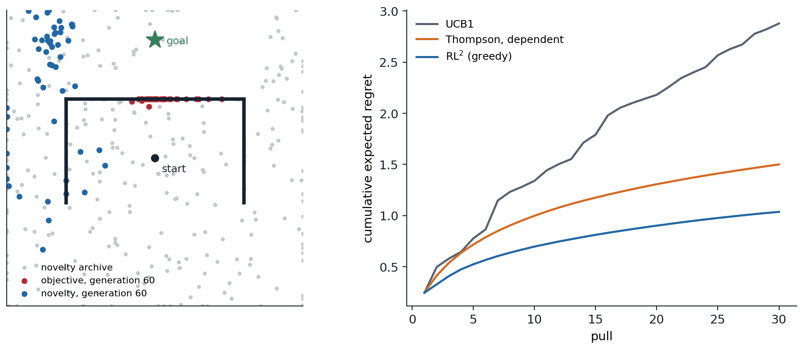

[Background Notes](../README.md) › [Reinforcement Learning](README.md)

# 29. Generalist Agents, Meta-RL, and Open-Endedness

> [!WARNING]
> Work in progress: this part of the notes is still being revised.

[← 28. Reinforcement Learning for Language Models and Reasoning](28-reinforcement-learning-for-language-models-and-reasoning.md) · [30. The Theory of Reinforcement Learning →](30-the-theory-of-reinforcement-learning.md)

## <a id="learning-to-learn"></a>Learning to learn

### <a id="the-meta-rl-problem"></a>The meta-RL problem

The agents of the previous chapters learn each task from scratch, and need thousands or millions of episodes to do it. People and animals learn a new game, a new tool, or a new route in a few tries, because they bring what they learned from similar problems. **Meta-reinforcement learning** makes this the objective. Tasks, MDPs $`\mathcal M`$ that share state and action spaces but differ in their dynamics or rewards, are drawn from a distribution $`p(\mathcal M)`$; in each task the agent interacts for a short budget, a few episodes or a few hundred steps, and it is judged by the return it collects during that budget, averaged over tasks. An **outer loop**, slow and run over many tasks, trains an **inner loop**, fast and run within each task, which is itself a learning algorithm ([Beck et al., 2025](https://doi.org/10.1561/2200000080)).

The objective has a precise meaning. If the task is unknown but drawn from a known prior, it is a hidden variable, the problem is a POMDP whose state is the pair of the environment's state and the task, and the optimal policy acts on the **belief**, the posterior over tasks given everything observed so far: a **Bayes-adaptive** MDP, as in [chapter 4](04-contextual-bayesian-and-adversarial-bandits.md#the-bandit-as-a-belief-mdp) and [chapter 14](14-partially-observable-environments.md) ([appendix A](#block-rl29-appendix-a)). The Bayes-optimal policy explores exactly as much as the information is worth for the rest of the budget, and exploits as soon as it is not. It is intractable to compute for all but tiny problems, and meta-RL can be understood as *learning* an approximation to it from samples of the task distribution. The methods differ in where the learned learning algorithm lives: in the activations of a recurrent network, in an initialization that a few gradient steps adapt, or in an explicit inference of the task.

### <a id="learning-algorithms-in-memory"></a>Learning algorithms in memory

The simplest approach gives a recurrent policy the previous action and reward along with the observation, and does not reset its memory between episodes of the same task. Trained by ordinary RL to maximize return over the whole interaction with each task, across many tasks, it must learn to learn: its only way to do well on a new task is to explore, remember what it found, and exploit it, all within its hidden state. This is **RL²** ([Duan et al., 2016](https://arxiv.org/abs/1611.02779)), proposed at the same time as "learning to reinforcement learn" ([Wang et al., 2016](https://arxiv.org/abs/1611.05763)), whose authors later argued that the prefrontal cortex, trained by dopamine-driven learning over a lifetime, works as such a learned, fast learning system ([Wang et al., 2018](https://doi.org/10.1038/s41593-018-0147-8)). The recurrent state can represent sufficient statistics of the belief, and the policy on top of it approximates the Bayes-optimal policy for the training distribution ([Ortega et al., 2019](https://arxiv.org/abs/1905.03030)). The next code trains a small GRU this way on two-armed bandits whose arms are anti-correlated, one paying with probability $`p`$ and the other with $`1-p`$, a structure a general-purpose bandit algorithm cannot exploit.

```python
import numpy as np
import torch
import torch.nn as nn

# Meta-RL with memory (RL^2) on a family of two-armed bandits with dependent arms, as in Wang et al. (2016): arm 1
# pays 1 with probability p and arm 2 with probability 1 - p, with p uniform on [0, 1], over 30 pulls. A GRU
# receives the previous arm and reward and outputs a policy; it is trained by policy gradient with a learned
# baseline across many tasks, never seeing a task twice, so it can only earn reward by learning within the episode.
# We compare its regret on new tasks with UCB1, with Thompson sampling that treats the arms as independent, and with
# Thompson sampling that knows the dependence, and then on tasks where the arms are in fact independent: uniform
# on [0, 1], as the training tasks' marginals are, or both between 0.5 and 1.
torch.set_num_threads(1); torch.manual_seed(0); rng = np.random.default_rng(0)
K, T = 2, 30


class Agent(nn.Module):
    def __init__(self, hidden=32):
        super().__init__()
        self.cell = nn.GRUCell(K + 2, hidden)
        self.pi, self.v = nn.Linear(hidden, K), nn.Linear(hidden, 1)

    def run(self, means, greedy=False):
        """Play a batch of tasks; returns log-probabilities, values, rewards, and expected rewards per step."""
        B = means.shape[0]
        h, x = torch.zeros(B, self.cell.hidden_size), torch.zeros(B, K + 2)
        out = [], [], [], []
        for t in range(T):
            h = self.cell(x, h)
            logits = self.pi(h)
            a = logits.argmax(-1) if greedy else torch.distributions.Categorical(logits=logits).sample()
            r = (torch.rand(B) < means[torch.arange(B), a]).float()
            for lst, val in zip(out, (torch.log_softmax(logits, -1)[torch.arange(B), a], self.v(h)[:, 0], r,
                                      means[torch.arange(B), a])):
                lst.append(val)
            x = torch.cat([nn.functional.one_hot(a, K).float(), r[:, None], torch.full((B, 1), (t + 1) / T)], -1)
        return [torch.stack(lst, 1) for lst in out]


agent = Agent()
opt = torch.optim.Adam(agent.parameters(), lr=3e-3)
disc = 0.9 ** torch.arange(T).float()                      # a discount of 0.9 in training, to reduce variance
for it in range(1000):
    p = torch.rand(128)
    logp, v, r, _ = agent.run(torch.stack([p, 1 - p], 1))
    ret = torch.stack([(r[:, t:] * disc[:T - t]).sum(1) for t in range(T)], 1) / 5
    adv = (ret - v).detach(); adv = (adv - adv.mean()) / (adv.std() + 1e-6)
    loss = -(logp * adv).mean() + 0.5 * ((ret - v) ** 2).mean() - 0.02 * max(0.0, 1 - it / 700) * (-logp).mean()
    opt.zero_grad(); loss.backward(); nn.utils.clip_grad_norm_(agent.parameters(), 1.0); opt.step()


def regret_baselines(means, kind):
    """Total expected regret on each task of a batch, for UCB1, Thompson sampling with independent uniform
    priors, or Thompson sampling that assumes means (p, 1 - p) with p uniform."""
    B = len(means); n, s = np.zeros((B, K)), np.zeros((B, K)); reg = np.zeros(B)
    grid = np.linspace(0.0005, 0.9995, 1000)
    for t in range(T):
        if kind == "UCB1":
            idx = np.where(n.min(1) == 0, n.argmin(1),
                           (s / np.maximum(n, 1) + np.sqrt(2 * np.log(t + 1) / np.maximum(n, 1))).argmax(1))
        elif kind == "Thompson":
            idx = rng.beta(1 + s, 1 + n - s).argmax(1)
        else:                                              # posterior over p from both arms' outcomes, on a grid
            logpost = (s[:, :1] + n[:, 1:] - s[:, 1:]) * np.log(grid) + (n[:, :1] - s[:, :1] + s[:, 1:]) * np.log(1 - grid)
            post = np.exp(logpost - logpost.max(1, keepdims=True)); post /= post.sum(1, keepdims=True)
            pk = grid[(post.cumsum(1) < rng.random((B, 1))).sum(1).clip(max=999)]
            idx = (pk < 0.5).astype(int)
        r = rng.random(B) < means[np.arange(B), idx]
        n[np.arange(B), idx] += 1; s[np.arange(B), idx] += r
        reg += means.max(1) - means[np.arange(B), idx]
    return reg.mean()


print(f"expected regret over {T} pulls (lower is better), 20,000 new tasks each")
print("  tasks                   random    UCB1   Thompson   Thompson, dependent   RL^2 sampled   RL^2 greedy")
for name, m in (("dependent arms", None), ("independent arms", rng.random((20000, K))),
                ("both in [0.5, 1]", 0.5 + 0.5 * rng.random((20000, K)))):
    if m is None:
        p = rng.random(20000); m = np.stack([p, 1 - p], 1)
    row = [T * (m.max(1) - m.mean(1)).mean(), regret_baselines(m, "UCB1"), regret_baselines(m, "Thompson"),
           regret_baselines(m, "dependent")]
    with torch.no_grad():
        mt = torch.as_tensor(m, dtype=torch.float32)
        for greedy in (False, True):
            e = agent.run(mt, greedy)[3]
            row.append((T * mt.max(1).values - e.sum(1)).mean().item())
    print(f"  {name:20s}" + "".join(f"{x:9.2f}" for x in row[:3]) + f"{row[3]:22.2f}{row[4]:15.2f}{row[5]:14.2f}")
# expected regret over 30 pulls (lower is better), 20,000 new tasks each
#   tasks                   random    UCB1   Thompson   Thompson, dependent   RL^2 sampled   RL^2 greedy
#   dependent arms           7.53     2.89     1.85                  1.50           1.13          1.02
#   independent arms         5.01     2.47     1.72                  1.67           1.44          1.40
#   both in [0.5, 1]         2.49     1.72     1.25                  1.24           1.50          1.49
```

On tasks from its training distribution, the meta-learned agent's regret, 1.02 over 30 pulls when it acts greedily, is two thirds of that of Thompson sampling that knows the arms are dependent (1.50), and about a third of UCB1's. The hand-designed algorithms are built for good worst-case or asymptotic behavior; the learned one is tuned to its task distribution, in which a pull of either arm says as much about $`p`$ as a pull of the other, so no pull ever needs to be spent on exploration: always playing the arm that currently looks better is Bayes-optimal here, with a regret of about 0.93, and the agent has learned nearly that, while Thompson sampling keeps randomizing. On independent arms with the same uniform marginals, it still does best, 1.40 against 1.72 for Thompson sampling, since its quick-commitment strategy remains reasonable. When both arms pay with probability above 0.5, a situation the training tasks never produced, where a success on one arm no longer says the other is worse, it loses to Thompson sampling (1.49 against 1.25): the learned algorithm is only as general as its task distribution. The trade is the central one of meta-learning: specialization to a distribution buys efficiency inside it and costs robustness outside it.

### <a id="gradients-and-task-inference"></a>Gradients and task inference

**Model-agnostic meta-learning** (MAML; [Finn, Abbeel, and Levine, 2017](https://arxiv.org/abs/1703.03400)) puts the inner loop in the parameters: it learns an initialization $`\theta`$ from which one or a few policy-gradient steps on a new task's data give a good policy, by differentiating the post-adaptation return with respect to $`\theta`$ through the adaptation step ([appendix B](#block-rl29-appendix-b)). Its inner loop is a real learning algorithm, so it keeps improving with more data even outside the training distribution, but a policy-gradient step needs many samples, which limits how fast it adapts. **Meta-gradient** methods apply the same idea to the hyperparameters of an RL algorithm, such as the discount and the bootstrapping parameter, adapting them online during a single training run ([Xu, van Hasselt, and Silver, 2018](https://arxiv.org/abs/1805.09801)).

**Task-inference** methods make the belief explicit. **PEARL** ([Rakelly et al., 2019](https://arxiv.org/abs/1903.08254)) trains an encoder that maps the transitions collected so far to a posterior over a latent task variable, samples a task hypothesis from it, and acts with a soft actor–critic conditioned on the sample, which is posterior sampling ([chapter 22](22-exploration-in-deep-rl.md#posterior-sampling)) with a learned posterior, and off-policy training made it 20 to 100 times more sample-efficient in meta-training than earlier methods. Posterior sampling commits to one hypothesis per episode, which is not Bayes-optimal: it never takes an action whose only value is information (exercise 29.3). **VariBAD** ([Zintgraf et al., 2020](https://arxiv.org/abs/1910.08348)) conditions the policy on the whole approximate posterior, learned with a variational autoencoder that predicts rewards and transitions, and so can learn information-gathering behavior, approximating the Bayes-optimal policy more closely.

### <a id="in-context-reinforcement-learning-and-discovered-algorithms"></a>In-context reinforcement learning and discovered algorithms

Transformers trained on long enough contexts learn in context, and RL is no exception. **Algorithm distillation** ([Laskin et al., 2023](https://arxiv.org/abs/2210.14215)) records the complete learning histories of an RL algorithm on many tasks, from its first random episodes to its final policy, and trains a transformer to predict the algorithm's actions given the history across episodes. At test time, with its weights frozen, the transformer improves from episode to episode on new tasks, and does so with less data than the algorithm it was distilled from: it has learned an improvement operator, not a policy. The context must span several episodes of improving behavior; a transformer trained on expert data alone imitates the expert and does not improve (exercise 29.4). The **decision-pretrained transformer** ([Lee et al., 2023](https://arxiv.org/abs/2306.14892)) is trained instead to predict the optimal action for a task given a context of interactions with it, and at test time behaves like posterior sampling. At a larger scale, the **Adaptive Agent** ([Adaptive Agent Team, 2023](https://arxiv.org/abs/2301.07608)), trained by RL across a vast open-ended space of 3D tasks with a transformer memory, an automatic curriculum, and distillation from earlier agents, adapted to held-out tasks within a few episodes, on the timescale of the people it was compared with.

Meta-learning can also go one level up and discover the learning rule itself. **Learned policy gradient** ([Oh et al., 2020](https://arxiv.org/abs/2007.08794)) meta-learned, across a population of agents in simple environments, the update that tells an agent what to predict and how to improve its policy, and the discovered rule transferred to Atari. **Learned policy optimization** (LPO; [Lu et al., 2022](https://arxiv.org/abs/2210.05639)) meta-learned the drift function of mirror learning, a framework of algorithms that includes PPO, and LPO and the closed-form algorithm derived from it, discovered policy optimization, performed at the state of the art on Brax continuous-control tasks and transferred to unseen settings. Scaled up, a rule discovered by meta-learning across many agents and environments, **DiscoRL**, outperformed all existing hand-designed RL rules on the Atari benchmark and generalized to benchmarks it had never been trained on ([Oh et al., 2025](https://doi.org/10.1038/s41586-025-09761-x)), evidence that the algorithms of this module may increasingly be found by search rather than derivation.

## <a id="generalist-agents"></a>Generalist agents

### <a id="goals-skills-and-zero-shot-rl"></a>Goals, skills, and zero-shot RL

A policy that can pursue many goals is the simplest kind of generalist. **Universal value function approximators** ([Schaul, Horgan, Gregor, and Silver, 2015](https://proceedings.mlr.press/v37/schaul15.html)) condition values and policies on a goal $`g`$, as $`V(s,g)`$ and $`\pi(a\mid s,g)`$, so that one network generalizes across goals as it does across states. Goal-conditioned learning has a special resource: a trajectory that failed to reach its goal did reach the states it visited, and relabeling it with those states as goals turns failures into training data for other goals, the hindsight relabeling of [chapter 31](31-reinforcement-learning-in-the-real-world.md). Goal-conditioned values can even be learned without rewards: in **contrastive RL** ([Eysenbach, Zhang, Levine, and Salakhutdinov, 2022](https://arxiv.org/abs/2206.07568)), the critic is a pair of representations trained to tell the future states of a trajectory from random ones, and their inner product corresponds to a goal-conditioned action value. An agent can also prepare for *any* reward. **Successor features** ([Barreto et al., 2017](https://arxiv.org/abs/1606.05312)) write the action values for rewards linear in known features, $`r=\phi(s)^\top w`$, as $`\psi^\pi(s,a)^\top w`$, where $`\psi^\pi`$ is the expected discounted sum of future features, so that a new reward, a new $`w`$, gives new values without learning; **generalized policy improvement** then acts greedily with respect to the best of several policies' values. **Forward–backward representations** ([Touati and Ollivier, 2021](https://arxiv.org/abs/2103.07945)) learn the features too, by factorizing the discounted occupancy measures of a family of policies, and reached about 85% of the performance of supervised RL on continuous-control tasks zero-shot, from reward-free data alone, when the data covered the environment well ([Touati, Rapin, and Ollivier, 2023](https://arxiv.org/abs/2209.14935)). Unsupervised skill discovery ([chapter 22](22-exploration-in-deep-rl.md#exploration-without-rewards)) is the policy-side counterpart: a repertoire of behaviors learned before any task is given.

### <a id="one-network-many-tasks"></a>One network, many tasks

A generalist agent is a single policy that performs well across many tasks, and the question is how far the scaling that produced language models carries over to control. Multi-task RL has a basic difficulty: tasks with larger rewards dominate the gradients. **PopArt** normalization of the value targets ([Hessel et al., 2019](https://arxiv.org/abs/1809.04474)) let a single IMPALA agent ([chapter 19](19-deep-actor-critic-and-distributed-rl.md)) exceed median human performance across the 57 Atari games. Offline data scaled further: **Gato** ([Reed et al., 2022](https://arxiv.org/abs/2205.06175)), one transformer trained by supervised learning on 604 tasks, from Atari and robot arms to captioning and chat, and **multi-game decision transformers** ([Lee et al., 2022](https://arxiv.org/abs/2205.15241)), which played 46 Atari games near human level, showed that sequence models absorb many tasks at once; and conservative offline Q-learning trained one network of up to 80 million parameters on 40 games that improved with scale ([Kumar et al., 2023](https://arxiv.org/abs/2211.15144)). Generalization to *new* tasks is harder than coverage of many. On procedurally generated benchmarks such as **Procgen** ([Cobbe, Hesse, Hilton, and Schulman, 2020](https://arxiv.org/abs/1912.01588)), agents trained on a few hundred levels overfit them and do much worse on new ones, and thousands of levels are needed to close the gap ([Kirk, Zhang, Grefenstette, and Rocktäschel, 2023](https://arxiv.org/abs/2111.09794)).

### <a id="agents-built-on-pretraining"></a>Agents built on pretraining

Open worlds show what pretraining adds. **Video pretraining** (VPT; [Baker et al., 2022](https://arxiv.org/abs/2206.11795)) trained an inverse dynamics model on a small set of labeled Minecraft play to infer the actions in 70,000 hours of unlabeled online videos, cloned the resulting behavior, and fine-tuned it by RL, and became the first agent to craft diamond tools, a task of about 24,000 actions. **DreamerV3** ([Hafner, Pasukonis, Ba, and Lillicrap, 2025](https://doi.org/10.1038/s41586-025-08744-2); [chapter 23](23-model-based-rl-and-world-models.md)) collected diamonds from scratch, without human data, with one set of hyperparameters across more than 150 tasks, and **Dreamer 4** ([Hafner, Yan, and Lillicrap, 2025](https://arxiv.org/abs/2509.24527)) collected them from offline data alone, by training its agent inside a world model fast enough to run in real time. Language models brought a different kind of prior. **Voyager** ([Wang et al., 2023](https://arxiv.org/abs/2305.16291)) played Minecraft by having a language model write code for new skills, store them in a library, and propose its own next goals, without gradient-based RL at all. The **SIMA** agents ([SIMA Team, 2024](https://arxiv.org/abs/2404.10179)) follow language instructions across many commercial 3D games through the screen and a keyboard and mouse, and **SIMA 2** ([SIMA Team, 2025](https://arxiv.org/abs/2512.04797)), built on a Gemini model, improved itself in new games with tasks and rewards generated by another model. Generative world models such as **Genie** ([Bruce et al., 2024](https://arxiv.org/abs/2402.15391)) and Genie 3, which generates explorable worlds in real time from a text prompt and in which a SIMA agent has acted ([Google DeepMind, 2025](https://deepmind.google/blog/genie-3-a-new-frontier-for-world-models/)), point toward training environments that are themselves learned.

Foundation models can also supply the pieces of an RL problem that were hand-designed. **Eureka** ([Ma et al., 2024](https://arxiv.org/abs/2310.12931)) had a language model write reward functions as code, refining them from training statistics, and its rewards beat those written by experts on 83% of 29 robot tasks. **Motif** ([Klissarov et al., 2024](https://arxiv.org/abs/2310.00166)) turned a language model's preferences between pairs of game messages in NetHack into an intrinsic reward, which alone led to higher game scores than training on the score itself; **ELLM** ([Du et al., 2023](https://arxiv.org/abs/2302.06692)) used a language model to suggest plausible goals to explore. These methods import common sense, and with it the biases and exploitable errors of learned rewards discussed in [chapter 28](28-reinforcement-learning-for-language-models-and-reasoning.md).

### <a id="robot-foundation-models-and-reinforcement-learning"></a>Robot foundation models and reinforcement learning

The robot policies of [chapter 25](25-imitation-learning-and-inverse-rl.md) became generalists by imitation at scale. **RT-1** ([Brohan et al., 2023](https://arxiv.org/abs/2212.06817)) trained a transformer on 130,000 real demonstrations; **RT-2** ([Brohan et al., 2023](https://arxiv.org/abs/2307.15818)) fine-tuned a vision–language model to output actions as tokens, a **vision–language–action** model (VLA), which transferred knowledge from the web to robot control; the **Open X-Embodiment** data set pooled the demonstrations of 22 robots from 21 institutions ([Open X-Embodiment Collaboration, 2024](https://arxiv.org/abs/2310.08864)); and open models followed, **Octo** ([Octo Model Team, 2024](https://arxiv.org/abs/2405.12213)), **OpenVLA** ([Kim et al., 2024](https://arxiv.org/abs/2406.09246)), and **π0** and **π0.5** ([Black et al., 2025](https://arxiv.org/abs/2410.24164); [Physical Intelligence et al., 2025](https://arxiv.org/abs/2504.16054)), the latter aimed at cleaning tasks in homes never seen in training. Imitation caps these policies at the quality and coverage of their demonstrations, and RL fine-tuning has begun to lift the cap, as it did for language models. Physical Intelligence's **π\*0.6** ([Physical Intelligence et al., 2025](https://arxiv.org/abs/2511.14759)) improved a VLA from its own autonomous experience and occasional human corrections, with a value function trained on that experience and a policy conditioned on the advantage of its actions, and more than doubled its throughput on some of the hardest tasks while roughly halving failures. [Liu et al. (2025)](https://arxiv.org/abs/2505.19789) found that RL fine-tuning generalized better than supervised fine-tuning to new objects, instructions, and initial positions, though no better to new backgrounds and textures, and methods such as **SimpleVLA-RL** ([Li et al., 2026](https://arxiv.org/abs/2509.09674)) apply the group-based policy gradients of chapter 28 to VLAs in simulation. [Chapter 31](31-reinforcement-learning-in-the-real-world.md) takes up what it takes to run RL on physical systems.

## <a id="open-endedness"></a>Open-endedness

### <a id="when-objectives-mislead"></a>When objectives mislead

Every agent so far has optimized a fixed objective. Many of the most impressive processes we know, biological evolution, science, culture, have no fixed objective and keep producing new and more complex things, and **open-endedness** is the study of how to build such processes ([Hughes et al., 2024](https://arxiv.org/abs/2406.04268); [Clune, 2019](https://arxiv.org/abs/1905.10985)). A first lesson is that objectives can be deceptive: the stepping stones to a goal need not resemble the goal, and a search that rewards resemblance can be trapped. **Novelty search** ([Lehman and Stanley, 2011](https://doi.org/10.1162/EVCO_a_00025)) drops the objective and rewards behavior that differs from what has been seen before, measured in a space of behavior descriptors; **quality-diversity** algorithms such as **MAP-Elites** ([Mouret and Clune, 2015](https://arxiv.org/abs/1504.04909)) keep the best solution found in each cell of a grid over the behavior space, building a whole repertoire. Go-Explore ([chapter 22](22-exploration-in-deep-rl.md#montezuma-s-revenge-and-go-explore)) applied the same principle to hard-exploration games. The next code shows the trap in a deceptive maze, a classic test for these methods.

```python
import numpy as np

# Deception and novelty. A point robot starts at (0, 0) inside a cup, open at the bottom, and must reach the goal at
# (0, 0.8), above the cup's closed top (walls: y = 0.4 for |x| <= 0.6, and x = +-0.6 for -0.3 <= y <= 0.4). A policy
# is a sequence of 12 moves of length at most 0.3; a move that would cross a wall stops just before it. Three
# evolutionary searches over policies (population 50, Gaussian mutation, 300 generations) differ only in what they
# select for: the objective (closeness of the final position to the goal), novelty (mean distance of the final
# position to its 10 nearest neighbors among the population and an archive of past behaviors), or MAP-Elites (the
# best policy by the objective in each cell of a 20 x 20 grid over final positions, parents drawn from all cells).
WALLS = [((-0.6, 0.4), (0.6, 0.4)), ((-0.6, -0.3), (-0.6, 0.4)), ((0.6, -0.3), (0.6, 0.4))]
GOAL, STEPS, POP, GENS = np.array([0.0, 0.8]), 12, 50, 300


def final_positions(pop):
    """Final positions of a population of policies, simulated together."""
    p = np.zeros((len(pop), 2))
    for move in pop.reshape(len(pop), STEPS, 2).transpose(1, 0, 2):
        n = np.linalg.norm(move, axis=1, keepdims=True)
        q = np.clip(p + move * np.minimum(1, 0.3 / np.maximum(n, 1e-12)), -1, 1)
        d, t_hit = q - p, np.ones(len(p))
        for a, b in WALLS:                                 # where each segment crosses each wall, if it does
            e, f = np.subtract(b, a), np.subtract(a, p)
            den = d[:, 0] * e[1] - d[:, 1] * e[0]
            ok = np.abs(den) > 1e-12
            t = np.where(ok, (f[:, 0] * e[1] - f[:, 1] * e[0]) / np.where(ok, den, 1), 2)
            u = np.where(ok, (f[:, 0] * d[:, 1] - f[:, 1] * d[:, 0]) / np.where(ok, den, 1), 2)
            hit = ok & (t >= 0) & (t <= 1) & (u >= 0) & (u <= 1)
            t_hit = np.where(hit, np.minimum(t_hit, np.maximum(0, t - 1e-3)), t_hit)
        p = p + d * t_hit[:, None]
    return p


def search(kind, seed):
    rng = np.random.default_rng(seed)
    pop = rng.normal(0, 0.1, (POP, 2 * STEPS))
    archive, elites, best = [], {}, np.inf
    for g in range(GENS):
        pos = final_positions(pop)
        dist = np.linalg.norm(pos - GOAL, axis=1)
        best = min(best, dist.min())
        if best < 0.1:
            return g, best
        if kind == "MAP-Elites":
            for x, p_, d in zip(pop, pos, dist):
                cell = tuple(np.minimum(((p_ + 1) / 2 * 20).astype(int), 19))
                if cell not in elites or d < elites[cell][1]:
                    elites[cell] = (x, d)
            keys = list(elites)
            parents = np.array([elites[keys[i]][0] for i in rng.integers(len(keys), size=POP)])
        else:
            if kind == "objective":
                score = -dist
            else:
                ref = np.array(archive + list(pos))
                dd = np.linalg.norm(pos[:, None] - ref[None], axis=2)
                score = np.sort(dd, 1)[:, 1:11].mean(1)               # skip the distance to itself
                archive += [p_ for p_ in pos[rng.random(POP) < 0.1]]  # archive a random tenth of behaviors
            parents = pop[np.argsort(-score)[:POP // 5]][rng.integers(POP // 5, size=POP)]
        pop = parents + rng.normal(0, 0.05, parents.shape)
    return None, best


print("generations to put a robot within 0.1 of the goal (of 300), over 20 runs, and the closest approach")
for kind in ("objective", "novelty", "MAP-Elites"):
    res = [search(kind, seed) for seed in range(20)]
    solved = [g for g, _ in res if g is not None]
    med = f"median {np.median(solved):4.0f} generations" if solved else " " * 22
    print(f"  {kind:11s} solved {len(solved):2d}/20   {med}   median closest distance {np.median([b for _, b in res]):.2f}")
stuck = np.linalg.norm(final_positions(np.tile([0.0, 0.3], (1, STEPS)))[0] - GOAL)
print(f"  (going straight up stops under the cup's top, {stuck:.2f} from the goal)")
# generations to put a robot within 0.1 of the goal (of 300), over 20 runs, and the closest approach
#   objective   solved  0/20                            median closest distance 0.40
#   novelty     solved 15/20   median   79 generations   median closest distance 0.09
#   MAP-Elites  solved  8/20   median  206 generations   median closest distance 0.13
#   (going straight up stops under the cup's top, 0.40 from the goal)
```

Selecting for closeness to the goal fails in every run: the population climbs straight up and stops under the cup's top, 0.40 from the goal, since every path around the cup first leads *away* from it (exercise 29.8). Novelty search, which ignores the goal, succeeds in 15 of 20 runs, after a median of 79 generations: rewarded only for going where no one has been, the population spreads out of the cup's open bottom, around its sides, and eventually past the goal. MAP-Elites succeeds in 8 of 20, more slowly, since it divides its effort evenly among all the regions it has reached rather than pushing its frontier outward. Novelty works here because the behavior descriptor, the final position, is small and aligned with the task; in a space with many irrelevant ways to be novel, it would spread effort thinly, the noisy-TV problem of curiosity in chapter 22 (exercise 29.7).



*Left: the deceptive maze of the second code (seed 0) after 60 generations. Selection by closeness to the goal has piled the population under the cup's top (red), while selection by novelty has spread it out through the cup's open bottom and around its sides toward the goal (blue), leaving an archive of past behaviors across the arena (gray). Right: cumulative expected regret on the dependent bandits of the first code, over 20,000 new tasks. The meta-learned agent's regret grows fastest in the first few pulls and ever more slowly afterward, while UCB1's keeps growing at a nearly steady rate as it keeps exploring (a separate evaluation from the code's, in which the agent's regret after 30 pulls is 1.04).*

### <a id="generating-the-environments"></a>Generating the environments

An open-ended system must keep producing problems that are neither trivial nor impossible for its current learners. **POET** ([Wang, Lehman, Clune, and Stanley, 2019](https://arxiv.org/abs/1901.01753); [Wang et al., 2020](https://arxiv.org/abs/2003.08536)) co-evolved a population of terrains for a walking robot with a population of agents, admitting a new terrain only if some agent found it neither too easy nor too hard, and transferring agents between terrains; some of its agents solved terrains that could not be solved by training on them directly, reaching them through stepping stones. **Unsupervised environment design** made the environment generator a learner. In **PAIRED** ([Dennis et al., 2020](https://arxiv.org/abs/2012.02096)), an adversary designs levels to maximize the **regret** of a protagonist agent, the gap between the return of a second, antagonist agent and the protagonist's; unlike an adversary that minimizes the protagonist's return, which would propose impossible levels, a regret-maximizing adversary proposes levels that are solvable but not yet solved (exercise 29.5). **Prioritized level replay** (PLR; [Jiang, Grefenstette, and Rocktäschel, 2021](https://arxiv.org/abs/2010.03934)) is simpler, and in its robust form has worked better: it samples procedurally generated levels at random, scores each by the agent's recent value-prediction error as an estimate of learning potential (exercise 29.6), and replays high-scoring levels more often, which, combined with the previous best method, UCB-DrAC, raised mean test return on Procgen 76% above that of standard PPO and 28% above UCB-DrAC alone; its robust variant trains only on replayed levels and approximates the minimax-regret objective ([Jiang et al., 2021](https://arxiv.org/abs/2110.02439)), and **ACCEL** ([Parker-Holder et al., 2022](https://arxiv.org/abs/2203.01302)) edits high-regret levels to grow a curriculum at the frontier of the agent's ability. The same ideas scale: DeepMind's XLand agents, trained on millions of tasks drawn from a generated space of billions, generalized zero-shot to held-out ones ([Open Ended Learning Team, 2021](https://arxiv.org/abs/2107.12808)), and **Kinetix** ([Matthews, Beukman, Lu, and Foerster, 2025](https://arxiv.org/abs/2410.23208)) trained one agent on tens of millions of generated 2D physics tasks, which then solved unseen human-designed tasks zero-shot.

### <a id="open-endedness-with-foundation-models"></a>Open-endedness with foundation models

What makes a new problem *interesting* is hard to define, and foundation models, trained on human culture, can stand in for human judgment. **OMNI** ([Zhang, Lehman, Stanley, and Clune, 2024](https://arxiv.org/abs/2306.01711)) had a language model judge which of the tasks an agent could learn next were interesting, focusing its curriculum; **OMNI-EPIC** ([Faldor, Zhang, Cully, and Clune, 2025](https://arxiv.org/abs/2405.15568)) went further and had models write new environments, with their reward functions, as code, producing an open-ended stream of tasks. The same loop, a model proposing, an evaluator scoring, an archive keeping the stepping stones, now drives systems beyond RL environments. **AlphaEvolve** ([Novikov et al., 2025](https://arxiv.org/abs/2506.13131)) evolved programs with a language model as the mutation operator and automated evaluators as the fitness, and found, among other results, a way to multiply $`4\times4`$ complex matrices with 48 scalar multiplications, the first improvement on Strassen's algorithm for this case in 56 years. The **Darwin Gödel Machine** ([Zhang et al., 2026](https://arxiv.org/abs/2505.22954)) kept an archive of coding agents that rewrote their own code, and improved its success on the SWE-bench benchmark from 20.0% to 50.0%, and automated agent design ([Hu, Lu, and Clune, 2025](https://arxiv.org/abs/2408.08435)) and "AI scientist" systems ([Lu et al., 2024](https://arxiv.org/abs/2408.06292)) apply the loop to designing agents and doing research. Open-ended systems are open-ended in what they produce, including behavior their designers did not anticipate, and systems that modify themselves or generate their own objectives raise the questions of oversight taken up in the Safety and Frontier module.

## <a id="exercises"></a>Exercises

### <a id="exercise-29-1-the-value-of-exploring"></a>Exercise 29.1 — The value of exploring

A two-armed bandit has a known arm that pays 1 with probability $`q`$ and an unknown arm that pays 1 with probability $`p`$, with a uniform prior on $`p`$. (a) With $`q=0.5`$ and a horizon of 2 pulls, compute the Bayes-optimal expected total reward of pulling the unknown arm first and of pulling the known arm first. (b) Repeat with $`q=0.6`$. (c) What do the two cases say about when a Bayes-optimal agent explores, and what must a meta-learned agent learn about its horizon?


<details>
<summary><b>Solution</b></summary>

After one success, the posterior mean of $`p`$ is $`2/3`$; after one failure, $`1/3`$ (a uniform prior is $`\operatorname{Beta}(1,1)`$).

(a) Unknown first: $`\frac12+\frac12\max(\frac23,\frac12)+\frac12\max(\frac13,\frac12)=\frac12+\frac13+\frac14=\frac{13}{12}\approx1.083`$. Known first: $`\frac12`$, after which nothing has been learned about $`p`$, whose mean is still $`\frac12`$, so the total is $`1`$. Exploring is worth $`1/12`$.

(b) Unknown first: $`\frac12+\frac12\cdot\frac23+\frac12\cdot0.6=1.133`$; known first: $`0.6+0.6=1.2`$. Exploiting the known arm is better.

(c) Exploration is worth its immediate cost only if the information can be used for long enough afterward: with two pulls, the unknown arm's expected payoff must be close to the known one's. With longer horizons the value of information grows, and even with $`q=0.6`$ exploring eventually pays. A Bayes-optimal policy therefore depends in general on the remaining horizon, which is why the agent of the code receives the time as an input, and a meta-learned agent is tuned to the horizon it was trained on. (In the code's dependent bandits a pull of either arm is equally informative about $`p`$, so there the Bayes-optimal policy is simply greedy at every horizon.)

</details>


### <a id="exercise-29-2-the-maml-meta-gradient"></a>Exercise 29.2 — The MAML meta-gradient

MAML adapts parameters $`\theta`$ by one gradient step, $`\theta'=\theta-\alpha\nabla_\theta L_{\text{tr}}(\theta)`$, and minimizes $`L_{\text{te}}(\theta')`$. (a) Show that $`\nabla_\theta L_{\text{te}}(\theta')=\bigl(I-\alpha\nabla^2_\theta L_{\text{tr}}(\theta)\bigr)\nabla_{\theta'}L_{\text{te}}(\theta')`$. (b) What does first-order MAML drop, and when is that reasonable? (c) In RL, $`L_{\text{tr}}`$ is estimated from trajectories sampled with $`\pi_\theta`$. What additional dependence on $`\theta`$ does this create, and what behavior does ignoring it fail to learn?


<details>
<summary><b>Solution</b></summary>

(a) By the chain rule, $`\nabla_\theta L_{\text{te}}(\theta')=(\partial\theta'/\partial\theta)^\top\nabla_{\theta'}L_{\text{te}}(\theta')`$, and $`\partial\theta'/\partial\theta=I-\alpha\nabla^2L_{\text{tr}}(\theta)`$, which is symmetric.

(b) First-order MAML replaces the Jacobian by the identity, using $`\nabla_{\theta'}L_{\text{te}}(\theta')`$ as the meta-gradient. It avoids second derivatives and works well when the inner step is small or the loss nearly linear, with little curvature, since then the Hessian term changes the direction little.

(c) The distribution of the inner-loop trajectories depends on $`\theta`$, so the post-adaptation return also depends on $`\theta`$ through *which data the pre-adaptation policy collects*. The exact gradient includes a score-function term, the post-adaptation return times $`\nabla_\theta\ln\pi_\theta`$ of the pre-adaptation trajectories ([appendix B](#block-rl29-appendix-b)). Ignoring it gives no credit to pre-adaptation behavior for gathering informative data, so the meta-learned policy does not learn to explore in order to adapt, the main skill a meta-RL agent needs.

</details>


### <a id="exercise-29-3-where-posterior-sampling-falls-short"></a>Exercise 29.3 — Where posterior sampling falls short

A reward of 1 is behind one of two doors, left or right, with equal prior probability; opening a door ends the episode. Before choosing, the agent may walk to a signpost that tells it which door is correct, at a cost $`c`$. (a) What is the expected return of posterior sampling, which samples a hypothesis about the door and acts optimally for it? (b) Of the Bayes-optimal policy? (c) Which of the meta-RL methods in the text can learn the Bayes-optimal behavior?


<details>
<summary><b>Solution</b></summary>

(a) Under either sampled hypothesis, the optimal plan walks straight to that door, since reading the sign is useless when the answer is known. Posterior sampling never reads the sign, and opens the correct door half the time: expected return $`1/2`$.

(b) The Bayes-optimal policy reads the sign when $`1-c>1/2`$, that is, when $`c<1/2`$, and earns $`1-c`$; otherwise it guesses.

(c) The sign has value only under uncertainty, and no single hypothesis makes it worth reading. Methods that condition on a sampled hypothesis, such as PEARL, cannot learn to read it; methods whose policy sees the whole belief, such as RL² through its memory or VariBAD through its posterior, can, because in the belief state before reading the sign, reading it is the best action.

</details>


### <a id="exercise-29-4-what-algorithm-distillation-needs"></a>Exercise 29.4 — What algorithm distillation needs

(a) Why must the transformer's context span several episodes of the source algorithm's learning history, rather than one? (b) What would a transformer trained on the histories of an already-converged expert learn to do on a new task? (c) Why can the distilled model improve faster than the algorithm whose histories it was trained on?


<details>
<summary><b>Solution</b></summary>

(a) To predict the source algorithm's next action, the model must infer how far its learning has progressed and what it has learned so far, which is visible only in how behavior changes across episodes. Within a single episode there is no improvement to imitate.

(b) An expert's history shows the same good behavior from the start, so the model learns to imitate the expert's policy, conditioned at best on cues that identify the task; if the task cannot be identified from a single episode, it has no learning signal to imitate, and it does not improve from episode to episode.

(c) The model was trained to predict the source's behavior from histories that were subsampled, so it learns a compressed improvement operator; and in context it is not bound to the source's step sizes or its forgetting, only to the pattern "given this experience, behave like a learner that has seen it". Laskin et al. found the distilled agents more data-efficient than their sources, mostly because the sources were distributed algorithms whose many actors each learned from little data, and, with histories subsampled every tenth episode, also more data-efficient than a single-stream source; the sources still reached slightly higher final returns.

</details>


### <a id="exercise-29-5-why-regret-not-return"></a>Exercise 29.5 — Why regret, not return

An adversary proposes levels for a protagonist agent. Some levels are unsolvable, with optimal return 0; the others have optimal return 1. (a) Which levels does an adversary that minimizes the protagonist's return propose? (b) Which does an adversary that maximizes the protagonist's regret, $`V^*(\text{level})-V^{\text{protagonist}}(\text{level})`$, propose? (c) PAIRED does not know $`V^*`$. What does it use instead, and what can go wrong?


<details>
<summary><b>Solution</b></summary>

(a) Unsolvable levels, where the protagonist's return is 0 whatever it does: the adversary always wins, and the protagonist receives no learning signal.

(b) Solvable levels on which the protagonist fails, since unsolvable levels have regret 0: exactly the levels at the edge of its ability. If the game reaches an equilibrium, the protagonist's policy minimizes its worst-case regret over levels.

(c) It replaces $`V^*`$ by the return of a second learner, the antagonist, allied with the adversary. The regret estimate is then only as good as the antagonist: if the antagonist also fails on a level, the level looks uninteresting even when it is solvable; and the three-learner game can be slow and unstable to train, which is part of why simpler replay-based methods such as PLR often work better.

</details>


### <a id="exercise-29-6-learning-potential-from-value-errors"></a>Exercise 29.6 — Learning potential from value errors

Robust PLR scores a level by the average of the positive parts of the agent's value errors on it (the original PLR used their magnitudes). Consider a one-step level on which the agent succeeds, with return 1, with probability $`q`$ and fails, with return 0, otherwise, and whose value estimate has converged to $`V=q`$. (a) Compute the expected positive value error $`\mathbb E[\max(G-V,0)]`$ as a function of $`q`$. (b) Which levels does PLR prioritize, and why is that a good curriculum?


<details>
<summary><b>Solution</b></summary>

(a) With probability $`q`$ the error is $`1-q`$, and otherwise it is $`-q`$, whose positive part is 0. The expected positive error is $`q(1-q)`$.

(b) The score is 0 for levels the agent always solves or never solves and largest, $`1/4`$, at $`q=1/2`$. PLR replays levels the agent solves sometimes, where the policy gradient's signal is strongest, since the variance of the return, $`q(1-q)`$ here, is what gives the gradient something to distinguish; this is the same frontier that exercise 28.4 found GRPO's normalization to weight away from. While the value estimate still lags the true success rate, the score also rises on levels whose success rate has changed, which points the curriculum at what the agent is currently learning.

</details>


### <a id="exercise-29-7-novelty-and-density"></a>Exercise 29.7 — Novelty and density

(a) Novelty search rewards the mean distance from a behavior to its $`k`$ nearest neighbors among past behaviors. Relate this score to a density estimate of past behaviors in a $`d`$-dimensional descriptor space, and to the count-based bonuses of chapter 22. (b) Why would novelty search fail in the maze of the code if the behavior descriptor were the whole 24-number policy instead of the final position?


<details>
<summary><b>Solution</b></summary>

(a) If past behaviors have density $`\rho`$ near a point, the distance to the $`k`$-th nearest neighbor $`r_k`$ satisfies $`\rho\cdot c_dr_k^d\approx k/n`$ for $`n`$ behaviors, where $`c_d`$ is the volume of the unit ball, so the novelty score is roughly proportional to $`\rho^{-1/d}`$: a decreasing function of the estimated visitation density, like the pseudo-count bonus $`1/\sqrt{\hat N}`$ of chapter 22. Both reward going where the agent has rarely been.

(b) Almost every change to the policy produces a novel point in a 24-dimensional space, so novelty would reward random drift in parameters, most of which do not change where the robot ends up, for instance changes to moves that are blocked by walls. The descriptor must capture the behavior that matters for the task, and choosing it is where the designer's knowledge enters.

</details>


### <a id="exercise-29-8-the-deception-measured"></a>Exercise 29.8 — The deception, measured

In the maze of the code, the robot starts at $`(0,0)`$, 0.8 from the goal at $`(0,0.8)`$. (a) Show that every path to the goal passes through a point at least 1.1 from the goal. (b) What is the shortest path length to the goal, and could 12 moves of length 0.3 cover it? (c) Explain why a search that only keeps the policies closest to the goal cannot find the path.


<details>
<summary><b>Solution</b></summary>

(a) The cup's walls block every direction except its open bottom, between $`x=-0.6`$ and $`x=0.6`$ at $`y=-0.3`$, so any path to the goal passes through a point with $`y\le-0.3`$, whose distance to $`(0,0.8)`$ is at least $`0.8+0.3=1.1`$.

(b) The shortest path goes from $`(0,0)`$ to the corner $`(0.6,-0.3)`$, up the outside of the wall to $`(0.6,0.4)`$, and to the goal: $`\sqrt{0.6^2+0.3^2}+0.7+\sqrt{0.6^2+0.4^2}\approx0.671+0.7+0.721=2.09`$, well within the 3.6 that 12 moves of 0.3 can cover.

(c) The best policies under the objective sit under the cup's top, 0.40 from the goal; every policy on the way around is much worse, at least 1.1 away at the opening and at least 0.72 away while it climbs the outside of the cup, and is discarded. A path to the goal requires a chain of policies that first get worse, which selection by the objective never keeps, while selection by novelty keeps exactly those.

</details>


## <a id="appendices"></a>Appendices


<details>
<summary><a id="block-rl29-appendix-a"></a><b>A. Meta-RL as a Bayes-adaptive MDP</b></summary>


Let tasks $`\mathcal M`$ be drawn from a prior $`p(\mathcal M)`$, all sharing state and action spaces, and let the agent interact with one sampled task for $`H`$ steps. Its history $`h_t=(s_0,a_0,r_0,\dots,s_t)`$ determines a posterior $`b_t(\mathcal M)=p(\mathcal M\mid h_t)`$, updated by Bayes' rule after each transition,
```math
b_{t+1}(\mathcal M)\propto b_t(\mathcal M)\,P_{\mathcal M}(s_{t+1}\mid s_t,a_t)\,p_{\mathcal M}(r_t\mid s_t,a_t).
```
The pair $`(s_t,b_t)`$ is a Markov state for the problem of maximizing $`\mathbb E\bigl[\sum_{t<H}r_t\bigr]`$ with $`\mathcal M`$ unknown: the **Bayes-adaptive MDP**. Its Bellman equation is
```math
V_t(s,b)=\max_a\Bigl(\mathbb E_{\mathcal M\sim b}\bigl[r_{\mathcal M}(s,a)\bigr]+\mathbb E\bigl[V_{t+1}(s',b')\bigr]\Bigr),
```
where the expectation is over $`\mathcal M\sim b`$, then $`(r,s')`$ from $`\mathcal M`$, and $`b'`$ is the updated belief. The optimal policy's value of an action includes the value of what the action reveals, through $`b'`$, which is why the Bayes-optimal agent explores exactly as much as it pays.

The meta-RL objective, the expected return over tasks drawn from $`p(\mathcal M)`$ within the budget, is the value of the BAMDP at the prior. A recurrent policy $`\pi(a_t\mid\text{GRU}(h_t))`$ can represent the Bayes-optimal policy if its hidden state can represent a sufficient statistic of the belief, the successes and failures of each arm in the code, and RL on tasks sampled from the prior optimizes exactly the BAMDP's objective; what is learned is limited by the network, the optimization, and the tasks seen. This is the sense in which a memory-based meta-learner, trained on a task distribution, implements an approximately Bayes-optimal learning algorithm for it ([Ortega et al., 2019](https://arxiv.org/abs/1905.03030)), and why it can beat algorithms designed for worst-case guarantees, as in the code, but only on tasks resembling its prior.

</details>


<details>
<summary><a id="block-rl29-appendix-b"></a><b>B. The MAML meta-gradient for reinforcement learning</b></summary>


For a task, let $`J(\theta)=\mathbb E_{\tau\sim\pi_\theta}[R(\tau)]`$. MAML adapts with a policy-gradient step estimated from $`N`$ trajectories $`\tau_{1:N}`$ sampled with $`\pi_\theta`$, $`\theta'(\theta,\tau_{1:N})=\theta+\alpha\hat g(\theta,\tau_{1:N})`$ with $`\hat g=\frac1N\sum_iR(\tau_i)\nabla_\theta\ln\pi_\theta(\tau_i)`$, and maximizes the expected post-adaptation return
```math
\mathcal J(\theta)=\mathbb E_{\tau_{1:N}\sim\pi_\theta}\bigl[J(\theta'(\theta,\tau_{1:N}))\bigr].
```
Both the adapted parameters and the distribution of the pre-adaptation trajectories depend on $`\theta`$, so
```math
\nabla_\theta\mathcal J=\mathbb E_{\tau_{1:N}}\Bigl[\Bigl(\frac{\partial\theta'}{\partial\theta}\Bigr)^{\!\top}\nabla_{\theta'}J(\theta')+J(\theta')\sum_{i=1}^N\nabla_\theta\ln\pi_\theta(\tau_i)\Bigr].
```
The first term, with $`\partial\theta'/\partial\theta=I+\alpha\,\partial\hat g/\partial\theta`$, is what automatic differentiation computes through the inner update, and it contains the second derivatives of exercise 29.2. The second term is a score-function term that credits the pre-adaptation policy for collecting data that made the adaptation successful. Implementations that differentiate only through the update omit it, and the meta-learned initialization then has no incentive to explore for the sake of adapting well; later MAML variants for RL added it, with variance-reduction techniques, because it is noisy. The contrast with memory-based methods is instructive: RL² optimizes the whole interaction, exploration included, with one ordinary policy gradient, and its "inner loop" is free of these complications, but it cannot keep improving when a task needs more adaptation than its memory can hold.

</details>

---

[← 28. Reinforcement Learning for Language Models and Reasoning](28-reinforcement-learning-for-language-models-and-reasoning.md) · [30. The Theory of Reinforcement Learning →](30-the-theory-of-reinforcement-learning.md)
