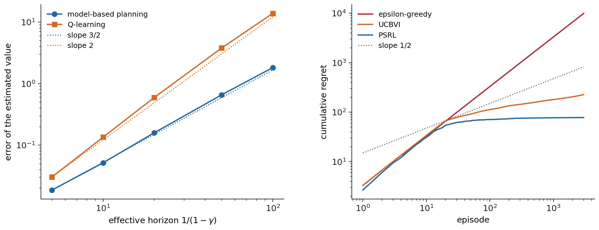

[Background Notes](../README.md) › [Reinforcement Learning](README.md)

# 30. The Theory of Reinforcement Learning

> [!WARNING]
> Work in progress: this part of the notes is still being revised.

[← 29. Generalist Agents, Meta-RL, and Open-Endedness](29-generalist-agents-meta-rl-and-open-endedness.md) · [31. Reinforcement Learning in the Real World →](31-reinforcement-learning-in-the-real-world.md)

## <a id="what-theory-asks"></a>What theory asks

### <a id="settings-and-measures"></a>Settings and measures

The previous chapters judged algorithms by experiments. Theory asks what is possible at all: how much data, or how much interaction, any algorithm needs to find a near-optimal policy, and which algorithms need no more than that. The answers depend on how the agent may access the environment, and the literature distinguishes three settings.

- **A generative model.** The agent may query any state–action pair and receive a sample of the next state, as a simulator allows. Exploration is not an issue, and the question is purely statistical: how many samples $`N`$ per pair are needed for an $`\varepsilon`$-accurate $`Q^*`$ or an $`\varepsilon`$-optimal policy?
- **Online interaction.** The agent can only act in the environment from its current state, and must find the states worth learning about. Performance is measured by **regret**, the total value lost compared with an optimal policy over $`K`$ episodes, $`\mathrm{Regret}(K)=\sum_{k=1}^K\bigl(V_1^*(s_1^k)-V_1^{\pi_k}(s_1^k)\bigr)`$, or by **PAC** sample complexity, the number of episodes in which the agent's policy is more than $`\varepsilon`$ worse than optimal, with probability at least $`1-\delta`$.
- **Offline data.** The agent receives a fixed data set, as in [chapter 26](26-offline-reinforcement-learning.md), and the question is what data make learning possible.

Results are stated for finite MDPs with $`S`$ states and $`A`$ actions, rewards in $`[0,1]`$, and either a discount $`\gamma`$, whose effective horizon is $`1/(1-\gamma)`$, or episodes of $`H`$ steps, with $`T=KH`$ the total number of steps. Conventions differ, and they matter for the powers of $`H`$: whether transitions may depend on the step $`h`$ (**time-inhomogeneous** MDPs have $`H`$ times more unknowns), and whether rewards are bounded per step or in total. The bounds are mostly **minimax**, worst-case over all MDPs of a size, and ignore logarithmic factors, written $`\tilde O`$; a **lower bound** shows that no algorithm can do better on some family of hard instances. Minimax bounds describe hard problems, and real problems are often easier, which **instance-dependent** bounds, in terms of the gaps between optimal and suboptimal actions, capture. The references for this chapter are the book of [Agarwal, Jiang, Kakade, and Sun](https://rltheorybook.github.io/) and the lecture notes of [Foster and Rakhlin (2023)](https://arxiv.org/abs/2312.16730).

## <a id="learning-with-a-generative-model"></a>Learning with a generative model

### <a id="the-minimax-rate"></a>The minimax rate

The simplest algorithm with a generative model is **certainty equivalence**: draw $`N`$ next-state samples for every pair, form the empirical model $`\hat P`$, and plan in it exactly. How large must $`N`$ be? A direct argument, with Hoeffding's inequality and the contraction of the Bellman operator, gives $`\|\hat Q^*-Q^*\|_\infty\le\frac{\gamma}{(1-\gamma)^2}\sqrt{\ln(2SA/\delta)/(2N)}`$, so that $`N=\tilde O\bigl(1/((1-\gamma)^4\varepsilon^2)\bigr)`$ samples per pair suffice (exercise 30.1). The dependence on the horizon is not tight. The Hoeffding step bounds the error $`(\hat P-P)V^*`$ by the *range* of $`V^*`$, $`1/(1-\gamma)`$, while its standard deviation is typically much smaller, and a sharper argument with Bernstein's inequality and a law of total variance for the returns ([appendix A](#block-rl30-appendix-a)) removes a factor $`1/(1-\gamma)`$. [Azar, Munos, and Kappen (2013)](https://doi.org/10.1007/s10994-013-5368-1) proved that $`\tilde O\bigl(SA/((1-\gamma)^3\varepsilon^2)\bigr)`$ samples in total suffice to estimate $`Q^*`$ to accuracy $`\varepsilon`$, and that this many are necessary on a family of hard instances (exercise 30.3). For the policy obtained by planning in $`\hat P`$, the same rate was shown for $`\varepsilon\le1/\sqrt{1-\gamma}`$ by [Agarwal, Kakade, and Yang (2020)](https://arxiv.org/abs/1906.03804) and for the whole range of $`\varepsilon`$ by [Li, Wei, Chi, Gu, and Chen (2020)](https://arxiv.org/abs/2005.12900): model-based planning is minimax-optimal. The next code checks the horizon dependence on a hard instance of the kind the lower bound uses, and compares it with Q-learning given the same samples.

```python
import numpy as np

# How the horizon enters the sample complexity, with a generative model. One state, two actions, both with the
# same dynamics: reward 1, then stay with probability p or fall into an absorbing state worth 0, so that
# Q*(a) = 1 / (1 - gamma p). Following the hard instances of Azar et al., p = (4 gamma - 1) / (3 gamma), which
# makes 1 - p of order 1 - gamma. Each method gets N = 20,000 samples of each action's next state:
#   model-based: estimate p for each action by counting, and plan in the estimated model (exactly);
#   Q-learning:  20,000 synchronous iterations, one fresh sample per action each, with the rescaled linear step
#                size 1 / (1 + (1 - gamma) t).
# Errors |max_a Q_hat(a) - V*|, averaged over 1,000 repetitions, and the errors multiplied by (1 - gamma)^1.5 and
# (1 - gamma)^2.
rng = np.random.default_rng(0)
N, reps = 20000, 1000
print("  gamma      V*   model-based error   x (1-g)^1.5    Q-learning error   x (1-g)^1.5   x (1-g)^2")
for gamma in (0.9, 0.95, 0.98, 0.99, 0.995):
    p = (4 * gamma - 1) / (3 * gamma)
    v = 1 / (1 - gamma * p)
    p_hat = rng.binomial(N, p, size=(reps, 2)) / N
    err_mb = np.abs(1 / (1 - gamma * p_hat.max(1)) - v).mean()
    Q = np.zeros((reps, 2))
    for t in range(N):
        stay = rng.random((reps, 2)) < p
        alpha = 1 / (1 + (1 - gamma) * t)
        Q += alpha * (1 + gamma * stay * Q.max(1, keepdims=True) - Q)
    err_q = np.abs(Q.max(1) - v).mean()
    h = 1 - gamma
    print(f"  {gamma:5.3f} {v:7.1f} {err_mb:19.3f} {err_mb * h ** 1.5:14.4f} {err_q:18.3f} {err_q * h ** 1.5:13.4f} {err_q * h ** 2:11.4f}")
#   gamma      V*   model-based error   x (1-g)^1.5    Q-learning error   x (1-g)^1.5   x (1-g)^2
#   0.900     7.5               0.055         0.0017              0.136        0.0043      0.0014
#   0.950    15.0               0.159         0.0018              0.585        0.0065      0.0015
#   0.980    37.5               0.650         0.0018              3.789        0.0107      0.0015
#   0.990    75.0               1.881         0.0019             13.885        0.0139      0.0014
#   0.995   150.0               5.562         0.0020             39.466        0.0140      0.0010
```

For the model-based estimate, the error multiplied by $`(1-\gamma)^{1.5}`$ is nearly constant, 0.0017 to 0.0020, as the horizon grows twentyfold: the error behaves as $`(1-\gamma)^{-3/2}/\sqrt N`$, so reaching accuracy $`\varepsilon`$ needs $`N\propto(1-\gamma)^{-3}\varepsilon^{-2}`$, the minimax rate. Q-learning's error, 2.5 to 7 times larger, grows faster, and it is its error multiplied by $`(1-\gamma)^2`$ that stays nearly constant up to $`\gamma=0.99`$: it needs $`N\propto(1-\gamma)^{-4}\varepsilon^{-2}`$. At $`\gamma=0.995`$ the last product drops, since 20,000 iterations are no longer many compared with the horizon of 200: Q-learning's error, almost entirely an overestimation caused by the maximization in its target, has not yet settled into its asymptotic $`1/\sqrt N`$ decay (with 80,000 iterations, the product rescaled by $`\sqrt{N/20{,}000}`$ is back at 0.0014).

### <a id="model-free-rates"></a>Model-free rates

The code illustrates a theorem. [Li, Cai, Chen, Wei, and Chi (2024)](https://arxiv.org/abs/2102.06548) showed that synchronous Q-learning, with its usual step sizes, needs $`\tilde\Theta\bigl(SA/((1-\gamma)^4\varepsilon^2)\bigr)`$ samples to estimate $`Q^*`$, and no fewer on some instances once there are two or more actions: the maximization in its target couples the noise of the estimates of all actions and costs a factor of the horizon. TD learning, which evaluates a single policy, has no maximization and is minimax-optimal ([chapter 7](07-model-free-control.md) reviewed the asymptotic theory). The factor can be removed without a model: **variance-reduced Q-learning** ([Wainwright, 2019](https://arxiv.org/abs/1906.04697)), which recenters its updates around a reference estimate computed from a large batch, as variance-reduced stochastic gradient methods do, and related methods ([Sidford, Wang, Wu, Yang, and Ye, 2018](https://arxiv.org/abs/1806.01492)) reach the $`(1-\gamma)^{-3}`$ rate.

## <a id="exploration-regret-and-pac"></a>Exploration: regret and PAC

### <a id="optimism"></a>Optimism

Without a generative model, the agent must visit the states it needs to learn about, and the problem of [chapter 22](22-exploration-in-deep-rl.md) becomes quantitative. Early algorithms showed that polynomial sample complexity is possible at all: **E³** ([Kearns and Singh, 2002](https://doi.org/10.1023/A:1017984413808)) and **R-max** ([Brafman and Tennenholtz, 2002](https://www.jmlr.org/papers/v3/brafman02a.html)) set apart the pairs that have not been visited enough, E³ by explicitly choosing between exploring them and exploiting the rest, R-max by treating them as maximally rewarding, an early form of optimism, and their PAC analyses were sharpened later ([Strehl, Li, and Littman, 2009](https://jmlr.org/papers/v10/strehl09a.html)). The modern algorithms use **optimism in the face of uncertainty**, as UCB does for bandits ([chapter 3](03-multi-armed-bandits.md#ucb1-and-its-regret)): plan in a model whose values are upper confidence bounds on the true ones, so that the agent is drawn to what it does not yet know, and either finds high reward there or learns that there is none.

**UCRL2** ([Jaksch, Ortner, and Auer, 2010](https://jmlr.org/papers/v11/jaksch10a.html)) plans in the most optimistic MDP within confidence sets around the empirical transitions, and for undiscounted problems with diameter $`D`$, the largest, over pairs of states, of the shortest expected time to travel from one to the other, its regret after $`T`$ steps is $`\tilde O(DS\sqrt{AT})`$, against a lower bound of $`\Omega(\sqrt{DSAT})`$. In the episodic setting, **UCBVI** ([Azar, Osband, and Munos, 2017](https://arxiv.org/abs/1703.05449)) runs value iteration on the empirical model with a bonus added to the rewards. With a Hoeffding bonus of order $`H\sqrt{\ln(SAT/\delta)/n(s,a)}`$, its regret is $`\tilde O(H\sqrt{SAT})`$; with a Bernstein bonus, which scales with the estimated variance of the next state's value, it is $`\tilde O(\sqrt{HSAT})`$ once $`T\ge H^3S^3A`$ and $`SA\ge H`$, which matches the lower bound $`\Omega(\sqrt{HSAT})`$ for time-homogeneous transitions. The argument ([appendix B](#block-rl30-appendix-b); exercise 30.5) has two steps: the optimistic values are at least the optimal ones, so the regret is at most the gap between the optimistic values and the values of the policies actually played; and that gap is a sum of bonuses along the trajectories played, which the pigeonhole principle bounds, since bonuses shrink as $`1/\sqrt n`$ where the agent goes.

Model-free methods can be optimistic too. Q-learning with UCB bonuses ([Jin, Allen-Zhu, Bubeck, and Jordan, 2018](https://arxiv.org/abs/1807.03765)) has regret $`\tilde O(\sqrt{H^3SAT})`$ with Bernstein-type bonuses ($`\tilde O(\sqrt{H^4SAT})`$ with Hoeffding ones) in time-inhomogeneous MDPs, within a factor $`\sqrt H`$ of the lower bound $`\Omega(\sqrt{H^2SAT})`$ for that setting, and a later, model-based algorithm closed the gap for every number of episodes, without the long "burn-in" that earlier minimax results required ([Zhang, Chen, Lee, and Du, 2024](https://arxiv.org/abs/2307.13586)). The horizon itself turned out to be less of an obstacle than the bounds suggested. When rewards are normalized so that each episode's total is at most 1, the sample complexity of time-homogeneous tabular RL grows only logarithmically with $`H`$ ([Wang, Du, Yang, and Kakade, 2020](https://arxiv.org/abs/2005.00527)), and a regret of $`\tilde O(\sqrt{SAK}+S^2A)`$ over $`K`$ episodes, the rate of a contextual bandit, is achievable ([Zhang, Ji, and Du, 2021](https://arxiv.org/abs/2009.13503)): long horizons are not, in themselves, what makes RL hard, at least in this minimax sense and counting episodes rather than steps.

### <a id="posterior-sampling"></a>Posterior sampling

**Posterior sampling for RL** (PSRL; [Osband, Russo, and Van Roy, 2013](https://arxiv.org/abs/1306.0940)) is Thompson sampling for MDPs: at the start of each episode, sample an MDP from the posterior, and follow its optimal policy for the episode. It needs no confidence sets or bonuses, and its Bayesian regret, the expected regret averaged over MDPs drawn from the prior, is $`\tilde O(HS\sqrt{AT})`$. The analysis rests on a symmetry: given the history, the sampled MDP and the true one have the same distribution, so the value the agent expects from its sampled MDP is, on average, the optimal value of the true one (exercise 30.4). Posterior sampling is thus optimistic on average rather than always, and it explores efficiently in practice, as chapter 22 found. The next code measures the regret of the three strategies on **RiverSwim**, a standard small problem in which an agent must swim against a current to reach a large reward, and small rewards near the start tempt it to stay.

```python
import numpy as np

# Regret of exploration strategies on RiverSwim (6 states, horizon 20, start at the left bank). Swimming left is
# easy and earns 0.005 at the left bank; swimming right, against the current, usually fails, but earns 1 at the
# far right. The rewards are known and the transitions must be learned. Each episode, each agent plans in a model:
#   epsilon-greedy:  the empirical model (uniform where unvisited), acting randomly with probability 0.1;
#   UCBVI:           the empirical model plus a bonus 0.2 H / sqrt(n(s, a)) (a smaller constant than theory's);
#   PSRL:            a model sampled from the Dirichlet(1, ..., 1) posterior of each transition distribution.
# Expected cumulative regret sum_k V*(s0) - V^{pi_k}(s0), computed exactly, mean of 5 runs of 3,000 episodes.
S, A, H, K = 6, 2, 20, 3000
P = np.zeros((S, A, S)); R = np.zeros((S, A))
for s in range(S):
    P[s, 0, max(s - 1, 0)] = 1.0                           # left: always succeeds
    if s == 0:
        P[s, 1, 0], P[s, 1, 1] = 0.4, 0.6
    elif s == S - 1:
        P[s, 1, s], P[s, 1, s - 1] = 0.6, 0.4
    else:
        P[s, 1, s + 1], P[s, 1, s], P[s, 1, s - 1] = 0.35, 0.6, 0.05
R[0, 0], R[S - 1, 1] = 0.005, 1.0


def plan(Pm, bonus=0.0):
    """Finite-horizon optimal Q-values (step h = 0 .. H-1) in a model, with an optional bonus, clipped at H."""
    Q, V = np.zeros((H, S, A)), np.zeros(S)
    for h in range(H - 1, -1, -1):
        Q[h] = np.minimum(R + bonus + Pm @ V, H - h)
        V = Q[h].max(1)
    return Q


def value(pi):
    """Expected return from s0 = 0 of a policy pi[h, s, a] (probabilities) in the true MDP."""
    V = np.zeros(S)
    for h in range(H - 1, -1, -1):
        V = (pi[h] * (R + P @ V)).sum(1)
    return V[0]


v_star = plan(P)[0, 0].max()


def run(kind, seed):
    rng = np.random.default_rng(seed)
    counts, regret = np.zeros((S, A, S)), np.zeros(K)
    for k in range(K):
        n = counts.sum(2)
        P_hat = np.where(n[..., None] > 0, counts / np.maximum(n, 1)[..., None], 1 / S)
        if kind == "PSRL":
            Q = plan(np.array([[rng.dirichlet(1 + counts[s, a]) for a in range(A)] for s in range(S)]))
        else:
            Q = plan(P_hat, 0.2 * H / np.sqrt(np.maximum(n, 1)) if kind == "UCBVI" else 0.0)
        greedy = np.eye(A)[Q.argmax(2)]
        pi = 0.9 * greedy + 0.1 / A if kind == "epsilon-greedy" else greedy
        regret[k] = v_star - value(pi)
        s = 0
        for h in range(H):
            a = rng.choice(A, p=pi[h, s])
            s2 = rng.choice(S, p=P[s, a])
            counts[s, a, s2] += 1; s = s2
    return regret.cumsum()


print(f"optimal value from the left bank: {v_star:.3f}; always swimming left earns {0.005 * H:.3f}")
checkpoints = (100, 300, 1000, 3000)
print("  episodes        " + "".join(f"{k:9,d}" for k in checkpoints) + "   slope from 300 to 3,000")
for kind in ("epsilon-greedy", "UCBVI", "PSRL"):
    c = np.mean([run(kind, seed) for seed in range(5)], 0)
    slope = np.log(c[2999] / c[299]) / np.log(10)
    print(f"  {kind:15s}" + "".join(f"{c[k - 1]:9.1f}" for k in checkpoints) + f"   {slope:9.2f}")
# optimal value from the left bank: 3.397; always swimming left earns 0.100
#   episodes              100      300    1,000    3,000   slope from 300 to 3,000
#   epsilon-greedy     329.8    990.8   3304.4   9914.5        1.00
#   UCBVI              112.4    143.8    179.7    226.5        0.20
#   PSRL                70.8     75.4     77.0     77.8        0.01
```

The $`\varepsilon`$-greedy agent never learns to swim across: its random actions almost never string together the long run of rightward moves needed to reach the far bank, it loses nearly the full optimal value in every episode, and its regret grows linearly, with slope 1.00 on a log–log scale. UCBVI's optimism sends it to the unexplored states, and PSRL's samples sometimes imagine a good far bank; both learn the optimal policy. Their regret grows far more slowly than the worst-case $`\sqrt K`$, with slopes of 0.20 and 0.01 between 300 and 3,000 episodes: on a fixed MDP, once the optimal policy is known, only occasional exploratory episodes cost regret, and the instance-dependent regret of optimistic algorithms grows like $`\log K`$, summed over state–action pairs and divided by their gaps between optimal and suboptimal actions. The minimax $`\sqrt K`$ describes the hardest MDPs of a given size, whose gaps shrink as $`K`$ grows. PSRL learns fastest here, and UCBVI's result depends on the constant in its bonus, set here hundreds of times smaller than the theory's, which would make it explore for far longer: a common gap between provable and practical optimism.



*Left: the error of the value estimated from 20,000 samples per action on the hard instance of the first code, against the effective horizon $`1/(1-\gamma)`$, on log–log axes (500 repetitions, a separate run from the code's). Model-based planning follows the slope $`3/2`$ of the minimax rate (fitted slope 1.54); Q-learning follows slope 2 (fitted 2.10 up to a horizon of 50), a factor of the square root of the horizon worse, which becomes a factor of $`1/(1-\gamma)`$ in the number of samples needed. Right: cumulative regret on RiverSwim, mean of 5 runs. The $`\varepsilon`$-greedy agent's regret grows linearly; UCBVI's and PSRL's bend below the worst-case $`\sqrt K`$ (dotted) once they have found the far bank.*

## <a id="function-approximation"></a>Function approximation

### <a id="linear-models"></a>Linear models

With large state spaces, bounds in terms of $`S`$ are useless, and the question becomes which assumptions about a function class make learning efficient. The cleanest positive result assumes a **linear MDP** ([Jin, Yang, Wang, and Jordan, 2020](https://arxiv.org/abs/1907.05388)): known features $`\phi(s,a)\in\mathbb R^d`$ such that transitions and rewards are linear in them, $`P_h(s'\mid s,a)=\phi(s,a)^\top\mu_h(s')`$ and $`r_h(s,a)=\phi(s,a)^\top\theta_h`$. Then the action values of *every* policy are linear in $`\phi`$ (exercise 30.6), and least-squares value iteration with an elliptical bonus $`\beta\|\phi(s,a)\|_{\Lambda^{-1}}`$, the bonus of LinUCB ([chapter 4](04-contextual-bayesian-and-adversarial-bandits.md#linear-bandits-and-linucb)), has regret $`\tilde O(\sqrt{d^3H^3T})`$, independent of the number of states.

### <a id="when-realizability-is-not-enough"></a>When realizability is not enough

A weaker assumption would seem natural: that the optimal action values are linear in known features, $`Q^*(s,a)=\phi(s,a)^\top w^*`$. It is not enough. [Du, Kakade, Wang, and Yang (2020)](https://arxiv.org/abs/1910.03016) showed that if the action values of all policies are only approximately linear, with errors of order $`\sqrt{H/d}`$, any algorithm needs a number of trajectories exponential in $`H`$ or $`d`$ to find a good policy; [Weisz, Amortila, and Szepesvári (2021)](https://arxiv.org/abs/2010.01374) showed that even exact linearity of $`Q^*`$, with a generative model, requires a number of queries exponential in $`\min(d,H)`$; and [Wang, Foster, and Kakade (2021)](https://arxiv.org/abs/2010.11895) showed that in the offline setting, even with every policy's action values exactly linear and data covering all feature directions as well as possible, evaluating a policy can require $`\Omega((d/2)^H)`$ samples. The missing ingredient is closure under the Bellman operator. **Bellman completeness** asks that the function class contain $`\mathcal T f`$ for every $`f`$ in it, which linear MDPs satisfy and which bootstrapping relies on: without it, the targets of fitted value iteration leave the class, and errors can compound across the horizon, the phenomenon behind the deadly triad of [chapter 12](12-the-deadly-triad-and-gradient-td-methods.md).

### <a id="general-complexity-measures"></a>General complexity measures

Beyond linear models, the theory has sought one quantity that determines whether a problem is learnable. **Bellman rank** ([Jiang et al., 2017](https://arxiv.org/abs/1610.09512)) measures the rank of the matrix of average Bellman errors between candidate value functions and the policies they induce, and a problem with low Bellman rank can be learned with a number of episodes polynomial in it, the horizon, the number of actions, and the logarithm of the size of the function class. The **eluder dimension** ([Russo and Van Roy, 2013](https://proceedings.neurips.cc/paper_files/paper/2013/hash/41bfd20a38bb1b0bec75acf0845530a7-Abstract.html)) measures how long a sequence of points can be in which each point's value is not determined by the previous ones, and the **Bellman eluder dimension** ([Jin, Liu, and Miryoosefi, 2021](https://arxiv.org/abs/2102.00815)) and **bilinear classes** ([Du et al., 2021](https://arxiv.org/abs/2103.10897)) extend these ideas, the first by combining the two, the second by generalizing Bellman rank, and together cover most known tractable classes. The **decision–estimation coefficient** ([Foster, Kakade, Qian, and Rakhlin, 2021](https://arxiv.org/abs/2112.13487)) goes further: it gives lower bounds on the regret of *any* algorithm for *any* model class, and an algorithm whose regret is bounded by the same quantity, up to the difficulty of estimating the model. The recurring lesson is that learning is efficient when the information gained by acting, measured against the class of hypotheses still consistent with the data, is large relative to the regret incurred, the trade-off that the Bayes-optimal agent of [chapter 29](29-generalist-agents-meta-rl-and-open-endedness.md) resolves exactly and these algorithms resolve approximately.

## <a id="offline-data"></a>Offline data

Offline, the question is what the data must cover. Classical analyses of fitted value and Q-iteration ([Munos and Szepesvári, 2008](https://jmlr.org/papers/v9/munos08a.html); [Chen and Jiang, 2019](https://arxiv.org/abs/1905.00360)) assume **all-policy concentrability**: the state–action distribution of every policy is at most a constant $`C`$ times the data distribution $`\mu`$, so that errors measured under $`\mu`$ transfer to any policy. With Bellman completeness, FQI then needs $`\tilde O\bigl(C\ln|\mathcal F|/(\varepsilon^2(1-\gamma)^4)\bigr)`$ samples to be $`\varepsilon`$-optimal, and without assumptions on the dynamics, even the most favorable data distribution cannot give polynomial sample complexity. All-policy coverage is unrealistic, since data rarely cover the behavior of bad policies, and **pessimism** removes the need for it. A learner that penalizes uncertain pairs, choosing the policy that is best under its lower confidence bounds, competes with any policy the data cover: its suboptimality relative to a comparison policy $`\pi`$ is bounded by the uncertainty along $`\pi`$'s own state–action distribution, which is small when the **single-policy concentrability** $`C^\pi=\max_{s,a}d^\pi(s,a)/\mu(s,a)`$ is small (exercise 30.7). [Jin, Yang, and Wang (2021)](https://arxiv.org/abs/2012.15085) proved this for linear MDPs, [Rashidinejad, Zhu, Ma, Jiao, and Russell (2021)](https://arxiv.org/abs/2103.12021) gave a tabular rate, within a factor $`1/(1-\gamma)`$ of the lower bound,, $`\tilde O\bigl(\sqrt{SC^*/((1-\gamma)^5N)}\bigr)`$ with $`C^*`$ the concentrability of an optimal policy, which interpolates between imitation learning, when the data come from the optimal policy, and offline RL, and [Xie, Cheng, Jiang, Mineiro, and Agarwal (2021)](https://arxiv.org/abs/2106.06926) extended pessimism to general function classes with Bellman completeness. These results are the theory behind the conservative algorithms of chapter 26.

## <a id="policy-optimization"></a>Policy optimization

[Chapter 13](13-policy-gradient-and-actor-critic-methods.md) presented the convergence theory of policy gradient methods with exact gradients: softmax policy gradient converges to a global optimum in tabular problems, but its constants can be exponentially large, while the natural policy gradient converges at a rate $`O(1/k)`$ independent of the numbers of states and actions ([Agarwal, Kakade, Lee, and Mahajan, 2021](https://arxiv.org/abs/1908.00261)). Viewing these methods as **policy mirror descent**, the update $`\pi_{k+1}(\cdot\mid s)\propto\pi_k(\cdot\mid s)\exp\bigl(\eta_kQ^{\pi_k}(s,\cdot)\bigr)`$ of [chapter 20](20-trust-regions-and-proximal-policy-optimization.md#policy-optimization-as-mirror-descent), gives stronger results. With strongly convex regularizers, policy mirror descent converges linearly ([Lan, 2023](https://arxiv.org/abs/2102.00135)); without them, step sizes that grow geometrically give linear convergence at a rate that depends on the instance ([Xiao, 2022](https://arxiv.org/abs/2201.07443)), and step sizes that also adapt to the divergence between successive policies give the rate $`\gamma`$ of policy iteration, which the method approaches as $`\eta\to\infty`$ (exercise 30.8), and this rate is the best possible for such methods ([Johnson, Pike-Burke, and Rebeschini, 2023](https://arxiv.org/abs/2302.11381)). With entropy regularization, the natural policy gradient converges linearly to the regularized optimum at a rate $`1-\eta\tau`$, independent of the problem's size, for any step size up to $`(1-\gamma)/\tau`$ ([Cen et al., 2022](https://arxiv.org/abs/2007.06558)), which is part of why the entropy bonuses of chapters 20 and 21 help optimization as well as exploration. In continuous control, policy gradient on the linear–quadratic regulator of [chapter 15](15-optimal-control-and-trajectory-optimization.md) converges to the globally optimal controller despite the nonconvexity of the cost in the controller's gain ([Fazel, Ge, Kakade, and Mesbahi, 2018](https://arxiv.org/abs/1801.05039)). With sampled rather than exact values, these methods inherit the sample complexity of estimating $`Q^{\pi_k}`$ at every iteration, and their theory then meets that of the previous sections.

## <a id="theory-and-practice"></a>Theory and practice

The theory of this chapter describes tabular and linear problems, and practice runs deep networks on problems no bound covers. The connection is conceptual rather than quantitative. Optimism and posterior sampling, derived for tables, became the count-based bonuses and randomized value functions of chapter 22; the pessimism analyzed for offline RL shaped the conservative algorithms of chapter 26; the variance arguments that sharpen the generative-model bounds reappear in the variance-reduction tricks of practical algorithms; and the negative results explain why bootstrapping with function approximation is fragile, and why no algorithm can be robust to every representation. Recent theory has turned to the setting of chapter 28, where a pretrained model supplies the starting policy, and asks what pretraining must provide. [Chen et al. (2026)](https://arxiv.org/abs/2510.15020) argue that the relevant quantity is **coverage**, the probability that the base model assigns to good responses, rather than its cross-entropy, and that maximum-likelihood pretraining improves coverage in a way that transfers to post-training; [Foster, Mhammedi, and Rohatgi (2025)](https://arxiv.org/abs/2503.07453) show that coverage is not needed for data efficiency in principle, but that it governs the *computation* needed to explore, which formalizes the observation of chapter 28 that RL from a pretrained model mainly reweights what the model can already produce.

## <a id="exercises"></a>Exercises

### <a id="exercise-30-1-a-first-generative-model-bound"></a>Exercise 30.1 — A first generative-model bound

With $`N`$ samples of the next state for every pair, let $`\hat P`$ be the empirical model and $`\hat Q^*`$ its optimal action values; rewards are in $`[0,1]`$. (a) Show that $`\|\hat Q^*-Q^*\|_\infty\le\frac\gamma{1-\gamma}\|(\hat P-P)V^*\|_\infty`$. (b) Using Hoeffding's inequality and a union bound, show that with probability at least $`1-\delta`$, $`\|\hat Q^*-Q^*\|_\infty\le\frac\gamma{(1-\gamma)^2}\sqrt{\ln(2SA/\delta)/(2N)}`$, and deduce a sufficient $`N`$ for accuracy $`\varepsilon`$.


<details>
<summary><b>Solution</b></summary>

(a) Both satisfy Bellman optimality equations, $`\hat Q^*=r+\gamma\hat P\hat V^*`$ and $`Q^*=r+\gamma PV^*`$, so $`\hat Q^*-Q^*=\gamma\hat P(\hat V^*-V^*)+\gamma(\hat P-P)V^*`$. Since $`|\hat V^*(s)-V^*(s)|=|\max_a\hat Q^*(s,a)-\max_aQ^*(s,a)|\le\|\hat Q^*-Q^*\|_\infty`$ and $`\hat P`$ averages, $`\|\hat Q^*-Q^*\|_\infty\le\gamma\|\hat Q^*-Q^*\|_\infty+\gamma\|(\hat P-P)V^*\|_\infty`$; rearrange.

(b) For each pair, $`(\hat PV^*)(s,a)`$ is an average of $`N`$ independent samples of $`V^*(s')`$, which lies in $`[0,1/(1-\gamma)]`$, with mean $`(PV^*)(s,a)`$. Hoeffding's inequality gives $`|(\hat P-P)V^*(s,a)|\le\frac1{1-\gamma}\sqrt{\ln(2/\delta')/(2N)}`$ with probability $`1-\delta'`$; with $`\delta'=\delta/(SA)`$ the bound holds for all pairs at once. Combined with (a), accuracy $`\varepsilon`$ holds once $`N\ge\frac{\gamma^2\ln(2SA/\delta)}{2\varepsilon^2(1-\gamma)^4}`$ per pair. The fixed $`V^*`$ matters: the samples are independent of it, which would not be true of $`\hat V^*`$. The rate is a factor $`1/(1-\gamma)`$ worse than the minimax one, because Hoeffding's inequality uses the range of $`V^*`$ rather than its variance.

</details>


### <a id="exercise-30-2-where-the-extra-horizon-factor-goes"></a>Exercise 30.2 — Where the extra horizon factor goes

In the instance of the first code, a state has value $`V=1/(1-\gamma p)`$ and is left with probability $`1-p=(1-\gamma)/(3\gamma)`$ for an absorbing state of value 0. (a) Compute the standard deviation of the next state's value, $`\sqrt{p(1-p)}\,V`$, and compare it with the range $`V`$ used by Hoeffding's inequality. (b) Replacing the range by the standard deviation in exercise 30.1, what error does one estimate of $`(\hat P-P)V`$ incur, and how does the resulting bound on the value error scale with $`1-\gamma`$? Compare with the code.


<details>
<summary><b>Solution</b></summary>

(a) $`1-\gamma p=1-\frac{4\gamma-1}3=\frac43(1-\gamma)`$, so $`V=\frac3{4(1-\gamma)}`$, and the standard deviation is $`\sqrt{p(1-p)}\,V\approx\sqrt{\frac{1-\gamma}{3}}\cdot\frac3{4(1-\gamma)}\propto(1-\gamma)^{-1/2}`$, much smaller than the range $`V\propto(1-\gamma)^{-1}`$.

(b) By Bernstein's inequality, $`|(\hat P-P)V|`$ is of order $`(1-\gamma)^{-1/2}/\sqrt N`$, and multiplying by $`\gamma/(1-\gamma)`$ from exercise 30.1(a) gives a value error of order $`(1-\gamma)^{-3/2}/\sqrt N`$, the scaling the code found, with its error times $`(1-\gamma)^{1.5}`$ constant. In general the variances along a trajectory do not all stay small, and the law of total variance of appendix A is needed to show that their discounted sum is of order $`(1-\gamma)^{-2}`$, the variance of the return, rather than $`(1-\gamma)^{-3}`$, which gives the rate $`(1-\gamma)^{-3}`$ rather than $`(1-\gamma)^{-4}`$.

</details>


### <a id="exercise-30-3-the-lower-bound-heuristically"></a>Exercise 30.3 — The lower bound, heuristically

In the same instance, suppose that an algorithm must tell whether the probability of staying is $`p`$ or $`p+\Delta`$. (a) How much do the two values differ, to first order in $`\Delta`$? (b) About how many samples are needed to distinguish the two with constant probability? (c) Choosing $`\Delta`$ so that the values differ by $`\varepsilon`$, conclude that $`N\gtrsim1/((1-\gamma)^3\varepsilon^2)`$ samples are needed per pair.


<details>
<summary><b>Solution</b></summary>

(a) $`\frac{d}{dp}\frac1{1-\gamma p}=\frac\gamma{(1-\gamma p)^2}=\frac{9\gamma}{16(1-\gamma)^2}`$, so the values differ by about $`\frac{9\gamma\Delta}{16(1-\gamma)^2}`$.

(b) Distinguishing two Bernoulli distributions with means $`p`$ and $`p+\Delta`$ needs of order $`p(1-p)/\Delta^2`$ samples, and here $`p(1-p)\approx(1-\gamma)/3`$.

(c) A value difference of $`\varepsilon`$ needs $`\Delta\approx\frac{16(1-\gamma)^2\varepsilon}{9\gamma}`$, so $`N\gtrsim\frac{(1-\gamma)/3}{\Delta^2}\propto\frac{1-\gamma}{(1-\gamma)^4\varepsilon^2}=\frac1{(1-\gamma)^3\varepsilon^2}`$. An algorithm that estimates $`Q^*`$ to accuracy $`\varepsilon`$ must distinguish such pairs of instances, which is the idea of the lower bound of Azar et al.; making every one of the $`SA`$ pairs such a test gives the factor $`SA`$.

</details>


### <a id="exercise-30-4-why-posterior-sampling-works"></a>Exercise 30.4 — Why posterior sampling works

At episode $`k`$, PSRL samples $`M_k`$ from the posterior given the history $`\mathcal H_k`$, and plays $`\pi_k`$, the optimal policy of $`M_k`$. (a) Explain why $`\mathbb E[V^*_{M^\star}(s_1)\mid\mathcal H_k]=\mathbb E[V^*_{M_k}(s_1)\mid\mathcal H_k]`$, where $`M^\star`$ is the true MDP drawn from the prior. (b) Deduce that the Bayesian regret of episode $`k`$ equals $`\mathbb E\bigl[V^{\pi_k}_{M_k}(s_1)-V^{\pi_k}_{M^\star}(s_1)\bigr]`$. (c) What remains to be bounded, and why is it small?


<details>
<summary><b>Solution</b></summary>

(a) Given $`\mathcal H_k`$, $`M^\star`$ has the posterior distribution, and $`M_k`$ is drawn from the same posterior, so any function of one has the same conditional expectation as the same function of the other.

(b) The regret of episode $`k`$ is $`V^*_{M^\star}(s_1)-V^{\pi_k}_{M^\star}(s_1)`$. By (a), the first term has the same expectation as $`V^*_{M_k}(s_1)=V^{\pi_k}_{M_k}(s_1)`$, since $`\pi_k`$ is optimal for $`M_k`$. Taking expectations over the history gives the claim.

(c) The difference between the value of the same policy in two MDPs, the sampled one and the true one, which by the simulation lemma ([chapter 23](23-model-based-rl-and-world-models.md)) is a sum of differences between their transition probabilities along the trajectories of $`\pi_k`$. Both are close to the empirical model where data are plentiful, so the difference is small wherever $`\pi_k`$ goes often, and the same pigeonhole argument as for optimism bounds the sum. Posterior sampling is optimistic only on average, which is enough.

</details>


### <a id="exercise-30-5-the-two-steps-of-optimism"></a>Exercise 30.5 — The two steps of optimism

In an episodic MDP with horizon $`H`$ and known rewards, an algorithm plans in the empirical model with bonuses $`b(s,a)`$, clipping values at $`H`$. (a) Show by backward induction that if $`b(s,a)\ge|((\hat P-P)V^*_{h+1})(s,a)|`$ for all $`h`$, $`s`$, and $`a`$, the optimistic values satisfy $`\bar V_h\ge V^*_h`$. (b) With $`b=cH/\sqrt{n(s,a)}`$, the regret is bounded, up to smaller terms, by the sum of bonuses along the trajectories played. Show that over $`K`$ episodes of $`H`$ steps, if $`n_{k,h}(s,a)`$ counts the visits to $`(s,a)`$ before step $`h`$ of episode $`k`$, $`\sum_{k,h}1/\sqrt{\max(n_{k,h}(s_h^k,a_h^k),1)}\le SA+2\sqrt{SAKH}`$ (counts updated only between episodes, as in UCBVI, add a term of order $`SAH`$ and a constant factor), and conclude the order of the regret.


<details>
<summary><b>Solution</b></summary>

(a) At $`h=H+1`$ both are 0. If $`\bar V_{h+1}\ge V^*_{h+1}`$, then $`\bar Q_h=r+\hat P\bar V_{h+1}+b\ge r+\hat PV^*_{h+1}+b\ge r+PV^*_{h+1}=Q^*_h`$, using the condition on $`b`$ in the last step; clipping at $`H`$ keeps the inequality since $`Q^*_h\le H`$. Maximizing over actions gives $`\bar V_h\ge V^*_h`$.

(b) Group the terms by pair: a pair visited $`N(s,a)`$ times in total contributes at most $`1+\sum_{i=1}^{N(s,a)}i^{-1/2}\le1+2\sqrt{N(s,a)}`$, and by the Cauchy–Schwarz inequality $`\sum_{s,a}\sqrt{N(s,a)}\le\sqrt{SA\sum_{s,a}N(s,a)}=\sqrt{SAKH}`$. The sum of bonuses is therefore at most $`cH(SA+2\sqrt{SAT})`$ with $`T=KH`$, and the regret is $`\tilde O(H\sqrt{SAT})`$, the Hoeffding version of UCBVI's bound; variance-aware bonuses reduce the factor $`H`$ to $`\sqrt H`$.

</details>


### <a id="exercise-30-6-linear-mdps-make-every-value-linear"></a>Exercise 30.6 — Linear MDPs make every value linear

In a linear MDP, $`P_h(s'\mid s,a)=\phi(s,a)^\top\mu_h(s')`$ and $`r_h(s,a)=\phi(s,a)^\top\theta_h`$. (a) Show that for every policy $`\pi`$ and step $`h`$, $`Q^\pi_h(s,a)=\phi(s,a)^\top w_h^\pi`$ for some vector $`w^\pi_h`$. (b) Why does this make least-squares value iteration well posed, in the sense of Bellman completeness, while the assumption that only $`Q^*`$ is linear does not?


<details>
<summary><b>Solution</b></summary>

(a) $`Q^\pi_h(s,a)=r_h(s,a)+\sum_{s'}P_h(s'\mid s,a)V^\pi_{h+1}(s')=\phi(s,a)^\top\bigl(\theta_h+\sum_{s'}\mu_h(s')V^\pi_{h+1}(s')\bigr)`$, with the sum replaced by an integral for continuous states.

(b) The same computation applies to any function $`V`$ in place of $`V^\pi_{h+1}`$: the Bellman backup of anything is linear in $`\phi`$, so the regression targets of value iteration always lie in the class, which is Bellman completeness. If only $`Q^*`$ is linear, the backup of an intermediate estimate, which is not $`Q^*`$, need not be linear, and regression projects it onto the class with an error that later iterations compound; the lower bounds of the text show that this can require exponentially many samples.

</details>


### <a id="exercise-30-7-pessimism-competes-with-covered-policies"></a>Exercise 30.7 — Pessimism competes with covered policies

A pessimistic offline algorithm evaluates policies in the empirical model with the penalized reward $`r-b`$, where $`b(s,a)=c/\sqrt{n(s,a)}`$ from $`n(s,a)`$ samples is large enough that, with high probability, the pessimistic value $`\underline J(\pi)`$ of every policy satisfies $`J(\pi)-2\,\mathbb E_{d^\pi}[b(s,a)]/(1-\gamma)\le\underline J(\pi)\le J(\pi)`$, where $`d^\pi`$ is $`\pi`$'s normalized discounted state–action distribution. It returns the policy $`\hat\pi`$ that maximizes $`\underline J`$. (a) Show that for any comparison policy $`\pi`$, $`J(\pi)-J(\hat\pi)\le2\,\mathbb E_{d^\pi}[b(s,a)]/(1-\gamma)`$. (b) With $`n(s,a)\approx N\mu(s,a)`$, a deterministic $`\pi`$, and $`d^\pi(s,a)\le C^\pi\mu(s,a)`$, show that the bound is at most of order $`\frac{c}{1-\gamma}\sqrt{SC^\pi/N}`$.


<details>
<summary><b>Solution</b></summary>

(a) $`J(\hat\pi)\ge\underline J(\hat\pi)\ge\underline J(\pi)\ge J(\pi)-2\,\mathbb E_{d^\pi}[b]/(1-\gamma)`$, using the upper inequality for $`\hat\pi`$, the choice of $`\hat\pi`$, and the lower inequality for $`\pi`$. The two inequalities are what the penalty buys: a penalty at least as large as the estimation error keeps every pessimistic value below the truth, and the truth exceeds it by at most the penalties collected along the policy's own distribution, twice, once for the penalty and once for the error it covers. Only the penalties along the *comparison* policy's distribution enter, not those of $`\hat\pi`$ or of all policies.

(b) $`\mathbb E_{d^\pi}[b]=\sum_{s,a}d^\pi(s,a)\frac c{\sqrt{N\mu(s,a)}}\le\frac c{\sqrt N}\sum_{s,a}d^\pi(s,a)\sqrt{\frac{C^\pi}{d^\pi(s,a)}}=c\sqrt{\frac{C^\pi}N}\sum_{s,a}\sqrt{d^\pi(s,a)}`$, and since a deterministic policy puts mass on at most $`S`$ pairs, the Cauchy–Schwarz inequality gives $`\sum\sqrt{d^\pi}\le\sqrt S`$. The suboptimality relative to *any* policy the data cover well goes to zero as $`1/\sqrt N`$, even if the data never cover the bad policies that an unpenalized algorithm might pick, which is exactly what all-policy concentrability demanded.

</details>


### <a id="exercise-30-8-policy-iteration-as-mirror-descent-with-infinite-steps"></a>Exercise 30.8 — Policy iteration as mirror descent with infinite steps

(a) Show that policy iteration converges linearly at rate $`\gamma`$: $`\|V^*-V^{\pi_{k+1}}\|_\infty\le\gamma\|V^*-V^{\pi_k}\|_\infty`$. (b) Show that the policy mirror descent update $`\pi_{k+1}(\cdot\mid s)\propto\pi_k(\cdot\mid s)e^{\eta_kQ^{\pi_k}(s,\cdot)}`$ tends to the policy iteration update as $`\eta_k\to\infty`$, and explain why step sizes that grow geometrically, in proportion to the divergence between the greedy policy and $`\pi_k`$, recover the rate $`\gamma`$ while constant ones give only $`O(1/k)`$.


<details>
<summary><b>Solution</b></summary>

(a) The greedy policy satisfies $`\mathcal T^{\pi_{k+1}}V^{\pi_k}=\mathcal TV^{\pi_k}\ge V^{\pi_k}`$, and repeated application of the monotone operator $`\mathcal T^{\pi_{k+1}}`$ gives $`V^{\pi_{k+1}}\ge\mathcal TV^{\pi_k}`$. Hence $`0\le V^*-V^{\pi_{k+1}}\le\mathcal TV^*-\mathcal TV^{\pi_k}`$, whose sup norm is at most $`\gamma\|V^*-V^{\pi_k}\|_\infty`$ by the contraction of $`\mathcal T`$ ([chapter 2](02-dynamic-programming.md)).

(b) As $`\eta_k\to\infty`$, the weights $`e^{\eta_kQ^{\pi_k}(s,a)}`$ concentrate on the maximizing actions, so $`\pi_{k+1}`$ becomes greedy, which is policy iteration. For finite $`\eta_k`$, the analysis of mirror descent bounds the loss relative to the greedy step by a term of order $`D/\eta_k`$, where $`D`$ is the divergence between the policies, at most about $`\ln A`$ from a uniform start. With constant $`\eta`$, these terms sum to the $`O(\ln A/(\eta k))`$ rate of chapter 13; if $`\eta_k`$ grows geometrically in proportion to that divergence, which need not stay near $`\ln A`$ once $`\pi_k`$ concentrates, the extra term at iteration $`k`$ shrinks as fast as the policy iteration error itself, and the linear rate $`\gamma`$ survives; Johnson et al. showed that this adaptivity is necessary.

</details>


## <a id="appendices"></a>Appendices


<details>
<summary><a id="block-rl30-appendix-a"></a><b>A. The minimax rate with a generative model</b></summary>


Fix a policy $`\pi`$ and write $`P^\pi`$ for its state-to-state transition matrix. The values in the true and empirical models satisfy $`V^\pi=(I-\gamma P^\pi)^{-1}r^\pi`$ and the same with $`\hat P^\pi`$, so
```math
\hat V^\pi-V^\pi=\gamma(I-\gamma\hat P^\pi)^{-1}(\hat P^\pi-P^\pi)V^\pi.
```
Exercise 30.1 bounded each entry of $`(\hat P-P)V^\pi`$ by the range of $`V^\pi`$ over $`\sqrt N`$, and the norm of $`(I-\gamma\hat P^\pi)^{-1}`$, a discounted sum of stochastic matrices, by $`1/(1-\gamma)`$: two factors of $`1/(1-\gamma)`$ besides the $`1/\sqrt N`$. The sharper argument keeps the variance. By Bernstein's inequality, with high probability, for every state
```math
|((\hat P^\pi-P^\pi)V^\pi)(s)|\lesssim\sqrt{\frac{\operatorname{Var}_{P^\pi(\cdot\mid s)}(V^\pi)\,L}N}+\frac{L}{(1-\gamma)N},
```
with $`L`$ a logarithmic factor. The key fact is a **law of total variance** for discounted returns: the one-step variances of the value, accumulated along the trajectory with discounting, account for the variance of the whole return, which is at most $`1/(1-\gamma)^2`$. In vector form,
```math
\Bigl\|(I-\gamma P^\pi)^{-1}\sqrt{\operatorname{Var}_{P^\pi}(V^\pi)}\Bigr\|_\infty\le\sqrt{\frac2{(1-\gamma)^3}},
```
by the Cauchy–Schwarz inequality applied to the discounted sum: $`\sum_t\gamma^t\sqrt{v_t}\le\sqrt{\sum_t\gamma^t}\sqrt{\sum_t\gamma^tv_t}`$, where the first factor is $`(1-\gamma)^{-1/2}`$ and the second is at most $`\sqrt2/(1-\gamma)`$ (with $`v_t`$ the expected one-step variance at step $`t`$, by Jensen's inequality): by the law of total variance, $`\gamma^2\sum_t\gamma^{2t}v_t`$ is the variance of the return after the fixed first reward, at most $`\gamma^2/(1-\gamma)^2`$, and weighting by $`\gamma^t`$ instead of $`\gamma^{2t}`$ costs at most a factor 2. Replacing the empirical matrix $`\hat P^\pi`$ by $`P^\pi`$ in the inverse costs lower-order terms, and the result is
```math
\|\hat V^\pi-V^\pi\|_\infty\lesssim\sqrt{\frac{L}{(1-\gamma)^3N}}+\frac{L}{(1-\gamma)^2N}.
```
Applied to an optimal policy of the true model and an optimal policy of the empirical model, with care for the dependence between $`\hat\pi^*`$ and the samples, this gives accuracy $`\varepsilon`$ with $`N=\tilde O\bigl(1/((1-\gamma)^3\varepsilon^2)\bigr)`$ samples per pair once $`N`$ exceeds a burn-in of order $`1/(1-\gamma)`$, as Li et al. showed after larger burn-ins in earlier work ([Azar, Munos, and Kappen, 2013](https://doi.org/10.1007/s10994-013-5368-1); [Agarwal, Kakade, and Yang, 2020](https://arxiv.org/abs/1906.03804); [Li et al., 2020](https://arxiv.org/abs/2005.12900)), matching the lower bound of exercise 30.3.

</details>


<details>
<summary><a id="block-rl30-appendix-b"></a><b>B. The regret of optimism</b></summary>


Consider an episodic MDP with horizon $`H`$, time-homogeneous unknown transitions, and known rewards in $`[0,1]`$. In episode $`k`$, UCBVI computes, from the empirical model $`\hat P_k`$ and counts $`n_k`$,
```math
\bar Q^k_h(s,a)=\min\bigl(H,\ r(s,a)+b_k(s,a)+\hat P_k\bar V^k_{h+1}(s,a)\bigr),\qquad\bar V^k_h(s)=\max_a\bar Q^k_h(s,a),
```
with $`\bar V^k_{H+1}=0`$ and $`b_k(s,a)=cH\sqrt{L/\max(n_k(s,a),1)}`$, and follows the greedy policy $`\pi_k`$. The analysis has three steps.

**Optimism.** With $`V^*_{h+1}`$ fixed, Hoeffding's inequality and a union bound show that $`|(\hat P_k-P)V^*_{h+1}(s,a)|\le b_k(s,a)`$ for all $`k`$, $`h`$, $`s`$, $`a`$ with high probability, and exercise 30.5(a) then gives $`\bar V^k_1\ge V^*_1`$. The regret is therefore at most $`\sum_k(\bar V^k_1-V^{\pi_k}_1)(s^k_1)`$.

**Decomposition along the trajectory.** At the state $`s^k_h`$ and action $`a^k_h=\pi_k(s^k_h)`$ actually visited,
```math
\bar V^k_h(s^k_h)-V^{\pi_k}_h(s^k_h)\le b_k+(\hat P_k-P)\bar V^k_{h+1}+P(\bar V^k_{h+1}-V^{\pi_k}_{h+1}),
```
all evaluated at $`(s^k_h,a^k_h)`$. The last term equals $`(\bar V^k_{h+1}-V^{\pi_k}_{h+1})(s^k_{h+1})`$ plus a martingale difference, the gap between the expected and the realized next state. Unrolling over $`h`$, the regret is bounded by the sum of the bonuses along the trajectories played, the sum of the model-error terms $`(\hat P_k-P)\bar V^k_{h+1}`$, and a martingale whose sum is $`\tilde O(H\sqrt T)`$ by the Azuma–Hoeffding inequality.

**Summation.** The bonuses sum to $`\tilde O(H\sqrt{SAT})`$ by exercise 30.5(b). The model-error terms involve $`\bar V^k_{h+1}`$, which depends on the data, so they are handled by writing $`(\hat P_k-P)\bar V^k_{h+1}=(\hat P_k-P)V^*_{h+1}+(\hat P_k-P)(\bar V^k_{h+1}-V^*_{h+1})`$: the first part is at most the bonus, and the second is controlled with a concentration bound for each next-state probability, which contributes lower-order terms polynomial in $`S`$ and $`H`$. Altogether the regret is $`\tilde O(H\sqrt{SAT})`$ plus terms that do not grow with $`T`$, as [Azar, Osband, and Munos (2017)](https://arxiv.org/abs/1703.05449) proved; bonuses based on the empirical variance of $`\bar V^k_{h+1}`$, together with the law of total variance of appendix A, replace $`H`$ by $`\sqrt H`$ and give the minimax $`\tilde O(\sqrt{HSAT})`$.

</details>

---

[← 29. Generalist Agents, Meta-RL, and Open-Endedness](29-generalist-agents-meta-rl-and-open-endedness.md) · [31. Reinforcement Learning in the Real World →](31-reinforcement-learning-in-the-real-world.md)
