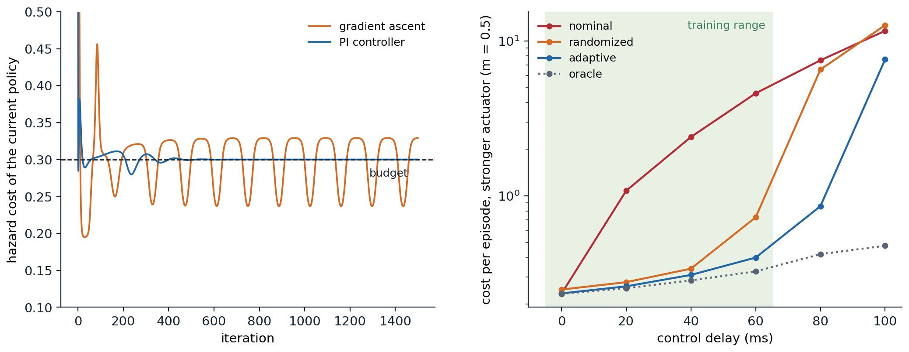

[ML Mastery Notes](../README.md) › [Reinforcement Learning](README.md)

# 31. Reinforcement Learning in the Real World

[← 30. The Theory of Reinforcement Learning](30-the-theory-of-reinforcement-learning.md)

## <a id="specifying-the-problem"></a>Specifying the problem

### <a id="rewards-are-designed"></a>Rewards are designed

Every chapter so far began with an MDP. Outside a textbook, someone has to write it down: decide what the agent observes, what it may do and how often, what it is rewarded for, and what it must never do. Of these, the reward is the hardest, because it has to say what the designer wants in a form an optimizer cannot misread. The reward hypothesis of chapter 1 says that any goal can be expressed as a reward; it says nothing about how easy the right reward is to find.

Designers face two opposite failures. A **sparse** reward, 1 for success and 0 otherwise, says exactly what is wanted, but an agent may almost never receive it, and learning then waits on exploration (chapter 22). A **dense** reward, a hand-made score for progress, gives a signal at every step, but it encodes the designer's guesses about *how* to succeed, and the agent follows those guesses wherever they lead. An agent learning to ride a bicycle to a goal, rewarded for progress toward it and not penalized for riding away, learned to ride in small circles near its starting point, collecting the reward for the approaching half of every circle ([Randløv and Alstrøm, 1998](https://dblp.org/rec/conf/icml/RandlovA98.html), as described by [Ng, Harada, and Russell, 1999](https://people.eecs.berkeley.edu/~russell/papers/icml99-shaping.pdf)). A boat-racing agent rewarded for the game's score found a lagoon where it could circle forever, knocking over three respawning targets, catching fire and crashing, and scored on average 20% more than human players without finishing the race ([Clark and Amodei, 2016](https://openai.com/index/faulty-reward-functions/)). In a simulated block-stacking task, a shaping term for grasping, computed from the wrong reference point on the brick, taught the arm to flip the brick over instead ([Popov et al., 2017](https://arxiv.org/abs/1704.03073)). Collections of such cases now run to dozens ([Krakovna et al., 2020](https://deepmind.google/discover/blog/specification-gaming-the-flip-side-of-ai-ingenuity/)), and they share a structure: the agent did what it was rewarded for, and the reward differed from the intent in a place the designer had not thought about.

Practice has converged on a few habits. Reward the outcome rather than the method when exploration allows it, and add dense terms only where they are needed. Keep regularizing terms, for energy, smoothness, or wear, small and bounded, so that they cannot dominate the objective. Watch the learned behavior, not only the return curve, since a rising return is exactly what reward hacking looks like. And treat reward design as an iterative loop, in which the designer trains, inspects, and revises; systems such as Eureka now automate that loop with a language model writing the reward code (chapter 29), and learned rewards, from demonstrations (chapter 25) or from preferences (chapter 28), replace hand-writing by fitting.

### <a id="potential-based-shaping"></a>Potential-based shaping

One family of dense rewards is safe by construction. **Potential-based shaping** adds to the reward of each transition

```math
F(s,a,s')=\gamma\Phi(s')-\Phi(s)
```

for a **potential** $`\Phi`$ defined on states, with $`\Phi=0`$ at terminal states. Along any trajectory the added terms telescope: the shaped return from $`s_0`$ differs from the original by $`-\Phi(s_0)`$, whatever the agent does afterward, so every action value shifts by the same amount, $`Q'^{\pi}(s,a)=Q^\pi(s,a)-\Phi(s)`$, and the optimal policies of the two problems coincide. [Ng, Harada, and Russell (1999)](https://people.eecs.berkeley.edu/~russell/papers/icml99-shaping.pdf) proved the converse as well: if $`F`$ is not of this form, there are dynamics and rewards for which it changes the optimal policy ([appendix A](#block-rl31-appendix-a)). The potential can be any function of the state, and a good one approximates the optimal value: with $`\Phi=V^*`$, the expected shaped reward of an action is its advantage $`A^*(s,a)`$, zero for optimal actions and negative for the others, and the problem becomes one a greedy, myopic agent can solve (exercise 31.2). The same idea extends to potentials that depend on the action ([Wiewiora, Cottrell, and Elkan, 2003](https://aaai.org/Papers/ICML/2003/ICML03-103.pdf)) and to potentials that change over time ([Devlin and Kudenko, 2012](https://www.ifaamas.org/Proceedings/aamas2012/papers/2C_3.pdf)).

The guarantee is about the optimum, not about learning. [Wiewiora (2003)](https://doi.org/10.1613/jair.1190) showed that Q-learning with potential-based shaping, started from zero, makes exactly the same decisions as Q-learning without shaping started from $`Q_0(s,a)=\Phi(s)`$: shaping *is* an initialization of the value estimates. A potential therefore helps as much as a good initial guess of the values would, and it can mislead as much as a bad one. The next code measures both effects, and the damage done by a progress bonus that is not potential-based, in a gridworld whose only reward is at the goal.

```python
import numpy as np

# Reward shaping in a sparse gridworld. A 15 x 15 grid, start at (0, 0), goal at (14, 14), reward 1 on reaching the
# goal and 0 otherwise, gamma = 0.98, four moves (a move into the edge stays put), at least 28 moves to the goal.
# Q-learning (step size 0.5, epsilon-greedy with epsilon 0.1, ties broken at random, Q initialized to 0) runs for 300
# episodes of at most 1,000 steps, 10 seeds, with the sparse reward plus a shaping term F(s, s'):
#   potential-based, F = gamma Phi(s') - Phi(s) (Phi = 0 at the goal), with d(s) the Manhattan distance to the goal:
#     Phi = 1 - d/28, a rough guess of the value; Phi = -d/28, the same guess shifted by -1; Phi = +d/28, backward;
#   a progress bonus, F = 0.1 for every move that reduces d, and 0 for every move that increases it.
# We count the steps used in training and follow the final greedy policy, which is judged by the true reward only.
N, GOAL, GAMMA = 15, (14, 14), 0.98
MOVES = ((1, 0), (-1, 0), (0, 1), (0, -1))
dist = lambda s: abs(GOAL[0] - s[0]) + abs(GOAL[1] - s[1])
SHAPING = {
    "none": lambda s, s2: 0.0,
    "Phi = 1 - d/28": lambda s, s2: (0 if s2 == GOAL else GAMMA * (1 - dist(s2) / 28)) - (1 - dist(s) / 28),
    "Phi = -d/28": lambda s, s2: (0 if s2 == GOAL else GAMMA * -dist(s2) / 28) - -dist(s) / 28,
    "Phi = +d/28": lambda s, s2: (0 if s2 == GOAL else GAMMA * dist(s2) / 28) - dist(s) / 28,
    "progress bonus": lambda s, s2: 0.1 if dist(s2) < dist(s) else 0.0,
}


def step(s, a):
    return min(max(s[0] + MOVES[a][0], 0), N - 1), min(max(s[1] + MOVES[a][1], 0), N - 1)


def train(F, seed, episodes=300):
    rng = np.random.default_rng(seed)
    Q, used = np.zeros((N, N, 4)), 0
    for ep in range(episodes):
        s = (0, 0)
        for t in range(1000):
            a = rng.integers(4) if rng.random() < 0.1 else rng.choice(np.flatnonzero(Q[s] == Q[s].max()))
            s2 = step(s, a)
            r = (s2 == GOAL) + F(s, s2)
            Q[s][a] += 0.5 * ((r if s2 == GOAL else r + GAMMA * Q[s2].max()) - Q[s][a])
            s, used = s2, used + 1
            if s == GOAL:
                break
    s, t = (0, 0), 0                                      # the greedy policy, run for up to 1,000 steps
    while s != GOAL and t < 1000:
        s, t = step(s, Q[s].argmax()), t + 1
    return used, t if s == GOAL else None


print("                    steps in training        greedy policy        its length")
print("  shaping           median     largest      reaches the goal    (optimal 28)")
for name, F in SHAPING.items():
    res = [train(F, seed) for seed in range(10)]
    used, ok = [u for u, _ in res], [L for _, L in res if L is not None]
    print(f"  {name:16s}{np.median(used):9,.0f}{max(used):12,d}{len(ok):16d} of 10" + (f"{np.mean(ok):16.1f}" if ok else f"{'never':>16s}"))
#                     steps in training        greedy policy        its length
#   shaping           median     largest      reaches the goal    (optimal 28)
#   none               34,345      41,361              10 of 10            28.2
#   Phi = 1 - d/28      9,746       9,888              10 of 10            28.0
#   Phi = -d/28        52,871     274,945               9 of 10            28.7
#   Phi = +d/28       173,811     195,787               9 of 10            28.0
#   progress bonus     53,780      60,659               0 of 10           never
```

Without shaping, Q-learning spends a median of about 34,000 steps over its 300 episodes, most of them in the first few dozen episodes, while it still wanders before reaching the goal. The potential $`\Phi=1-d/28`$, a rough guess of the value that decreases with the Manhattan distance $`d`$ to the goal, cuts that to under 10,000 and finds the shortest path in every run. The same potential lowered by 1 describes the same differences between states, and it still leaves the optimal policy unchanged, yet it made learning slower than no shaping at all and erratic, with one run using 275,000 steps: a negative potential is a pessimistic initialization, and against pessimistic estimates, a move into a wall that leaves the agent where it is looks better than a move into an unexplored state (exercise 31.2). A potential that points away from the goal is five times slower than none, but because it is potential-based, it leaves the optimal policy unchanged, and nine of its ten runs end with shortest paths. The progress bonus is worse than slow. Stepping toward the goal and back earns 0.1 every two steps forever, worth more than entering the goal, so in the shaped problem the optimal behavior is to hover next to the goal and never reach it (exercise 31.1): no run's greedy policy reaches the goal, exactly the bicycle's circles.

### <a id="when-the-proxy-is-optimized"></a>When the proxy is optimized

A reward that is only approximately right is a **proxy**, and optimizing a proxy hard enough tends to find the places where it and the intent diverge, an instance of Goodhart's law. [Skalse et al. (2022)](https://arxiv.org/abs/2209.13085) made this precise. They call a proxy *unhackable* with respect to a true reward if no change of policy can increase the proxy's return while decreasing the true return, and showed that over the set of all stochastic policies, two rewards are unhackable with respect to each other only if one of them is constant: every nontrivial proxy can be gamed by some policy. Nontrivial unhackable pairs exist only for special sets of policies, such as finite sets or deterministic policies; any set containing an open set of stochastic policies, even a small neighborhood of a trusted policy, still admits hacking. Limiting how far optimization moves from a trusted policy, as the KL penalties of chapter 28 do, therefore cannot rule hacking out, but it limits how far the true return can fall, which is why it is a real safeguard and not only a regularizer. Learned rewards are proxies by construction, and their overoptimization, the true quality peaking and then falling as the proxy keeps rising, is measured in NLP chapter 11; reward hacking and the questions it raises about overseeing capable optimizers are central themes of the Safety and Frontier module.

Many real objectives also have several parts that trade off: speed and energy, throughput and wear, performance and risk. Folding them into one reward with fixed weights is common, but the weights have no meaning an operator can check, and they must be retuned whenever the scales change. When one of the parts is really a requirement, a bound on an expected cost that must not be exceeded, a constrained formulation states it directly ([below](#constrained-mdps)); when the trade-off itself is to be explored, multi-objective RL learns a set of policies along the Pareto front ([Roijers, Vamplew, Whiteson, and Dazeley, 2013](https://doi.org/10.1613/jair.3987)).

## <a id="sparse-rewards-and-goals"></a>Sparse rewards and goals

### <a id="goal-conditioned-learning-and-hindsight"></a>Goal-conditioned learning and hindsight

Many tasks are naturally about reaching a goal: a position, a configuration of objects, an arrangement of bits. A goal-conditioned policy $`\pi(a\mid s,g)`$ and value $`Q(s,a,g)`$, trained over a distribution of goals, generalize across goals as they do across states, the universal value functions of chapter 29, and the reward is usually sparse: $`r(s',g)=0`$ if $`s'`$ achieves $`g`$, and $`-1`$ otherwise. Goal conditioning offers something ordinary RL does not. When the reward is a known function of the state and the goal, one experience can be scored against *any* goal, an observation that goes back to [Kaelbling (1993)](https://dblp.org/rec/conf/ijcai/Kaelbling93.html), whose agent updated its values for all goals from every transition.

**Hindsight experience replay** (HER; [Andrychowicz et al., 2017](https://arxiv.org/abs/1707.01495)) turns the observation into a replay strategy for off-policy learners. A trajectory that failed to reach its goal $`g`$ did reach the states it visited, so each transition $`(s_t,a_t,s_{t+1})`$ is stored not only with $`g`$ but also with a few goals achieved later in the same episode, with the reward recomputed: for those goals, part of the trajectory is a success. The "future" strategy with four relabeled goals per transition worked best. The authors' test case is **bit flipping**: the state and the goal are strings of $`n`$ bits, each action flips one bit, and the reward is $`-1`$ until the state equals the goal. A random start and goal differ in about $`n/2`$ bits, and random exploration essentially never matches all $`n`$, so an agent that learns only from its real goals never sees a reward. The next code reproduces the comparison at a small scale.

```python
import numpy as np
import torch
import torch.nn as nn

# Hindsight experience replay on bit flipping (Andrychowicz et al., 2017). The state and the goal are strings of n
# bits; each action flips one bit; the reward is 0 on reaching the goal, which ends the episode, and -1 otherwise;
# an episode lasts at most n steps. A random start and goal differ in about n/2 bits, and random flipping almost
# never matches all n. DQN (MLP 2n -> 256 -> n, epsilon 0.2, gamma 0.98, soft target updates) is trained for
# 2,400 episodes, 16 per cycle, each followed by 40 minibatch updates, with and without hindsight relabeling: every
# transition is also stored with 4 goals replaced by states reached later in the same episode ("future" strategy).
torch.set_num_threads(1)


def train(n, her, seed, cycles=150, E=16, gamma=0.98):
    rng = np.random.default_rng(seed); torch.manual_seed(seed)
    make = lambda: nn.Sequential(nn.Linear(2 * n, 256), nn.ReLU(), nn.Linear(256, n))
    net, tgt = make(), make(); tgt.load_state_dict(net.state_dict())
    opt = torch.optim.Adam(net.parameters(), lr=1e-3)
    q = lambda m, s, g: m(torch.as_tensor(np.concatenate([s, g], -1), dtype=torch.float32))
    buf = {k: [] for k in "sagn"}                  # state, action, goal, next state
    for c in range(cycles):
        s, g = rng.integers(0, 2, (E, n)), rng.integers(0, 2, (E, n))
        traj, acts, length = [s], [], np.full(E, n)
        for t in range(n):
            with torch.no_grad():
                a = np.where(rng.random(E) < 0.2, rng.integers(0, n, E), q(net, s, g).argmax(1).numpy())
            s = s.copy(); s[np.arange(E), a] ^= 1
            traj.append(s); acts.append(a)
            length = np.where((length == n) & (s == g).all(1) & (t < length), t + 1, length)
        traj, acts = np.stack(traj, 1), np.stack(acts, 1)       # (E, n+1, n), (E, n)
        e, t = np.nonzero(np.arange(n)[None] < length[:, None])  # the transitions actually taken
        goals = [g[e]]
        if her:                                                  # 4 goals achieved later in the same episode
            goals += [traj[e, rng.integers(t + 1, length[e] + 1)] for _ in range(4)]
        for gl in goals:
            buf["s"].append(traj[e, t]); buf["a"].append(acts[e, t]); buf["g"].append(gl); buf["n"].append(traj[e, t + 1])
        S, A, G, S2 = (np.concatenate(buf[k]) for k in "sagn")
        for _ in range(40):
            i = rng.integers(0, len(S), 128)
            done = torch.as_tensor((S2[i] == G[i]).all(1), dtype=torch.float32)
            with torch.no_grad():
                y = (done - 1 + gamma * (1 - done) * q(tgt, S2[i], G[i]).max(1).values).clamp(-1 / (1 - gamma), 0)
            loss = ((q(net, S[i], G[i]).gather(1, torch.as_tensor(A[i])[:, None])[:, 0] - y) ** 2).mean()
            opt.zero_grad(); loss.backward(); opt.step()
        with torch.no_grad():
            for p, pt in zip(net.parameters(), tgt.parameters()):
                pt.mul_(0.95).add_(0.05 * p)
    s, g = rng.integers(0, 2, (1000, n)), rng.integers(0, 2, (1000, n))  # greedy test on 1,000 new goals
    done = (s == g).all(1)
    for t in range(n):
        with torch.no_grad():
            a = q(net, s, g).argmax(1).numpy()
        s = s.copy(); s[np.arange(1000), a] ^= ~done; done |= (s == g).all(1)
    return done.mean(), (S2 == G).all(1).mean()


print("         greedy success on new goals    stored transitions that reach their goal     (mean of 2 seeds)")
print("  bits      DQN      DQN + HER                DQN      DQN + HER")
for n in (6, 10, 14, 18):
    dqn, her = (np.mean([train(n, h, seed) for seed in range(2)], 0) for h in (False, True))
    print(f"  {n:4d}{dqn[0]:9.2f}{her[0]:15.2f}{dqn[1]:19.4f}{her[1]:15.4f}")
#          greedy success on new goals    stored transitions that reach their goal     (mean of 2 seeds)
#   bits      DQN      DQN + HER                DQN      DQN + HER
#      6     1.00           1.00             0.1490         0.4726
#     10     0.01           1.00             0.0013         0.3438
#     14     0.00           1.00             0.0000         0.2780
#     18     0.00           0.84             0.0000         0.2429
```

DQN alone learns 6 bits, where 15% of its stored transitions happen to reach their goals, and fails from 10 bits on, where almost none do: it has nothing to learn from. With hindsight, about a quarter to a half of the stored transitions are successes for *some* goal at every size, and the same network, with the same budget, reaches every new goal at 10 and 14 bits and 84% of them at 18. With more training, the original paper found DQN limited to $`n\le13`$ and HER solving $`n=50`$. On simulated robot arms, HER learned pushing, sliding, and pick-and-place from binary rewards, where the shaped rewards the authors tried failed on every task, and a pick-and-place policy trained in simulation ran on a physical Fetch robot, succeeding in 2 of 5 trials at first and in 5 of 5 once observation noise was added in training, a small instance of the sim-to-real methods of [a later section](#from-simulation-to-reality).

### <a id="hindsight-beyond-goals"></a>Hindsight beyond goals

Relabeling rewrites the goal after seeing the outcome, and in a stochastic environment that is a biased sample. A transition stored with the goal it happened to reach is always a success for that goal, so an action that reaches a state only by luck looks, in the relabeled data, like one that reaches it reliably, and value estimates become optimistic about risky actions (exercise 31.3). The bias vanishes in deterministic environments, and it can be corrected by importance weighting ([Schramm et al., 2022](https://arxiv.org/abs/2207.01115)) or offset by rewarding hindsight transitions differently from real ones ([Lanka and Wu, 2018](https://arxiv.org/abs/1809.02070)).

The same idea supports methods without value functions. **Goal-conditioned supervised learning** (GCSL; [Ghosh et al., 2021](https://arxiv.org/abs/1912.06088)) relabels each of the agent's own trajectories with the goals it reached and trains the policy to imitate the relabeled actions, which are by definition good ways of reaching those goals; iterated, this improves the policy without rewards or critics, and is the goal-reaching relative of the return-conditioned policies of chapter 26. Relabeling also generalizes beyond goals: a trajectory can be relabeled with any task, reward function, or instruction for which it is good evidence, a choice that can be made by inverse RL ([Eysenbach, Geng, Levine, and Salakhutdinov, 2020](https://arxiv.org/abs/2002.11089); [Li, Pinto, and Abbeel, 2020](https://arxiv.org/abs/2002.11708)). And the goals themselves can be generated: a curriculum of goals of intermediate difficulty, produced by a generative adversarial network ([Florensa, Held, Geng, and Abbeel, 2018](https://arxiv.org/abs/1705.06366)), or goals imagined by sampling from a generative model of observations, which let a robot practice reaching images of states it could produce itself ([Nair et al., 2018](https://arxiv.org/abs/1807.04742)).

## <a id="temporal-abstraction"></a>Temporal abstraction

### <a id="options-and-semi-mdps"></a>Options and semi-MDPs

People plan in steps of very different lengths: drive to the airport, then take the flight, and only at the lowest level move a foot or a wheel. An agent that chooses a primitive action every few milliseconds faces long horizons, slow credit assignment, and exploration that rarely strays far from where it started. **Options** ([Sutton, Precup, and Singh, 1999](https://doi.org/10.1016/S0004-3702(99)00052-1)) give it temporally extended actions. An option $`o=(\mathcal I_o,\pi_o,\beta_o)`$ has an initiation set of states where it may start, a policy it follows while running, and a termination condition $`\beta_o(s)`$, the probability of stopping in each state. Primitive actions are options that last one step. Choosing among options from the states where one ends is a **semi-MDP**, a decision process whose actions take variable amounts of time, and its values satisfy a Bellman equation in which an option that runs for $`k`$ steps is followed by a discount of $`\gamma^k`$:

```math
Q(s,o)=\mathbb E\bigl[r_{t+1}+\gamma r_{t+2}+\dots+\gamma^{k-1}r_{t+k}+\gamma^k\max_{o'}Q(s_{t+k},o')\;\big|\;s_t=s,\ o\bigr],
```

where the expectation is over the random duration $`k`$ as well as the rewards and the state where the option ends. Q-learning carries over directly, with the discounted reward accumulated during the option as the reward and $`\gamma^k`$ as the discount ([Bradtke and Duff, 1994](https://papers.nips.cc/paper_files/paper/1994/hash/07871915a8107172b3b5dc15a6574ad3-Abstract.html)). Because the options' policies are known, experience can do more work: **intra-option learning** updates the value of every option consistent with each primitive step, and an option can be interrupted whenever switching to another looks better.

What options buy is reach. The value of a distant reward propagates back through a few option-level decisions instead of hundreds of primitive ones (exercise 31.6), and an agent exploring at the level of options travels far with each choice. What they cost is optimality: an agent restricted to a set of options can do no better than the best combination of them, which may be worse than the best primitive policy. Earlier formulations imposed hierarchies from above: **feudal RL** ([Dayan and Hinton, 1992](https://papers.nips.cc/paper_files/paper/1992/hash/d14220ee66aeec73c49038385428ec4c-Abstract.html)), with managers that set subgoals for sub-managers without caring how they are met; **hierarchies of abstract machines** ([Parr and Russell, 1997](https://papers.nips.cc/paper_files/paper/1997/hash/5ca3e9b122f61f8f06494c97b1afccf3-Abstract.html)), partial programs whose choice points are learned; and **MAXQ** ([Dietterich, 2000](https://doi.org/10.1613/jair.639)), which decomposes the value function along a task hierarchy and distinguishes *hierarchically* optimal policies, the best a hierarchy allows, from *recursively* optimal ones, in which each subtask is solved in isolation.

### <a id="learning-hierarchies"></a>Learning hierarchies

Where good options come from is the hard part. Early methods looked for **bottleneck** states, such as doorways, that lie on many successful trajectories, and made reaching them into subgoals ([McGovern and Barto, 2001](https://scholarworks.umass.edu/cs_faculty_pubs/8/)); **eigenoptions** ([Machado, Bellemare, and Bowling, 2017](https://arxiv.org/abs/1703.00956)) use the eigenvectors of the graph Laplacian of the state space as intrinsic rewards, each yielding an option that travels along one of the directions in which the space is hardest to cross. The **option-critic** architecture ([Bacon, Harb, and Precup, 2017](https://arxiv.org/abs/1609.05140)) learns the options' policies and termination functions end to end by policy gradients, though without further pressure learned options tend to degenerate into one option that does everything or into options that switch at every step.

The approach that has scaled best is to make the high level choose **goals** for a goal-conditioned low level, with the low level rewarded intrinsically for reaching them: **h-DQN** ([Kulkarni, Narasimhan, Saeedi, and Tenenbaum, 2016](https://arxiv.org/abs/1604.06057)) with hand-specified subgoal objects; **FeUdal networks** ([Vezhnevets et al., 2017](https://arxiv.org/abs/1703.01161)), whose manager emits directions in a learned latent space at a slower time scale; **HIRO** ([Nachum, Gu, Lee, and Levine, 2018](https://arxiv.org/abs/1805.08296)), whose goals are desired changes of the state and which makes off-policy learning at the high level possible by relabeling old high-level actions with the goals that would best explain what the changing low level actually did; **hierarchical actor-critic** ([Levy, Konidaris, Platt, and Saenko, 2019](https://arxiv.org/abs/1712.00948)), which applies hindsight relabeling at every level; and **Director** ([Hafner, Lee, Fischer, and Abbeel, 2022](https://arxiv.org/abs/2206.04114)), which chooses goals in the latent space of a world model and learns both levels in imagination.

Why hierarchy helps has been examined as carefully as whether it does. Comparing hierarchical agents with flat agents given the same advantages one at a time, [Nachum et al. (2019)](https://arxiv.org/abs/1909.10618) attributed most of the benefit to better exploration, temporally extended and directed, and little to easier learning of the policy itself; flat agents that explore with temporally correlated, goal-directed behavior performed competitively with hierarchical ones. In current systems, hierarchy is often supplied rather than learned: a language model decomposes an instruction into steps that learned skills can execute, as in SayCan ([Ahn et al., 2022](https://arxiv.org/abs/2204.01691)), and a robot's learned locomotion controller serves as the low level for navigation or manipulation planners. Temporal abstraction also has a humbler, universal form. The **control frequency** and the **action repeat**, the number of simulator steps each decision is held for, set the time scale of the problem, and choosing them is part of problem design ([below](#the-challenges-of-real-world-rl)).

## <a id="safety"></a>Safety

### <a id="constrained-mdps"></a>Constrained MDPs

Many requirements are naturally bounds. A robot should reach its goal quickly *and* spend little time near people; a building controller should save energy *and* keep temperatures within limits; a trading agent should earn *and* keep its risk below a threshold. A **constrained MDP** ([Altman, 1999](https://doi.org/10.1201/9781315140223)) adds cost functions $`c_1,\dots,c_k`$ and budgets $`d_1,\dots,d_k`$ to an MDP and asks for

```math
\max_\pi J_r(\pi)\quad\text{subject to}\quad J_{c_i}(\pi)\le d_i,\ i=1,\dots,k,
```

where $`J_r`$ and $`J_{c_i}`$ are the expected discounted totals of the reward and of each cost from the start. Budgets have units an operator can state and check, and they do not need retuning when the reward changes scale, which fixed penalty weights do.

The theory is that of linear programming. Expected discounted totals are linear in the discounted **occupancy measure** $`x(s,a)`$ of the policy (chapter 1), and the occupancy measures of all policies are exactly the nonnegative solutions of a set of linear flow equations, so a constrained MDP is the linear program of chapter 2 with $`k`$ more inequality constraints. Two consequences follow ([appendix B](#block-rl31-appendix-b)). First, an optimal policy may have to randomize, but there is always one that randomizes in at most $`k`$ states; with one constraint, in at most one. A fixed penalty turns the problem back into an ordinary MDP, whose optimal policies can be taken deterministic, so it cannot in general produce the constrained optimum. Second, strong duality holds: with the **Lagrangian**

```math
L(\pi,\lambda)=J_r(\pi)-\sum_i\lambda_i\bigl(J_{c_i}(\pi)-d_i\bigr),\qquad \lambda_i\ge0,
```

the constrained optimum equals $`\min_{\lambda\ge0}\max_\pi L(\pi,\lambda)`$, and the inner maximization is an ordinary MDP with the penalized reward $`r-\sum_i\lambda_ic_i`$. [Paternain, Chamon, Calvo-Fullana, and Ribeiro (2019)](https://arxiv.org/abs/1910.13393) showed that the duality gap is zero despite the nonconvexity of the problem in the policy, and that for parameterized policies it is bounded by a multiple of the parameterization's approximation error, so nearly zero for rich ones, the justification of the **Lagrangian methods** that dominate practice: an RL algorithm improves the policy on the penalized reward while the multipliers rise when a constraint is violated and fall when it is slack. This is RCPO ([Tessler, Mankowitz, and Mannor, 2019](https://arxiv.org/abs/1805.11074)) and the PPO-Lagrangian baselines of the Safety Gym benchmark ([Ray, Achiam, and Amodei, 2019](https://cdn.openai.com/safexp-short.pdf)). **Constrained policy optimization** (CPO; [Achiam, Held, Tamar, and Abbeel, 2017](https://arxiv.org/abs/1705.10528)) instead adds a linearized cost constraint to each trust-region step of chapter 20, aiming to satisfy the constraint approximately at every update rather than on average.

Lagrangian learning has a characteristic failure: the multiplier is a slow feedback loop around a lagging system. The multiplier grows while the policy violates the constraint, the policy responds only after the multiplier has overshot, and the cost swings from violation to excessive caution and back. [Stooke, Achiam, and Abbeel (2020)](https://arxiv.org/abs/2007.03964) observed that the usual multiplier update, $`\lambda\leftarrow\max(0,\lambda+\eta(J_c-d))`$, is **integral control** of the constraint violation, and that adding the proportional and derivative terms of a PID controller damps the oscillation. The next code shows the whole picture on a small gridworld, solving the constrained problem exactly and then by Lagrangian learning with each update of the multiplier.

```python
import numpy as np
from scipy.optimize import linprog

# A constrained MDP. A robot crosses a 5 x 7 grid from (2, 0) to (2, 6); the three cells between, (2, 2) to (2, 4),
# are hazardous. Each step costs reward -1, each step taken in a hazard costs 1 unit of the constraint cost, and moves
# slip in a random direction with probability 0.2; gamma = 0.95. The objective is the discounted return, subject to
# a discounted hazard cost of at most 0.3. We compare: fixed penalties (optimal policies for r - lambda c, found by
# value iteration); the exact constrained optimum, a linear program over occupancy measures; and Lagrangian learning,
# in which a softmax policy takes exact natural-gradient steps on r - lambda c while lambda follows the constraint
# violation, either by gradient ascent (lambda += 0.5 (cost - 0.3)) or by a PI controller that adds a proportional
# term (lambda = 5 (cost - 0.3) + sum of 0.5 (cost - 0.3)), as in Stooke, Achiam, and Abbeel (2020).
H, W, GAMMA, BUDGET = 5, 7, 0.95, 0.3
S, A, MOVES = H * W, 4, ((-1, 0), (1, 0), (0, -1), (0, 1))
P, R, C = np.zeros((S, A, S)), np.full((S, A), -1.0), np.zeros((S, A))
for y in range(H):
    for x in range(W):
        s = y * W + x
        if (y, x) == (2, 6):                                    # the goal is absorbing and free
            P[s, :, s], R[s] = 1, 0
            continue
        C[s] = (y, x) in ((2, 2), (2, 3), (2, 4))
        for a in range(A):
            for b, (dy, dx) in enumerate(MOVES):
                P[s, a, min(max(y + dy, 0), H - 1) * W + min(max(x + dx, 0), W - 1)] += 0.8 * (a == b) + 0.05
mu0 = np.eye(S)[2 * W]


def values(pi, f):
    """Per-state discounted totals of f(s, a) under policy pi, and the total from the start."""
    v = np.linalg.solve(np.eye(S) - GAMMA * np.einsum("sa,sat->st", pi, P), (pi * f).sum(1))
    return v, v @ mu0


def optimal(lam):
    Q = np.zeros((S, A))
    for _ in range(1000):
        Q = R - lam * C + GAMMA * P @ Q.max(1)
    return np.eye(A)[Q.argmax(1)]


print("fixed penalty    return    cost")
for lam in (0, 0.8, 1, 3, 30):
    pi = optimal(lam)
    print(f"  lambda = {lam:<4}{values(pi, R)[1]:8.3f}{values(pi, C)[1]:8.3f}")

# the exact optimum: maximize sum x r subject to the flow constraints and sum x c <= 0.3, over occupancies x >= 0
flow = np.kron(np.eye(S), np.ones(A)) - GAMMA * P.reshape(S * A, S).T
lp = linprog(-R.ravel(), A_ub=C.ravel()[None], b_ub=[BUDGET], A_eq=flow, b_eq=mu0, method="highs")
x = lp.x.reshape(S, A); visited = x.sum(1) > 1e-9
mixed = (x[visited].max(1) < x[visited].sum(1) - 1e-9).sum()
print(f"linear program   {-lp.fun:.3f}   {C.ravel() @ lp.x:.3f}   randomizes in {mixed} state(s); multiplier {-lp.ineqlin.marginals[0]:.3f}")


def lagrangian(controller, iters=3000):
    logits, lam, integral, hist = np.zeros((S, A)), 0.0, 0.0, []
    for k in range(iters):
        pi = np.exp(logits - logits.max(1, keepdims=True)); pi /= pi.sum(1, keepdims=True)
        J_r, J_c = values(pi, R)[1], values(pi, C)[1]
        hist.append((J_r, J_c, lam))
        err = J_c - BUDGET
        if controller == "gradient ascent":
            lam = max(0.0, lam + 0.5 * err)
        else:
            integral = max(0.0, integral + 0.5 * err); lam = max(0.0, 5 * err + integral)
        f = R - lam * C
        logits += 0.2 * (f + GAMMA * P @ values(pi, f)[0])     # natural gradient step: logits += eta Q_lambda
    return np.array(hist)


print("Lagrangian       final: return   cost   lambda   iterations over budget   total violation   last 1,000: mean return, cost")
for controller in ("gradient ascent", "PI controller"):
    h = lagrangian(controller)
    over = np.maximum(h[:, 1] - BUDGET, 0)
    print(f"  {controller:16s}{h[-1, 0]:12.3f}{h[-1, 1]:7.3f}{h[-1, 2]:9.3f}{(over > 0.005).mean():21.0%}{over.sum():18.1f}"
          f"{h[-1000:, 0].mean():17.3f}{h[-1000:, 1].mean():7.3f}")
# fixed penalty    return    cost
#   lambda = 0     -6.712   2.087
#   lambda = 0.8   -7.819   0.330
#   lambda = 1     -7.937   0.207
#   lambda = 3     -8.090   0.126
#   lambda = 30    -9.256   0.013
# linear program   -7.848   0.300   randomizes in 1 state(s); multiplier 0.962
# Lagrangian       final: return   cost   lambda   iterations over budget   total violation   last 1,000: mean return, cost
#   gradient ascent       -7.820  0.329    0.794                  60%              48.2           -7.847  0.301
#   PI controller         -7.848  0.300    0.962                   5%               3.1           -7.848  0.300
```

Without the constraint, the shortest route crosses the hazards, with a hazard cost of 2.09. Every fixed penalty yields a deterministic policy, and as $`\lambda`$ grows the cost falls in jumps: to 0.330 for $`\lambda`$ between about 0.63 and 0.96, just over the budget of 0.3, then to 0.207, and further for larger penalties. No penalty spends the budget exactly, and the best policy a penalty yields that satisfies it, for any $`\lambda`$ between 0.962 and 1.835 such as $`\lambda=1`$, returns $`-7.937`$. The linear program does better, $`-7.848`$, by randomizing in a single state between the two policies on either side of the budget, those with costs 0.330 and 0.207, in the proportion that spends the budget exactly; its multiplier, 0.962, is the penalty at which those two policies tie. Lagrangian learning with gradient ascent on the multiplier finds this solution only on average: its iterates, averaged over the last 1,000 iterations, have the optimal return and cost, but the current policy keeps swinging between the two tied policies, its cost cycling between about 0.24 and 0.33, over budget in 60% of the iterations and at the end. The PI controller settles on the randomized optimum and the exact multiplier, and its total violation over training is about a fifteenth of gradient ascent's. The left panel of the figure after the fourth code shows the two trajectories. Methods with guarantees for the last iterate rather than the average, such as optimistic gradient updates ([Moskovitz et al., 2023](https://arxiv.org/abs/2302.01275)), address the same problem from the side of optimization theory.

### <a id="safe-exploration"></a>Safe exploration

A constraint satisfied in expectation, after training, says nothing about what happens during training, and an agent cannot learn that an action is dangerous without trying it, being told, or predicting it. Safe exploration therefore always rests on prior knowledge, and methods differ in its form ([García and Fernández, 2015](https://jmlr.org/papers/v16/garcia15a.html); [Brunke et al., 2022](https://doi.org/10.1146/annurev-control-042920-020211)).

- **Shields and safety filters.** A separate component checks each proposed action and replaces it if it could lead to an unsafe state. The check can come from a formal specification in temporal logic and an abstraction of the dynamics ([Alshiekh et al., 2018](https://arxiv.org/abs/1708.08611)), from a **control barrier function**, a function of the state that must not decrease past zero and that turns safety into a constraint on each action ([Cheng, Orosz, Murray, and Burdick, 2019](https://arxiv.org/abs/1903.08792)), from a model predictive controller that certifies that a safe fallback remains available ([Wabersich and Zeilinger, 2021](https://arxiv.org/abs/1812.05506); chapter 15), or from a learned linear model of the constraint, used to project each action onto the safe set ([Dalal et al., 2018](https://arxiv.org/abs/1801.08757)).
- **Safe sets that grow.** With a model whose uncertainty is quantified, such as a Gaussian process, the agent explores only where it can be confident of staying within a certified safe region, and enlarges the region as its model improves: for the region of attraction of a controller ([Berkenkamp, Turchetta, Schoellig, and Krause, 2017](https://arxiv.org/abs/1705.08551)), or for a safety function over the states of a finite MDP ([Turchetta, Berkenkamp, and Krause, 2016](https://arxiv.org/abs/1606.04753)). **Lyapunov functions** constructed from a baseline policy's constraint costs give local constraints under which each policy update keeps the constraint satisfied ([Chow, Nachum, Duenez-Guzman, and Ghavamzadeh, 2018](https://arxiv.org/abs/1805.07708)).
- **Returning and recovering.** Many dangers are really irreversibilities. [Moldovan and Abbeel (2012)](https://arxiv.org/abs/1205.4810) defined safety as the ability to return to the starting states and showed that exploring under this requirement exactly is NP-hard; practical methods learn a reset policy alongside the task policy and abort when the reset would fail ([Eysenbach, Gu, Ibarz, and Levine, 2018](https://arxiv.org/abs/1711.06782)), or learn a recovery policy that takes over near constraint violations, estimated from offline data ([Thananjeyan et al., 2021](https://arxiv.org/abs/2010.15920)).
- **Learning with the exploration in mind.** On-policy learners account for their own exploratory mistakes, which is why SARSA takes the safer path along the cliff in chapter 7; offline RL (chapter 26) and simulation ([below](#from-simulation-to-reality)) move the dangerous part of learning away from the real system altogether.

### <a id="robustness-and-risk"></a>Robustness and risk

Constraints bound expected costs. Two other formulations protect against what the expectation hides. **Robust MDPs** replace the transition function by a set of possible ones and optimize the worst case over the set; when the uncertainty is independent across states, a condition called rectangularity, robust dynamic programming is as tractable as the ordinary kind ([Iyengar, 2005](https://doi.org/10.1287/moor.1040.0129); [Nilim and El Ghaoui, 2005](https://doi.org/10.1287/opre.1050.0216)). Deep RL approximates the worst case by training against an adversary that applies disturbances, as in **robust adversarial RL** ([Pinto, Davidson, Sukthankar, and Gupta, 2017](https://arxiv.org/abs/1703.02702)). Worst-case policies can be very conservative, and the right size of the uncertainty set is itself a modeling choice. **Risk-sensitive** objectives act on the distribution of the return rather than on the model: the conditional value at risk of chapter 17, the expected return in the worst fraction of outcomes, is the most common, and it has a dual interpretation as robustness, since the CVaR equals the worst expected return over a set of reweightings of the outcomes. Distributional critics appear in several of the deployed systems below.

## <a id="from-simulation-to-reality"></a>From simulation to reality

### <a id="the-reality-gap"></a>The reality gap

Real systems are slow, fragile, and expensive to reset, and most of the agents that act in the physical world today were trained in simulation. Simulators are wrong in ways that matter: actuators have dynamics, friction, and backlash that are hard to model; contacts are approximated; sensors are noisy and delayed; rendered images differ from camera images; and every computation and communication adds latency. A policy optimized against a simulator exploits its errors, for the same reason that a policy exploits a learned model (chapter 23) or a proxy reward: optimization goes wherever the objective is highest, including into the gaps between the model and the world. The difference between a policy's performance in simulation and in reality is the **reality gap**.

The first defense is to make the simulator better. **System identification** fits its parameters to data from the real system, as in Lab 7; learned components replace the hardest parts of the physics, such as the **actuator network** trained on measurements of the real motors of the ANYmal quadruped and placed inside its simulator ([Hwangbo et al., 2019](https://arxiv.org/abs/1901.08652)); and details such as actuator dynamics and control latency can decide whether a policy transfers at all ([Tan et al., 2018](https://arxiv.org/abs/1804.10332)). Simulation has also become fast enough to change what is practical: with thousands of robots simulated in parallel on one GPU, a quadruped learned to walk on flat ground in under four minutes and on rough terrain in twenty ([Rudin, Hoeller, Reist, and Hutter, 2021](https://arxiv.org/abs/2109.11978)).

### <a id="randomization-and-adaptation"></a>Randomization and adaptation

The second defense accepts that the simulator is wrong and trains a policy that works across the ways it might be wrong. **Domain randomization** samples the simulator's uncertain properties anew in every episode. Randomizing textures, lighting, and camera positions, [Tobin et al. (2017)](https://arxiv.org/abs/1703.06907) trained an object detector on non-realistic rendered images alone that located objects on a real table to within 1.5 cm, accurate enough for grasping, and a drone learned to fly through real buildings from randomized renderings without a single real image ([Sadeghi and Levine, 2017](https://arxiv.org/abs/1611.04201)). Randomizing 95 dynamical parameters, from link masses and joint damping to the friction of the puck and the length of the time step, [Peng, Andrychowicz, Zaremba, and Abbeel (2018)](https://arxiv.org/abs/1710.06537) trained a recurrent policy to push a puck with a real robot arm in 89% of trials, where a policy trained without randomization never succeeded. OpenAI's robot hand ([OpenAI et al., 2020](https://arxiv.org/abs/1808.00177)) learned dexterous in-hand rotation of a block, and later solved a Rubik's cube ([OpenAI et al., 2019](https://arxiv.org/abs/1910.07113)), 60% of the time for scrambles needing 15 face rotations and 20% for the hardest, 26-rotation scrambles, with **automatic domain randomization**, which widens the range of each parameter whenever the policy performs well at its edge, a curriculum over simulators.

Randomization changes the problem the policy solves. The true system becomes a hidden variable drawn from the randomization distribution, which makes the problem partially observable (chapter 14), and the optimal policy is Bayes-adaptive in the sense of chapter 29: it should infer the system from its history and act accordingly. A memoryless policy cannot, and must instead be **robust**, acceptable on every system in the range, which usually means cautious. A policy with memory can identify the system implicitly, which is why Peng et al.'s recurrent policy transferred where feedforward ones did less well. **Rapid motor adaptation** (RMA; [Kumar, Fu, Pathak, and Malik, 2021](https://arxiv.org/abs/2107.04034)) makes the identification explicit. A base policy is trained in simulation with access to a vector of *extrinsics*, an encoding of the true friction, payload, terrain, and motor strength, and an adaptation module is then trained, also in simulation, to estimate the extrinsics from the last half second of states and actions; deployed on a real quadruped without any fine-tuning, the pair adapted within fractions of a second to terrains and loads it had never seen. The same **teacher–student** structure, a teacher with privileged information distilled into a student that must infer it, also carried quadruped locomotion over challenging natural terrain ([Lee et al., 2020](https://arxiv.org/abs/2010.11251); [Miki et al., 2022](https://arxiv.org/abs/2201.08117)), and a transformer over the history of observations and actions, adapting in context, walked a full-sized humanoid outdoors after training only in simulation ([Radosavovic et al., 2024](https://arxiv.org/abs/2303.03381)). The next code compares the three approaches on a problem small enough to test exhaustively: balancing a pendulum whose actuator strength and control delay in "reality" differ from the simulator's.

```python
import numpy as np

# Simulation to reality with a pendulum balanced upright. theta'' = 10 sin(theta) + u(t - delay) / m, time step
# 0.02 s, torque |u| <= 5, small process noise, 200 steps from |theta| <= 0.2. The cost per step is
# theta^2 + 0.1 theta'^2 + 0.0001 u^2, and falling past 1 radian costs 1 per remaining step. Policies are linear,
# u = -k1 theta - k2 theta', and are trained by searching a grid of gains in simulation:
#   nominal:     in the nominal simulator, m = 1 and no delay;
#   randomized:  on simulators with m uniform on [0.5, 2] and a delay of 0 to 3 steps (0 to 60 ms);
#   adaptive:    a policy that knows the parameters (the best gains for each of a grid of 7 x 4 simulators) combined
#                with online identification: it keeps the likelihood of each simulator given the transitions seen so
#                far and acts with the gains of the most likely one (after 5 steps with the randomized gains);
#   oracle:      the best gains for the true parameters, a reference no deployable policy can know.
# Each is then tested on "real" systems with other parameters, with the same 400 initial states and noise.
DT, T, SIG = 0.02, 200, 0.02
k1, k2 = np.meshgrid(np.linspace(10, 400, 40), np.linspace(1, 60, 30))
GAINS = np.stack([k1.ravel(), k2.ravel()], 1)                       # 1,200 candidate policies


def rollout(m, d, n, seed, gains=None, adapt=None):
    """Mean cost over n episodes on systems (m[i], d[i]); fixed gains (P, 2) or the adaptive policy (P = 1)."""
    rng = np.random.default_rng(seed)
    P = 1 if gains is None else len(gains)
    th, om = np.tile(rng.uniform(-0.2, 0.2, n), (P, 1)), np.zeros((P, n))
    past_u, cost, alive = np.zeros((P, n, 8)), np.zeros((P, n)), np.ones((P, n), bool)
    loglik = None if adapt is None else np.zeros((n, len(adapt[0])))
    for t in range(T):
        if adapt is None:
            K = gains[:, None, :]
        else:
            cand_m, cand_d, cand_K, K_start = adapt
            K = (K_start[None] if t < 5 else cand_K[loglik.argmax(1)])[None]
        u = np.clip(-K[..., 0] * th - K[..., 1] * om, -5, 5)
        past_u = np.roll(past_u, 1, axis=2); past_u[..., 0] = u
        u_applied = np.take_along_axis(past_u, np.broadcast_to(d, (P, n))[..., None], 2)[..., 0]
        om_next = om + DT * (10 * np.sin(th) + u_applied / m) + SIG * np.sqrt(DT) * rng.normal(size=n)
        if adapt is not None:                                   # Gaussian likelihood of the observed transition
            pred = om[0][:, None] + DT * (10 * np.sin(th[0])[:, None] + past_u[0][:, cand_d] / cand_m)
            loglik -= (om_next[0][:, None] - pred) ** 2
        th, om = th + DT * om, om_next
        fell = alive & (np.abs(th) > 1)
        cost += np.where(fell, T - t, np.where(alive, th ** 2 + 0.1 * om ** 2 + 1e-4 * u ** 2, 0)); alive &= ~fell
    return cost.mean(1)


def best_gains(m, d, n=64, seed=0):
    return GAINS[rollout(np.broadcast_to(m, n), np.broadcast_to(d, n), n, seed, GAINS).argmin()]


rng = np.random.default_rng(1)
K_nom = best_gains(1.0, 0)
K_rand = GAINS[rollout(rng.uniform(0.5, 2, 256), rng.integers(0, 4, 256), 256, 1, GAINS).argmin()]
cm, cd = np.meshgrid(np.geomspace(0.5, 2, 7), np.arange(4)); cm, cd = cm.ravel(), cd.ravel()
adapt = (cm, cd, np.array([best_gains(m, d) for m, d in zip(cm, cd)]), K_rand)
print(f"gains (k1, k2): nominal {K_nom.round(1)}, randomized {K_rand.round(1)}")
print("  real system         nominal   randomized   adaptive     oracle     (mean cost per episode, 400 episodes)")
for m, d in ((1, 0), (1, 2), (0.5, 0), (0.5, 2), (2, 3), (1, 5), (0.5, 4)):
    test = lambda **kw: rollout(np.full(400, m), np.full(400, d), 400, 7, **kw)[0]
    row = [test(gains=K_nom[None]), test(gains=K_rand[None]), test(adapt=adapt), test(gains=best_gains(m, d)[None])]
    print(f"  m = {m:3}, {20 * d:3d} ms" + "".join(f"{x:11.2f}" for x in row))
# gains (k1, k2): nominal [90.  29.5], randomized [40.   9.1]
#   real system         nominal   randomized   adaptive     oracle     (mean cost per episode, 400 episodes)
#   m =   1,   0 ms       0.25       0.27       0.26       0.25
#   m =   1,  40 ms       0.50       0.33       0.30       0.30
#   m = 0.5,   0 ms       0.23       0.25       0.23       0.23
#   m = 0.5,  40 ms       2.40       0.34       0.31       0.28
#   m =   2,  60 ms       0.54       0.57       0.54       0.53
#   m =   1, 100 ms       3.30       0.82       2.10       0.47
#   m = 0.5,  80 ms       7.51       6.54       0.86       0.42
```

Trained on the nominal simulator, the policy uses high gains, which are optimal there: it balances the nominal system as well as the oracle. With a 40 ms delay its cost doubles, and if the actuator is also twice as strong as modeled, the effective gain doubles as well and the cost is more than eight times the oracle's, the classic way a controller tuned in simulation oscillates on hardware. The randomized policy uses much lower gains, costs slightly more on the nominal system, and stays close to the oracle on the other systems of the table within its training range, though the figure below shows it slipping at the range's hardest corner, a strong actuator with a 60 ms delay: robustness, bought with a little caution. The adaptive policy identifies the system within a fraction of a second and then acts with gains tuned for it, and comes within about 10% of the oracle on the systems of the table within the training range, and within about 20% at the range's hardest corner in the figure. Outside it, the two fail differently. With an 80 ms delay and a strong actuator, the adaptive policy recognizes the strong actuator and the longest delay it knows, 60 ms, and its gentle gains for that case still work, at twice the oracle's cost, while the randomized policy's compromise, too aggressive for this system, costs fifteen times the oracle's. With a 100 ms delay and the nominal actuator, the adaptive policy's best explanation is a 60 ms delay with a weaker actuator, whose gains are too aggressive for the real delay, and it does worse than the randomized policy. An adaptive policy is only as good as the family of systems it can recognize, and outside that family, whether it degrades more or less gracefully than a robust policy depends on what its misidentification does to the gains (exercise 31.7).



*Left: the hazard cost of the current policy during Lagrangian learning on the constrained gridworld of the third code. With gradient ascent on the multiplier (orange), the policy never settles, swinging toward one and then the other of two deterministic policies, one above and one below the budget, with its cost cycling between about 0.24 and 0.33; with the PI controller (blue), it settles on the randomized policy that spends the budget exactly. Right: the pendulum of the fourth code with an actuator twice as strong as the simulator's, against the control delay. The nominal policy degrades as soon as there is any delay; the randomized policy holds up to 40 ms, slips at the edge of its training range (shaded), and fails beyond it; the adaptive policy stays near the oracle through 60 ms and degrades beyond it, but more slowly than the others.*

Lab 17 repeats these experiments with deep networks: PPO under a hazard budget with fixed penalties and learned multipliers, a model-based shield compared with learning to avoid the hazard, and a swing-up pendulum trained with domain randomization, memory, and RMA and tested on systems with other actuators and delays.

### <a id="learning-on-real-hardware"></a>Learning on real hardware

Some systems cannot be simulated well enough, and some tasks are easier to learn directly than to model. Learning on the real system became practical as algorithms became more sample-efficient. **QT-Opt** ([Kalashnikov et al., 2018](https://arxiv.org/abs/1806.10293)) learned vision-based grasping with a distributed Q-learning method from over 580,000 grasp attempts on seven robots, about 800 robot hours over four months, and grasped unseen objects 96% of the time. Soft actor-critic learned a quadruped gait from scratch on a real Minitaur robot in about two hours ([Haarnoja et al., 2019](https://arxiv.org/abs/1812.11103)); with the high update-to-data ratios of chapter 21, a quadruped learned to walk outdoors in 20 minutes ([Smith, Kostrikov, and Levine, 2023](https://arxiv.org/abs/2208.07860)), and with a world model, a quadruped learned to roll over, stand, and walk in one hour without resets ([Wu, Escontrela, Hafner, Goldberg, and Abbeel, 2022](https://arxiv.org/abs/2206.14176)). For manipulation, **SERL** ([Luo et al., 2024](https://arxiv.org/abs/2401.16013)) packaged the ingredients, off-policy learning seeded with a few demonstrations, rewards from a learned success classifier, and a forward–backward controller pair that resets the task, and learned circuit-board insertion, cable routing, and object relocation in 25 to 50 minutes on average; with occasional human corrections during training, **HIL-SERL** ([Luo, Xu, Wu, and Levine, 2025](https://arxiv.org/abs/2410.21845)) reached near-perfect success on precise and dexterous tasks such as inserting a RAM stick or assembling a car dashboard, most of them within one to two and a half hours of training. The same pattern, a pretrained policy improved by RL on real experience with human interventions, drives the RL fine-tuning of robot foundation models in chapter 29.

Real-world learning adds engineering problems that simulation hides. Episodes must be reset, by a person, by a scripted routine, or by a learned reset policy. Rewards must be measured, often by a learned classifier on camera images, which can itself be exploited. Actions must be smooth, since jittery policies that are harmless in simulation waste power and wear out motors; penalizing the change between successive actions, and between the actions for nearby states, cut the power consumption of a real quadrotor's learned controller by almost 80% ([Mysore, Mabsout, Mancuso, and Saenko, 2021](https://arxiv.org/abs/2012.06644)). And someone must be ready to stop the system, which is why the safety filters of the previous section are standard equipment.

## <a id="deployed-systems"></a>Deployed systems

### <a id="case-studies"></a>Case studies

Reinforcement learning now controls, or has controlled, a range of real systems. The table collects the best-documented cases; the largest deployment of all, the training of language models, is the subject of chapter 28.

| System | What the policy decides | How it learned | What made it work |
| --- | --- | --- | --- |
| Stratospheric balloons ([Bellemare et al., 2020](https://doi.org/10.1038/s41586-020-2939-8)) | Ascend, descend, or hold, to ride winds that keep the balloon near a station | Distributional deep Q-learning in a simulator built from historical wind data with procedural noise | A 39-day experiment over the Pacific; better station-keeping than Loon's hand-engineered controller |
| Tokamak plasma ([Degrave et al., 2022](https://doi.org/10.1038/s41586-021-04301-9)) | Voltages on all 19 magnetic coils of the TCV tokamak, at 10 kHz | MPO in a simulator of the plasma and coils | An asymmetric actor–critic: a large critic used only in training, a small actor fast enough for real time; many plasma shapes, including two plasmas at once |
| Racing in Gran Turismo ([Wurman et al., 2022](https://doi.org/10.1038/s41586-021-04357-7)) | Steering, throttle, and brake | QR-SAC, a distributional soft actor–critic, in the game itself on over 1,000 PlayStation 4 consoles | Reward terms encoding racing etiquette; won a head-to-head competition against four of the world's best drivers |
| Drone racing ([Kaufmann et al., 2023](https://doi.org/10.1038/s41586-023-06419-4)) | Collective thrust and body rates of a quadrotor | PPO in simulation | Models of perception noise and dynamics residuals fitted to data from the real track; won 15 of 25 races against three champion pilots |
| Robot soccer ([Haarnoja et al., 2024](https://arxiv.org/abs/2304.13653)) | Joint targets of a small humanoid | Skills trained separately in simulation, then combined and improved by self-play | Zero-shot transfer with randomized dynamics and perturbations; faster walking, turning, kicking, and getting up than scripted skills |
| Commercial cooling ([Luo et al., 2022](https://arxiv.org/abs/2211.07357)) | Setpoints of chillers and cooling towers in buildings | Learning from logged data of the existing controllers, with constraint checks, built on earlier work cooling Google's data centers | Energy savings of about 9% and 13% in live experiments at two sites |
| Chip floorplanning ([Mirhoseini et al., 2021](https://doi.org/10.1038/s41586-021-03544-w)) | Placement of a chip's macro blocks, one at a time | PPO with a graph neural network, pretrained across many chip blocks | Placements comparable to experts' in under six hours, used in Google's accelerators; the comparisons are disputed (below) |
| Video recommendations ([Chen et al., 2019](https://arxiv.org/abs/1812.02353)) | Which videos to recommend on YouTube | REINFORCE with off-policy corrections for the logging policy and for recommending several items at once | Small but real gains in live experiments, such as 0.85% more viewing time from the top-K correction |
| Video compression ([Mandhane et al., 2022](https://arxiv.org/abs/2202.06626)) | The quantization parameter of each frame in the VP9 codec | MuZero, rewarded for beating its own past performance | 6.28% smaller videos on average at the same quality |
| Sorting routines ([Mankowitz et al., 2023](https://doi.org/10.1038/s41586-023-06004-9)) | The next assembly instruction of a program | AlphaZero-style search and learning, with correctness and latency as the reward | Routines up to 70% faster for five elements, merged into the LLVM C++ standard library |

Some entries deserve a caution. The chip-floorplanning results were challenged by an independent assessment, which found that the method did not beat strong academic and commercial placers on the open benchmarks it built ([Cheng, Kahng, Kundu, Wang, and Wang, 2023](https://doi.org/10.1145/3569052.3578926)), a finding a later meta-analysis endorsed ([Markov, 2024](https://doi.org/10.1145/3676845)); the authors replied that the replications omitted pretraining and used far less compute ([Goldie, Mirhoseini, and Dean, 2024](https://arxiv.org/abs/2411.10053)), and the journal appended an addendum to the paper in 2024. The episode is a reminder that "RL beats the experts" claims on real problems depend heavily on baselines, benchmarks, and compute, as they do in simulation (chapter 21).

### <a id="what-the-successes-share"></a>What the successes share

The deployed systems have more in common than their algorithms. Nearly all had a simulator that was either very good (the game, the compiler, the codec) or engineered for the purpose with real data, and nearly all trained most or all of their experience there. Their rewards measured something the operators cared about directly and could not easily be gamed: time near the station, lap time, energy, bitrate at fixed quality, latency of verified-correct code. Their learned components were embedded in larger engineered systems, with conventional controllers, safety checks, and human operators around them; Google's data-center cooling system, for example, vetted every action against operator-defined constraints, had the local control system check it again, discarded actions it was not confident about, and let operators leave AI control at any time ([Gamble and Gao, 2018](https://deepmind.google/blog/safety-first-ai-for-autonomous-data-centre-cooling-and-industrial-control/)). And they were evaluated extensively before deployment, in simulation or on logged data with the off-policy evaluation methods of chapter 26. Several also used distributional critics, and several used asymmetric designs, in which training uses information that deployment will not have, the privileged critic of the tokamak controller and the teacher of RMA.

### <a id="the-challenges-of-real-world-rl"></a>The challenges of real-world RL

[Dulac-Arnold, Mankowitz, and Hester (2019)](https://arxiv.org/abs/1904.12901) listed nine challenges that separate real-world problems from benchmarks, and studied them empirically in a suite of perturbed control tasks ([Dulac-Arnold et al., 2021](https://doi.org/10.1007/s10994-021-05961-4)). Most have appeared in this module:

1. Learning offline from fixed logs of a behavior policy: chapter 26.
2. Learning on the real system from limited samples: models (chapter 23) and sample-efficient critics (chapter 21).
3. High-dimensional continuous states and actions: the deep RL of chapters 16 to 21.
4. Safety constraints that should never, or rarely, be violated: this chapter.
5. Partial observability and nonstationarity: chapter 14 and the adaptation of this chapter.
6. Rewards that are unspecified, multi-objective, or risk-sensitive: this chapter and chapter 17.
7. Operators who need explainable policies and actions.
8. Inference in real time at the control frequency of the system.
9. Large or unknown delays in actuators, sensors, or rewards.

The last three need a word. Explainability is often obtained by structure rather than by explanation: a learned policy that proposes setpoints to a conventional controller, or chooses among a few interpretable modes, is easier to trust than one that commands actuators directly. Real-time inference constrains the policy's size, which is why the tokamak's actor was small, and why large models are often distilled into small ones for deployment. And time itself is a design parameter. The discount per step and the control frequency together set the horizon in seconds, $`\Delta t/(1-\gamma)`$, so a discount tuned at one frequency is wrong at another, and, as chapter 15 noted, discounting can make instability look cheap. As the time step shrinks, the effect of any single action on the return shrinks with it, the action values of all actions converge to the state value, and Q-learning's choice among them drowns in noise ([Tallec, Blier, and Ollivier, 2019](https://arxiv.org/abs/1901.09732); exercise 31.8); learning the advantage rescaled by the time step, rather than the action value, removes the problem. Delays make the observed state non-Markov, since the actions already sent but not yet applied also determine the future; augmenting the state with the last few actions restores the Markov property ([Katsikopoulos and Engelbrecht, 2003](https://doi.org/10.1109/TAC.2003.809799)), and a policy that must act while the world keeps moving can be designed for it from the start ([Ramstedt and Pal, 2019](https://arxiv.org/abs/1911.04448)).

The two halves of this chapter meet here. Everything that makes the real world hard, misspecified rewards, unmodeled dynamics, constraints that bind during learning, exploits the same property of reinforcement learning: it optimizes exactly what it is given, as well as it can. That property is what made the deployed systems possible, and it is also why the problem of specifying what we want, and of verifying that an optimizer has found it rather than something that merely scores well, becomes more pressing as the optimizers become more capable. It is the central problem of the Safety and Frontier module.

## <a id="exercises"></a>Exercises

### <a id="exercise-31-1-why-the-progress-bonus-hovers"></a>Exercise 31.1 — Why the progress bonus hovers

In the gridworld of the first code, $`\gamma=0.98`$, entering the goal earns 1, and the progress bonus adds 0.1 to every move that reduces the distance to the goal. (a) From a state next to the goal, compare entering the goal with stepping away and back forever. (b) For which discounts is entering the goal from that state better? (c) Show that with a potential-based term instead, the discounted shaping reward collected around any cycle that leaves $`s`$ and returns to it after $`k`$ steps is $`-(1-\gamma^k)\Phi(s)`$, and explain why cycles then never become optimal.


<details>
<summary><b>Solution</b></summary>

(a) Entering earns $`1+0.1=1.1`$ and ends the episode. Stepping away earns 0, and stepping back earns 0.1, returning to the same choice: if hovering is optimal, its value satisfies $`V=\gamma(0.1+\gamma V)`$, so $`V=0.1\gamma/(1-\gamma^2)=0.098/0.0396\approx2.47`$, more than twice the value of entering. The shaped problem's optimal policy approaches the goal and never enters it, and Q-learning found it.

(b) Entering is better when $`1.1\ge0.1\gamma/(1-\gamma^2)`$, that is, $`1.1\gamma^2+0.1\gamma-1.1\le0`$, or $`\gamma\le(-0.1+\sqrt{0.01+4.84})/2.2\approx0.956`$. The bonus is worth hovering for exactly when the agent is patient, which is when shaping is most needed.

(c) Along the cycle $`s=s_0,s_1,\dots,s_k=s`$, the discounted shaping terms telescope: $`\sum_{t=0}^{k-1}\gamma^t(\gamma\Phi(s_{t+1})-\Phi(s_t))=\gamma^k\Phi(s)-\Phi(s)`$. Repeating the cycle forever collects $`-(1-\gamma^k)\Phi(s)(1+\gamma^k+\gamma^{2k}+\dots)=-\Phi(s)`$, the same total that *any* continuation from $`s`$ collects, since every shaped return from $`s`$ is the original return minus $`\Phi(s)`$. Shaping therefore adds the same amount to every way of continuing from $`s`$, and cannot make a cycle better than it was without shaping. A learner can still be misled while its estimates are wrong: when $`\Phi(s)<0`$, a single pass around a cycle is rewarded, which is what the next exercise examines.

</details>


### <a id="exercise-31-2-shaping-as-initialization"></a>Exercise 31.2 — Shaping as initialization

(a) Show that Q-learning with potential-based shaping, started from $`Q'_0=0`$, and Q-learning without shaping, started from $`Q_0(s,a)=\Phi(s)`$, maintain $`Q_t(s,a)=Q'_t(s,a)+\Phi(s)`$ and choose the same actions, given the same random numbers. (b) Use this to explain why $`\Phi=-d/28`$ slowed learning in the first code while $`\Phi=1-d/28`$ sped it up. Consider a move into a wall, which leaves the state unchanged. (c) Show that with $`\Phi=V^*`$ the expected shaped reward of each action is its advantage $`A^*(s,a)`$, and conclude that a myopic agent, one with $`\gamma=0`$, can act optimally.


<details>
<summary><b>Solution</b></summary>

(a) By induction. The shaped update on a transition $`(s,a,r,s')`$ is $`Q'(s,a)\mathrel{+}=\alpha\bigl(r+\gamma\Phi(s')-\Phi(s)+\gamma\max_{a'}Q'(s',a')-Q'(s,a)\bigr)`$. Writing $`Q=Q'+\Phi`$, the bracket equals $`r+\gamma\max_{a'}Q(s',a')-Q(s,a)`$, the unshaped update of $`Q`$ (at a terminal $`s'`$, $`\Phi(s')=0`$ and there is no bootstrap in either). The relation holds at the start and is preserved by each update. Since $`Q(s,\cdot)`$ and $`Q'(s,\cdot)`$ differ by a constant in each state, their greedy actions and ties coincide, so both agents act identically ([Wiewiora, 2003](https://doi.org/10.1613/jair.1190)).

(b) $`\Phi=-d/28`$ amounts to starting from $`Q_0(s,a)=-d(s)/28`$, below the true values, which are positive. A move into a wall has target $`\gamma\max_{a'}Q(s,a')`$, and for negative estimates $`\gamma\max_{a'}Q(s,a')>\max_{a'}Q(s,a')\ge Q_0(s,\cdot)`$: the wall move's value rises above those of the untried moves, the greedy agent repeats it, and its value keeps climbing toward 0 while it goes nowhere, until $`\varepsilon`$-exploration or propagated rewards break the loop. With $`\Phi=1-d/28`$ the initial estimates are nonnegative, so the wall move's target, $`\gamma\max_{a'}Q(s,a')=\gamma\Phi(s)`$ at first, is at most the current value, and staying in place never looks better for having been tried. A move toward the goal, by contrast, has the target $`\gamma(1-(d-1)/28)`$, which exceeds $`1-d/28`$ by $`(0.98+0.02d)/28-0.02>0`$, while a move away has a target below it for every $`d`$ in the grid: the first try of each move already sorts it correctly. Adding a constant to a potential changes nothing at the optimum, but with $`\gamma<1`$ it changes how every self-loop and cycle looks to a learner.

(c) With $`\Phi=V^*`$, $`\mathbb E[r+\gamma V^*(s')-V^*(s)\mid s,a]=Q^*(s,a)-V^*(s)=A^*(s,a)`$, which is 0 for optimal actions and negative for the others. The shaped optimal values are $`Q'^*=Q^*-V^*=A^*`$ and $`V'^*=0`$: there is nothing left to propagate, and choosing the action with the highest expected immediate shaped reward is optimal. A potential that approximates $`V^*`$ turns a long-horizon problem into a nearly myopic one.

</details>


### <a id="exercise-31-3-the-optimism-of-hindsight"></a>Exercise 31.3 — The optimism of hindsight

From a start state, an agent can **walk**, reaching the goal $`g`$ in two deterministic steps, or **jump**, reaching $`g`$ in one step with probability $`p`$ and otherwise falling into a pit that ends the episode. The reward is 1 on reaching $`g`$ and 0 otherwise, with $`\gamma=0.9`$. Transitions are relabeled with the "future" strategy with $`k=4`$ achieved goals each; after a jump the only achieved state is where it landed. (a) What are the true values of walking and jumping for goal $`g`$? (b) Among the stored transitions of the jump with goal $`g`$, what fraction are successes, and what estimate of the jump's value does Q-learning converge to? (c) For which $`p`$ does the agent prefer to jump although walking is better? (d) Why is the walk's value estimated without bias?


<details>
<summary><b>Solution</b></summary>

(a) Walking earns 1 after two steps, worth $`\gamma=0.9`$; jumping earns 1 immediately with probability $`p`$, worth $`p`$. Walking is better whenever $`p<0.9`$.

(b) Each jump with goal $`g`$ is stored once with goal $`g`$, a success with probability $`p`$, and four times with the state it landed in as the goal. The relabeled copies have goal $`g`$ only when the jump reached $`g`$, so they add, per jump, $`4p`$ samples with goal $`g`$ on average, all successes. The fraction of successes, and the value Q-learning learns for the jump, is $`\dfrac{p+4p}{1+4p}=\dfrac{5p}{1+4p}`$. For $`p=0.5`$ this is $`0.83`$.

(c) The agent jumps when $`5p/(1+4p)>0.9`$, that is, $`5p>0.9+3.6p`$, or $`p>0.9/1.4\approx0.64`$. For $`0.64<p<0.9`$, the relabeled data make the risky shortcut look better than the sure path, though it is worse.

(d) Relabeling selects goals by the outcome, which is harmless only if the outcome was not a matter of chance. The walk is deterministic: every walk from the start reaches $`g`$, so conditioning on having reached it selects nothing. The bias is the price of treating a lucky outcome as if the agent had aimed for it, and it grows with the stochasticity of the environment; importance weights that correct for the selection remove it.

</details>


### <a id="exercise-31-4-why-constrained-optima-randomize"></a>Exercise 31.4 — Why constrained optima randomize

A one-step decision has two actions: **fast**, with reward 1 and cost 1, and **slow**, with reward 0 and cost 0. The budget on the expected cost is $`d=0.3`$. (a) Find the best deterministic policy that satisfies the budget and the best randomized one. (b) Compute the dual function $`g(\lambda)=\max_\pi L(\pi,\lambda)`$ and its minimizer, and verify that there is no duality gap. (c) At the optimal multiplier, which policies maximize the Lagrangian, and which of them is optimal for the constrained problem? What does gradient ascent on $`\lambda`$, with best responses to the current multiplier, do?


<details>
<summary><b>Solution</b></summary>

(a) Only slow satisfies the budget deterministically, with return 0. Choosing fast with probability $`q`$ gives return $`q`$ and cost $`q`$, so the best randomized policy has $`q=0.3`$ and return 0.3.

(b) $`L=q-\lambda(q-0.3)=q(1-\lambda)+0.3\lambda`$. For $`\lambda<1`$ the maximum is at $`q=1`$, giving $`g(\lambda)=1-0.7\lambda`$; for $`\lambda\ge1`$ it is at $`q=0`$, giving $`0.3\lambda`$. The minimum of $`g`$ is at $`\lambda^*=1`$, with $`g(1)=0.3`$, the constrained optimum: no gap.

(c) At $`\lambda^*=1`$ the Lagrangian is $`0.3`$ for every $`q`$: all policies maximize it, and the multiplier cannot tell them apart. Only $`q=0.3`$ satisfies the constraint with equality, as complementary slackness requires. With best responses, gradient ascent overshoots in both directions: for $`\lambda<1`$ the response is $`q=1`$, with cost 1, so $`\lambda`$ rises; past 1 the response is $`q=0`$ and $`\lambda`$ falls. The policies alternate between always fast and always slow, and only their time average, like the average of the iterates in the third code, approaches $`q=0.3`$. Something similar happened there, with the policy swinging between those with costs 0.330 and 0.207.

</details>


### <a id="exercise-31-5-the-multiplier-as-a-feedback-loop"></a>Exercise 31.5 — The multiplier as a feedback loop

Model the policy's response to the multiplier as a lag: with $`x_k=J_c(\pi_k)-d`$ and $`y_k=\lambda_k-\lambda^*`$, suppose $`x_{k+1}=x_k+\beta(-\kappa y_k-x_k)`$, where $`-\kappa y`$ is the cost violation the policy would settle at for a fixed multiplier, $`\kappa>0`$, and $`0<\beta\le1`$ is how fast the policy adapts. (a) With the gradient-ascent update $`y_{k+1}=y_k+\eta x_k`$, find when the joint dynamics oscillate and when they are stable. (b) With a PI update, $`y_k=K_Px_k+I_k`$ and $`I_{k+1}=I_k+\eta x_k`$, show that a large enough proportional gain removes the oscillation.


<details>
<summary><b>Solution</b></summary>

(a) The state $`(x,y)`$ evolves by the matrix $`\begin{pmatrix}1-\beta&-\beta\kappa\\\eta&1\end{pmatrix}`$, with characteristic polynomial $`z^2-(2-\beta)z+(1-\beta+\eta\beta\kappa)`$. Its discriminant is $`(2-\beta)^2-4(1-\beta+\eta\beta\kappa)=\beta^2-4\eta\beta\kappa`$, negative, giving complex roots and oscillation, when $`\beta<4\eta\kappa`$: a policy that adapts slowly relative to the multiplier always oscillates. The complex roots have $`|z|^2=1-\beta+\eta\beta\kappa`$, so the oscillation decays if $`\eta\kappa<1`$, but slowly when $`\beta`$ is small, since $`|z|^2=1-\beta(1-\eta\kappa)`$ is close to 1. A step size large enough to respond quickly to violations makes it grow instead.

(b) Substituting $`y_k=K_Px_k+I_k`$ gives $`x_{k+1}=\bigl(1-\beta(1+\kappa K_P)\bigr)x_k-\beta\kappa I_k`$ and $`I_{k+1}=I_k+\eta x_k`$. This is the system of (a) with the $`\beta`$ on the diagonal replaced by $`\beta'=\beta(1+\kappa K_P)`$, and its discriminant is $`\beta'^2-4\eta\beta\kappa`$, which is nonnegative once $`(1+\kappa K_P)^2\ge4\eta\kappa/\beta`$. The proportional term reacts to the violation itself, not to its accumulation, so the multiplier responds before the violation has built up, damping the loop; as long as $`\beta'`$ stays below 2, both real roots lie inside the unit circle. The integral term is still needed to remove the steady-state error, and too large a $`K_P`$ makes the loop overshoot in the other direction. In the third code the policy's response is a switch between two policies rather than a linear lag, but the same design, $`K_P=5`$ with the integral gain of gradient ascent, removed the oscillation.

</details>


### <a id="exercise-31-6-options-shorten-the-horizon"></a>Exercise 31.6 — Options shorten the horizon

A corridor has states $`0,1,\dots,N`$, starting at 0, with the goal at $`N`$; entering it earns 1 and ends the episode; the primitive actions move left and right, and moving left at 0 stays put. An option "run right" moves right until it reaches $`N`$. (a) What is the option's value from state $`i`$ in the semi-MDP, and how does it compare with the optimal primitive value? (b) How many sweeps of synchronous value iteration propagate the goal's value to state 0 with primitive actions alone, and with the option added? (c) An agent explores by choosing uniformly at random among its choices. Compare the expected number of steps to first reach the goal from 0 with primitive actions alone, $`N(N+1)`$ for a walk that stays put with probability 1/2 at 0, with the expected number of decisions when the option is one of three choices. (d) What goes wrong if the agent may use only the options "run right to the end" and "run left to the end"?


<details>
<summary><b>Solution</b></summary>

(a) The option from $`i`$ runs for $`N-i`$ steps and earns 1 on the last, so $`Q(i,\text{run right})=\gamma^{N-i-1}`$, the same as the optimal primitive value $`V^*(i)`$: the option is the optimal policy's own behavior, packaged.

(b) With primitives, each sweep moves the nonzero values one state further from the goal, so state 0 is reached after $`N`$ sweeps. With the option, the first sweep already gives every state the exact value $`\gamma^{N-i-1}`$, because the option's model jumps straight to the goal.

(c) A random primitive walk needs $`N(N+1)`$ steps on average, about 10,000 for $`N=100`$. With the option available, each decision picks it with probability 1/3, so the expected number of decisions before it is first chosen is 3, and the option then carries the agent to the goal; a few decisions replace thousands of steps. This is the exploration benefit that [Nachum et al. (2019)](https://arxiv.org/abs/1909.10618) found to account for most of what hierarchy buys.

(d) With only those two options, the agent can be at state 0 or at $`N`$ and nowhere else in between, so a goal in the middle of the corridor is unreachable. Options restrict the policies an agent can represent, and a set that omits the needed behavior makes the best available policy worse than the best primitive one; keeping the primitive actions available, and allowing options to be interrupted, avoids this.

</details>


### <a id="exercise-31-7-robust-versus-adaptive-in-one-dimension"></a>Exercise 31.7 — Robust versus adaptive, in one dimension

A system $`x_{t+1}=x_t+bu_t`$ has an unknown gain $`b\in[0.5,2]`$, and a linear policy $`u_t=-kx_t`$ makes $`x_{t+1}=(1-bk)x_t`$. The cost is $`\sum_{t\ge0}x_t^2`$ from a given $`x_0\ne0`$. (a) What does the policy that is optimal for the nominal $`b=1`$ cost on the systems $`b=0.5`$ and $`b=2`$? (b) Find the gain that minimizes the worst case over the range, and its worst-case cost. What does it cost on the nominal system? (c) An adaptive policy uses the robust gain for one step, identifies $`b`$ from the observed change, and then acts optimally. What is its worst-case cost? (d) A real system has $`b=3`$, outside the range, and the adaptive policy must choose its estimate within $`[0.5,2]`$. What do the robust and the adaptive policies do?


<details>
<summary><b>Solution</b></summary>

(a) For $`b=1`$ the optimal gain is $`k=1`$, which sets $`x_1=0`$ for a cost of $`x_0^2`$. For $`b=0.5`$ the factor is $`0.5`$ and the cost $`x_0^2/(1-0.25)=\tfrac43x_0^2`$. For $`b=2`$ the factor is $`-1`$: the state flips sign forever without decaying, and the cost grows without bound with the horizon.

(b) The worst factor over the range is $`\max(|1-0.5k|,|1-2k|)`$, minimized where the two are equal, $`1-0.5k=2k-1`$, at $`k=0.8`$, with factor 0.6 at both ends. The worst-case cost is $`x_0^2/(1-0.36)\approx1.56x_0^2`$. On the nominal system the factor is $`0.2`$ and the cost $`x_0^2/0.96\approx1.04x_0^2`$, 4% more than the nominal optimum: the price of robustness.

(c) After one step, $`x_1-x_0=-0.8bx_0`$ reveals $`b`$ exactly, and the gain $`1/b`$ then sets $`x_2=0`$. The cost is $`x_0^2+x_1^2=x_0^2\bigl(1+(1-0.8b)^2\bigr)\le1.36x_0^2`$, no worse than the robust policy anywhere in the range, and better except at $`b=1.25`$, where both reach zero after one step. This is the value of information: a policy that can use what the system reveals about itself does not have to hedge against every system it might be.

(d) The robust gain gives the factor $`1-3\cdot0.8=-1.4`$, and the state diverges. The adaptive policy's best estimate within the range is $`b=2`$, so it uses $`k=0.5`$, giving the factor $`1-1.5=-0.5`$, and converges. Here the identification error pushes the adaptive policy toward caution, and it extrapolates well; in the fourth code the error of misidentifying a 100 ms delay pushed it toward aggression, and it did worse than the robust policy. Whether an adaptive policy fails gracefully outside its model class depends on how the model's error maps into the control, which is why systems deployed with adaptation still randomize over the parameters they cannot identify.

</details>


### <a id="exercise-31-8-time-steps-discounts-and-delays"></a>Exercise 31.8 — Time steps, discounts, and delays

(a) A controller runs at 50 Hz with $`\gamma=0.99`$. What is its horizon in seconds, and what discount keeps the same horizon at 500 Hz? (b) For a continuous-time system $`\dot x=f(x,u)`$ with reward rate $`r(x,u)`$ and discount rate $`\rho`$, a step of length $`\Delta t`$ holds the action fixed, earns $`r\Delta t`$, and discounts by $`e^{-\rho\Delta t}`$. Show that $`Q_{\Delta t}(x,u)=V(x)+\Delta t\,A(x,u)+o(\Delta t)`$ for a function $`A`$ that does not depend on $`\Delta t`$, and explain why Q-learning degrades as $`\Delta t\to0`$. (c) Actions take effect $`d`$ steps after they are chosen: $`x_{t+1}=F(x_t,a_{t-d})`$. Show that $`x_t`$ is not a Markov state but $`(x_t,a_{t-d},\dots,a_{t-1})`$ is.


<details>
<summary><b>Solution</b></summary>

(a) The horizon is $`\Delta t/(1-\gamma)=0.02/0.01=2`$ s. At 500 Hz, $`\Delta t=0.002`$ s, and a 2 s horizon needs $`1-\gamma=0.001`$, $`\gamma=0.999`$. In general $`\gamma=e^{-\Delta t/\tau}\approx1-\Delta t/\tau`$ for a horizon of $`\tau`$ seconds, so a discount must be retuned whenever the control frequency changes.

(b) Holding $`u`$ for $`\Delta t`$ and acting optimally afterward gives $`Q_{\Delta t}(x,u)=r(x,u)\Delta t+e^{-\rho\Delta t}V\bigl(x+f(x,u)\Delta t\bigr)+o(\Delta t)=V(x)+\Delta t\bigl(r(x,u)-\rho V(x)+\nabla V(x)^\top f(x,u)\bigr)+o(\Delta t)`$, so $`A(x,u)=r(x,u)-\rho V(x)+\nabla V(x)^\top f(x,u)`$. The differences between the action values of different actions are $`O(\Delta t)`$, while the errors of a learned $`Q`$ do not shrink with $`\Delta t`$, so for small time steps the greedy action is decided by the errors. Learning $`A=(Q-V)/\Delta t`$ directly keeps the differences of order 1, the idea of advantage updating, which [Tallec, Blier, and Ollivier (2019)](https://arxiv.org/abs/1901.09732) revived for deep RL.

(c) Two histories can reach the same $`x_t`$ with different actions still in the pipeline, $`a_{t-d},\dots,a_{t-1}`$, and those actions determine $`x_{t+1},\dots,x_{t+d}`$ whatever the agent now does, so $`x_t`$ alone does not determine the distribution of the future. The augmented state does: its successor $`(F(x_t,a_{t-d}),a_{t-d+1},\dots,a_t)`$ depends only on it and on the new action $`a_t`$. In the fourth code the adaptive policy's model used the recent actions for exactly this reason, to predict the effect of delayed controls, while the linear policies saw only the angle and its velocity and had to be robust to what they could not see.

</details>


## <a id="appendices"></a>Appendices


<details>
<summary><a id="block-rl31-appendix-a"></a><b>A. Potential-based shaping: sufficiency and necessity</b></summary>


**Sufficiency.** Let $`\Phi`$ be bounded, with $`\Phi=0`$ at terminal states, and let the shaped MDP have rewards $`r+F`$ with $`F(s,a,s')=\gamma\Phi(s')-\Phi(s)`$. Along any trajectory, the discounted shaping terms telescope:
```math
\sum_{t=0}^{T-1}\gamma^t\bigl(\gamma\Phi(s_{t+1})-\Phi(s_t)\bigr)=\gamma^T\Phi(s_T)-\Phi(s_0),
```
and $`\gamma^T\Phi(s_T)`$ vanishes as $`T\to\infty`$ when $`\gamma<1`$, or at termination. Taking expectations under any policy $`\pi`$ from $`(s,a)`$ gives $`Q'^\pi(s,a)=Q^\pi(s,a)-\Phi(s)`$. In particular $`Q^*-\Phi`$ satisfies the shaped Bellman optimality equation, since
```math
\mathbb E\Bigl[r+\gamma\Phi(s')-\Phi(s)+\gamma\max_{a'}\bigl(Q^*(s',a')-\Phi(s')\bigr)\Bigr]=\mathbb E\Bigl[r+\gamma\max_{a'}Q^*(s',a')\Bigr]-\Phi(s)=Q^*(s,a)-\Phi(s),
```
so $`Q'^*=Q^*-\Phi`$. The two differ by a function of the state alone, so $`\arg\max_aQ'^*(s,a)=\arg\max_aQ^*(s,a)`$ in every state: the optimal policies coincide, and near-optimal policies of one problem are near-optimal in the other, with the same gaps.

**Necessity, sketched.** Suppose a shaping function $`F(s,a,s')`$, fixed in advance, preserves the optimal policies of *every* MDP with the given states, actions, and discount, whatever its transitions and rewards. Fix a terminal state $`z`$ and an action $`a_0`$, and define $`\Phi(s)=-F(s,a_0,z)`$. For any state $`s`$, action $`a\ne a_0`$, and state $`s'`$, build deterministic dynamics in which $`a`$ takes $`s`$ to $`s'`$, and $`a_0`$ takes every state to $`z`$; from $`s`$, the agent can then exit at once, or move to $`s'`$ and exit from there. Give these two plans original returns that differ by a small $`\varepsilon`$, in either direction. Their shaped returns differ by an additional
```math
F(s,a,s')+\gamma F(s',a_0,z)-F(s,a_0,z)=F(s,a,s')-\gamma\Phi(s')+\Phi(s),
```
and if this were nonzero, a small enough $`\varepsilon`$ of the opposite sign would make the shaped problem prefer the plan that is worse in the original. Preservation for all $`\varepsilon`$ forces $`F(s,a,s')=\gamma\Phi(s')-\Phi(s)`$. [Ng, Harada, and Russell (1999)](https://people.eecs.berkeley.edu/~russell/papers/icml99-shaping.pdf) give the full argument, including the case $`a=a_0`$ and the conditions on $`z`$.

The theorem is about *which* rewards are safe to add, not about how much they help. Potential-based shaping helps exactly as much as initializing the value estimates to $`\Phi`$ would (exercise 31.2), and a potential close to $`V^*`$ helps most, since it leaves almost nothing to learn.

</details>


<details>
<summary><a id="block-rl31-appendix-b"></a><b>B. Constrained MDPs as linear programs</b></summary>


**The program.** For a policy $`\pi`$ and start distribution $`\mu_0`$, the discounted occupancy measure $`x(s,a)=\sum_t\gamma^t\Pr(s_t=s,a_t=a)`$ satisfies, for every state $`s'`$, the flow equation
```math
\sum_ax(s',a)=\mu_0(s')+\gamma\sum_{s,a}P(s'\mid s,a)\,x(s,a),
```
and conversely every nonnegative solution is the occupancy measure of the stationary policy $`\pi(a\mid s)=x(s,a)/\sum_bx(s,b)`$ (chapter 1). Expected discounted totals are linear in $`x`$, $`J_r=\sum_{s,a}x(s,a)r(s,a)`$ and $`J_{c_i}=\sum_{s,a}x(s,a)c_i(s,a)`$, so the constrained MDP is the linear program
```math
\max_{x\ge0}\ r^\top x\quad\text{subject to the } S \text{ flow equations and } c_i^\top x\le d_i,\ i=1,\dots,k.
```

**Randomization.** If the program is feasible, it has an optimal *basic* solution, in which, after adding a slack variable to each inequality, at most $`S+k`$ variables are nonzero, one for each constraint. Suppose every state has positive occupancy, as when $`\mu_0(s)>0`$ for all $`s`$. Then each state needs at least one positive $`x(s,a)`$, which uses $`S`$ of the nonzero variables, and at most $`k`$ remain for second or further actions: the corresponding optimal policy randomizes in at most $`k`$ states. [Altman (1999)](https://doi.org/10.1201/9781315140223) proves the general statement: some optimal stationary policy uses at most $`k`$ randomizations in total. With $`k=0`$ this recovers the existence of deterministic optimal policies.

**Duality.** For $`\lambda\ge0`$, the dual function
```math
g(\lambda)=\max_\pi\Bigl(J_r(\pi)-\sum_i\lambda_i\bigl(J_{c_i}(\pi)-d_i\bigr)\Bigr)=V^*_{r-\lambda^\top c}(\mu_0)+\lambda^\top d
```
is the optimal value of an unconstrained MDP with the penalized reward, plus a constant. It is a maximum of functions linear in $`\lambda`$, one for each deterministic policy, hence convex and piecewise linear, and linear programming duality gives $`\min_{\lambda\ge0}g(\lambda)=`$ the constrained optimum. At any $`\lambda`$, a vector with components $`d_i-J_{c_i}(\pi_\lambda)`$, for an optimal policy $`\pi_\lambda`$ of the penalized MDP, is a subgradient of $`g`$, so the multiplier update $`\lambda_i\leftarrow\max\bigl(0,\lambda_i+\eta(J_{c_i}(\pi_\lambda)-d_i)\bigr)`$ is projected subgradient descent on $`g`$.

This explains the behavior of the third code. At the minimizer $`\lambda^*`$, $`g`$ has a kink: several deterministic policies are optimal for the penalized reward, with costs on both sides of the budget, and the constrained optimum is the mixture of their occupancy measures that meets the budget, a policy that randomizes where they differ. Subgradient methods on a kinked function do not settle at the kink with a fixed step size; their iterates hover around it, and only averages converge. The policy that best responds to the current multiplier is at every moment one of the deterministic extremes, never the mixture. Algorithms that converge in the last iterate either smooth the problem, for instance with an entropy term that makes the best response unique and continuous in $`\lambda`$, or use optimistic or damped updates, of which the PI controller is an example.

</details>

---

[← 30. The Theory of Reinforcement Learning](30-the-theory-of-reinforcement-learning.md)
